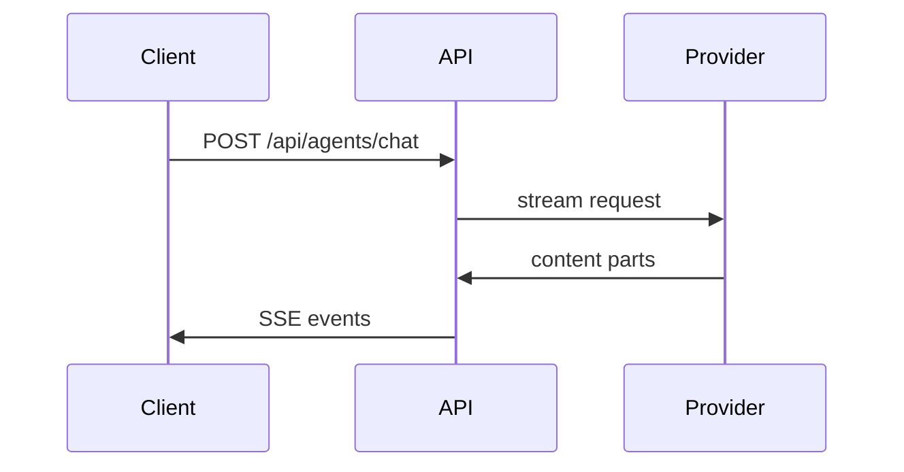

# Pull Request

> Before submitting, please review the [Contributing Guide](https://github.com/danny-avila/LibreChat/blob/main/.github/CONTRIBUTING.md).
>
> Documentation changes belong in the [LibreChat documentation repository](https://github.com/LibreChat-AI/librechat.ai).

## Summary

<!--
Briefly explain:
- What problem or limitation exists today?
- What triggers it (input, state, or configuration)?
- What does this PR change?
- What is the resulting behavior?

Keep this focused on the final state of the code rather than the history of the
branch or previous review iterations. Naming the merged pull request that
introduced a regression is the exception: that is history the reader needs.

Link related issues, and name any dependency this change needs:
Fixes #123
Related to #123
Depends on danny-avila/agents#123
-->

## How it works

<!--
Optional. Remove this section if the implementation is already obvious from the
summary and diff.

Explain the mechanism reviewers need to understand. Pick one or two of the views
below, whichever make the change reviewable, and put a sentence beside each rather
than describing every changed file. Show a whole block instead of a diff when most
of it is new, or when the omitted context would hide execution order or ownership.

Focused diff:

```diff
-const parts = content.filter(isText);
-const files = content.filter(isFile);
+const { parts, files } = splitContent(content);
```

Runtime flow:

```text
submitMessage
  ask
    setMessages
    setSubmission   # opens the SSE stream
```

Ownership:

```text
packages/api/src/agents/
├── run.ts      # builds the run and callbacks
├── tools.ts    # resolves tools for the request
└── client.ts   # streams provider output
```

Cross-service flow:



Keep the arrows in this example solid (`->>`). A dashed Mermaid arrow spells the
HTML comment terminator, so it would close this block early and spill the rest of
the guidance into every description. Diagrams you write outside this comment can
use dashed arrows freely.
-->

## Type of change

<!--
Check every type that applies, then delete the lines that do not. The section
should end up listing only the types this pull request actually is.
-->

* [ ] Bug fix
* [ ] Feature
* [ ] Refactor
* [ ] Performance improvement
* [ ] Breaking change
* [ ] Documentation
* [ ] Translation
* [ ] Tests / tooling / CI

## Testing

<!--
Describe how you verified the change.

Include only the configuration that matters for reproducing the test.

Example:

1. Start LibreChat with Agents enabled.
2. Create an agent using an Ollama endpoint.
3. Add the Ask User tool.
4. Send a message that triggers the tool.
5. Confirm the question is rendered and the conversation continues after answering.
-->

**Tested environments/configuration:**

<!--
Examples:
- Browser:
- Provider/model:
- Database:
- Feature flags:
- OS:
-->

**Automated tests:**

<!--
Examples:
- `npm run test:client`
- `npm run test:api`
- Added tests in `foo.spec.ts`

Write "Not applicable" when appropriate.
-->

## Screenshots / recordings

<!--
Required whenever the change alters something a user can see: a new, removed or
restyled component, layout, spacing, copy, icons, empty/loading/error states,
theming, or motion. The diff shows what the code says; only a screenshot shows
what the screen looks like.

Capture from the app running this branch, never a mockup. Post before and after
as a pair, taken at the same size on the same screen, and label which is which.
A brand new surface has no "before", so say that instead of leaving a cell
blank. Include light and dark mode whenever the change touches color or theming.
Use a recording rather than a still whenever the behavior is motion or
interaction dependent, such as a transition, drag, hover or streaming state,
where a frozen frame proves nothing.

Upload the files with `gh` (v2.99.0 or newer). Write the body with ordinary
relative image links, pass the same paths to `--attach`, and each link is
rewritten to the uploaded asset:

| Before | After |
| --- | --- |
|  |  |

    gh pr create --base dev --body-file ./pr-body.md \
      --attach ./sidebar-before.png --attach ./sidebar-after.png

    gh pr edit 123 --attach './sidebar-after.png#Sidebar after the change'

`--attach` repeats, up to 50 files per command, and works on `gh pr create`,
`gh pr edit` and `gh pr comment`. Alt text follows the path after `#`; a link
already in the body keeps the alt text written there, and a file the body never
references is appended to the end instead. PNG, JPEG, GIF, WebP, SVG, MP4, MOV
and WebM are accepted, images and GIFs up to 10 MB.

That upload is the only way to get an asset URL. Do not commit screenshots to
the repository or push them to a branch, do not link a path on the machine that
captured them, do not host them on a gist or an image site, and never write a
`user-attachments` link by hand: an invented link renders as a broken image and
costs a review round.

Write "No user-facing change" rather than removing this section, so reviewers can
see the question was answered.
-->

## Risk / compatibility

<!--
Optional for small changes.

Call out anything reviewers should pay particular attention to, such as:
- migrations or schema changes
- API/configuration changes
- provider-specific behavior
- backwards compatibility
- performance implications
- security-sensitive behavior

Write "None" when there are no notable risks.
-->

## Checklist

* [ ] I reviewed my own changes
* [ ] Relevant tests have been added or updated
* [ ] Existing relevant tests pass
* [ ] The change does not introduce new warnings or errors
* [ ] User-facing or complex behavior is documented where necessary
* [ ] Required dependency changes have been merged/published
* [ ] Required documentation PR: <!-- link or N/A -->
