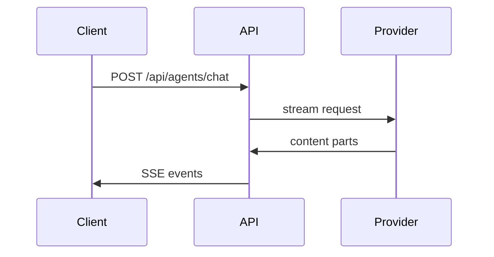

# Pull Request Template

⚠️ Before Submitting a PR, Please Review:
- Please ensure that you have thoroughly read and understood the [Contributing Docs](https://github.com/danny-avila/LibreChat/blob/main/.github/CONTRIBUTING.md) before submitting your Pull Request.

⚠️ Documentation Updates Notice:
- Kindly note that documentation updates are managed in this repository: [librechat.ai](https://github.com/LibreChat-AI/librechat.ai)

## Summary

<!--
Say what breaks or is missing today, what triggers it, and how it behaves after this
change. Link the issue with `Fixes #N`, and list any dependency your change needs.
Two or three sentences is usually enough:

"Pasting an image while the composer had focus left Send disabled until the user
clicked back into the textarea: the upload dialog took focus and never returned it.
Focus now returns to the composer as soon as the attachment mounts."

Describe the code as it stands. A reader who has not followed the branch has no
context for what earlier commits tried or what a review round changed. Naming the
merged pull request that caused the bug is different — that is history the reader
needs.
-->

## How it works

<!--
Optional. Delete this section when the summary already explains the change.

Pick one or two views that make the change reviewable, and put a sentence beside
each. These show the format, not a required implementation pattern — replace them
with real names from your change. Do not paste the whole diff or list every file
you touched.

The mechanism, as a focused diff, when the surrounding shape already exists:

```diff
-const parts = content.filter(isText);
-const files = content.filter(isFile);
+const { parts, files } = splitContent(content);
```

Runtime order, as a call tree, keeping only the calls that carry the change:

```text
submitMessage
  ask
    setMessages
    setSubmission   # opens the SSE stream
```

Ownership, as a shallow file tree, for a new module or a broad refactor:

```text
packages/api/src/agents/
├── run.ts      # builds the run and its callbacks
├── tools.ts    # resolves tools for the request
└── client.ts   # streams provider output back to the route
```

Client/server or cross-service flow, as Mermaid:



Editing this file: keep the arrows in the example above solid (`->>`). A dashed
Mermaid arrow spells the comment terminator, so it would close this comment early
and spill the rest of the guidance into every description. Your own diagram sits
outside the comment, where dashed arrows are fine.

Show a whole block instead of a diff when most of it is new, or when the omitted
context would hide execution order or ownership.
-->

## Change Type

Please delete any irrelevant options.

- [ ] Bug fix (non-breaking change which fixes an issue)
- [ ] New feature (non-breaking change which adds functionality)
- [ ] Breaking change (fix or feature that would cause existing functionality to not work as expected)
- [ ] This change requires a documentation update
- [ ] Translation update

## Testing

Please describe your test process and include instructions so that we can reproduce your test. If there are any important variables for your testing configuration, list them here.

### **Test Configuration**:

## Checklist

Please delete any irrelevant options.

- [ ] My code adheres to this project's style guidelines
- [ ] I have performed a self-review of my own code
- [ ] I have commented in any complex areas of my code
- [ ] I have made pertinent documentation changes
- [ ] My changes do not introduce new warnings
- [ ] I have written tests demonstrating that my changes are effective or that my feature works
- [ ] Local unit tests pass with my changes
- [ ] Any changes dependent on mine have been merged and published in downstream modules.
- [ ] A pull request for updating the documentation has been submitted.
