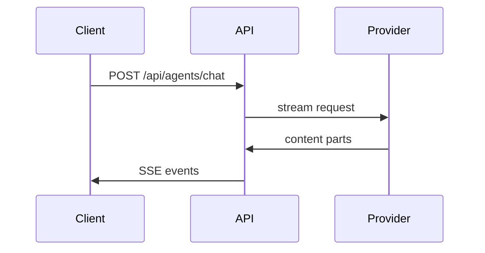

# Pull Request

> Before submitting, please review the [Contributing Guide](https://github.com/danny-avila/LibreChat/blob/main/.github/CONTRIBUTING.md).
>
> Documentation changes belong in the [LibreChat documentation repository](https://github.com/LibreChat-AI/librechat.ai).

## Summary

<!--
Briefly explain:
- What problem or limitation exists today?
- What does this PR change?
- What is the resulting behavior?

Keep this focused on the final state of the code rather than the history of the
branch or previous review iterations.

Link related issues where applicable:
Fixes #123
Related to #123
-->

## How it works

<!--
Optional. Remove this section if the implementation is already obvious from the
summary and diff.

Explain the mechanism reviewers need to understand. Prefer the smallest useful
representation rather than describing every changed file.

Focused diff:

```diff
-const parts = content.filter(isText);
-const files = content.filter(isFile);
+const { parts, files } = splitContent(content);
```

Runtime flow:

```text
submitMessage
  ask
    setMessages
    setSubmission   # opens the SSE stream
```

Ownership:

```text
packages/api/src/agents/
├── run.ts      # builds the run and callbacks
├── tools.ts    # resolves tools for the request
└── client.ts   # streams provider output
```

Cross-service flow:


-->

## Type of change

<!-- Select all that apply. -->

* [ ] Bug fix
* [ ] Feature
* [ ] Refactor
* [ ] Performance improvement
* [ ] Breaking change
* [ ] Documentation
* [ ] Translation
* [ ] Tests / tooling / CI

## Testing

<!--
Describe how you verified the change.

Include only the configuration that matters for reproducing the test.

Example:

1. Start LibreChat with Agents enabled.
2. Create an agent using an Ollama endpoint.
3. Add the Ask User tool.
4. Send a message that triggers the tool.
5. Confirm the question is rendered and the conversation continues after answering.
-->

**Tested environments/configuration:**

<!--
Examples:
- Browser:
- Provider/model:
- Database:
- Feature flags:
- OS:
-->

**Automated tests:**

<!--
Examples:
- `npm run test:client`
- `npm run test:api`
- Added tests in `foo.spec.ts`

Write "Not applicable" when appropriate.
-->

## Screenshots / recordings

<!--
For user-facing changes, include before/after screenshots or a short recording.
Remove this section when not applicable.
-->

## Risk / compatibility

<!--
Optional for small changes.

Call out anything reviewers should pay particular attention to, such as:
- migrations or schema changes
- API/configuration changes
- provider-specific behavior
- backwards compatibility
- performance implications
- security-sensitive behavior

Write "None" when there are no notable risks.
-->

## Checklist

* [ ] I reviewed my own changes
* [ ] Relevant tests have been added or updated
* [ ] Existing relevant tests pass
* [ ] The change does not introduce new warnings or errors
* [ ] User-facing or complex behavior is documented where necessary
* [ ] Required dependency changes have been merged/published
* [ ] Required documentation PR: <!-- link or N/A -->
