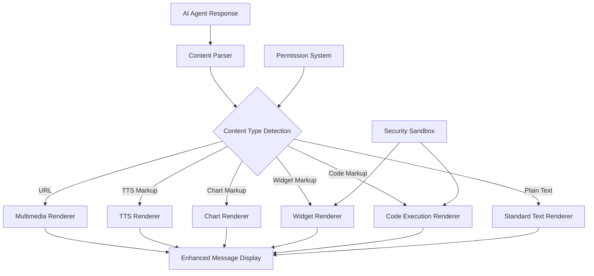

# Design Document

## Overview

The Enhanced Content Rendering system extends LibreChat's message display capabilities by introducing a secure markup-based approach for rich content rendering. Instead of allowing AI agents to execute arbitrary HTML/JavaScript, agents use predefined markup tags that the frontend parses and renders into appropriate React components.

This design integrates seamlessly with LibreChat's existing message rendering pipeline while maintaining security through controlled component rendering and sandboxed execution environments.

## Architecture

### High-Level Architecture



### Integration with Existing Architecture

The system integrates with LibreChat's current message rendering pipeline by extending the `MessageContent` component:

```
MessageContent.tsx (existing)
├── DisplayMessage (existing)
│   ├── Markdown (existing) - for user messages
│   └── EnhancedMessageContent (NEW) - for agent messages
│       ├── ContentParser (NEW)
│       └── ContentBlockRenderer (NEW)
│           ├── MultimediaRenderer
│           ├── TTSRenderer  
│           ├── ChartRenderer
│           ├── WidgetRenderer
│           └── CodeExecutionRenderer
```

## Components and Interfaces

### 1. Content Parser

**Purpose**: Parse agent message text and identify enhanced content markup tags.

**Interface**:
```typescript
interface ContentBlock {
  type: 'text' | 'image' | 'video' | 'audio' | 'tts' | 'chart' | 'widget' | 'code';
  content: string;
  metadata?: {
    language?: string;
    chartType?: 'bar' | 'line' | 'pie' | 'scatter';
    widgetType?: 'react' | 'html';
    codeLanguage?: string;
  };
}

class ContentParser {
  parse(text: string): ContentBlock[];
}
```

**Implementation Strategy**:
- Use regex patterns to identify markup tags
- Parse content sequentially to maintain order
- Extract metadata from markup attributes
- Handle nested content gracefully
- Sanitize all extracted content

### 2. Enhanced Message Content Component

**Purpose**: Main orchestrator that replaces standard markdown rendering for agent messages.

**Interface**:
```typescript
interface EnhancedMessageContentProps {
  message: TMessage;
  isLatestMessage: boolean;
}

const EnhancedMessageContent: React.FC<EnhancedMessageContentProps>
```

**Implementation Strategy**:
- Check if message is from agent (not user)
- Parse message text using ContentParser
- Render each content block with appropriate renderer
- Maintain responsive design principles
- Handle loading states and errors gracefully

### 3. Multimedia Renderer

**Purpose**: Display images, videos, and audio from URLs.

**Interface**:
```typescript
interface MultimediaRendererProps {
  url: string;
  type: 'image' | 'video' | 'audio';
}
```

**Implementation Strategy**:
- Validate URL format and security
- Implement lazy loading for performance
- Add loading states and error handling
- Ensure responsive design with max dimensions
- Support common formats (jpg, png, gif, mp4, mp3, etc.)

### 4. TTS Renderer

**Purpose**: Create clickable text elements that trigger text-to-speech.

**Interface**:
```typescript
interface TTSRendererProps {
  text: string;
  language: string;
}

class TTSEngine {
  speak(text: string, language: string): void;
  stop(): void;
}
```

**Implementation Strategy**:
- Use Web Speech API (speechSynthesis)
- Implement language-specific voice selection
- Add visual feedback during speech (highlighting, animation)
- Handle browser compatibility gracefully
- Reset to system default language after completion
- Manage concurrent speech requests

### 5. Chart Renderer

**Purpose**: Generate charts from CSV/JSON data.

**Interface**:
```typescript
interface ChartRendererProps {
  type: 'bar' | 'line' | 'pie' | 'scatter';
  data: string; // URL, JSON, or CSV
}

interface ChartData {
  labels: string[];
  datasets: Array<{
    label: string;
    data: number[];
    backgroundColor?: string;
    borderColor?: string;
  }>;
}
```

**Implementation Strategy**:
- Use Chart.js with react-chartjs-2
- Support multiple data sources (URL, inline JSON, inline CSV)
- Implement data parsing utilities
- Add responsive chart sizing
- Handle data loading and error states
- Provide fallback for unsupported chart types

### 6. Widget Renderer

**Purpose**: Execute React/HTML widgets in sandboxed environment.

**Interface**:
```typescript
interface WidgetRendererProps {
  code: string;
  type: 'react' | 'html';
}
```

**Implementation Strategy**:
- Use Sandpack for secure code execution
- Isolate widgets from main application context
- Implement timeout mechanisms
- Provide error boundaries
- Support basic React hooks and HTML/CSS
- Limit resource usage and execution time

### 7. Code Execution Renderer

**Purpose**: Display code with execution capabilities using existing Code Interpreter.

**Interface**:
```typescript
interface CodeExecutionRendererProps {
  code: string;
  language: string;
}

interface CodeExecutionResult {
  output?: string;
  error?: string;
  type: 'success' | 'error';
  executionTime?: number;
}
```

**Implementation Strategy**:
- Integrate with existing LibreChat Code Interpreter API
- Display code with syntax highlighting
- Provide execute button for on-demand execution
- Show execution results inline
- Handle timeouts and errors gracefully
- Support multiple programming languages

## Data Models

### Enhanced Content Block

```typescript
interface ContentBlock {
  id: string;
  type: ContentBlockType;
  content: string;
  metadata: ContentBlockMetadata;
  position: number;
}

type ContentBlockType = 
  | 'text' 
  | 'image' 
  | 'video' 
  | 'audio' 
  | 'tts' 
  | 'chart' 
  | 'widget' 
  | 'code';

interface ContentBlockMetadata {
  // TTS specific
  language?: string;
  
  // Chart specific  
  chartType?: 'bar' | 'line' | 'pie' | 'scatter';
  dataSource?: 'url' | 'json' | 'csv';
  
  // Widget specific
  widgetType?: 'react' | 'html';
  
  // Code specific
  codeLanguage?: string;
  
  // Multimedia specific
  mediaType?: string;
  dimensions?: { width?: number; height?: number };
}
```

### TTS Configuration

```typescript
interface TTSConfig {
  language: string;
  rate: number;
  pitch: number;
  volume: number;
}

interface TTSState {
  isPlaying: boolean;
  currentText: string;
  currentLanguage: string;
}
```

### Chart Data Models

```typescript
interface ChartDataset {
  label: string;
  data: number[];
  backgroundColor?: string | string[];
  borderColor?: string;
  borderWidth?: number;
}

interface ChartConfiguration {
  type: 'bar' | 'line' | 'pie' | 'scatter';
  data: {
    labels: string[];
    datasets: ChartDataset[];
  };
  options: {
    responsive: boolean;
    maintainAspectRatio: boolean;
    plugins: {
      legend: {
        position: 'top' | 'bottom' | 'left' | 'right';
      };
    };
  };
}
```

## Error Handling

### Error Boundary Strategy

```typescript
class EnhancedContentErrorBoundary extends React.Component {
  // Catch rendering errors in enhanced content
  // Display fallback UI with error message
  // Log errors for debugging
  // Allow rest of message to render normally
}
```

### Error Types and Handling

1. **Parsing Errors**
   - Invalid markup syntax
   - Malformed data structures
   - Fallback: Render as plain text

2. **Loading Errors**
   - Failed URL requests
   - Network timeouts
   - Fallback: Show error message with retry option

3. **Execution Errors**
   - Widget/code execution failures
   - Sandbox timeouts
   - Fallback: Display error message, disable execution

4. **Browser Compatibility Errors**
   - Unsupported APIs (TTS, Canvas)
   - Fallback: Show compatibility message

## Testing Strategy

### Unit Tests

1. **ContentParser Tests**
   - Test markup pattern recognition
   - Test content extraction accuracy
   - Test edge cases and malformed input

2. **Renderer Component Tests**
   - Test each renderer in isolation
   - Mock external dependencies
   - Test error states and loading states

3. **TTS Engine Tests**
   - Mock Web Speech API
   - Test language switching
   - Test concurrent speech handling

4. **Chart Data Parser Tests**
   - Test CSV parsing accuracy
   - Test JSON validation
   - Test remote data fetching

### Integration Tests

1. **End-to-End Content Rendering**
   - Test complete message parsing and rendering
   - Test multiple content types in single message
   - Test responsive behavior

2. **Security Tests**
   - Test sandbox isolation
   - Test XSS prevention
   - Test resource limitation

3. **Performance Tests**
   - Test large multimedia content
   - Test multiple widgets in single message
   - Test memory usage and cleanup

### Browser Compatibility Tests

1. **Cross-Browser Testing**
   - Chrome, Firefox, Safari, Edge
   - Mobile browsers (iOS Safari, Chrome Mobile)
   - Test TTS API availability

2. **Accessibility Testing**
   - Screen reader compatibility
   - Keyboard navigation
   - ARIA labels and roles

## Security Considerations

### Content Security Policy (CSP)

```typescript
// Required CSP adjustments for Sandpack
const cspDirectives = {
  'script-src': "'self' 'unsafe-eval' https://sandpack-bundler.vercel.app",
  'frame-src': "'self' https://sandpack-bundler.vercel.app",
  'connect-src': "'self' https://sandpack-bundler.vercel.app"
};
```

### Input Sanitization

1. **URL Validation**
   - Whitelist allowed domains for multimedia
   - Validate URL format and protocol
   - Prevent data: URLs and javascript: URLs

2. **Code Sanitization**
   - Sanitize widget code before execution
   - Remove dangerous JavaScript functions
   - Limit available APIs in sandbox

3. **Data Validation**
   - Validate chart data structure
   - Sanitize CSV/JSON input
   - Prevent code injection through data

### Sandbox Security

1. **Widget Isolation**
   - Use Sandpack for complete isolation
   - Limit network access from widgets
   - Prevent access to parent window

2. **Resource Limits**
   - Set execution timeouts
   - Limit memory usage
   - Prevent infinite loops

## Performance Optimization

### Lazy Loading Strategy

1. **Content Loading**
   - Load multimedia content on demand
   - Implement intersection observer for viewport detection
   - Progressive image loading with placeholders

2. **Component Rendering**
   - Lazy load heavy components (Chart.js, Sandpack)
   - Use React.lazy() and Suspense
   - Implement virtual scrolling for long conversations

### Caching Strategy

1. **Asset Caching**
   - Cache loaded multimedia content
   - Implement LRU cache for frequently accessed content
   - Use browser cache for static assets

2. **Computation Caching**
   - Cache parsed chart data
   - Cache compiled widget code
   - Memoize expensive calculations

### Memory Management

1. **Cleanup Strategy**
   - Cleanup TTS utterances on component unmount
   - Dispose chart instances properly
   - Terminate sandbox workers when not needed

2. **Resource Monitoring**
   - Monitor memory usage in development
   - Implement warnings for resource-heavy content
   - Provide fallback for low-memory devices

## Accessibility

### Screen Reader Support

1. **ARIA Labels**
   - Descriptive labels for interactive elements
   - Role definitions for custom components
   - Live regions for dynamic content updates

2. **Alternative Content**
   - Alt text for images
   - Transcripts for audio content
   - Text descriptions for charts

### Keyboard Navigation

1. **Focus Management**
   - Proper tab order for interactive elements
   - Focus indicators for TTS elements
   - Keyboard shortcuts for common actions

2. **Interaction Patterns**
   - Enter/Space activation for TTS
   - Arrow key navigation for charts
   - Escape key to stop TTS playback

## Responsive Design

### Mobile Optimization

1. **Touch Interactions**
   - Larger touch targets for TTS elements
   - Swipe gestures for chart navigation
   - Touch-friendly widget controls

2. **Layout Adaptation**
   - Responsive chart sizing
   - Collapsible widget containers
   - Optimized multimedia dimensions

### Cross-Device Consistency

1. **Breakpoint Strategy**
   - Mobile: < 768px
   - Tablet: 768px - 1024px  
   - Desktop: > 1024px

2. **Feature Adaptation**
   - Simplified widgets on mobile
   - Touch-optimized TTS controls
   - Responsive chart legends

This design provides a comprehensive foundation for implementing the enhanced content rendering system while maintaining security, performance, and accessibility standards.