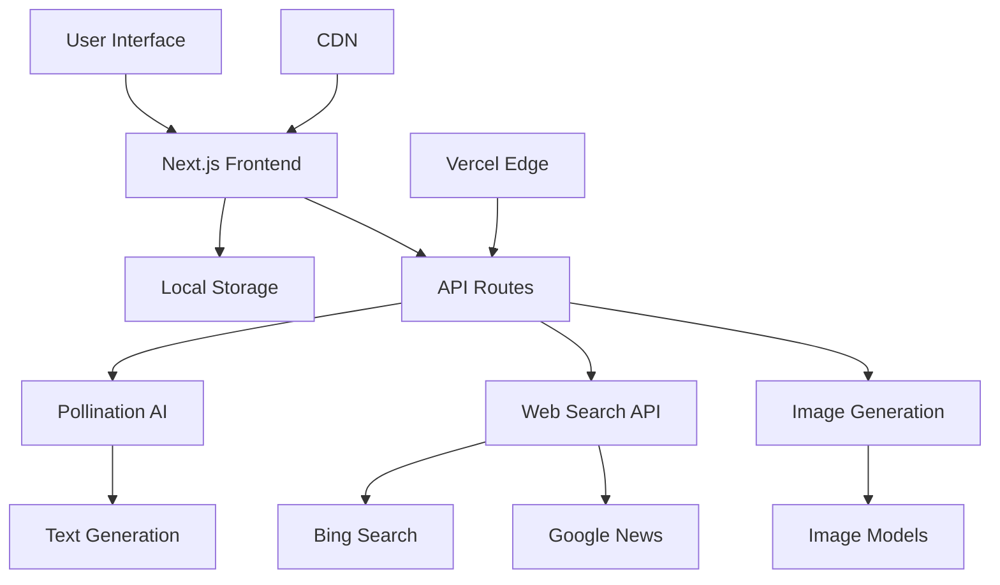

# 🚀 AI-Powered Website Project Planning

> **Complete System Transformation** - Strategic roadmap for migrating from external API system to integrated Pollination AI platform

## 📋 Project Overview

### 🎯 Mission Statement
Transform the existing beautiful website into a self-contained, AI-powered platform that maintains the current design excellence while completely revolutionizing the underlying architecture with Pollination AI integration.

### 🔄 Transformation Strategy

| **Current State** | **Target State** |
|-------------------|------------------|
| External API dependencies | Built-in Pollination AI |
| Server-side chat storage | Local browser storage |
| Manual API configurations | Seamless AI integration |
| Complex deployment | One-click Vercel deployment |
| Limited AI capabilities | Full multi-modal AI suite |

## 🗓️ Development Phases

### 📦 Phase 1: Foundation & Core Migration (Week 1-2)

#### 🎯 **Objectives**
- Establish new Next.js 15 foundation
- Integrate Pollination AI core functionality
- Implement local storage system
- Preserve existing UI design

#### 📝 **Tasks Breakdown**

**Day 1-3: Project Setup**
- [x] Initialize Next.js 15 project with TypeScript
- [x] Set up Tailwind CSS configuration
- [x] Install and configure Radix UI components
- [x] Create project structure and file organization
- [x] Set up development environment

**Day 4-7: Core AI Integration**
- [x] Implement Pollination AI text generation API
- [x] Create chat interface with real-time responses
- [x] Set up error handling and retry mechanisms
- [x] Implement loading states and user feedback
- [x] Add basic conversation management

**Day 8-10: Local Storage System**
- [ ] Design local storage schema for chat history
- [ ] Implement conversation persistence
- [ ] Create import/export functionality
- [ ] Add data cleanup and management utilities
- [ ] Test storage limits and performance

**Day 11-14: UI Migration**
- [ ] Recreate exact design from existing website
- [ ] Implement responsive layouts
- [ ] Add animations and transitions
- [ ] Test cross-browser compatibility
- [ ] Optimize for mobile devices

#### 🎯 **Deliverables**
- ✅ Working Next.js application
- ✅ Basic chat functionality with Pollination AI
- ✅ Local storage implementation
- ✅ UI matching existing design

---

### 🔍 Phase 2: Search & Image Generation (Week 3-4)

#### 🎯 **Objectives**
- Implement advanced web search capabilities
- Add AI image generation features
- Create file upload system
- Enhance user experience

#### 📝 **Tasks Breakdown**

**Day 15-18: Web Search Implementation**
- [x] Build custom web scraping system
- [x] Implement Bing and Google News search
- [x] Create search result parsing logic
- [x] Add search result display components
- [x] Integrate search with AI responses

**Day 19-22: Image Generation**
- [x] Implement Pollination AI image generation
- [x] Create image prompt enhancement system
- [x] Add image display and download features
- [x] Implement image regeneration functionality
- [x] Optimize image loading and caching

**Day 23-26: File Upload System**
- [ ] Design file upload interface
- [ ] Implement drag-and-drop functionality
- [ ] Add file type validation and processing
- [ ] Create file preview system
- [ ] Integrate files with AI processing

**Day 27-28: UX Enhancements**
- [ ] Add voice input/output capabilities
- [ ] Implement text-to-speech features
- [ ] Create keyboard shortcuts
- [ ] Add accessibility improvements
- [ ] Optimize performance

#### 🎯 **Deliverables**
- ✅ Functional web search with scraping
- ✅ AI image generation system
- [ ] File upload and processing
- [ ] Voice interaction capabilities

---

### 🎨 Phase 3: UI Polish & Advanced Features (Week 5-6)

#### 🎯 **Objectives**
- Perfect the user interface
- Add advanced AI features
- Implement error handling
- Prepare for deployment

#### 📝 **Tasks Breakdown**

**Day 29-32: UI Polish**
- [ ] Fine-tune responsive design
- [ ] Add micro-interactions and animations
- [ ] Implement dark/light theme system
- [ ] Create loading skeletons
- [ ] Optimize CSS and bundle size

**Day 33-36: Advanced AI Features**
- [ ] Implement conversation branching
- [ ] Add AI model selection options
- [ ] Create custom prompt templates
- [ ] Implement conversation search
- [ ] Add AI response streaming

**Day 37-40: Quality Assurance**
- [ ] Comprehensive testing across devices
- [ ] Performance optimization
- [ ] Security audit and improvements
- [ ] Accessibility compliance testing
- [ ] Bug fixes and polish

**Day 41-42: Deployment Preparation**
- [ ] Optimize build process
- [ ] Configure Vercel deployment
- [ ] Set up monitoring and analytics
- [ ] Create deployment documentation
- [ ] Final testing on production environment

#### 🎯 **Deliverables**
- [ ] Polished, production-ready UI
- [ ] Advanced AI features
- [ ] Comprehensive testing
- [ ] Deployment-ready application

---

### 🚀 Phase 4: Deployment & Optimization (Week 7)

#### 🎯 **Objectives**
- Deploy to production
- Monitor performance
- Gather user feedback
- Plan future enhancements

#### 📝 **Tasks Breakdown**

**Day 43-45: Production Deployment**
- [ ] Deploy to Vercel production
- [ ] Configure custom domain
- [ ] Set up SSL certificates
- [ ] Configure CDN and caching
- [ ] Monitor initial performance

**Day 46-47: Post-Launch Monitoring**
- [ ] Monitor error rates and performance
- [ ] Collect user feedback
- [ ] Analyze usage patterns
- [ ] Plan immediate improvements
- [ ] Document lessons learned

**Day 48-49: Future Planning**
- [ ] Roadmap for next features
- [ ] Plan re-enabling of disabled features
- [ ] Consider scaling requirements
- [ ] Documentation updates
- [ ] Community building strategy

#### 🎯 **Deliverables**
- [ ] Live production website
- [ ] Performance monitoring setup
- [ ] User feedback collection
- [ ] Future roadmap

---

## 🛠️ Technical Architecture

### 🏗️ **System Architecture**



### 🧱 **Component Architecture**

```
src/
├── app/                    # Next.js 15 App Directory
│   ├── layout.tsx         # Root layout with theme provider
│   ├── page.tsx           # Main chat interface
│   ├── globals.css        # Global styles and animations
│   └── api/               # API routes
│       ├── chat/          # Chat completions
│       ├── search/        # Web search functionality
│       ├── scrape/        # Content scraping
│       └── generate-image/# Image generation
│
├── components/            # Reusable UI components
│   ├── ui/               # Base UI components (Radix)
│   ├── chat-interface.tsx # Main chat component
│   ├── message-bubble.tsx # Individual message display
│   ├── search-results.tsx # Search results display
│   └── image-generator.tsx# Image generation interface
│
├── lib/                  # Utility functions
│   ├── utils.ts         # Common utilities
│   ├── search-utils.ts  # Search and scraping logic
│   ├── storage.ts       # Local storage management
│   └── ai-utils.ts      # AI integration helpers
│
├── types/               # TypeScript type definitions
│   └── index.ts        # All interface definitions
│
├── hooks/              # Custom React hooks
│   ├── use-chat.ts    # Chat management
│   ├── use-storage.ts # Local storage hook
│   └── use-voice.ts   # Voice interaction
│
└── styles/            # Additional styling
    └── components.css # Component-specific styles
```

### 🔧 **API Integration Strategy**

#### **Pollination AI Integration**
```typescript
// Core AI service configuration
const POLLINATION_CONFIG = {
  baseURL: "https://text.pollinations.ai",
  imageURL: "https://image.pollinations.ai",
  token: "bKQd-OREFd3DMl_7",
  models: {
    text: "openai",
    image: "flux"
  }
}

// API call structure
const chatCompletion = await fetch(`${POLLINATION_CONFIG.baseURL}/openai`, {
  method: 'POST',
  headers: {
    'Authorization': `Bearer ${POLLINATION_CONFIG.token}`,
    'Content-Type': 'application/json'
  },
  body: JSON.stringify({
    model: POLLINATION_CONFIG.models.text,
    messages: conversationHistory,
    temperature: 0.7,
    max_tokens: 1000
  })
})
```

#### **Local Storage Schema**
```typescript
interface ChatStorage {
  conversations: Conversation[]
  settings: UserSettings
  cache: {
    searchResults: SearchCache
    imageCache: ImageCache
  }
}

interface Conversation {
  id: string
  title: string
  messages: Message[]
  createdAt: Date
  updatedAt: Date
  tags: string[]
}
```

---

## 🎨 Design System

### 🌈 **Color Palette**
```css
:root {
  /* Primary Colors */
  --primary-blue: #3B82F6;
  --primary-purple: #8B5CF6;
  
  /* Gradient Backgrounds */
  --gradient-primary: linear-gradient(135deg, #3B82F6 0%, #8B5CF6 100%);
  --gradient-secondary: linear-gradient(135deg, #F3F4F6 0%, #E5E7EB 100%);
  
  /* Semantic Colors */
  --success: #10B981;
  --warning: #F59E0B;
  --error: #EF4444;
  --info: #3B82F6;
}
```

### 🎭 **Component Variants**
```typescript
// Button variants for different actions
const buttonVariants = {
  primary: "bg-gradient-to-r from-blue-500 to-purple-600 text-white",
  secondary: "bg-white border border-gray-300 text-gray-700",
  ghost: "bg-transparent hover:bg-gray-100 text-gray-600",
  danger: "bg-red-500 text-white hover:bg-red-600"
}

// Message bubble styles
const messageStyles = {
  user: "bg-blue-500 text-white ml-12",
  assistant: "bg-white border border-gray-200 mr-12",
  system: "bg-gray-100 text-gray-600 mx-8"
}
```

### 📱 **Responsive Breakpoints**
```typescript
const breakpoints = {
  mobile: "320px",
  tablet: "768px", 
  desktop: "1024px",
  wide: "1440px"
}

// Usage in Tailwind
<div className="w-full md:w-1/2 lg:w-1/3 xl:w-1/4">
  {/* Responsive content */}
</div>
```

---

## 🔒 Security Implementation

### 🛡️ **Security Measures**

#### **Client-Side Security**
```typescript
// Input sanitization
const sanitizeInput = (input: string): string => {
  return input
    .replace(/<script\b[^<]*(?:(?!<\/script>)<[^<]*)*<\/script>/gi, '')
    .replace(/javascript:/gi, '')
    .trim()
}

// Rate limiting for API calls
const rateLimiter = {
  requests: new Map(),
  limit: 60, // requests per minute
  window: 60000, // 1 minute
  
  checkLimit(userId: string): boolean {
    const now = Date.now()
    const userRequests = this.requests.get(userId) || []
    
    // Remove old requests
    const recentRequests = userRequests.filter(
      (time: number) => now - time < this.window
    )
    
    this.requests.set(userId, recentRequests)
    return recentRequests.length < this.limit
  }
}
```

#### **API Security**
```typescript
// API route protection
export async function POST(request: NextRequest) {
  // Validate request origin
  const origin = request.headers.get('origin')
  if (!isValidOrigin(origin)) {
    return NextResponse.json({ error: 'Invalid origin' }, { status: 403 })
  }
  
  // Rate limiting
  const ip = request.headers.get('x-forwarded-for') || 'unknown'
  if (!rateLimiter.checkLimit(ip)) {
    return NextResponse.json({ error: 'Rate limit exceeded' }, { status: 429 })
  }
  
  // Process request...
}
```

### 🔐 **Privacy Protection**
```typescript
// Local storage encryption (optional)
const encryptData = (data: any): string => {
  return btoa(JSON.stringify(data)) // Simple base64 encoding
}

const decryptData = (encrypted: string): any => {
  return JSON.parse(atob(encrypted))
}

// Clear sensitive data on page unload
window.addEventListener('beforeunload', () => {
  // Clear temporary data but preserve conversations
  localStorage.removeItem('temp-data')
  sessionStorage.clear()
})
```

---

## 📈 Performance Optimization

### ⚡ **Frontend Optimization**

#### **Code Splitting & Lazy Loading**
```typescript
// Lazy load heavy components
const ImageGenerator = lazy(() => import('@/components/image-generator'))
const SearchResults = lazy(() => import('@/components/search-results'))

// Route-based code splitting (automatic with Next.js)
const ChatPage = dynamic(() => import('@/pages/chat'), {
  loading: () => <ChatSkeleton />,
  ssr: false
})
```

#### **Bundle Optimization**
```javascript
// next.config.mjs
const nextConfig = {
  experimental: {
    optimizeCss: true,
    optimizeServerReact: true,
  },
  compiler: {
    removeConsole: process.env.NODE_ENV === 'production',
  },
  webpack: (config) => {
    config.optimization.splitChunks = {
      chunks: 'all',
      cacheGroups: {
        vendor: {
          test: /[\\/]node_modules[\\/]/,
          name: 'vendors',
          chunks: 'all',
        },
      },
    }
    return config
  }
}
```

### 🔄 **Caching Strategy**
```typescript
// Service worker for caching
const CACHE_NAME = 'ai-chat-v1'
const urlsToCache = [
  '/',
  '/static/css/main.css',
  '/static/js/main.js',
  '/api/search-cache'
]

// Cache API responses
const cacheApiResponse = async (url: string, response: any) => {
  const cache = await caches.open('api-cache')
  await cache.put(url, new Response(JSON.stringify(response)))
}

// Local storage caching
const getCachedData = (key: string, maxAge = 3600000) => { // 1 hour default
  const cached = localStorage.getItem(key)
  if (!cached) return null
  
  const { data, timestamp } = JSON.parse(cached)
  if (Date.now() - timestamp > maxAge) {
    localStorage.removeItem(key)
    return null
  }
  
  return data
}
```

---

## 🧪 Testing Strategy

### 🔬 **Testing Pyramid**

#### **Unit Tests (Jest + React Testing Library)**
```typescript
// Component testing example
describe('ChatInterface', () => {
  test('renders chat messages correctly', () => {
    const messages = [
      { id: '1', role: 'user', content: 'Hello' },
      { id: '2', role: 'assistant', content: 'Hi there!' }
    ]
    
    render(<ChatInterface messages={messages} />)
    
    expect(screen.getByText('Hello')).toBeInTheDocument()
    expect(screen.getByText('Hi there!')).toBeInTheDocument()
  })
  
  test('handles message submission', async () => {
    const onSubmit = jest.fn()
    render(<ChatInterface onSubmit={onSubmit} />)
    
    const input = screen.getByPlaceholderText('Type your message...')
    const submitButton = screen.getByRole('button', { name: /send/i })
    
    fireEvent.change(input, { target: { value: 'Test message' } })
    fireEvent.click(submitButton)
    
    expect(onSubmit).toHaveBeenCalledWith('Test message')
  })
})
```

#### **Integration Tests (Playwright)**
```typescript
// API integration testing
test('chat API responds correctly', async ({ request }) => {
  const response = await request.post('/api/chat', {
    data: {
      messages: [
        { role: 'user', content: 'Hello, how are you?' }
      ]
    }
  })
  
  expect(response.status()).toBe(200)
  
  const data = await response.json()
  expect(data.content).toBeTruthy()
  expect(typeof data.content).toBe('string')
})
```

#### **E2E Tests (Playwright)**
```typescript
// End-to-end user flow testing
test('complete chat conversation flow', async ({ page }) => {
  await page.goto('/')
  
  // Send a message
  await page.fill('[data-testid="chat-input"]', 'Generate an image of a sunset')
  await page.click('[data-testid="send-button"]')
  
  // Wait for AI response
  await page.waitForSelector('[data-testid="assistant-message"]')
  
  // Check if image generation was triggered
  await page.waitForSelector('[data-testid="generated-image"]', { timeout: 30000 })
  
  // Verify image is displayed
  const image = page.locator('[data-testid="generated-image"]')
  await expect(image).toBeVisible()
})
```

### 📊 **Performance Testing**
```typescript
// Performance monitoring
const performanceObserver = new PerformanceObserver((list) => {
  list.getEntries().forEach((entry) => {
    if (entry.entryType === 'measure') {
      console.log(`${entry.name}: ${entry.duration}ms`)
      
      // Send to analytics
      analytics.track('performance_metric', {
        name: entry.name,
        duration: entry.duration,
        timestamp: Date.now()
      })
    }
  })
})

performanceObserver.observe({ entryTypes: ['measure'] })

// Measure API response times
const measureApiCall = async (apiCall: () => Promise<any>) => {
  performance.mark('api-start')
  
  try {
    const result = await apiCall()
    performance.mark('api-end')
    performance.measure('api-duration', 'api-start', 'api-end')
    return result
  } catch (error) {
    performance.mark('api-error')
    performance.measure('api-error-time', 'api-start', 'api-error')
    throw error
  }
}
```

---

## 🚀 Deployment Strategy

### 🌐 **Vercel Deployment Configuration**

#### **Automated Deployment Pipeline**
```yaml
# .github/workflows/deploy.yml
name: Deploy to Vercel

on:
  push:
    branches: [main]
  pull_request:
    branches: [main]

jobs:
  deploy:
    runs-on: ubuntu-latest
    steps:
      - uses: actions/checkout@v2
      
      - name: Setup Node.js
        uses: actions/setup-node@v2
        with:
          node-version: '18'
          cache: 'npm'
      
      - name: Install dependencies
        run: npm ci
      
      - name: Run tests
        run: npm run test
      
      - name: Build application
        run: npm run build
      
      - name: Deploy to Vercel
        uses: vercel/action@v24
        with:
          vercel-token: ${{ secrets.VERCEL_TOKEN }}
          vercel-org-id: ${{ secrets.ORG_ID }}
          vercel-project-id: ${{ secrets.PROJECT_ID }}
```

#### **Environment Configuration**
```javascript
// vercel.json
{
  "framework": "nextjs",
  "buildCommand": "npm run build",
  "outputDirectory": ".next",
  "installCommand": "npm install",
  "functions": {
    "app/api/**/*.ts": {
      "runtime": "nodejs18.x",
      "maxDuration": 30
    }
  },
  "regions": ["iad1", "sfo1", "fra1"],
  "redirects": [
    {
      "source": "/old-path/(.*)",
      "destination": "/new-path/$1",
      "permanent": true
    }
  ],
  "headers": [
    {
      "source": "/api/(.*)",
      "headers": [
        {
          "key": "Cache-Control",
          "value": "s-maxage=60, stale-while-revalidate"
        }
      ]
    }
  ]
}
```

### 📊 **Monitoring & Analytics**

#### **Performance Monitoring**
```typescript
// utils/monitoring.ts
import { getCLS, getFID, getFCP, getLCP, getTTFB } from 'web-vitals'

const sendToAnalytics = (metric: any) => {
  // Send to Vercel Analytics
  if (typeof window !== 'undefined' && window.va) {
    window.va('track', 'WebVital', {
      name: metric.name,
      value: metric.value,
      id: metric.id,
    })
  }
}

// Monitor Core Web Vitals
getCLS(sendToAnalytics)
getFID(sendToAnalytics)
getFCP(sendToAnalytics)
getLCP(sendToAnalytics)
getTTFB(sendToAnalytics)
```

#### **Error Tracking**
```typescript
// utils/error-tracking.ts
class ErrorTracker {
  static logError(error: Error, context?: any) {
    console.error('Application Error:', error)
    
    // Send to monitoring service
    fetch('/api/errors', {
      method: 'POST',
      headers: { 'Content-Type': 'application/json' },
      body: JSON.stringify({
        message: error.message,
        stack: error.stack,
        timestamp: new Date().toISOString(),
        context,
        userAgent: navigator.userAgent,
        url: window.location.href
      })
    }).catch(console.error)
  }
}

// Global error handling
window.addEventListener('error', (event) => {
  ErrorTracker.logError(event.error, {
    type: 'javascript_error',
    filename: event.filename,
    lineno: event.lineno,
    colno: event.colno
  })
})

window.addEventListener('unhandledrejection', (event) => {
  ErrorTracker.logError(new Error(event.reason), {
    type: 'unhandled_promise_rejection'
  })
})
```

---

## 📅 Success Metrics & KPIs

### 🎯 **Key Performance Indicators**

#### **Technical Metrics**
- **Page Load Time**: < 2 seconds (First Contentful Paint)
- **API Response Time**: < 1 second average
- **Error Rate**: < 0.1% of requests
- **Uptime**: 99.9% availability
- **Bundle Size**: < 500KB initial load

#### **User Experience Metrics**
- **Time to First Response**: < 3 seconds
- **Conversation Completion Rate**: > 85%
- **Feature Adoption Rate**: > 70%
- **User Retention**: > 60% weekly return
- **Mobile Usage**: Optimized for 50%+ mobile traffic

#### **Business Metrics**
- **Daily Active Users**: Baseline establishment
- **Session Duration**: > 5 minutes average
- **Feature Usage Distribution**: Track most/least used features
- **Conversion Rate**: Measure goal completions
- **User Satisfaction**: 4.5+ star rating target

### 📈 **Analytics Implementation**
```typescript
// analytics/tracking.ts
class Analytics {
  static track(event: string, properties?: any) {
    // Privacy-first analytics
    const anonymousData = {
      event,
      properties: this.sanitizeProperties(properties),
      timestamp: Date.now(),
      session: this.getSessionId(),
      page: window.location.pathname
    }
    
    // Store locally and batch send
    this.batchEvent(anonymousData)
  }
  
  static sanitizeProperties(properties: any) {
    // Remove any PII or sensitive data
    const sanitized = { ...properties }
    delete sanitized.email
    delete sanitized.userId
    delete sanitized.personalInfo
    return sanitized
  }
  
  private static batchEvent(event: any) {
    const events = JSON.parse(localStorage.getItem('analytics_batch') || '[]')
    events.push(event)
    
    if (events.length >= 10) {
      this.sendBatch(events)
      localStorage.removeItem('analytics_batch')
    } else {
      localStorage.setItem('analytics_batch', JSON.stringify(events))
    }
  }
}
```

---

## 🎉 Launch Checklist

### ✅ **Pre-Launch Checklist**

#### **Development Complete**
- [ ] All core features implemented and tested
- [ ] UI/UX matches design specifications
- [ ] Mobile responsiveness verified
- [ ] Cross-browser compatibility tested
- [ ] Performance optimizations applied

#### **Quality Assurance**
- [ ] Unit tests passing (>90% coverage)
- [ ] Integration tests passing
- [ ] E2E tests passing
- [ ] Security audit completed
- [ ] Accessibility compliance verified

#### **Deployment Ready**
- [ ] Production build successful
- [ ] Environment variables configured
- [ ] Domain and SSL certificates ready
- [ ] CDN and caching configured
- [ ] Monitoring and analytics set up

#### **Documentation**
- [ ] README.md completed
- [ ] API documentation updated
- [ ] Deployment guide written
- [ ] User guide created
- [ ] Troubleshooting guide prepared

#### **Launch Preparation**
- [ ] Backup strategy implemented
- [ ] Rollback plan prepared
- [ ] Team notification channels set up
- [ ] User support channels ready
- [ ] Launch announcement prepared

### 🚀 **Post-Launch Monitoring**

#### **Week 1: Critical Monitoring**
- [ ] Monitor error rates and performance metrics
- [ ] Track user adoption and usage patterns
- [ ] Collect and respond to user feedback
- [ ] Fix critical bugs immediately
- [ ] Document lessons learned

#### **Month 1: Optimization Phase**
- [ ] Analyze usage data and optimize features
- [ ] Implement user-requested improvements
- [ ] Optimize performance based on real usage
- [ ] Plan next phase of development
- [ ] Gather comprehensive user feedback

---

## 🤝 Team Collaboration

### 👥 **Roles & Responsibilities**

#### **Development Team**
- **Frontend Developer**: UI/UX implementation, responsive design
- **Backend Developer**: API integration, performance optimization
- **AI Specialist**: Pollination AI integration, prompt engineering
- **QA Engineer**: Testing strategy, quality assurance
- **DevOps Engineer**: Deployment, monitoring, infrastructure

#### **Communication Channels**
- **Daily Standups**: Progress updates and blockers
- **Weekly Reviews**: Feature demos and feedback
- **Sprint Planning**: Task allocation and timeline
- **Documentation**: Shared knowledge base
- **Code Reviews**: Quality control and knowledge sharing

### 📝 **Development Standards**

#### **Code Quality**
```typescript
// ESLint configuration
module.exports = {
  extends: [
    'next/core-web-vitals',
    '@typescript-eslint/recommended',
    'prettier'
  ],
  rules: {
    'prefer-const': 'error',
    'no-unused-vars': 'error',
    '@typescript-eslint/no-explicit-any': 'warn',
    'react-hooks/exhaustive-deps': 'error'
  }
}

// Prettier configuration
module.exports = {
  semi: false,
  singleQuote: true,
  tabWidth: 2,
  trailingComma: 'es5',
  printWidth: 100
}
```

#### **Git Workflow**
```bash
# Feature development
git checkout develop
git pull origin develop
git checkout -b feature/new-feature-name

# Development work...
git add .
git commit -m "feat: add new feature description"

# Push and create PR
git push origin feature/new-feature-name
# Create pull request to develop branch

# Code review and merge
# After approval, merge to develop
# Deploy develop to staging for testing
# After testing, merge develop to main for production
```

---

## 🔮 Future Vision

### 🌟 **Long-term Roadmap (6-12 months)**

#### **Advanced AI Features**
- **Custom AI Models**: Train specialized models for specific use cases
- **Multi-modal Interactions**: Voice, video, and real-time collaboration
- **AI Workflows**: Automated task sequences and intelligent routing
- **Personalization**: AI that learns and adapts to user preferences

#### **Platform Expansion**
- **Mobile Applications**: Native iOS and Android apps
- **API Platform**: Public API for third-party integrations
- **Enterprise Features**: Team collaboration and admin controls
- **Multi-language Support**: Internationalization for global reach

#### **Technical Evolution**
- **Edge Computing**: Reduce latency with edge deployment
- **Real-time Collaboration**: Multi-user real-time features
- **Advanced Caching**: Intelligent caching for better performance
- **AI-powered Optimization**: Self-optimizing system performance

### 🎯 **Success Vision**
> "A seamlessly integrated AI platform that empowers users to accomplish complex tasks through natural conversation, with the reliability and performance of enterprise software and the accessibility of consumer applications."

---

**📊 Project Status: Ready for Development**

*This comprehensive planning document serves as the blueprint for transforming the existing website into a next-generation AI-powered platform. The roadmap is designed to be executed in phases, ensuring continuous delivery of value while maintaining the high design standards that make the current website exceptional.*