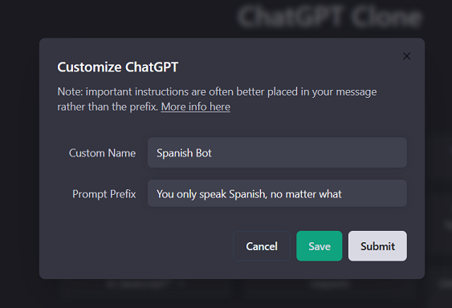

<p align="center">
  <a href="https://discord.gg/NGaa9RPCft">
    <picture>
      <source media="(prefers-color-scheme: dark)" srcset="https://user-images.githubusercontent.com/110412045/228325485-9d3e618f-a980-44fe-89e9-d6d39164680e.png">
      
    </picture>
    <h1 align="center">ChatGPT Clone</h1>
  </a>
</p>

<p align="center">
  <a aria-label="Join the community on Discord" href="https://discord.gg/NGaa9RPCft">
    
  </a>
  <a aria-label="Sponsors" href="#sponsors">
    
  </a>
</p>

## All AI Conversations under One Roof. ##
  Assistant AIs are the future and OpenAI revolutionized this movement with ChatGPT. While numerous UIs exist, this app commemorates the original styling of ChatGPT, with the ability to integrate any current/future AI models, while integrating and improving upon original client features, such as conversation/message search and prompt templates (currently WIP). Through this clone, you can avoid ChatGPT Plus in favor of free or pay-per-call APIs. I will soon deploy a demo of this app. Feel free to contribute, clone, or fork. Currently dockerized.
  
  

### Features

- Response streaming identical to ChatGPT through server-sent events
- UI from original ChatGPT, including Dark mode
- AI model selection (through 3 endpoints: OpenAI API, BingAI, and ChatGPT Browser)
- Create, Save, & Share custom presets for OpenAI and BingAI endpoints - [More info on customization here](https://github.com/danny-avila/chatgpt-clone/releases/tag/v0.3.0)
- Edit and Resubmit messages just like the official site (with conversation branching)
- Search all messages/conversations - [More info here](https://github.com/danny-avila/chatgpt-clone/releases/tag/v0.1.0)
- Integrating plugins soon

## Sponsors

  Sponsored by <a href="https://github.com/DavidDev1334"><b>@DavidDev1334</b></a>, <a href="https://github.com/mjtechguy"><b>@mjtechguy</b></a>, <a href="https://github.com/Pharrcyde"><b>@Pharrcyde</b></a>, & <a href="https://github.com/fuegovic"><b>@fuegovic</b></a>


## Updates
<details open>
<summary><strong>2023-04-05</strong></summary>


**Released [v0.3.0](https://github.com/danny-avila/chatgpt-clone/releases/tag/v0.3.0)**, Introducing more customization for both OpenAI & BingAI conversations! This is one of the biggest updates yet and will make integrating future LLM's a lot easier, providing a lot of customization features as well, including sharing presets! Please feel free to share them in the **[community discord server](https://discord.gg/NGaa9RPCft)**

</details>

<details>
<summary><strong>Previous Updates</strong></summary>
  
<details>
<summary><strong>2023-03-23</strong></summary>


**Released [v0.1.0](https://github.com/danny-avila/chatgpt-clone/releases/tag/v0.1.0)**, **searching messages/conversations is live!** Up next is more custom parameters for customGpt's. Join the discord server for more immediate assistance and update: **[community discord server](https://discord.gg/NGaa9RPCft)**

</details>

  
<details>
<summary><strong>2023-03-22</strong></summary>


**Released [v0.0.6](https://github.com/danny-avila/chatgpt-clone/releases/tag/v0.0.6)**, the latest stable release before **Searching messages** goes live tomorrow. See exact updates to date in the tag link. By request, there is now also a **[community discord server](https://discord.gg/NGaa9RPCft)**

</details>
<details>
<summary><strong>2023-03-20</strong></summary>


**Searching messages** is almost here as I test more of its functionality. There've been a lot of great features requested and great contributions and I will work on some soon, namely, further customizing the custom gpt params with sliders similar to the OpenAI playground, and including the custom params and system messages available to Bing.

The above features are next and then I will have to focus on building the **test environment.** I would **greatly appreciate** help in this area with any test environment you're familiar with (mocha, chai, jest, playwright, puppeteer). This is to aid in the velocity of contributing and to save time I spend debugging.

On that note, I had to switch the default branch due to some breaking changes that haven't been straight forward to debug, mainly related to node-chat-gpt the main dependency of the project. Thankfully, my working branch, now switched to default as main, is working as expected.

</details>
<details>
<summary><strong>2023-03-16</strong></summary>


[Latest release (v0.0.4)](https://github.com/danny-avila/chatgpt-clone/releases/tag/v0.0.4) includes Resubmitting messages & Branching messages, which mirrors official ChatGPT feature of editing a sent message, that then branches the conversation into separate message paths (works only with ChatGPT)

Full details and [example here](https://github.com/danny-avila/chatgpt-clone/releases/tag/v0.0.4). Message search is on the docket

</details>
<details>
<summary><strong>2023-03-12</strong></summary>


Really thankful for all the issues reported and contributions made, the project's features and improvements have accelerated as result. Honorable mention is [wtlyu](https://github.com/wtlyu) for contributing a lot of mindful code, namely hostname configuration and mobile styling. I will upload images on next release for faster docker setup, and starting updating them simultaneously with this repo.


Many improvements across the board, the biggest is being able to start conversations simultaneously (again thanks to [wtlyu](https://github.com/wtlyu) for bringing it to my attention), as you can switch conversations or start a new chat without any response streaming from a prior one, as the backend will still process/save client responses. Just watch out for any rate limiting from OpenAI/Microsoft if this is done excessively.


Adding support for conversation search is next! Thank you [mysticaltech](https://github.com/mysticaltech) for bringing up a method I can use for this.
</details>
<details>
<summary><strong>2023-03-09</strong></summary>
Released v.0.0.2

Adds Sydney (jailbroken Bing AI) to the model menu. Thank you [DavesDevFails](https://github.com/DavesDevFails) for bringing it to my attention in this [issue](https://github.com/danny-avila/chatgpt-clone/issues/13). Bing/Sydney now correctly cite links, more styling to come. Fix some overlooked bugs, and model menu doesn't close upon deleting a customGpt.


I've re-enabled the ChatGPT browser client (free version) since it might be working for most people, it no longer works for me. Sydney is the best free route anyway.
</details>
<details>
<summary><strong>2023-03-07</strong></summary>
Due to increased interest in the repo, I've dockerized the app as of this update for quick setup! See setup instructions below. I realize this still takes some time with installing docker dependencies, so it's on the roadmap to have a deployed demo. Besides this, I've made major improvements for a lot of the existing features across the board, mainly UI/UX.


Also worth noting, the method to access the Free Version is no longer working, so I've removed it from model selection until further notice.
</details>
<details>
<summary><strong>2023-03-04</strong></summary>
Custom prompt prefixing and labeling is now supported through the official API. This nets some interesting results when you need ChatGPT for specific uses or entertainment. Select 'CustomGPT' in the model menu to configure this, and you can choose to save the configuration or reference it by conversation. Model selection will change by conversation.
</details>
<details>
<summary><strong>2023-03-01</strong></summary>
Official ChatGPT API is out! Removed davinci since the official API is extremely fast and 10x less expensive. Since user labeling and prompt prefixing is officially supported, I will add a View feature so you can set this within chat, which gives the UI an added use case. I've kept the BrowserClient, since it's free to use like the official site.

The Messages UI correctly mirrors code syntax highlighting. The exact replication of the cursor is not 1-to-1 yet, but pretty close. Later on in the project, I'll implement tests for code edge cases and explore the possibility of running code in-browser. Right now, unknown code defaults to javascript, but will detect language as close as possible.
</details>
<details>
<summary><strong>2023-02-21</strong></summary>
BingAI is integrated (although sadly limited by Microsoft with the 5 msg/convo limit, 50 msgs/day). I will need to handle the case when Bing refuses to give more answers on top of the other styling features I have in mind. Official ChatGPT use is back with the new BrowserClient. Brainstorming how to handle the UI when the Ai model changes, since conversations can't be persisted between them (or perhaps build a way to achieve this at some level).
</details>
<details >
<summary><strong>2023-02-15</strong></summary>
Just got access to Bing AI so I'll be focusing on integrating that through waylaidwanderer's 'experimental' BingAIClient.
</details>
<details>
<summary><strong>2023-02-14</strong></summary>

Official ChatGPT use is no longer possible though I recently used it with waylaidwanderer's [reverse proxy method](https://github.com/waylaidwanderer/node-chatgpt-api/blob/main/README.md#using-a-reverse-proxy), and before that, through leaked models he also discovered.

Currently, this project is only functional with the `text-davinci-003` model.
</details>
</details>

# Table of Contents
- [Table of Contents](#table-of-contents)
  - [Roadmap](#roadmap)
    - [Tech Stack](#tech-stack)
  - [Getting Started](#getting-started)
    - [Prerequisites](#prerequisites)
  - [Usage](#usage)
    - [Local](#local)
    - [**Automated Installer (Windows)**](#automated-installer-windows)
    - [**In-Depth Instructions**](#in-depth-instructions)
    - [Docker](#docker)
    - [Access Tokens](#access-tokens)
    - [Proxy](#proxy)
    - [User/Auth System](#userauth-system)
    - [Updating](#updating)
  - [Use Cases](#use-cases)
  - [Origin](#origin)
  - [Caveats](#caveats)
    - [Regarding use of Official ChatGPT API](#regarding-use-of-official-chatgpt-api)
  - [Contributing](#contributing)
  - [License](#license)

## Roadmap

> **Warning**

>  This is a work in progress. I'm building this in public. FYI there is still a lot of tech debt to cleanup. You can follow the progress here or on my [Linkedin](https://www.linkedin.com/in/danny-avila).


<details>
<summary><strong>Here are my recently completed and planned features:</strong></summary>

- [x] Persistent conversation
- [x] Rename, delete conversations
- [x] UI Error handling
- [x] Bing AI integration
- [x] AI model change handling (start new convos within existing, remembers last selected)
- [x] Code block handling (highlighting, markdown, clipboard, language detection)
- [x] Markdown handling
- [x] Customize prompt prefix/label (custom ChatGPT using official API)
- [x] Server convo pagination (limit fetch and load more with 'show more' button)
- [x] Config file for easy startup (docker compose)
- [x] Mobile styling (thanks to [wtlyu](https://github.com/wtlyu))
- [x] Resubmit/edit sent messages (thanks to [wtlyu](https://github.com/wtlyu))
- [x] Message Search
- [x] Custom params for ChatGPT API (temp, top_p, presence_penalty)
- [x] Bing AI Styling (params, suggested responses, convo end, etc.)
- [x] Add warning before clearing convos
- [ ] Build test suite for CI/CD
- [ ] Prompt Templates/Search
- [ ] Refactor/clean up code (tech debt)
- [x] Optional use of local storage for credentials (for bing and browser)
- [ ] ChatGPT Plugins (reverse engineered)
- [ ] Deploy demo

</details>

### Tech Stack


<details>
<summary><strong>This project uses:</strong></summary>


- [node-chatgpt-api](https://github.com/waylaidwanderer/node-chatgpt-api)
- No React boilerplate/toolchain/clone tutorials, created from scratch with react@latest
- Use of Tailwind CSS and [shadcn/ui](https://github.com/shadcn/ui) components
- Docker, useSWR, Redux, Express, MongoDB, [Keyv](https://www.npmjs.com/package/keyv)
</details>


## Getting Started

### Prerequisites
- npm
- Node.js >= 19.0.0
- MongoDB installed or [MongoDB Atlas](https://account.mongodb.com/account/login) (required if not using Docker)
    - MongoDB does not support older ARM CPUs like those found in Raspberry Pis. However, you can make it work by setting MongoDB's version to mongo:4.4.18 in docker-compose.yml, the most recent version compatible with
- [Docker (optional)](https://www.docker.com/get-started/)
- [OpenAI API key](https://platform.openai.com/account/api-keys)
- BingAI, ChatGPT access tokens (optional, free AIs)

## Usage

- **Clone/download** the repo down where desired
```bash
  git clone https://github.com/danny-avila/chatgpt-clone.git
```
- If using MongoDB Atlas, remove `&w=majority` from default connection string.

### Local
### **[Automated Installer (Windows)](https://github.com/fuegovic/chatgpt-clone-local-installer)**
(Includes a Startup and Update Utility)
### **[In-Depth Instructions](https://github.com/danny-avila/chatgpt-clone/blob/0d4f0f74c04337aaf51b9a3eef898165a7009156/LOCAL_INSTALL.md)** 
by [@fuegovic](https://github.com/fuegovic)

### Docker

- **Provide** all credentials, (API keys, access tokens, and Mongo Connection String) in [docker-compose.yml](docker-compose.yml) under api service
- **Run** `docker-compose up` to start the app
- Note: MongoDB does not support older ARM CPUs like those found in Raspberry Pis. However, you can make it work by setting MongoDB's version to mongo:4.4.18 in docker-compose.yml, the most recent version compatible with

### Access Tokens

<details>
<summary><strong>ChatGPT Free Instructions</strong></summary>

To get your Access token For ChatGPT 'Free Version', login to chat.openai.com, then visit https://chat.openai.com/api/auth/session.


**Warning:** There may be a high chance of your account being banned with this method. Continue doing so at your own risk.

</details>

<details>
<summary><strong>BingAI Instructions</strong></summary>
The Bing Access Token is the "_U" cookie from bing.com. Use dev tools or an extension while logged into the site to view it.

**Note:** Specific error handling and styling for this model is still in progress.
</details>

### Proxy

If your server cannot connect to the chatGPT API server by some reason, (eg in China). You can set a environment variable `PROXY`. This will be transmitted to `node-chatgpt-api` interface.

**Warning:** `PROXY` is not `reverseProxyUrl` in `node-chatgpt-api`

<details>
<summary><strong>Set up proxy in local environment </strong></summary>

Here is two ways to set proxy.
- Option 1: system level environment
`export PROXY="http://127.0.0.1:7890"`
- Option 2: set in .env file
`PROXY="http://127.0.0.1:7890"`

**Change `http://127.0.0.1:7890` to your proxy server**
</details>

<details>
<summary><strong>Set up proxy in docker environment </strong></summary>

set in docker-compose.yml file, under services - api - environment

```
    api:
        ...
        environment:
                ...
                - "PROXY=http://127.0.0.1:7890"
                # add this line ↑
```

**Change `http://127.0.0.1:7890` to your proxy server**

</details>

### User/Auth System

**First Time Setup**

In order for the auth system to function properly, there are some environment variables that are needed. Note that this information is also included in the [/api/.env.example](https://github.com/danny-avila/chatgpt-clone/blob/main/api/.env.example) and [/client/.env.example](https://github.com/danny-avila/chatgpt-clone/blob/main/client/.env.example) files.

In /api/.env, you will need to set the following variables:
```bash
JWT_SECRET_DEV=secret
# Add a secure secret for production if deploying to live domain.
JWT_SECRET_PROD=secret
# Set the expiration delay for the secure cookie with the JWT token
# Delay is in millisecond e.g. 7 days is 1000*60*60*24*7
SESSION_EXPIRY=1000 * 60 * 60 * 24 * 7
# Note: NODE_ENV should be set to 'development' in the Server configuration section if you want to run in dev mode
CLIENT_URL_DEV=http://localhost:3090
SERVER_URL_DEV=http://localhost:3080
# Change these values to domain if deploying:
CLIENT_URL_PROD=http://localhost:3080
SERVER_URL_PROD=http://localhost:3080
```

In /client/.env, you will need to set the following variables:
```bash
VITE_SERVER_URL_DEV=http://localhost:3080
# Change this to domain if deploying:
VITE_SERVER_URL_PROD=http://localhost:3080
```

The first time you run the application, you should register a new account by clicking the "Sign up" link on the login page. The first account registered will be recieve an admin role. The admin account does not currently have extended functionality, but is valuable should you choose to create an admin dashboard for user management. 

**Migrating Previous Conversations and Presets to new User Account**

When the first account is registered, the application will automatically migrate any conversations and presets that you created before the user system was implemented to that account. 

IMPORTANT: if you use login for the first time with a social login account (eg. Google, facebook, etc.), the conversations and presets that you created before the user system was implemented will NOT be migrated to that account. You should register and login with a local account (email and password) for the first time. 

**OAuth2/Social Login**

The application is setup to support OAuth2/Social Login with Google. All of the code is in place for Facebook login as well, but this has not been tested because the setup process with Facebook was honestly just too painful for me to deal with. I plan to add support for other OAuth2 providers including Github and Discord at a later time.

To enable Google login, you must create an application in the [Google Cloud Console](https://cloud.google.com) and provide the client ID and client secret in the [/api/.env](https://github.com/danny-avila/chatgpt-clone/blob/main/api/.env.example) file, then set `VITE_SHOW_GOOGLE_LOGIN_OPTION=true` in the [/client/.env](https://github.com/danny-avila/chatgpt-clone/blob/main/client/.env.example) file. 

*Instructions for setting up Google login are provided below.*

1. Go to "APIs and Services" in your Google Cloud account and click on "Credentials".
2. Click on "Configure consent screen" and select "External" as the user type.
3. Add "profile", "email" and "openid" as the scopes for your app. These are the first three checkboxes when you click on "Add or remove scopes".
4. Click on "Save and continue" and then "Back to dashboard".
5. Click on "Create Credentials" and then "OAuth client ID".
6. Select "Web application" as the application type and give it a name.
7. Add "http://localhost/" "http://localhost:3080/" and "http://localhost:3090/" to the authorized JavaScript origins.
8. Add "http://localhost:3080/oauth/google/callback" to the authorized redirect URIs.
9. Click on "Create" and copy your client ID and client secret.
10. Paste them into your api/.env file.
11. Enable the feature in the client/.env file


**Email and Password Reset** 

Most of the code is in place for sending password reset emails, but is not yet feature-complete as I have not setup an email server to test it. Currently, submitting a password reset request will then display a link with the one-time reset token that can then be used to reset the password. Understanding that this is a considerable security hazard, email integration will be included in the next release.

***Warning***

If you previously implemented your own user system using the original scaffolding that was provided, you will no longer see conversations and presets by switching to the new user system. This is because of a design flaw in the scaffolding implementation that was problematic for the inclusion of social login.

### Updating

- As the project is still a work-in-progress, you should pull the latest and run the steps over. Reset your browser cache/clear cookies and site data.

## Use Cases ##


<details>
<summary><strong> Why use this project? </strong></summary>

  - One stop shop for all conversational AIs, with the added bonus of searching past conversations.
  - Using the official API, you'd have to generate 7.5 million words to expense the same cost as ChatGPT Plus ($20).
  - ChatGPT/Google Bard/Bing AI conversations are lost in space or
  cannot be searched past a certain timeframe.
  - **Customize ChatGPT**

    

  - **API is not as limited as ChatGPT Free (at [chat.openai.com](https://chat.openai.com/chat))**

    

  - **ChatGPT Free is down.**

    
    
    </details>


## Origin ##
    This project was started early in Feb '23, anticipating the release of the official ChatGPT API from OpenAI, which is now used. It was originally created as a Minimum Viable Product (or MVP) for the [@HackReactor](https://github.com/hackreactor/) Bootcamp. It was built with OpenAI response streaming and most of the UI completed in under 20 hours. During the end of that time, I had most of the UI and basic functionality done. This was created without using any boilerplates or templates, including create-react-app and other toolchains. I didn't follow any 'un-official chatgpt' video tutorials, and simply referenced the official site for the UI. The purpose of the exercise was to learn setting up a full stack project from scratch. Please feel free to give feedback, suggestions, or fork the project for your own use.


## Caveats
### Regarding use of Official ChatGPT API
From [@waylaidwanderer](https://github.com/waylaidwanderer/node-chatgpt-api/blob/main/README.md#caveats):

Since `gpt-3.5-turbo` is ChatGPT's underlying model, I had to do my best to replicate the way the official ChatGPT website uses it.
This means my implementation or the underlying model may not behave exactly the same in some ways:
- Conversations are not tied to any user IDs, so if that's important to you, you should implement your own user ID system.
- ChatGPT's model parameters (temperature, frequency penalty, etc.) are unknown, so I set some defaults that I thought would be reasonable.
- Conversations are limited to roughly the last 3000 tokens, so earlier messages may be forgotten during longer conversations.
  - This works in a similar way to ChatGPT, except I'm pretty sure they have some additional way of retrieving context from earlier messages when needed (which can probably be achieved with embeddings, but I consider that out-of-scope for now).

## Contributing

Contributions and suggestions welcome! Bug reports and fixes are welcome!

For new features, components, or extensions, please open an issue and discuss before sending a PR. 

- Join the [Discord community](https://discord.gg/NGaa9RPCft)

## License
This project is licensed under the MIT License.
