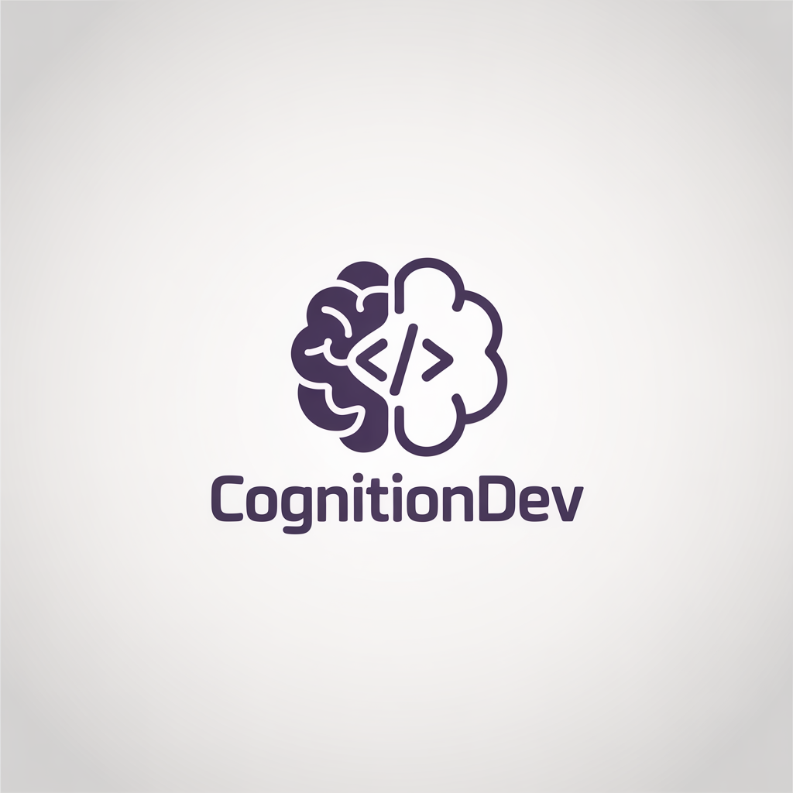

<p align="center">
  
  <h1 align="center">CognitionDev</h1>
  <p align="center">A <a href="https://librechat.ai">LibreChat</a> fork focused on learning, technical work, and personal automation</p>
</p>

<p align="center">
  <a href="https://github.com/danny-avila/LibreChat">
    
  </a>
  <a href="https://docs.librechat.ai">
    
  </a>
</p>

---

> **CognitionDev** is a fork of [LibreChat](https://github.com/danny-avila/LibreChat) — an open-source AI chat platform. All original LibreChat features are preserved. The additions described here are this fork's roadmap, focused on technical productivity, active learning, and agent-based automation.

---

## Feature Roadmap

The features below are **planned** and not yet implemented. They are organized by category and delivery horizon.

### Learning & Study

| Feature | Description |
|---|---|
| **Feynman Mode** | An assistant that makes you explain concepts out loud and corrects you, enforcing active learning |
| **Flashcard Generator** | From any text or PDF, generates Q&A pairs for spaced repetition review |
| **Exam Simulator** | Send a topic, the model builds an exam and evaluates your answers |
| **Knowledge Map** | The assistant tracks what you already know and suggests the next topic |
| **Learning Journal** | Daily automatic summary of what you studied in your conversations |
| **Socratic Tutor** | A mode where the model never gives a direct answer — only asks guiding questions |

---

### Work & Code

| Feature | Description |
|---|---|
| **Automated Code Review** | Send a PR or file, receive structured feedback |
| **Documentation Generator** | From source code, generates README, JSDoc, and Swagger |
| **Conversational Debugger** | Paste an error and stack trace; the assistant asks questions to isolate the root cause |
| **Test Generator** | From a function, automatically generates test cases |
| **Requirements Translator** | Transforms natural-language specs into detailed technical tasks |
| **Architecture Assistant** | Discusses design decisions grounded in your codebase via MCP |

---

### Personal Productivity

| Feature | Description |
|---|---|
| **Second Brain** | Connects Notion/Obsidian via MCP; the model reads your notes and answers based on them |
| **Email Triage** | Integration to summarize and prioritize work emails |
| **Report Generator** | From the week's conversations, generates a summary of what was done |
| **Meeting Assistant** | Paste the agenda, receive suggested questions and key points to watch |
| **Task Planner** | Describe what you need to do, receive an execution plan with time estimates |

---

### External Integrations via MCP

| Integration | Capabilities |
|---|---|
| **GitHub** | Read issues, create PRs, review code directly in chat |
| **Jira / Linear** | Create and update tickets by conversation |
| **Notion** | Read and write pages, search knowledge base |
| **Google Drive / Docs** | Ask questions about documents in your Drive |
| **Database** | Connect to your database and run queries in natural language |
| **Slack** | Summarize channels, draft messages |
| **Google Calendar** | Check your schedule and plan your day |

---

### Platform Features

| Feature | Description |
|---|---|
| **Multi-user with Profiles** | Share the instance with colleagues, with per-profile isolation |
| **Cost Control per Provider** | Dashboard showing how much you're spending per model/provider |
| **Intelligent Model Routing** | Simple questions go to cheaper models; complex ones go to the best |
| **Automatic Fallback** | If a provider goes down, automatically redirects to another |
| **Semantic Response Cache** | Similar questions reuse previous answers, saving tokens |
| **Model Evaluation** | A/B testing between models to see which performs best for your use case |

---

### Automations & Autonomous Agents

| Agent | Description |
|---|---|
| **Research Agent** | Receives a topic, searches the web, consolidates and summarizes |
| **Monitoring Agent** | Monitors a repository or website and alerts you about relevant changes |
| **Onboarding Pipeline** | New projects: the agent reads the code, generates documentation, and answers questions |
| **PR Review Agent** | Automatically runs when a PR is opened and posts review comments |

---

## Delivery Horizons

```
Short term   → MCP filesystem + GitHub + context-aware presets
Mid term     → RAG over your docs + persistent memory + model routing
Long term    → Autonomous agents + second brain + model evaluation
```

---

## About LibreChat (upstream)

CognitionDev is built on top of LibreChat, which provides:

- Multi-provider AI support (Anthropic, OpenAI, Google, Bedrock, Ollama, and more)
- Agents with Model Context Protocol (MCP) support
- Sandboxed Code Interpreter (Python, Node.js, Go, C++, Java, Rust, etc.)
- Image generation and editing (DALL-E, Stable Diffusion, GPT-Image-1)
- Multimodal interface — text, files, images, audio
- Multi-user authentication (OAuth2, LDAP, email)
- Resumable streams with multi-device sync
- Multilingual UI (30+ languages)
- Fully open-source and self-hosted

Full LibreChat documentation: [docs.librechat.ai](https://docs.librechat.ai)

---

## Development

```bash
# Install dependencies
npm run smart-reinstall

# Backend (port 3080)
npm run backend:dev

# Frontend (port 3090)
npm run frontend:dev
```

Requirements: Node.js v20.19.0+ · MongoDB 8.x

---

## License

Distributed under the same license as LibreChat. See [LICENSE](LICENSE) for details.
