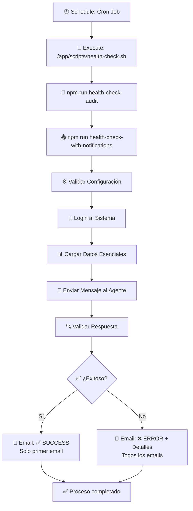

# 🔍 Health Check Audit Automático para LibreChat

Esta guía te permitirá configurar el sistema automático de Health Check Audit para LibreChat usando Docker y Dokploy, con **notificaciones diferenciadas por email**.

## 📋 Índice
- [🎯 Objetivo](#-objetivo)
- [🏗️ Arquitectura del Flujo](#-arquitectura-del-flujo)
- [📁 Archivos Modificados/Creados](#-archivos-modificadoscreados)
- [⚙️ Pasos de Implementación](#-pasos-de-implementación)
- [🔧 Configuración de Variables de Entorno](#-configuración-de-variables-de-entorno)
- [🚀 Configuración en Dokploy](#-configuración-en-dokploy)
- [🧪 Pruebas y Verificación](#-pruebas-y-verificación)
- [🐛 Resolución de Problemas](#-resolución-de-problemas)
- [📧 Tipos de Notificaciones](#-tipos-de-notificaciones)
- [🎛️ Scripts Disponibles](#-scripts-disponibles)

## 🎯 Objetivo

Automatizar la auditoría y monitoreo de LibreChat, detectando problemas antes de que afecten a usuarios reales. El sistema envía **notificaciones diferenciadas por email** según el resultado del health check.

### ✅ Características del Sistema
- **🔍 Auditoría Externa** - Prueba el sistema desde fuera como un usuario real
- **📧 Notificaciones Diferenciadas** - ✅ Éxito: Solo primer email | ❌ Error: Todos los emails
- **🤖 Test de Agentes** - Verifica que los agentes respondan correctamente
- **🔄 Automatizado** - Ejecución programada via cron
- **🛡️ Detección de Errores** - Identifica problemas específicos en respuestas
- **⚡ Robusto** - Manejo completo de errores con detalles
- **🎯 Parseo Inteligente** - Lee dinámicamente la lista de emails de administradores

## 🏗️ Arquitectura del Flujo



## 📁 Archivos Modificados/Creados

### 🆕 Archivos Nuevos
```
├── config/health-check/
│   ├── load-config.js              # Manejo de configuración + parseo de emails
│   ├── simple-health-check.js      # Health check básico (sin email)
│   ├── health-check-with-email.js  # Health check completo ⭐
│   ├── test-email.js               # Test de configuración de email
│   └── debug-test-parsing.js       # Debug del parseo de emails
├── config/services/
│   └── email-notifier.js           # Servicio de notificaciones mejorado
├── scripts/
│   └── health-check.sh             # Script bash principal ⭐
└── README_HEALTH_CHECK_AUDIT.md    # Esta guía
```

### ✏️ Archivos Modificados
```
├── api/package.json                # Nuevos scripts + debug-email-parsing
├── Dockerfile.multi                # Incluye scripts health check
└── .env                            # Variables ya configuradas
```

## ⚙️ Pasos de Implementación

### 1. **Verificar Archivos del Proyecto**

Asegúrate de que todos los archivos estén en su lugar:

```bash
# Verificar archivos nuevos
ls -la config/health-check/
ls -la config/services/email-notifier.js
ls -la scripts/health-check.sh

# Verificar modificaciones
git status
```

### 2. **Rebuild de la Imagen Docker**

> **💡 Nota:** Las dependencias (`axios`, `dotenv`, `nodemailer`) ya están incluidas en el proyecto.

En Dokploy, ejecuta un **rebuild** de la imagen para incluir los nuevos scripts:

```bash
# En tu repositorio Git
git add .
git commit -m "feat: Add Health Check Audit system with differentiated email notifications"
git push origin develop

# En Dokploy: Trigger rebuild from UI
```

## 🔧 Configuración de Variables de Entorno

### **Variables Ya Configuradas en .env**

Las siguientes variables ya están configuradas en tu archivo `.env`:

```env
# ========================================
# HEALTH CHECK AUDIT CONFIGURATION
# ========================================

# Health Check Basic Configuration
HEALTH_CHECK_URL=https://avi.corporacionccm.cl
HEALTH_CHECK_EMAIL=email@gmail.com
HEALTH_CHECK_PASSWORD=password123
HEALTH_CHECK_AGENT_ID=agent_nC338LEca541Mt80BSC0i
HEALTH_CHECK_ADMIN_EMAIL=asistente@corporacionccm.cl, email_2@corporacionccm.cl, email_3@corporacionccm.cl

# Email Notification Configuration  
EMAIL_SERVICE=gmail
EMAIL_USERNAME=echev.test@gmail.com
EMAIL_PASSWORD=tu_app_password_aqui
EMAIL_FROM_NAME=Asistente AVI
EMAIL_FROM=echev.test@gmail.com
EMAIL_HOST=smtp.gmail.com
EMAIL_PORT=587
EMAIL_ENCRYPTION=starttls
EMAIL_ALLOW_SELFSIGNED=false
```

### **🎯 Nuevo Comportamiento de Notificaciones**

El sistema ahora **parsea dinámicamente** la variable `HEALTH_CHECK_ADMIN_EMAIL`:

#### **✅ Notificaciones de Éxito:**
- **Destinatario:** Solo el **primer email** de la lista
- **Ejemplo:** `asistente@corporacionccm.cl`
- **Asunto:** `✅ Health Check Exitoso - LibreChat`

#### **❌ Notificaciones de Error:**
- **Destinatarios:** **Todos los emails** de la lista
- **Ejemplo:** `asistente@corporacionccm.cl, email_2@corporacionccm.cl, email_3@corporacionccm.cl`
- **Asunto:** `❌ Health Check Falló - LibreChat`

### **🔧 Configuración de Gmail para Notificaciones**

1. **Habilita autenticación de 2 factores** en tu cuenta Google
2. Ve a **"Gestionar tu cuenta de Google"** → **"Seguridad"** → **"Contraseñas de aplicaciones"**
3. Genera una **"App Password"** específica para LibreChat Health Check
4. Usa la **App Password** en `EMAIL_PASSWORD`, **NO** tu contraseña normal

## 🚀 Configuración en Dokploy

### 1. **Redesplegar el Servicio**

1. Ve a tu proyecto en Dokploy
2. Selecciona el servicio **API**
3. Clic en **Redeploy** para aplicar los cambios del Dockerfile

### 2. **Configurar Cron Job**

1. En el servicio **API**, busca la sección **"Cron Jobs"** o **"Schedules"**
2. Clic en **"Create Schedule"**
3. Configura los siguientes parámetros:

```yaml
Service Name: api
Task Name: Health Check Audit with Email Notifications
Schedule: 0 */6 * * *  # Cada 6 horas
Shell Type: sh
Command: /app/scripts/health-check.sh
Enabled: ✅
```

### 3. **Opciones de Schedule**
- `0 */6 * * *` = Cada 6 horas
- `0 2 * * *` = Diariamente a las 2:00 AM
- `0 8,20 * * *` = Dos veces al día (8 AM y 8 PM)
- `*/30 * * * *` = Cada 30 minutos (para testing)

## 🧪 Pruebas y Verificación

### 1. **Prueba Manual del Health Check**

Ejecuta el script manualmente para verificar que funcione:

```bash
# Conectarse al contenedor
docker exec -it LibreChat-API-local /bin/sh

# Ejecutar el script manualmente
/app/scripts/health-check.sh

# O ejecutar paso a paso
cd /app/api
npm run health-check-audit
```

### 2. **Test de Configuración de Email Mejorado**

```bash
# Test específico de email (envía 2 emails: éxito y error)
cd /app/api
npm run test-health-email
```

### 3. **Debug del Parseo de Emails**

```bash
# Verificar cómo se parsean los emails
cd /app/api
npm run debug-email-parsing
```

### 4. **Verificar Logs**

```bash
# Ver logs del contenedor
docker logs <nombre_contenedor_api> -f

# Buscar logs de health check
docker logs <nombre_contenedor_api> 2>&1 | grep -i "health check"
```

### 5. **Verificar Emails**

1. Revisa tu bandeja de entrada en `HEALTH_CHECK_ADMIN_EMAIL`
2. Los emails de éxito tienen **✅** en el asunto y van **solo al primer email**
3. Los emails de error tienen **❌** en el asunto y van a **todos los emails**

### 6. **Verificar Cron Job**

En Dokploy UI:
1. Ve a **Schedules** del servicio API
2. Verifica que el job esté **Enabled**
3. Revisa el **Last Run** y **Next Run**

## 🐛 Resolución de Problemas

### ❌ Error: "Variables faltantes: baseUrl, email, password, agentId"

**Solución:**
1. Verifica que las variables `HEALTH_CHECK_*` estén en el archivo `.env`
2. Asegúrate de que el contenedor tenga acceso a las variables de entorno

```bash
# Verificar variables de entorno en el contenedor
docker exec -it <container> env | grep HEALTH_CHECK
```

### ❌ Error: "Login falló: status 401"

**Solución:**
1. Verifica que `HEALTH_CHECK_EMAIL` y `HEALTH_CHECK_PASSWORD` sean correctos
2. Confirma que el usuario tenga acceso al sistema
3. Prueba hacer login manual en la interfaz web

### ❌ Error: "Error enviando email"

**Solución:**
1. Verifica la configuración de Gmail (App Password)
2. Confirma que `EMAIL_USERNAME` y `EMAIL_PASSWORD` sean correctos
3. Verifica que `EMAIL_HOST` y `EMAIL_PORT` estén configurados

```bash
# Test de configuración de email
docker exec -it <container> sh -c "cd /app/api && npm run test-health-email"
```

### ❌ Error: "Error en respuesta del chat: [mensaje de error]"

**Solución:**
1. Verifica que `HEALTH_CHECK_AGENT_ID` sea válido
2. Confirma que el agente esté activo y funcionando
3. Revisa los logs del servidor para problemas con LLM/API keys

### ❌ Error: "Respuesta vacía del agente"

**Solución:**
1. Verifica la configuración del agente
2. Confirma que el LLM backend esté funcionando
3. Revisa límites de rate limiting o quotas

### ❌ Error: "Parseo de emails falló"

**Solución:**
1. Verifica el formato de `HEALTH_CHECK_ADMIN_EMAIL`
2. Asegúrate de que esté separado por comas
3. Ejecuta el debug de parseo:

```bash
docker exec -it <container> sh -c "cd /app/api && npm run debug-email-parsing"
```

### ❌ Cron Job no se ejecuta

**Solución:**
1. Verifica la sintaxis del cron: `0 */6 * * *`
2. Comprueba que el script sea ejecutable: `chmod +x`
3. Verifica que la ruta sea correcta: `/app/scripts/health-check.sh`
4. Revisa logs del cron service en Dokploy

### 🔍 Debug Avanzado

Para debug detallado, modifica temporalmente el script:

```bash
# En health-check.sh, agregar debug
#!/bin/bash
set -x  # Debug mode
echo "🚀 Iniciando Health Check Audit - $(date)"
echo "Current directory: $(pwd)"
echo "Environment: $(env | grep HEALTH_CHECK)"
cd /app/api
npm run health-check-audit
```

## 📊 Monitoreo y Mantenimiento

### **Logs Recomendados**
- Revisa logs diariamente los primeros días
- Configura alertas si el proceso falla repetidamente
- Monitorea la salud del sistema mediante los reportes

### **Mantenimiento Periódico**
- Revisa la rotación de passwords de email (anualmente)
- Verifica que el agente de prueba siga funcionando
- Considera ajustar frecuencia según necesidades

### **Métricas a Monitorear**
- Tiempo de respuesta del health check
- Tasa de éxito/error de los tests
- Tiempo de respuesta del agente
- Errores específicos detectados

## 📧 Tipos de Notificaciones

### **Email de Éxito ✅**
- **Asunto:** `✅ Health Check Exitoso - LibreChat`
- **Destinatario:** Solo el primer email de `HEALTH_CHECK_ADMIN_EMAIL`
- **Contiene:** Tiempo de duración, status de cada paso, detalles del test

### **Email de Error ❌**
- **Asunto:** `❌ Health Check Falló - LibreChat`
- **Destinatarios:** Todos los emails de `HEALTH_CHECK_ADMIN_EMAIL`
- **Contiene:** Error específico, paso donde falló, detalles para debugging

## 🎛️ Scripts Disponibles

```bash
# Health Check completo con notificaciones diferenciadas (⭐ Principal)
npm run health-check-audit

# Health Check básico sin email
npm run health-check-simple  

# Health Check con notificaciones (alias)
npm run health-check-with-notifications

# Test de configuración de email (envía 2 emails: éxito y error)
npm run test-health-email

# Debug del parseo de emails
npm run debug-email-parsing
```

---

## ✅ Checklist de Implementación

- [ ] ✅ Archivos creados/modificados
- [ ] ✅ Variables de entorno configuradas (ya están)
- [ ] ✅ Configuración de Gmail (App Password)
- [ ] ✅ Imagen Docker reconstruida
- [ ] ✅ Cron job configurado en Dokploy
- [ ] ✅ Prueba manual exitosa
- [ ] ✅ Test de email exitoso (verificar 2 emails)
- [ ] ✅ Debug de parseo de emails exitoso
- [ ] ✅ Verificación de emails diferenciados recibidos

---

Para soporte o mejoras, revisa los logs y consulta esta guía. El sistema detectará problemas proactivamente y te notificará por email de manera inteligente, permitiendo una respuesta rápida ante cualquier incidencia. 