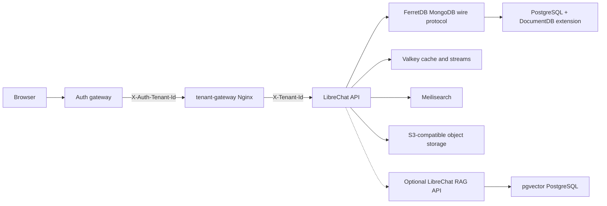

# LibreChat FerretDB Production Compose

This deployment path removes MongoDB Community Server from the runtime stack. LibreChat still uses its MongoDB-compatible data access layer, but it connects to FerretDB, and FerretDB stores data in PostgreSQL with the DocumentDB extension.

Use `RUNBOOK.md` for production rollout, backup scheduling, restore drills, image pinning, and the object-store licensing decision. Use `PRODUCTION_READINESS.md` as the pass/fail launch sign-off checklist.



## Files

- `deploy-compose.ferretdb.yml` defines the self-hosted stack.
- `deploy-compose.ferretdb.seaweedfs.yml` disables internal MinIO and uses SeaweedFS as the S3-compatible object store.
- `deploy-compose.ferretdb.external-s3.yml` disables internal MinIO and points LibreChat at an external S3-compatible service.
- `deploy-compose.ferretdb.rag.yml` enables optional RAG services after source/license review.
- `deploy/ferretdb/.env.example` is the production environment template.
- `deploy/ferretdb/images.linux-amd64.env` contains digest-pinned linux/amd64 image references resolved during this evaluation.
- `deploy/ferretdb/.env.seaweedfs.example` contains the additional variables needed for internal SeaweedFS object storage.
- `deploy/ferretdb/.env.external-s3.example` contains the additional variables needed for external S3-compatible storage.
- `deploy/ferretdb/.env.rag.example` contains the explicit opt-in variables for RAG.
- `deploy/ferretdb/.env.backup-shipping.example` contains the rclone backup shipping template.
- `deploy/ferretdb/PRODUCTION_READINESS.md` is the commercial launch sign-off checklist.
- `deploy/ferretdb/tenant-gateway.conf.template` rewrites the auth gateway tenant header into LibreChat's trusted `X-Tenant-Id`.
- `deploy/ferretdb/auth-gateway/` contains public auth-gateway examples for Nginx, Caddy, and Traefik.
- `deploy/ferretdb/librechat.yaml.example` enables S3 file storage.
- `deploy/ferretdb/bin/generate-env.sh` creates a fresh production env file with random secrets and pinned images.
- `deploy/ferretdb/bin/validate-env.sh` fails startup on placeholder secrets, unsafe bind addresses, unpinned images, and unresolved license confirmations.
- `deploy/ferretdb/bin/bootstrap-host.sh` validates and installs the SeaweedFS production stack on a Linux/systemd host.
- `deploy/ferretdb/bin/healthcheck.sh` checks service health, gateway reachability, backup freshness, and disk thresholds.
- `deploy/ferretdb/bin/ship-backups.sh` ships backup archives and checksums to an rclone remote.
- `deploy/ferretdb/bin/release-evidence.sh` runs the production readiness checks and writes a dated evidence bundle.
- `config/license-audit.js` generates the npm and deployment license inventory.

## First Boot

For the no-AGPL production path, use the SeaweedFS override:

```bash
DOMAIN_SERVER=https://chat.yourdomain.tld \
DOMAIN_CLIENT=https://chat.yourdomain.tld \
OBJECT_STORE_MODE=seaweedfs \
deploy/ferretdb/bin/generate-env.sh

# Review deploy/ferretdb/.env, set real domains/provider keys, and set
# RAG_ENABLED=true only if you also include deploy-compose.ferretdb.rag.yml
# and complete the RAG source/license review fields.
deploy/ferretdb/bin/validate-env.sh

docker compose --env-file deploy/ferretdb/.env -f deploy-compose.ferretdb.yml -f deploy-compose.ferretdb.seaweedfs.yml build api
docker compose --env-file deploy/ferretdb/.env -f deploy-compose.ferretdb.yml -f deploy-compose.ferretdb.seaweedfs.yml up -d
```

On the production Linux host, prefer the repeatable bootstrap path after `.env`, `librechat.yaml`, and optional rclone backup shipping are configured:

```bash
cd /opt/librechat
COMPOSE_PROJECT_NAME=librechat-ferretdb \
ENV_FILE=/opt/librechat/deploy/ferretdb/.env \
COMPOSE_FILES=/opt/librechat/deploy-compose.ferretdb.yml,/opt/librechat/deploy-compose.ferretdb.seaweedfs.yml \
BACKUP_ROOT=/srv/librechat/backups \
TENANT_GATEWAY_URL=http://127.0.0.1:3080 \
npm run host:bootstrap
```

Preview the systemd install and commands without changing the host:

```bash
BOOTSTRAP_DRY_RUN=true npm run host:bootstrap
```

The default bind address is `127.0.0.1:3080` because tenant assignment is trusted only when an auth gateway is in front of this stack. The auth gateway must set `X-Auth-Tenant-Id`; the included Nginx container validates that value and overwrites `X-Tenant-Id` before proxying to LibreChat. Do not expose this gateway directly to browsers unless the network path prevents clients from setting `X-Auth-Tenant-Id`.

If you have approved a MinIO commercial license, you can omit the SeaweedFS `.env` snippet and the SeaweedFS compose override. If you use an external S3-compatible object store instead, merge `deploy/ferretdb/.env.external-s3.example` and use `deploy-compose.ferretdb.external-s3.yml`.

RAG is disabled by default for the commercial no-unknown-license path. To enable it, set `RAG_ENABLED=true`, append `deploy-compose.ferretdb.rag.yml` to `COMPOSE_FILES` after the object-store override, set the `RAG_API_SOURCE_*` review metadata, and set `RAG_API_LICENSE_REVIEWED=true`.

## Operational Notes

- Start with one API container. FerretDB/DocumentDB index creation was validated, but concurrent startup index creation can still create avoidable contention.
- Do not publish ports for `documentdb`, `ferretdb`, `redis`, `meilisearch`, `minio`, or optional `vectordb` unless a firewall limits access to trusted operators. The service is named `redis` for LibreChat compatibility but runs Valkey.
- Pin all active image variables by digest for production. Optional RAG image pins are inactive unless `RAG_ENABLED=true`; review RAG source, build provenance, and licensing before enabling them.
- Back up `documentdb_data`, the selected object-store volume, `meili_data`, and `redis_data`. If `RAG_ENABLED=true`, also back up `rag_pgdata`. DocumentDB is the source of chat/application records; the object store is the source of uploaded objects; `redis_data` contains Valkey persistence for cache/streams. The included backup script uses a physical `pg_basebackup` for DocumentDB because the DocumentDB extension catalog is not safely represented by a standalone logical `pg_dump`.
- If migrating an already-running Redis 7.4+ stack to Valkey, do not reuse the Redis 7.4 AOF/RDB volume directly. Quiesce the app, drain pending work, then reset `redis_data` or perform a tested export/import path.
- Before upgrading FerretDB, upgrade the matching `postgres-documentdb` image and run `ALTER EXTENSION documentdb UPDATE;` from the DocumentDB container, then update the FerretDB image.
- Run the compatibility harness against any candidate FerretDB/DocumentDB version before rollout:

```bash
MONGO_URI='mongodb://ferretdb:<password>@127.0.0.1:27017/LibreChatCompat' \
DB_COMPAT_ALLOW_DROP=true \
TENANT_ISOLATION_STRICT=true \
npm run db:compat:ferretdb
```

- Run the tenant gateway smoke test after any gateway or auth-gateway change:

```bash
TENANT_GATEWAY_URL=http://127.0.0.1:3080 npm run smoke:tenant-gateway
```

- Run the public auth-gateway conformance test after adapting one of the reference configs:

```bash
AUTH_GATEWAY_URL=https://chat.yourdomain.tld \
AUTH_GATEWAY_VALID_HEADERS_JSON='{"Cookie":"session=replace-with-valid-session"}' \
npm run smoke:auth-gateway
```

- Regenerate production image pins only as part of a planned upgrade:

```bash
nix develop -c npm run images:pin:ferretdb -- linux amd64
```

## Backup And Restore

The backup tool writes a timestamped directory and a `.tar.gz` archive containing:

- DocumentDB/PostgreSQL globals and a physical `pg_basebackup` tarball.
- RAG pgvector PostgreSQL globals and database dump, only when `RAG_ENABLED=true`.
- MinIO bucket mirror.
- SeaweedFS data-volume tarball, when using internal SeaweedFS. The script briefly stops gateway, API, SeaweedFS init, and SeaweedFS while taking this physical snapshot.
- External S3-compatible object stores are not backed up by these scripts; use the backend's native backup path.
- Meilisearch data volume tarball.
- Valkey data volume tarball.
- Redacted env snapshot and deployment config files.

```bash
COMPOSE_PROJECT_NAME=librechat-ferretdb \
ENV_FILE=deploy/ferretdb/.env \
COMPOSE_FILES=deploy-compose.ferretdb.yml,deploy-compose.ferretdb.seaweedfs.yml \
BACKUP_ROOT=/srv/librechat/backups \
deploy/ferretdb/bin/backup.sh
```

Restores are destructive and require an explicit confirmation variable:

```bash
COMPOSE_PROJECT_NAME=librechat-ferretdb \
ENV_FILE=deploy/ferretdb/.env \
COMPOSE_FILES=deploy-compose.ferretdb.yml,deploy-compose.ferretdb.seaweedfs.yml \
RESTORE_CONFIRM=I_UNDERSTAND_THIS_REPLACES_DATA \
deploy/ferretdb/bin/restore.sh /srv/librechat/backups/20260504T120000Z.tar.gz
```

For a real disaster-recovery drill, run the drill against a staging stack. The drill seeds sentinel data into DocumentDB, the configured internal object store, Meilisearch, and RAG PostgreSQL when enabled; creates a backup; deletes the sentinel data; restores the backup; and verifies the sentinels came back.

```bash
COMPOSE_PROJECT_NAME=librechat-ferretdb-staging \
ENV_FILE=/tmp/librechat-ferretdb-staging.env \
COMPOSE_FILES=deploy-compose.ferretdb.yml,deploy-compose.ferretdb.seaweedfs.yml \
DRILL_CONFIRM=I_UNDERSTAND_THIS_REPLACES_DATA \
DRILL_ROOT=/tmp/librechat-ferretdb-drill \
deploy/ferretdb/bin/drill.sh
```

Keep backup archives and any `BACKUP_INCLUDE_ENV=true` secret snapshots encrypted at rest. The default backup stores only a redacted env file; keep the real production env/secrets in your secret-management backup path.

DocumentDB restores replace the PostgreSQL data directory from the physical base backup, so restore with the same `postgres-documentdb` image version that created the backup. For lower RPO than scheduled archive backups, add PostgreSQL WAL archiving/pgBackRest around the DocumentDB service and test point-in-time recovery separately.

## Health, Shipping, And Compliance

Run the operational healthcheck from the host:

```bash
COMPOSE_PROJECT_NAME=librechat-ferretdb \
ENV_FILE=deploy/ferretdb/.env \
COMPOSE_FILES=deploy-compose.ferretdb.yml,deploy-compose.ferretdb.seaweedfs.yml \
BACKUP_ROOT=/srv/librechat/backups \
deploy/ferretdb/bin/healthcheck.sh
```

Configure off-host backup shipping with rclone:

```bash
cp deploy/ferretdb/.env.backup-shipping.example deploy/ferretdb/.env.backup-shipping
# edit BACKUP_REMOTE, preferably to an encrypted rclone crypt remote
COMPOSE_PROJECT_NAME=librechat-ferretdb \
ENV_FILE=deploy/ferretdb/.env \
BACKUP_ROOT=/srv/librechat/backups \
deploy/ferretdb/bin/ship-backups.sh
```

Generate a license audit artifact before any commercial release or image redistribution:

```bash
npm run license:audit
```

The audit writes JSON and Markdown under `artifacts/license-audit/` by default. That directory is intentionally ignored because it is generated evidence, not source.

Generate a full release evidence bundle before production launch or a planned upgrade:

```bash
COMPOSE_PROJECT_NAME=librechat-ferretdb \
ENV_FILE=/opt/librechat/deploy/ferretdb/.env \
COMPOSE_FILES=/opt/librechat/deploy-compose.ferretdb.yml,/opt/librechat/deploy-compose.ferretdb.seaweedfs.yml \
BACKUP_ROOT=/srv/librechat/backups \
TENANT_GATEWAY_URL=http://127.0.0.1:3080 \
AUTH_GATEWAY_URL=https://chat.yourdomain.tld \
AUTH_GATEWAY_VALID_HEADERS_JSON='{"Cookie":"session=replace-with-valid-session"}' \
RELEASE_EVIDENCE_REQUIRE_AUTH_GATEWAY=true \
npm run release:evidence
```

The bundle is written under `artifacts/release-evidence/<timestamp>/` by default and includes redacted env/config snapshots, redacted compose output, step logs, the license audit, and `summary.json` plus `summary.md`. A `GO` status means every required check passed. `NO-GO` means a required check failed. `INCOMPLETE` means no required check failed, but a required check was intentionally skipped by environment configuration.

## License Note

FerretDB is Apache-2.0 and DocumentDB is MIT, so this path avoids MongoDB SSPL runtime licensing. Valkey replaces Redis 7.4+ to avoid Redis RSALv2/SSPLv1 licensing. SeaweedFS is used here as the preferred internal object store because it identifies as Apache-2.0. MinIO is not MIT or Apache-2.0; MinIO documents it as AGPLv3/commercial dual licensed. RAG is disabled by default because the prebuilt RAG API image needs separate source/license/provenance review. If AGPL or unknown image provenance is outside your commercial policy, use the SeaweedFS override and leave `RAG_ENABLED=false`.
