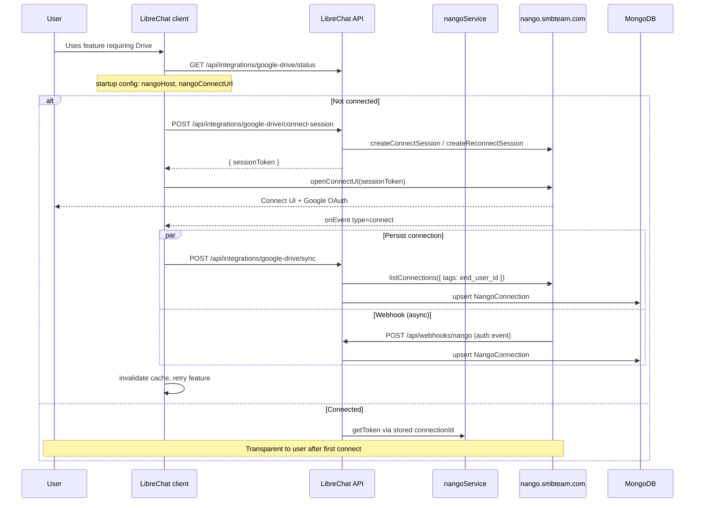

# Nango OAuth Integrations — Architecture & Implementation Plan

**Status:** Connect UI migration shipped on branch  
**Feature branch (both repos):** `feat/nango-oauth-integrations`  
**Last updated:** 2026-06-16

This document is the single source of truth for integrating external services (Google Drive, Gmail, Microsoft, Dropbox, Box, Clio) via [Nango](https://nango.dev) in LibreChat and the Admin Panel.

---

## Table of contents

1. [Goals](#goals)
2. [Business decisions](#business-decisions)
3. [SDK versions & deployment](#sdk-versions--deployment)
4. [Current Nango setup](#current-nango-setup)
5. [Architecture overview (Connect UI)](#architecture-overview-connect-ui)
6. [Smooth logins (UX)](#smooth-logins-ux)
7. [Data model](#data-model)
8. [Provider registry](#provider-registry)
9. [Environment variables](#environment-variables)
10. [API endpoints](#api-endpoints)
11. [Repository layout](#repository-layout)
12. [Implementation phases (PRs)](#implementation-phases-prs)
13. [Adding a new provider](#adding-a-new-provider)
14. [Security](#security)
15. [Testing](#testing)
16. [Pending work](#pending-work)
17. [Out of scope](#out-of-scope)

---

## Goals

- Use **Nango** as the OAuth orchestrator for third-party integrations (credentials, refresh, Connect UI).
- **Per-user connections:** each employee connects their own Google/Microsoft/etc. account.
- **Smooth logins:** Nango Connect UI popup, lazy connect in LibreChat when a feature needs Drive/Gmail/Calendar — no custom OAuth forms in LibreChat.
- **Scalable provider list:** adding a provider = Nango dashboard config + registry entry + i18n (no duplicated auth logic).
- **Admin Panel:** audit and support (who is connected in a tenant), not a replacement for end-user connect flows.

---

## Business decisions

| Topic | Decision | Notes |
|-------|----------|-------|
| **Who can use integrations?** | **Whole platform** | All tenants and users see enabled providers in LibreChat / Admin Panel |
| **Who owns OAuth credentials?** | **Each user** | One Google account per employee |
| **Per-tenant OAuth apps?** | **No** | Tenants do not get separate Nango integrations or Client IDs |
| Connection ownership | **Per-user** | Mongo `NangoConnection` keyed by `{ userId, providerKey }` |
| Primary connect UX | **LibreChat client** | Modal when user needs Drive/Gmail/Calendar (lazy connect) |
| Admin Panel role | **Complement** | Tenant admins **audit** who in their org is connected |
| OAuth app credentials | **Platform-level in Nango** | One `google-drive` / `google-mail` / `google-calendar` row in Nango; many **connections** under each |
| Nango deployment | **Self-hosted 0.70.7** | `https://nango.smbteam.com` with Connect UI enabled |
| Default auth UI | **Connect UI** | `createConnectSession` + `openConnectUI` |

### Platform vs tenant vs user

| Layer | What it means | Example |
|-------|----------------|---------|
| **Platform** | Integration templates exist once in Nango + registry `enabled: true` | Everyone can connect Google Drive |
| **Tenant** | Optional **visibility** via admin grants (`read:integrations`); tenant admin sees **list** of connections in their org | Acme Corp admin sees which Acme users connected Drive |
| **User** | Each employee runs Connect UI with **their** Google account | New connections use Nango-generated IDs tagged with `end_user_id` |

The **"1"** on each row in the Nango dashboard is **one connection** (one user authorized), not one tenant.

### Nango concepts (do not confuse)

| Nango term | Meaning |
|------------|---------|
| **Integration** | OAuth template (e.g. `google-drive`) — Client ID/Secret, scopes — configured once in dashboard |
| **Connection** | One user's authorized account — Nango-generated `connection_id`, tagged with `end_user_id` |
| **Connect session** | Short-lived token for the browser Connect UI modal |

---

## SDK versions & deployment

Self-hosted Nango at **`https://nango.smbteam.com` must run 0.70.7** with Connect UI enabled (`FLAG_SERVE_CONNECT_UI=true`).

| Package | Version | Where |
|---------|---------|--------|
| `@nangohq/node` | `^0.70.7` | `packages/api` (backend) |
| `@nangohq/frontend` | `^0.70.7` | LibreChat `client` only |
| `@icons-pack/react-simple-icons` | `^13.13.0` | Admin Panel (provider brand icons) |

**Upgrade `@nangohq/node` and `@nangohq/frontend` together.**

---

## Current Nango setup

| Integration ID (Nango) | Provider | Registry `enabled` | Notes |
|------------------------|----------|-------------------|--------|
| `google-drive` | Google Drive | Yes | Scopes: `drive.readonly`, `drive.file` |
| `google-mail` | Gmail | Yes | Match Nango dashboard ID exactly |
| `google-calendar` | Google Calendar | Yes | Match Nango dashboard ID exactly |

| Item | Value |
|------|--------|
| Nango server version | **0.70.7** (self-hosted) |
| Callback URL | `https://nango.smbteam.com/oauth/callback` |
| API host | `NANGO_HOST=https://nango.smbteam.com` |
| Connect UI | Hosted on Nango (`NANGO_PUBLIC_CONNECT_URL` or same as `NANGO_HOST`) |
| Webhook | `POST https://<librechat>/api/webhooks/nango` |

**Planned later** (configure in Nango, then enable in registry):

- Microsoft
- Dropbox
- Box
- Clio

---

## Architecture overview (Connect UI)

### High-level flow



### Layer responsibilities

| Layer | Responsibility |
|-------|----------------|
| **Nango** | Credentials, token refresh, Connect UI modal |
| **Mongo `NangoConnection`** | Metadata mirror: `connectionId`, `userId`, `tenantId`, `providerKey`, `status` |
| **LibreChat API** | Connect session + sync (secret key never in browser); webhook upsert; token endpoint for agents |
| **Frontend** | `@nangohq/frontend@0.70.7` — `openConnectUI({ apiURL, baseURL }).setSessionToken(token)` |

### Who does what

| Actor | Where | Action |
|-------|-------|--------|
| Employee | LibreChat client | Connect **their** account via attach menu (Drive/Gmail/Calendar) |
| Tenant admin | Admin Panel | **Read-only audit:** own status on `/integrations`; per-user popup in Users / Tenant admins |
| Platform admin | Admin Panel | Same audit capabilities; scoped by tenant when applicable |
| Dev/platform | Nango dashboard | OAuth apps, scopes, webhooks, Connect UI settings |

---

## Smooth logins (UX)

| Requirement | Implementation |
|-------------|----------------|
| No custom OAuth forms in LibreChat | Nango Connect UI |
| Short path per provider | One integration ID per provider (`google-drive`, etc.) |
| No unnecessary re-login | Nango refresh; store only `connectionId` locally |
| Reconnect | Same Connect UI flow; `createReconnectSession` when Mongo has a prior `connectionId` |
| Connect in context | CTA when agent/tool needs Drive — not only a settings page |
| Drive file destination | When connected, attach menu **From Google Drive** expands like SharePoint |
| Gmail / Calendar attach | Single menu item → attaches as `tool_resource: context` (`.txt` summaries) |

**Anti-patterns (avoid):**

- Reimplementing MCP-style OAuth (PKCE, custom callbacks, `FlowStateManager`)
- Forcing users to Admin Panel only to connect Drive from chat
- Exposing `NANGO_SECRET_KEY` or long-lived access tokens to the browser

---

## Data model

### MongoDB: `NangoConnection`

```typescript
{
  userId: ObjectId,           // LibreChat user
  tenantId?: string,          // for tenant-scoped admin lists
  providerKey: string,        // e.g. 'google-drive' (our registry key)
  nangoIntegrationId: string, // e.g. 'google-drive' (Nango integration ID)
  connectionId: string,       // Nango connection_id (resolved via end_user_id tags)
  status: 'connected' | 'expired' | 'revoked',
  connectedAt: Date,
  createdAt / updatedAt
}
```

**Indexes:**

- Unique: `{ userId, providerKey }`
- Query: `{ tenantId, providerKey }`

### Connect session tags

Connect sessions include tags for webhook/sync resolution:

```typescript
{
  end_user_id: userId,
  tenant_id?: tenantId,
  user_email?: email,
}
```

---

## Provider registry

Location: `packages/api/src/integrations/providers.ts`

| Registry key | Nango integration ID | Enabled in code |
|--------------|----------------------|-----------------|
| `google-drive` | `google-drive` | `true` |
| `google-mail` | `google-mail` | `true` |
| `google-calendar` | `google-calendar` | `true` |
| `microsoft` | `microsoft` | `false` |
| `dropbox` | `dropbox` | `false` |
| `box` | `box` | `false` |
| `clio` | `clio` | `false` |

---

## Environment variables

### Backend (`.env` / `.env.example`)

```env
# Required — server-only (Environment settings > API Keys)
NANGO_SECRET_KEY=

# Self-hosted Nango API host (defaults to https://api.nango.dev)
NANGO_HOST=https://nango.smbteam.com

# Connect UI base URL for the browser (defaults to NANGO_HOST)
NANGO_PUBLIC_CONNECT_URL=

# Webhook HMAC signing key (Environment settings > Webhooks — NOT the API secret)
NANGO_WEBHOOK_SECRET=
```

`isNangoConfigured()` returns true when **`NANGO_SECRET_KEY`** (or `NANGO_API_KEY`) is set.

Startup config (`GET /api/config`) exposes to the client:

- `integrationsEnabled: boolean`
- `nangoHost: string`
- `nangoConnectUrl: string`

### Admin Panel (`.env`)

```env
# Optional — only needed if Admin Panel env documents NANGO_HOST for operators
NANGO_HOST=https://nango.smbteam.com
```

Admin Panel server functions call the LibreChat Admin API only. The panel does **not** run OAuth in the browser.

### LibreChat client

No secrets in `.env`. Reads `nangoHost` and `nangoConnectUrl` from startup config.

---

## API endpoints

### User-facing (LibreChat JWT)

Base path: `/api/integrations`

| Method | Path | Description |
|--------|------|-------------|
| `GET` | `/` | All providers + status for current user (syncs from Nango on read) |
| `GET` | `/:providerKey/status` | Single provider status |
| `POST` | `/:providerKey/connect-session` | **Connect UI** — `{ sessionToken, expiresAt? }` |
| `POST` | `/:providerKey/sync` | Resolve connection in Nango + upsert Mongo after OAuth |
| `DELETE` | `/:providerKey` | Disconnect (Nango + Mongo) |
| `GET` | `/:providerKey/token` | Fresh access token — **server/agents only**, not browser |

### Admin (requires `access:admin` + capabilities)

Base path: `/api/admin/integrations`

| Method | Path | Capability | Description |
|--------|------|------------|-------------|
| `GET` | `/` | `read:integrations` | Current admin user's provider statuses |
| `GET` | `/tenant` | `read:integrations` | All connections in caller's tenant |
| `GET` | `/users/:userId` | `read:integrations` | Provider statuses for a user (tenant-scoped) |

### Webhooks

| Method | Path | Description |
|--------|------|-------------|
| `POST` | `/api/webhooks/nango` | Nango `auth` events → upsert/update `NangoConnection` (HMAC verified) |

**Important:** The webhook route is mounted **before** `express.json()` with `express.raw({ type: 'application/json' })` so HMAC verification works.

### Capabilities

| Capability | Implies |
|------------|---------|
| `read:integrations` | — |
| `manage:integrations` | `read:integrations` |

---

## Repository layout

### Backend (`AI-Workforce-Pro`)

```
packages/
├── api/src/integrations/
│   ├── index.ts
│   ├── providers.ts
│   └── nango/
│       ├── client.ts          # getNangoClient(), getNangoConnectUrl(), isNangoConfigured()
│       ├── service.ts         # connect session, sync, webhook, disconnect, status, token
│       ├── handlers.ts        # user + admin HTTP handlers
│       ├── webhook.ts         # payload parsing
│       ├── webhookHandlers.ts # HMAC verify + route handler
│       └── handlers.spec.ts
└── data-schemas/src/
    └── schema/nangoConnection.ts

api/server/routes/
├── integrations.js
└── webhooks/nango.js
```

### Admin Panel (`AI-Workforce-Pro-Admin-Panel`)

Read-only audit UI — see `AI-Workforce-Pro-Admin-Panel/docs/NANGO_INTEGRATIONS.md`.

### LibreChat client

```
client/src/
├── hooks/integrations/useNangoConnect.ts   # Connect UI flow
├── data-provider/Integrations/mutations.ts # connect-session + sync
└── components/Integrations/
```

Dependency: `@nangohq/frontend@^0.70.7`

---

## Implementation phases (PRs)

| PR | Repo | Scope | Status |
|----|------|-------|--------|
| **PR-1** | Backend | Registry, `nangoService`, Mongo schema, user + admin routes | **Done** |
| **PR-4** | LibreChat client | Lazy connect inline (Drive, Gmail, Calendar) | **Done** |
| **PR-3** | Admin Panel | Read-only Integrations page, user audit dialogs | **Done** |
| **PR-5** | Backend | Token endpoint + Google agent tools | **Done** |
| **Connect UI migration** | Both | SDK 0.70.7, connect-session/sync, webhook | **Done** |
| **PR-6** | Both | Enable Microsoft, Dropbox, Box, Clio | **Pending** |
| **PR-7** | Both | Reconnect UX polish | **Done** |

---

## Adding a new provider

1. Create/configure integration in **Nango dashboard** (OAuth app, scopes).
2. Add entry to `INTEGRATION_PROVIDERS` in `providers.ts` with `enabled: true`.
3. Add i18n keys + icon in Admin Panel and client locales.
4. (If needed) wire agent/tool to call `/api/integrations/:providerKey/token`.

No changes to connect-session / sync handler logic beyond the registry entry.

---

## Security

- `NANGO_SECRET_KEY` and `NANGO_WEBHOOK_SECRET` **server-only**.
- Connect session tokens are short-lived and scoped to allowed integrations — safe in the browser.
- User routes: `requireJwtAuth` — users can only connect/disconnect **their own** connections.
- Admin tenant list: requires `tenantId` on caller (tenant admin).
- Access tokens for agents: server-side only; never return in JSON to browser.

---

## Testing

### Backend unit tests

```bash
cd packages/api
npx jest src/integrations/nango/handlers.spec.ts --no-coverage
```

### Manual smoke (Connect UI)

1. Set `NANGO_SECRET_KEY`, `NANGO_HOST`, and `NANGO_WEBHOOK_SECRET` in LibreChat `.env`.
2. Register webhook in Nango dashboard → `POST https://<librechat>/api/webhooks/nango`.
3. Restart backend.
4. Log in as a test user → `GET /api/config` should show `integrationsEnabled: true`, `nangoHost`, `nangoConnectUrl`.
5. LibreChat chat → attach menu → **From Google Drive** → Connect → Connect UI + Google OAuth.
6. After OAuth → `GET /api/integrations/google-drive/status` shows `connected`.
7. Admin Panel `/integrations` shows **Connected** (read-only).
8. Verify connection in Nango dashboard (new connections have random IDs tagged with `end_user_id`).

---

## Pending work

| ID | Scope | Priority |
|----|-------|----------|
| **PR-6** | Enable Microsoft, Dropbox, Box, Clio | Medium |
| **Release** | Push branch, open PRs, env vars in staging/prod | High |

Optional polish: Google Picker JS widget, inline send-mail / create-event actions.

---

## Out of scope (current initiative)

- Replacing existing MCP OAuth flows
- Nango Functions / data sync pipelines
- BYO OAuth app per tenant

---

## Related repos & branches

| Repo | Branch | Role |
|------|--------|------|
| `AI-Workforce-Pro` | `feat/nango-oauth-integrations` | API, Nango service, Mongo, webhooks |
| `AI-Workforce-Pro-Admin-Panel` | `feat/nango-oauth-integrations` | Integrations UI, server fns |

Admin Panel summary: `AI-Workforce-Pro-Admin-Panel/docs/NANGO_INTEGRATIONS.md`

---

## References

- [Nango Auth guide](https://nango.dev/docs/guides/auth/auth-guide)
- [Nango Node SDK](https://nango.dev/docs/reference/backend/backend-sdk/node)
- [Nango Frontend SDK](https://nango.dev/docs/reference/frontend/frontend-sdk)
