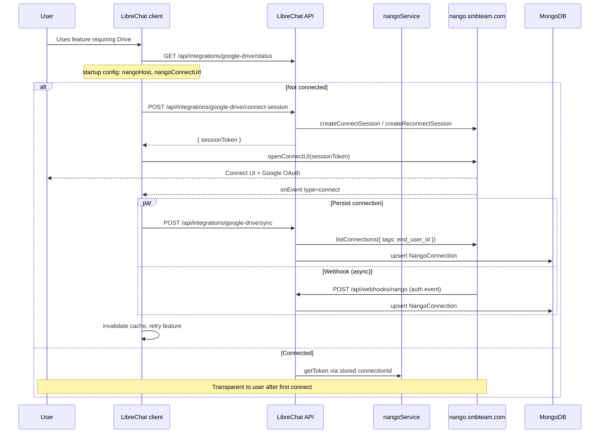

# Nango OAuth Integrations — Architecture & Implementation Plan

**Status:** Connect UI + attach pickers for **six active** registry providers (Google, Microsoft, Dropbox, Clio). **Box is disabled** in the provider registry until OAuth setup is complete.  
**Feature branch (both repos):** `feat/nango-integration-providers`  
**Last updated:** 2026-06-23

**Branch state (local, not pushed):** implementation complete on branch; **2 commits** ahead of `origin` in `AI-Workforce-Pro`, **1 commit** ahead in Admin Panel. See [Pending work](#pending-work).

---

## Table of contents

1. [Goals](#goals)
2. [Business decisions](#business-decisions)
3. [SDK versions & deployment](#sdk-versions--deployment)
4. [Current Nango setup](#current-nango-setup)
5. [Attach capabilities by provider](#attach-capabilities-by-provider)
6. [Architecture overview (Connect UI)](#architecture-overview-connect-ui)
7. [Smooth logins (UX)](#smooth-logins-ux)
8. [Data model](#data-model)
9. [Provider registry](#provider-registry)
10. [Environment variables](#environment-variables)
11. [API endpoints](#api-endpoints)
12. [Repository layout](#repository-layout)
13. [Implementation phases (PRs)](#implementation-phases-prs)
14. [Adding a new provider](#adding-a-new-provider)
15. [Security](#security)
16. [Testing](#testing)
17. [Pending work](#pending-work)
18. [Out of scope](#out-of-scope)

---

## Goals

- Use **Nango** as the OAuth orchestrator for third-party integrations (credentials, refresh, Connect UI).
- **Per-user connections:** each employee connects their own Google/Microsoft/etc. account.
- **Smooth logins:** Nango Connect UI popup, lazy connect in LibreChat when a feature needs Drive/Gmail/Calendar — no custom OAuth forms in LibreChat.
- **Scalable provider list:** adding a provider = Nango dashboard config + registry entry + i18n (no duplicated auth logic).
- **Admin Panel:** audit and support (who is connected in a tenant), not a replacement for end-user connect flows.

---

## Business decisions

| Topic | Decision | Notes |
|-------|----------|-------|
| **Who can use integrations?** | **Whole platform** | All tenants and users see enabled providers in LibreChat / Admin Panel |
| **Who owns OAuth credentials?** | **Each user** | One Google account per employee |
| **Per-tenant OAuth apps?** | **No** | Tenants do not get separate Nango integrations or Client IDs |
| Connection ownership | **Per-user** | Mongo `NangoConnection` keyed by `{ userId, providerKey }` |
| Primary connect UX | **LibreChat client** | Modal when user needs Drive/Gmail/Calendar (lazy connect) |
| Admin Panel role | **Complement** | Tenant admins **audit** who in their org is connected |
| OAuth app credentials | **Platform-level in Nango** | One `google-drive` / `google-mail` / `google-calendar` row in Nango; many **connections** under each |
| Nango deployment | **Self-hosted 0.70.7** | `https://nango.smbteam.com` with Connect UI enabled |
| Default auth UI | **Connect UI** | `createConnectSession` + `openConnectUI` |

### Platform vs tenant vs user

| Layer | What it means | Example |
|-------|----------------|---------|
| **Platform** | Integration templates exist once in Nango + registry `enabled: true` | Everyone can connect Google Drive |
| **Tenant** | Optional **visibility** via admin grants (`read:integrations`); tenant admin sees **list** of connections in their org | Acme Corp admin sees which Acme users connected Drive |
| **User** | Each employee runs Connect UI with **their** Google account | New connections use Nango-generated IDs tagged with `end_user_id` |

The **"1"** on each row in the Nango dashboard is **one connection** (one user authorized), not one tenant.

### Nango concepts (do not confuse)

| Nango term | Meaning |
|------------|---------|
| **Integration** | OAuth template (e.g. `google-drive`) — Client ID/Secret, scopes — configured once in dashboard |
| **Connection** | One user's authorized account — Nango-generated `connection_id`, tagged with `end_user_id` |
| **Connect session** | Short-lived token for the browser Connect UI modal |

---

## SDK versions & deployment

Self-hosted Nango at **`https://nango.smbteam.com` must run 0.70.7** with Connect UI enabled (`FLAG_SERVE_CONNECT_UI=true`).

| Package | Version | Where |
|---------|---------|--------|
| `@nangohq/node` | `^0.70.7` | `packages/api` (backend) |
| `@nangohq/frontend` | `^0.70.7` | LibreChat `client` only |
| `@icons-pack/react-simple-icons` | `^13.13.0` | Admin Panel (provider brand icons) |

**Upgrade `@nangohq/node` and `@nangohq/frontend` together.**

---

## Current Nango setup

| Integration ID (Nango) | Provider | Registry `enabled` | Attach in chat |
|------------------------|----------|-------------------|----------------|
| `google-drive` | Google Drive | Yes | Files (picker) |
| `google-mail` | Gmail | Yes | Messages → `.txt` context |
| `google-calendar` | Google Calendar | Yes | Events → `.txt` context |
| `microsoft` | Microsoft 365 | Yes | OneDrive files + Outlook Mail + Outlook Calendar |
| `dropbox` | Dropbox | Yes | Files (picker) |
| `box` | Box | **No** (disabled in registry) | — (code retained; re-enable in `providers.ts`) |
| `clio` | Clio | Yes | Documents (picker) + agent tool (matters, contacts, tasks, etc.) |

| Item | Value |
|------|--------|
| Nango server version | **0.70.7** (self-hosted) |
| Callback URL | `https://nango.smbteam.com/oauth/callback` |
| API host | `NANGO_HOST=https://nango.smbteam.com` |
| Connect UI | Hosted on Nango (`NANGO_PUBLIC_CONNECT_URL` or same as `NANGO_HOST`) |
| Webhook | `POST https://<librechat>/api/webhooks/nango` |

### Microsoft Graph scopes (single `microsoft` connection)

One Nango integration covers OneDrive, Outlook Mail, and Outlook Calendar. Typical Azure app scopes:

| Scope | Used for |
|-------|----------|
| `User.Read` | Profile |
| `offline_access` | Refresh tokens |
| `Files.Read` / `Files.ReadWrite` | OneDrive file picker |
| `Mail.Read` / `Mail.Send` | Outlook mail search + attach (read is sufficient for attach) |
| `Calendars.Read` / `Calendars.ReadWrite` | Outlook calendar list + attach (read is sufficient for attach) |

### Dropbox — OAuth scopes (Nango integration `dropbox`)

Configure in **Nango** (and the [Dropbox App Console](https://www.dropbox.com/developers/apps)):

| Scope | Used for |
|-------|----------|
| `account_info.read` | Profile / connection identity |
| `files.metadata.read` | List and search files |
| `files.content.read` | Download / attach picker |
| `sharing.read` | Shared file metadata (if needed) |
| `files.content.write` | Agent tool `dropbox` `create_document` (upload new files) |
| `files.metadata.write` | Create/upload file metadata |

LibreChat does **not** pass scopes at connect time — Nango includes them in the OAuth authorize URL from the integration settings.

### Box — OAuth scopes (Nango integration `box`) — **currently disabled**

> **Registry:** `enabled: false` in `packages/api/src/integrations/providers.ts`. Box does not appear in the attach menu or Admin Panel audit lists until re-enabled. Existing Nango connections are ignored for connect/file APIs.

Box uses **traditional OAuth scopes**. Configure them in **both** Nango and the Box Developer Console when re-enabling.

| Scope | Used for |
|-------|----------|
| `root_readonly` | List, search, and download files in the user's Box account |

| Where | What to set |
|-------|-------------|
| **Nango** (`box` integration) | Scopes: `root_readonly` · Callback URL: `https://nango.smbteam.com/oauth/callback` |
| **Box Developer Console** | Same redirect URI (exact match) · Application scope: **Read all files and folders stored in Box** |

LibreChat does **not** send scopes at connect time — Nango includes them in the OAuth authorize URL from the integration settings.

### Clio — app-level permissions (Nango integration `clio`)

> **Agent tool:** `clio` supports v1 read/write actions for matters, contacts, tasks, activities, documents, plus read-only communications, calendar entries, and users. See [clio-expanded-scopes-plan.md](./clio-expanded-scopes-plan.md) (AIWP#112).

Clio uses **app-level access permissions**, not OAuth scopes in Nango. Permissions are chosen once when the developer application is created in the [Clio Developer Portal](https://docs.developers.clio.com/api-docs/clio-manage/permissions/) and cannot be extended via the Nango **Scopes** field.

| Permission (Clio app settings) | Used for |
|--------------------------------|----------|
| **Documents** (read + write) | Document picker; `search_documents`, `create_document` |
| **Matters** (read + write) | `list_matters`, `get_matter`, `create_matter` |
| **Contacts** (read + write) | `list_contacts`, `get_contact`, `create_contact` |
| **Tasks** (read + write) | `list_tasks`, `create_task` |
| **Activities** (read + write) | `list_activities`, `create_activity_time_entry` |
| **Communications** (read only in v1) | `list_communications` — no write tool |
| **Calendars** (read only in v1) | `list_calendar_entries` — no write tool |
| **Users** (read only) | `list_users`, `get_user` |

| Where | What to set |
|-------|-------------|
| **Clio Developer Portal** | Enable the permissions above on OAuth app **34580** (or your app) · Redirect URI = Nango callback URL |
| **Nango** (`clio` integration) | Client ID + Secret · **Leave Scopes empty** · Callback URL: `https://nango.smbteam.com/oauth/callback` |

LibreChat does **not** pass scopes in `createConnectSession` — same as Box; only `allowed_integrations` and user tags are sent. For Clio, authorization is limited to whatever permissions were registered on the app at creation time.

**Reconnect after permission changes:** users who connected before new app permissions were enabled must **disconnect and reconnect Clio** in the Integrations hub so Clio issues a token with the expanded access.

Attach picker remains **documents only**; other resources are accessed via the `clio` agent tool in chat.

### Box vs Clio (operator checklist)

| | **Box** | **Clio** |
|---|---------|----------|
| Scopes in Nango dashboard | **Yes** — `root_readonly` | **No** — leave empty |
| Provider console | Box Developer Console (redirect URI + scope) | Clio Developer Portal (app permissions at create time) |
| LibreChat runtime | Token only → Box API | Token only → Clio API v4 |

---

## Attach capabilities by provider

End users connect via the chat **attach menu** (clip icon). When connected, providers expose pickers that download or summarize content server-side and attach it to the conversation.

| Provider key | OAuth (Nango) | Files | Mail | Calendar | Client pickers |
|--------------|---------------|-------|------|----------|----------------|
| `google-drive` | `google-drive` | Yes | — | — | `GoogleDrivePickerDialog` |
| `google-mail` | `google-mail` | — | Yes | — | `GmailPickerDialog` |
| `google-calendar` | `google-calendar` | — | — | Yes | `GoogleCalendarPickerDialog` |
| `microsoft` | `microsoft` | Yes (OneDrive) | Yes (Outlook) | Yes (Outlook) | `MicrosoftOneDrivePickerDialog`, `MicrosoftOutlookMailPickerDialog`, `MicrosoftOutlookCalendarPickerDialog` |
| `dropbox` | `dropbox` | Yes | — | — | `DropboxPickerDialog` |
| `box` | `box` | **Disabled** | — | — | `BoxPickerDialog` (not exposed while disabled) |
| `clio` | `clio` | Yes | — | — | `ClioPickerDialog` |

**Microsoft UX when connected:** the attach menu shows **three separate items** (not one submenu):

1. **From OneDrive** — file-type submenu (image, document, …) → OneDrive picker  
2. **From Outlook Mail** — message picker → attaches as plain-text context  
3. **From Outlook Calendar** — event picker → attaches as plain-text context  

**Mail and calendar attach** (Google and Microsoft) always use `tool_resource: context` and produce `.txt` summaries on the server.

**File attach** uses the same pipeline as local uploads after the server downloads bytes from the provider API (with MIME type inference when providers return `application/octet-stream`).

### Agent tools (natural-language chat)

When enabled on the active `modelSpec` (`librechat.yaml`), the assistant can call integration tools instead of only the attach menu:

| Tool | Provider | Read | Write |
|------|----------|------|-------|
| `google_drive` | Google Drive | search | `create_document` (Google Doc) |
| `google_mail` | Gmail | search | — |
| `google_calendar` | Google Calendar | list events | — |
| `microsoft_onedrive` | OneDrive | search | `create_document` (`.md` file) |
| `microsoft_mail` | Outlook | search | — |
| `microsoft_calendar` | Outlook Calendar | list events | — |
| `dropbox` | Dropbox | search | `create_document` (upload file) |
| `clio` | Clio | search/list documents; list/get matters, contacts, tasks, activities, communications, calendar, users; create matter, contact, task, time entry, document | communications & calendar: **read only**; users: **read only** |

Enable per spec: `googleDrive`, `microsoftOneDrive`, `dropbox`, `clio`, etc. Users must connect Clio via the **Integrations** hub (left nav) or attach menu before using the `clio` tool.

### Backend API modules

| Provider | Files | Mail | Calendar |
|----------|-------|------|----------|
| Google | `googleDrive/driveApi.ts` | `googleMail/mailApi.ts` | `googleCalendar/calendarApi.ts` |
| Microsoft | `microsoft/oneDriveApi.ts` | `microsoft/outlookMailApi.ts` | `microsoft/outlookCalendarApi.ts` |
| Dropbox | `dropbox/dropboxApi.ts` | — | — |
| Box | `box/boxApi.ts` | — | — |
| Clio | `clio/clioApi.ts` | — | — |

Handlers in `nango/handlers.ts` route by `providerKey`. Message and event endpoints accept `google-mail` / `google-calendar` **or** `microsoft` (same Nango connection for all Microsoft features).

---

## Architecture overview (Connect UI)

### High-level flow



### Layer responsibilities

| Layer | Responsibility |
|-------|----------------|
| **Nango** | Credentials, token refresh, Connect UI modal |
| **Mongo `NangoConnection`** | Metadata mirror: `connectionId`, `userId`, `tenantId`, `providerKey`, `status` |
| **LibreChat API** | Connect session + sync (secret key never in browser); webhook upsert; token endpoint for agents |
| **Frontend** | `@nangohq/frontend@0.70.7` — `openConnectUI({ apiURL, baseURL }).setSessionToken(token)` |

### Who does what

| Actor | Where | Action |
|-------|-------|--------|
| Employee | LibreChat client | Connect **their** account via attach menu (Drive, Gmail, Calendar, Microsoft, Dropbox, …) |
| Tenant admin | Admin Panel | **Read-only audit:** own status on `/integrations`; per-user popup in Users / Tenant admins |
| Platform admin | Admin Panel | Same audit capabilities; scoped by tenant when applicable |
| Dev/platform | Nango dashboard | OAuth apps, scopes, webhooks, Connect UI settings |

---

## Smooth logins (UX)

| Requirement | Implementation |
|-------------|----------------|
| No custom OAuth forms in LibreChat | Nango Connect UI |
| Short path per provider | One integration ID per provider (`google-drive`, `microsoft`, etc.) |
| No unnecessary re-login | Nango refresh; store only `connectionId` locally |
| Reconnect | Same Connect UI flow; `createReconnectSession` when Mongo has a prior `connectionId` |
| Connect in context | CTA when attach menu needs a provider — not only a settings page |
| Drive / Dropbox / Box / Clio / OneDrive file destination | When connected, **From …** expands with file-type submenu (like SharePoint) |
| Gmail / Calendar / Outlook attach | Menu item → picker → attaches as `tool_resource: context` (`.txt` summaries) |
| Microsoft multi-surface | One OAuth connection; three attach menu entries when connected |

**Anti-patterns (avoid):**

- Reimplementing MCP-style OAuth (PKCE, custom callbacks, `FlowStateManager`)
- Forcing users to Admin Panel only to connect Drive from chat
- Exposing `NANGO_SECRET_KEY` or long-lived access tokens to the browser

---

## Data model

### MongoDB: `NangoConnection`

```typescript
{
  userId: ObjectId,           // LibreChat user
  tenantId?: string,          // for tenant-scoped admin lists
  providerKey: string,        // e.g. 'google-drive' (our registry key)
  nangoIntegrationId: string, // e.g. 'google-drive' (Nango integration ID)
  connectionId: string,       // Nango connection_id (resolved via end_user_id tags)
  status: 'connected' | 'expired' | 'revoked',
  connectedAt: Date,
  createdAt / updatedAt
}
```

**Indexes:**

- Unique: `{ userId, providerKey }`
- Query: `{ tenantId, providerKey }`

### Connect session tags

Connect sessions include tags for webhook/sync resolution:

```typescript
{
  end_user_id: userId,
  tenant_id?: tenantId,
  user_email?: email,
}
```

---

## Provider registry

Location: `packages/api/src/integrations/providers.ts`

| Registry key | Nango integration ID | Enabled in code | Attach pickers |
|--------------|----------------------|-----------------|----------------|
| `google-drive` | `google-drive` | `true` | Files |
| `google-mail` | `google-mail` | `true` | Mail |
| `google-calendar` | `google-calendar` | `true` | Calendar |
| `microsoft` | `microsoft` | `true` | OneDrive + Outlook Mail + Outlook Calendar |
| `dropbox` | `dropbox` | `true` | Files |
| `box` | `box` | **`false`** | Files (implementation kept; not user-facing) |
| `clio` | `clio` | `true` | Documents + agent tool (matters, contacts, tasks, …) |

---

## Environment variables

### Backend (`.env` / `.env.example`)

```env
# Required — server-only (Environment settings > API Keys)
NANGO_SECRET_KEY=

# Self-hosted Nango API host (defaults to https://api.nango.dev)
NANGO_HOST=https://nango.smbteam.com

# Connect UI base URL for the browser (defaults to NANGO_HOST)
NANGO_PUBLIC_CONNECT_URL=

# Webhook HMAC signing key (Environment settings > Webhooks — NOT the API secret)
NANGO_WEBHOOK_SECRET=
```

`isNangoConfigured()` returns true when **`NANGO_SECRET_KEY`** (or `NANGO_API_KEY`) is set.

Startup config (`GET /api/config`) exposes to the client:

- `integrationsEnabled: boolean`
- `nangoHost: string`
- `nangoConnectUrl: string`

### Admin Panel (`.env`)

```env
# Optional — only needed if Admin Panel env documents NANGO_HOST for operators
NANGO_HOST=https://nango.smbteam.com
```

Admin Panel server functions call the LibreChat Admin API only. The panel does **not** run OAuth in the browser.

### LibreChat client

No secrets in `.env`. Reads `nangoHost` and `nangoConnectUrl` from startup config.

---

## API endpoints

### User-facing (LibreChat JWT)

Base path: `/api/integrations`

| Method | Path | Description |
|--------|------|-------------|
| `GET` | `/` | All providers + status for current user (syncs from Nango on read) |
| `GET` | `/:providerKey/status` | Single provider status |
| `POST` | `/:providerKey/connect-session` | **Connect UI** — `{ sessionToken, expiresAt? }` |
| `POST` | `/:providerKey/sync` | Resolve connection in Nango + upsert Mongo after OAuth |
| `DELETE` | `/:providerKey` | Disconnect (Nango + Mongo) |
| `GET` | `/:providerKey/token` | Fresh access token — **server/agents only**, not browser |
| `GET` | `/:providerKey/files` | Search/list files (`google-drive`, `dropbox`, `microsoft`, `clio`; `box` when re-enabled) |
| `POST` | `/:providerKey/files/download` | Download selected files as base64 payloads |
| `GET` | `/:providerKey/messages` | Search mail (`google-mail`, `microsoft`) |
| `POST` | `/:providerKey/messages/attach` | Fetch messages as plain-text attachments |
| `GET` | `/:providerKey/events` | List calendar events (`google-calendar`, `microsoft`) |
| `POST` | `/:providerKey/events/attach` | Fetch events as plain-text attachments |

**Query params (files/messages/events):** `query`, `pageToken`, `pageSize`; events also accept `timeMin`, `timeMax`.

**Attach request bodies:**

```json
// POST .../messages/attach
{ "messageIds": ["id1", "id2"] }

// POST .../events/attach
{ "eventIds": ["id1", "id2"] }

// POST .../files/download
{ "files": [{ "id": "...", "name": "...", "mimeType": "..." }] }
```

### Admin (requires `access:admin` + capabilities)

Base path: `/api/admin/integrations`

| Method | Path | Capability | Description |
|--------|------|------------|-------------|
| `GET` | `/` | `read:integrations` | Current admin user's provider statuses |
| `GET` | `/tenant` | `read:integrations` | All connections in caller's tenant |
| `GET` | `/users/:userId` | `read:integrations` | Provider statuses for a user (tenant-scoped) |
| `DELETE` | `/users/:userId/:providerKey` | `manage:integrations` | Disconnect a tenant-scoped user's provider |
| `DELETE` | `/:providerKey` | `manage:integrations` | Disconnect the current admin user's provider |

### Webhooks

| Method | Path | Description |
|--------|------|-------------|
| `POST` | `/api/webhooks/nango` | Nango `auth` events → upsert/update `NangoConnection` (HMAC verified) |

**Important:** The webhook route is mounted **before** `express.json()` with `express.raw({ type: 'application/json' })` so HMAC verification works.

### Capabilities

| Capability | Implies |
|------------|---------|
| `read:integrations` | — |
| `manage:integrations` | `read:integrations` |

---

## Repository layout

### Backend (`AI-Workforce-Pro`)

```
packages/
├── api/src/integrations/
│   ├── index.ts
│   ├── providers.ts
│   ├── types.ts
│   ├── googleDrive/driveApi.ts
│   ├── googleMail/mailApi.ts
│   ├── googleCalendar/calendarApi.ts
│   ├── dropbox/dropboxApi.ts
│   ├── box/boxApi.ts
│   ├── clio/clioApi.ts
│   ├── microsoft/
│   │   ├── oneDriveApi.ts
│   │   ├── outlookMailApi.ts
│   │   └── outlookCalendarApi.ts
│   └── nango/
│       ├── client.ts          # getNangoClient(), getNangoConnectUrl(), isNangoConfigured()
│       ├── service.ts         # connect session, sync, webhook, disconnect, status, token
│       ├── handlers.ts        # user + admin HTTP handlers + file/mail/event attach
│       ├── webhook.ts         # payload parsing
│       ├── webhookHandlers.ts # HMAC verify + route handler
│       └── handlers.spec.ts
└── data-schemas/src/
    └── schema/nangoConnection.ts

api/server/routes/
├── integrations.js            # mounts attach routes under /api/integrations
└── webhooks/nango.js
```

### Admin Panel (`AI-Workforce-Pro-Admin-Panel`)

Read-only audit UI — no OAuth in the browser. See `AI-Workforce-Pro-Admin-Panel/docs/NANGO_INTEGRATIONS.md`.

```
src/
├── server/integrations.ts
├── components/integrations/
│   ├── IntegrationsPage.tsx
│   ├── UserIntegrationsDialog.tsx
│   └── IntegrationProviderIcon.tsx
└── routes/_app/integrations.tsx
```

All seven registry providers appear in the audit UI when enabled on the LibreChat backend.

### LibreChat client

```
client/src/
├── hooks/integrations/useIntegrationConnectors.ts  # Connect UI flow per provider
├── hooks/Files/
│   ├── useGoogleDriveFileHandling.ts
│   ├── useDropboxFileHandling.ts
│   ├── useBoxFileHandling.ts
│   ├── useClioFileHandling.ts
│   ├── useMicrosoftOneDriveFileHandling.ts
│   └── useIntegrationTextAttachHandling.ts       # Gmail, Calendar, Outlook mail/calendar
├── data-provider/Integrations/
│   ├── mutations.ts            # connect-session + sync
│   └── attach.ts               # React Query hooks for pickers
└── components/Integrations/
    ├── attachMenu.ts           # menu labels + INTEGRATION_PICKER_PROVIDER_KEYS
    ├── GoogleDrivePickerDialog.tsx
    ├── GmailPickerDialog.tsx
    ├── GoogleCalendarPickerDialog.tsx
    ├── DropboxPickerDialog.tsx
    ├── BoxPickerDialog.tsx
    ├── ClioPickerDialog.tsx
    ├── MicrosoftOneDrivePickerDialog.tsx
    ├── MicrosoftOutlookMailPickerDialog.tsx
    └── MicrosoftOutlookCalendarPickerDialog.tsx
```

Dependency: `@nangohq/frontend@^0.70.7`

---

## Implementation phases (PRs)

| PR | Repo | Scope | Status |
|----|------|-------|--------|
| **PR-1** | Backend | Registry, `nangoService`, Mongo schema, user + admin routes | **Done** |
| **PR-4** | LibreChat client | Lazy connect inline (Drive, Gmail, Calendar) | **Done** |
| **PR-3** | Admin Panel | Read-only Integrations page, user audit dialogs | **Done** |
| **PR-5** | Backend | Token endpoint + Google agent tools | **Done** |
| **Connect UI migration** | Both | SDK 0.70.7, connect-session/sync, webhook | **Done** |
| **PR-6a** | Backend + client | Enable Microsoft, Dropbox, Box, Clio in registry | **Done** |
| **PR-6b** | Backend + client | Dropbox file picker + MIME inference | **Done** |
| **PR-6c** | Backend + client | Microsoft OneDrive + Outlook Mail + Outlook Calendar pickers | **Done** |
| **PR-6d** | Backend + client | Box file picker | **Done** |
| **PR-6e** | Backend + client | Clio document picker | **Done** |
| **PR-7** | Both | Reconnect UX polish | **Done** |

---

## Adding a new provider

1. Create/configure integration in **Nango dashboard** (OAuth app; add **Scopes** only when the provider requires them — see [Box vs Clio](#box-vs-clio-operator-checklist)).
2. Add entry to `INTEGRATION_PROVIDERS` in `providers.ts` with `enabled: true`.
3. Add i18n keys + icon in client `attachMenu.ts` and locales (EN/ES).
4. If the provider exposes files, mail, or calendar:
   - Add API module under `packages/api/src/integrations/<provider>/`.
   - Extend `handlers.ts` search/download/attach branches.
   - Add React Query hooks in `client/src/data-provider/Integrations/attach.ts`.
   - Add picker dialog(s) and wire `AttachFileMenu.tsx`.
   - Add `INTEGRATION_PICKER_PROVIDER_KEYS` entry when attach is ready.
5. (If needed) wire agent/tool to call `/api/integrations/:providerKey/token`.

Connect-session / sync handler logic is provider-agnostic beyond the registry entry.

---

## Security

- `NANGO_SECRET_KEY` and `NANGO_WEBHOOK_SECRET` **server-only**.
- Connect session tokens are short-lived and scoped to allowed integrations — safe in the browser.
- User routes: `requireJwtAuth` — users can only connect/disconnect **their own** connections.
- Admin tenant list: requires `tenantId` on caller (tenant admin).
- Access tokens for agents: server-side only; never return in JSON to browser.

---

## Troubleshooting

### OneDrive picker: `itemNotFound` / 404

**Symptom:** Log shows `Microsoft Graph API error (404): itemNotFound` when opening the OneDrive picker right after connecting Microsoft (common with **personal** `@outlook.com` accounts).

**Cause:** Microsoft has not **provisioned** OneDrive for that account yet. Graph cannot create the drive via API alone; the user must open OneDrive in a browser at least once.

**Fix (user):**

1. Open [https://onedrive.live.com](https://onedrive.live.com) (or OneDrive for work: `https://<tenant>-my.sharepoint.com`) and sign in with the **same account** used in LibreChat.
2. Wait for the OneDrive home page to load fully.
3. Return to LibreChat and open **From OneDrive** again.

The picker shows a friendly message when Graph returns this 404 (`code: onedrive_not_provisioned`).

### Microsoft org account: “Need admin approval”

**Symptom:** Connect UI shows **Need admin approval** when signing in with a work/school account (e.g. `@company.com`).

**Cause:** The Azure app registration requires **tenant admin consent** before non-admin users can authorize the requested Graph scopes.

**Fix (IT / platform admin):**

1. Open **Azure Portal** → **App registrations** → the app used by Nango `microsoft`.
2. **API permissions** → **Grant admin consent for [tenant]** (one-time).
3. User retries Connect UI in LibreChat.

Personal Microsoft accounts (`@outlook.com`, `@hotmail.com`) do not require this step.

### Box: `redirect_uri_mismatch`

**Symptom:** Box shows **Application Error** with `Error: redirect_uri_mismatch` and `redirect_uri=https://nango.smbteam.com/oauth/callback`.

**Cause:** The Box OAuth app's registered redirect URI does not include Nango's callback URL (common when only `https://api.nango.dev/oauth/callback` is listed).

**Fix (DevOps):**

1. Box Developer Console → app matching Nango **Client ID** → **Configuration**.
2. Add **`https://nango.smbteam.com/oauth/callback`** under **OAuth 2.0 Redirect URI** (exact match, no trailing slash).
3. Enable **Read all files and folders stored in Box** (`root_readonly`).
4. Save, then retry **Connect Box** in LibreChat.

Nango `box` integration should already show the same callback URL and scope `root_readonly`.

### Clio: `payment required` (403)

**Symptom:** `clio` tool returns `Clio API error (403): {"error":"payment required",...}`.

**Cause:** The connected Clio firm account has a billing issue on Clio's side (not LibreChat or Nango).

**Fix:** Resolve billing in the Clio Manage account tied to the OAuth connection, then retry.

### Clio: 401, 403, or empty results

**Symptom:** Connect succeeds but the `clio` tool or document picker returns **401**, **403**, or an empty list.

**Cause:** The Clio OAuth app is missing required **app-level permissions**, the user's Clio role does not allow access, or the stored token is **expired/revoked** (common after expanding app permissions without reconnecting).

**Fix:**

1. Clio Developer Portal → your app → confirm v1 permissions are enabled: Documents, Matters, Contacts, Tasks, Activities (read+write as needed), Communications (read), Calendars (read), Users (read). See [Clio section](#clio--app-level-permissions-nango-integration-clio) above.
2. Nango `clio` integration → **Scopes** field should remain **empty**.
3. Users must **disconnect and reconnect Clio** in the Integrations hub after permission changes or when seeing `invalid_token`.
4. Retry the `clio` tool or **From Clio** in the attach menu.

---

## Testing

### Backend unit tests

```bash
cd packages/api
npx jest src/integrations/nango/handlers.spec.ts --no-coverage
npx jest src/integrations/microsoft/ --no-coverage
npx jest src/integrations/dropbox/dropboxApi.spec.ts --no-coverage
npx jest src/integrations/box/boxApi.spec.ts --no-coverage
npx jest src/integrations/clio/clioApi.spec.ts --no-coverage
npx jest src/integrations/googleDrive/driveApi.spec.ts --no-coverage
```

### Client unit tests

```bash
cd client
npx jest src/components/Chat/Input/Files/__tests__/AttachFileMenu.spec.tsx --no-coverage
```

### Manual smoke (Connect UI)

1. Set `NANGO_SECRET_KEY`, `NANGO_HOST`, and `NANGO_WEBHOOK_SECRET` in LibreChat `.env`.
2. Register webhook in Nango dashboard → `POST https://<librechat>/api/webhooks/nango`.
3. Restart backend.
4. Log in as a test user → `GET /api/config` should show `integrationsEnabled: true`, `nangoHost`, `nangoConnectUrl`.
5. **Google:** attach menu → From Google Drive / Gmail / Calendar → connect → pick items → attach.
6. **Dropbox:** attach menu → From Dropbox → connect → pick files → attach.
7. **Microsoft:** attach menu → connect Microsoft → verify three entries (OneDrive, Outlook Mail, Outlook Calendar) → pick and attach each type.
8. **Clio:** Integrations hub → connect (or reconnect) Clio → attach menu **From Clio** → pick documents → attach. In chat, exercise `clio` tool read actions (`list_matters`, `list_users`, `search_documents`) and write smoke (`create_matter`) on a healthy Clio tenant. (**Box:** skipped while registry `enabled: false`.)
9. After OAuth → `GET /api/integrations/<providerKey>/status` shows `connected`.
10. Admin Panel `/integrations` shows **Connected** (read-only).
11. Verify connection in Nango dashboard (connections tagged with `end_user_id`).

---

## Pending work

| ID | Scope | Priority |
|----|-------|----------|
| **Push / PR** | Push `feat/nango-integration-providers` on both repos; open PR and review | High |
| **Release** | Merge branch; set `NANGO_*` env vars and Nango integrations in staging/prod | High |
| **Manual QA** | End-to-end attach with real Microsoft, Dropbox, and Clio accounts | Medium |
| **Microsoft org** | Azure **Grant admin consent** for work/school tenants | Medium (IT) |
| **Box (disabled)** | Re-enable in `providers.ts` after redirect URI + `root_readonly` in Box Developer Console and Nango | Low (when needed) |
| **Clio permissions** | App permissions for v1 scope on Clio Developer Portal; Nango scopes empty; users reconnect after expand | Medium (DevOps) |

### Local commits (awaiting push)

| Repo | Commits ahead of `origin/feat/nango-integration-providers` |
|------|-------------------------------------------------------------|
| `AI-Workforce-Pro` | `0042e0293` Dropbox picker + MIME inference · `713d97863` Microsoft, Box, Clio pickers |
| `AI-Workforce-Pro-Admin-Panel` | `fe6ff9c` docs for Box and Clio pickers |

Optional polish: Google Picker JS widget, inline send-mail / create-event actions, Box re-enable when OAuth is ready.

---

## Out of scope (current initiative)

- Replacing existing MCP OAuth flows
- Nango Functions / data sync pipelines
- BYO OAuth app per tenant
- SharePoint (separate from Nango `microsoft` — uses existing SharePoint file picker flow)

---

## Related repos & branches

| Repo | Branch | Role |
|------|--------|------|
| `AI-Workforce-Pro` | `feat/nango-integration-providers` | API, pickers, Nango service, Mongo, webhooks |
| `AI-Workforce-Pro-Admin-Panel` | `feat/nango-integration-providers` | Integrations audit UI, server fns |

Admin Panel summary: `AI-Workforce-Pro-Admin-Panel/docs/NANGO_INTEGRATIONS.md`

---

## References

- [Nango Auth guide](https://nango.dev/docs/guides/auth/auth-guide)
- [Nango Node SDK](https://nango.dev/docs/reference/backend/backend-sdk/node)
- [Nango Frontend SDK](https://nango.dev/docs/reference/frontend/frontend-sdk)
