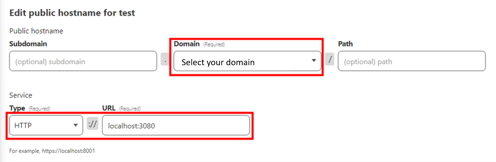

## if you are new to Domain, here's a quick guide to use setup a domain with Cloudflare:

**Google Domains and Cloudflare**

- buy a domain at https://domains.google.com/
- register a Cloudflare account at https://dash.cloudflare.com/sign-up
- click on `add site` and add your domain
- select `Free` and tap `continue` twice
- copy the 2 Cloudflare's nameservers
- go to https://domains.google.com/registrar/ and select your domain
- in the dns tab select `Custom name servers`
- click on `Switch to these settings` and enter the two Cloudflare nameservers that you copied before, then save
- return to the cloudflare tab and tap on `Done, check nameservers`, then `finish later` and `Check nameservers` (this process can take about 5 minutes)
- in the `DNS` tab select `Records` and `Add Record`

  (in the Name section, if you use @ it will use you main domain, but if you want to use a subdomain write it in the Name section)
   - For example: if you want to acces with chat.yourdomain.com just set in the Name section `chat`

**NOTE:** You have to set yourdomain.com the same way in both ngnix-proxy-manager and the Cloudflare records. So, if you have set it in the records as chat.yourdomain.com, you will also need to set chat.yourdomain.com in ngnix-proxy-manager."

## Cloudflare Zero Trust extra protection (optional)

If you want to use LibreChat exclusively for yourself or your family and set up an additional layer of protection, you can utilize Cloudflare Zero Trust. Here's how:

**Install Cloudflare Tunnel:**

- Go to `https://dash.cloudflare.com/`.
- On the left side, click on **Zero Trust**.
- Provide a casual name (which you can change later).
- Select the free plan and proceed to payment (if you choose the free plan, you will not be charged).
- Open the **Access** tab, navigate to **Tunnels**, and click on **Create a tunnel**.
- Set up a tunnel name (e.g., `my-linode-server`) and save the tunnel.
- Choose where you want to install Cloudflare Tunnel (I recommend using Docker).
  - If you choose Docker: Simply copy the displayed command and paste it into the terminal. Before running it, add `-d` after `docker run`, like this: `docker run -d cloudflare/cloudflared:latest...` (this will run the Docker process in the background).
- In the **Public Hostname** tab, select **Add a public hostname**.

## Setup Application Login: (optional)

Setting up application login with Cloudflare Zero Trust adds extra security but is not recommended for most users because it requires authentication through Cloudflare Zero Trust before accessing LibreChat.

- On the left side, click on **Access**, then **Applications**, and add a new application.
- Select **Self-hosted**, provide an **Application name**, and set a **Session Duration**.
- In the **Application domain** field, enter the same settings you configured in the Tunnels tab. Then, click **Next**.
- Set the **Policy name** as "auth" and in the **Configure rules** section, you can define variables for granting access to LibreChat for specific users. Here are some examples:
   - **Emails**: You can add specific email addresses that are allowed to access it.
   - **Email ending in**: You can add email addresses that end with a custom domain (e.g., @myorganization.com).
   - **GitHub organization**: You can restrict access to a specific GitHub organization.
- Click **Next** and then **Add application**.

**NOTE:** If you have followed the "Setup Application Login" section, you must read the next part.

## Setup Authentication Method:

Currently, you can only access Cloudflare Zero Trust using a PIN. Below are guides that explain how to add popular social login methods:

- GitHub: [GitHub Integration Guide](https://developers.cloudflare.com/cloudflare-one/identity/idp-integration/github)
- Google: [Google Integration Guide](https://developers.cloudflare.com/cloudflare-one/identity/idp-integration/google/)
- Facebook: [Facebook Integration Guide](https://developers.cloudflare.com/cloudflare-one/identity/idp-integration/facebook-login/)
- LinkedIn: [LinkedIn Integration Guide](https://developers.cloudflare.com/cloudflare-one/identity/idp-integration/linkedin/)
- If you want to use a different authentication method, refer to this list: [Identity Providers Integration](https://developers.cloudflare.com/cloudflare-one/identity/idp-integration/)

After adding at least one login method, return to the **Applications** section, select your application, go to **Configure**, and click on **Authentication**.
- Turn off "Accept all available identity providers".
- Select your social login method and deselect "One-time PIN".
- Click on **Save application**.
