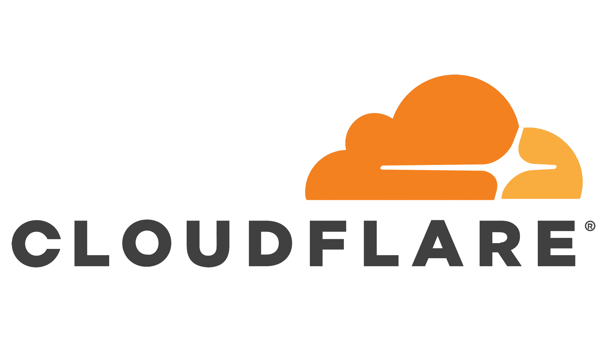
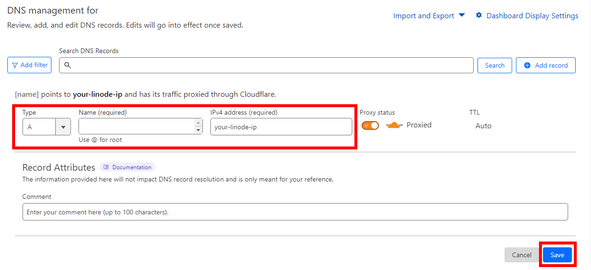

# Cloudflare
### if you are new to Domain, here's a quick guide to use setup a domain with Cloudflare:

## Google Domains and Cloudflare

- buy a domain at https://domains.google.com/
- register a Cloudflare account at https://dash.cloudflare.com/sign-up
- click on `add site` and add your domain
- select `Free` and tap `continue` twice
- copy the 2 Cloudflare's nameservers
- go to https://domains.google.com/registrar/ and select your domain
- in the dns tab select `Custom name servers`
- click on `Switch to these settings` and enter the two Cloudflare nameservers that you copied before, then save
- return to the cloudflare tab and tap on `Done, check nameservers`, then `finish later` and `Check nameservers` (this process can take about 5 minutes)
- in the `DNS` tab select `Records` and `Add Record`

  (in the Name section, if you use @ it will use you main domain, but if you want to use a subdomain write it in the Name section)
   - For example: if you want to acces with chat.yourdomain.com just set in the Name section `chat`

**NOTE:** You have to set yourdomain.com the same way in both ngnix-proxy-manager and the Cloudflare records. So, if you have set it in the records as chat.yourdomain.com, you will also need to set chat.yourdomain.com in ngnix-proxy-manager."

## Cloudflare Zero Trust extra protection (optional)

If you want to use LibreChat exclusively for yourself or your family and set up an additional layer of protection, you can utilize Cloudflare Zero Trust. Here's how:

### Setup Application Login: (optional)

Setting up application login with Cloudflare Zero Trust adds extra security but is not recommended for most users because it requires authentication through Cloudflare Zero Trust before accessing LibreChat.

- On the left side, click on **Access**, then **Applications**, and add a new application.
- Select **Self-hosted**, provide an **Application name**, and set a **Session Duration**.
- In the **Application domain** field, enter the same settings you configured in the Tunnels tab. Then, click **Next**.
- Set the **Policy name** as "auth" and in the **Configure rules** section, you can define variables for granting access to LibreChat for specific users. Here are some examples:
   - **Emails**: You can add specific email addresses that are allowed to access it.
   - **Email ending in**: You can add email addresses that end with a custom domain (e.g., @myorganization.com).
   - **GitHub organization**: You can restrict access to a specific GitHub organization.
- Click **Next** and then **Add application**.

**NOTE:** If you have followed the "Setup Application Login" section, you must read the next part.

### Setup Authentication Method:

Currently, you can only access Cloudflare Zero Trust using a PIN. Below are guides that explain how to add popular social login methods:

- GitHub: [GitHub Integration Guide](https://developers.cloudflare.com/cloudflare-one/identity/idp-integration/github)
- Google: [Google Integration Guide](https://developers.cloudflare.com/cloudflare-one/identity/idp-integration/google/)
- Facebook: [Facebook Integration Guide](https://developers.cloudflare.com/cloudflare-one/identity/idp-integration/facebook-login/)
- LinkedIn: [LinkedIn Integration Guide](https://developers.cloudflare.com/cloudflare-one/identity/idp-integration/linkedin/)
- If you want to use a different authentication method, refer to this list: [Identity Providers Integration](https://developers.cloudflare.com/cloudflare-one/identity/idp-integration/)

After adding at least one login method, return to the **Applications** section, select your application, go to **Configure**, and click on **Authentication**.
- Turn off "Accept all available identity providers".
- Select your social login method and deselect "One-time PIN".
- Click on **Save application**.

---

## Cloudflare Tunnels

Cloudflare Tunnels is a powerful tool that allows you to securely expose your local web servers or services to the internet. With Cloudflare Tunnels, you can establish a secure connection between your local machine and Cloudflare's global network, ensuring that your web traffic is protected and efficiently routed.

Here's a straightforward guide on how to install it!

### Installation Steps

1. Go to `https://dash.cloudflare.com/`.
2. On the left side, click on **Zero Trust**.
3. Provide a casual name (which you can change later).
4. Select the free plan and proceed to payment (if you choose the free plan, you will not be charged).
5. Open the **Access** tab, navigate to **Tunnels**, and click on **Create a tunnel**.
6. Set up a tunnel name (e.g., `home`) and save the tunnel.

### Windows Installation

To install Cloudflare Tunnels on Windows, follow these steps:

1. Click [here](https://github.com/cloudflare/cloudflared/releases/latest/download/cloudflared-windows-amd64.msi) to download the latest version.
2. Open the Command Prompt as an administrator.
3. Copy the command provided in the Windows section under "Install and run a connector." The command should look something like this: `cloudflared.exe service install <your token>`.
4. Paste the command into the Command Prompt and press Enter.
5. The installation is now complete! Proceed to the [Tunnel Configuration](#tunnel-configuration) section to continue with the configuration.

### Docker Installation

To install Cloudflare Tunnels using Docker, follow these steps:

1. Copy the command provided in the Docker section. It should be something like this: `docker run cloudflare/cloudflared:latest tunnel --no-autoupdate run --token <your token>`
2. Open the terminal or command prompt.
3. Paste the command and add `-d` after `docker run` to run the Docker process in the background. The updated command should look like this: `docker run -d cloudflare/cloudflared:latest...`
4. Press Enter to execute the command.
5. The installation is now complete! Proceed to the [Tunnel Configuration](#tunnel-configuration) section to continue with the configuration.

### Tunnel Configuration

Now that you have installed the tunnel, it's time to configure it. Follow these steps:

1. Proceed to the next step and select a public hostname.
2. Follow the instructions provided in this image to configure it correctly.

   

## You did it! You have successfully set up a working tunnel.
---

### Note: If you're still having trouble, before creating a new issue, please search for similar ones on our [#issues thread on our discord](https://discord.gg/weqZFtD9C4) or our [troubleshooting discussion](https://github.com/danny-avila/LibreChat/discussions/categories/troubleshooting) on our Discussions page. If you don't find a relevant issue, feel free to create a new one and provide as much detail as possible.
