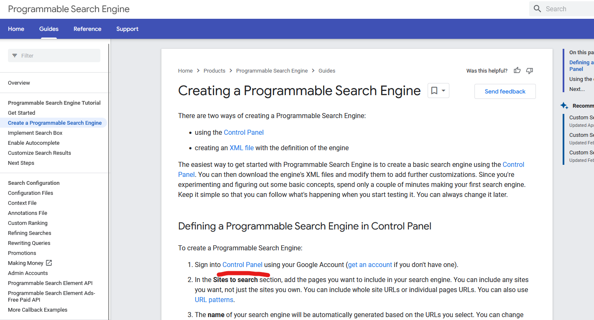
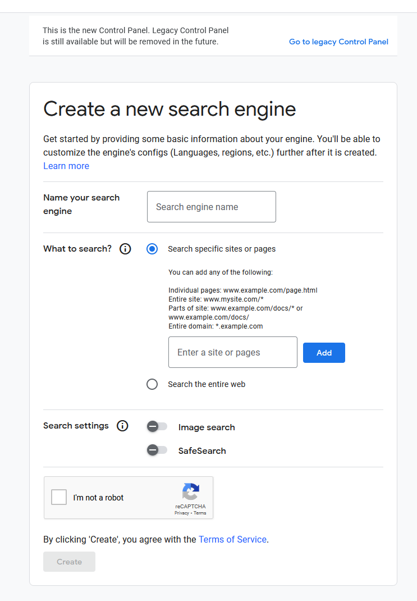
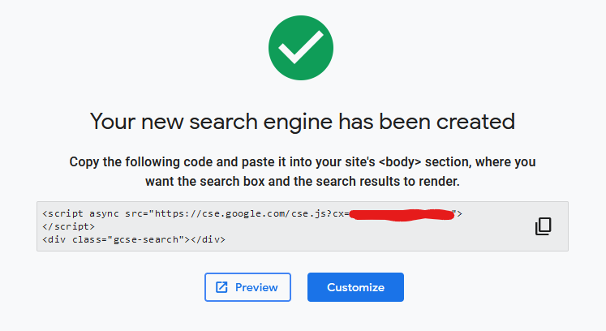
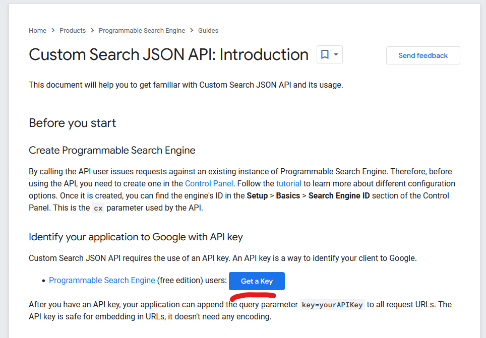
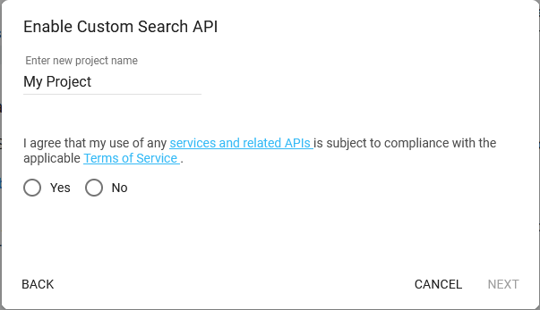
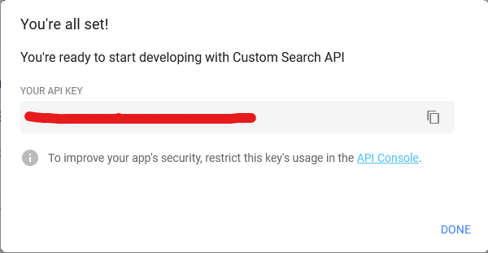

# Google Search Plugin
Through the plugins endpoint, you can use google search for answers to your questions with assistance from GPT! To get started, you need to get a Google Custom Search API key, and a Google Custom Search Engine ID. You can then define these as follows in your `.env` file:  
```env  
GOOGLE_API_KEY="...."  
GOOGLE_CSE_ID="...."  
```  
  
You first need to create a programmable search engine and get the search engine ID: https://developers.google.com/custom-search/docs/tutorial/creatingcse  
  
Then you can get the API key, click the "Get a key" button on this page: https://developers.google.com/custom-search/v1/introduction  

<!-- You can limit the max price that is charged for a single search request by setting `MAX_SEARCH_PRICE` in your `.env` file. -->


## 1\. Go to the [Programmable Search Engine docs](https://developers.google.com/custom-search/docs/tutorial/creatingcse) to get a Search engine ID


## 2\. Click on "Control Panel" under "Defining a Programmable Engine in Control Panel"


Click to sign in(make a Google acct if you do not have one):



## 3\. Register yourself a new account/Login to the Control Panel


After logging in, you will be redirected to the Control Panel to create a new search engine:




## 4\. Create a new search engine


Fill in a name, select to "Search the entire web" and hit "Create":


## 5\. Copy your Search engine ID to your .env file





## 6\. Go to [custom-search docs](https://developers.google.com/custom-search/v1/introduction) to get a Google search API key


## 7\. Click "Get a Key":




## 8\. Name your project and agree to the Terms of Service





## 9\. Copy your Google search API key to your .env file



