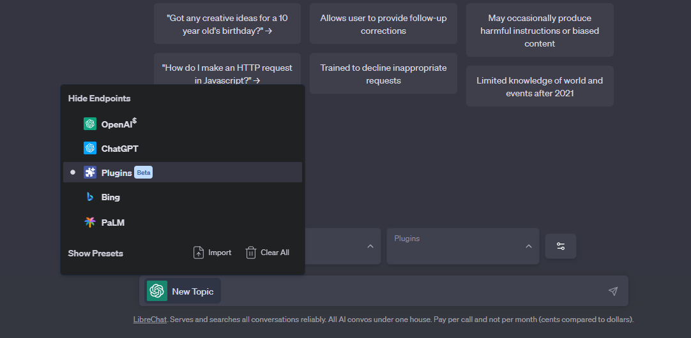
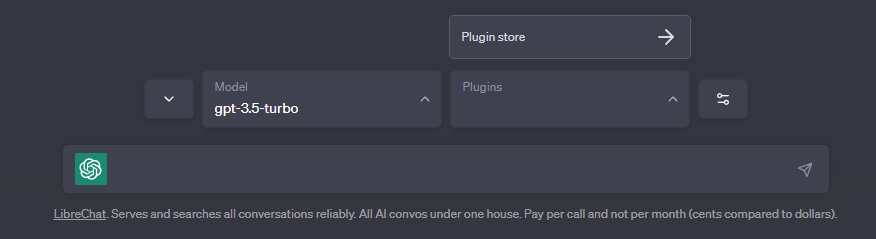
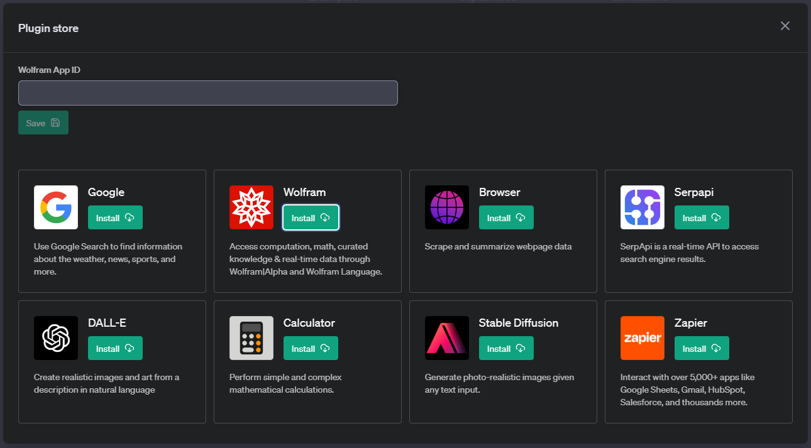
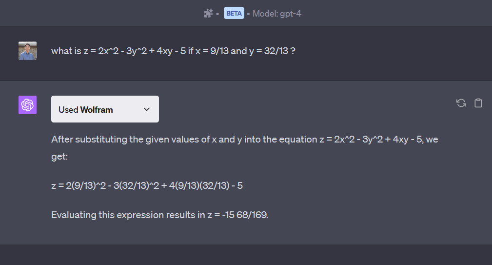

# Wolfram Alpha Plugin

An AppID must be supplied in all calls to the Wolfram|Alpha API. 

- Note: Wolfram API calls are limited to 100 calls/day and 2000/month for regular users.

## 1. Make an account at <a href='http://products.wolframalpha.com/api/'>Wolfram|Alpha</a>
## 2. Go to the <a href='https://developer.wolframalpha.com/portal/myapps/'>Developer Portal</a> click on "Get an AppID".
## 3. Configure it in LibreChat
### Select the plugins endpoint

### Open the Plugin store

### Install Wolfram and Provide your AppID

- Alternatively: you (the admin) can set the value in `\.env` to bypass the prompt: `WOLFRAM_APP_ID=your_app_id`

## 5. Select the plugin and enjoy!

