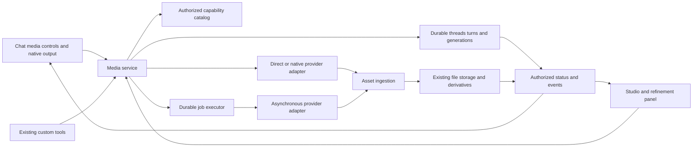

# First-class media generation in LibreChat

The local implementation and enablement instructions are tracked in [implementation.md](implementation.md). The research below includes longer-term design beyond the implemented first cut.

The [2026-09-19 remediation report](remediation.md) maps all 44 integration findings to implemented fixes and verification across the LibreChat and Agents SDK branches. Operational details cover [credential support](credentials.md), [retention and native consumers](retention.md), [operator recovery and account deletion](recovery.md), and [observability and Insights](observability.md). The [first audit](integration-audit.md) and [deeper audit](audit/README.md) preserve the original findings.

**Status:** opt-in local implementation, 2026-09-17. The research and longer-term design below were prepared on 2026-09-15; [implementation.md](implementation.md) describes what is available now. [Native provider setup](native-providers.md) documents the current adapters, credentials and model coverage.
**Branch:** `research/media-studio`, created from local `dev` at `385c6f8a1`.
**Product direction:** a sidebar Media Studio with model selection, image/video creation, uploaded
image editing, a grid of queued/completed work, and an iterable media thread behind each tile.
Chat and studio remain equal entry points. Start provider/model discovery with OpenRouter while
supporting native provider connections. Standalone speech/music and a full video timeline editor
are later product decisions.

## Recommendation

Build a shared media generation subsystem with two first-class entry points: conversational
creation in chat and direct creation/editing in a studio. Both use the same authorized model
catalog, assets, generation records and provider integrations. A result created in either place
can be opened, edited, downloaded and attached in the other without generating it again.

In the studio, a new creation starts a thread tile. Opening that tile reveals its prompts,
references, queued jobs and immutable result versions. Users can queue independent ideas or
several variants within a thread. A tile can show completed results and pending iterations at the
same time. The [studio experience](studio.md) defines this product model and queue behavior.

Support three provider execution shapes explicitly:

1. **Native multimodal conversation:** Gemini can produce ordered text and image parts in a
   normal model response. Preserve that response and its continuation state.
2. **Direct media operation:** an image generation/edit endpoint accepts a prompt and references
   without requiring a separate chat model to call a custom tool.
3. **Asynchronous provider job:** video and some image APIs return an operation ID whose progress
   and outputs must be recovered independently of a chat stream or browser session.

Provider-hosted tools, such as OpenAI Responses image generation, fit into the conversational
execution path but retain their provider item identities. Existing LibreChat custom tools can
become compatibility callers of the shared service. They should not define the media domain.

This is a substantial addition across the UI, provider runtime, persistence, storage and usage
accounting. The first delivery should prove those boundaries with a few representative providers;
an extensible adapter contract is more credible than promising every vendor at launch.

## Research map

| Document                                          | Contents                                                                                                        |
| ------------------------------------------------- | --------------------------------------------------------------------------------------------------------------- |
| [Technical design](design.md)                     | Recommended workspace boundaries, service composition, shared contracts, HTTP endpoints and lifecycle sequence  |
| [Persistence protocols](persistence.md)           | Standalone Mongo acceptance/import receipts, claims, originals, file retirement and recoverable settlement      |
| [Configuration and integrations](integrations.md) | Proposed YAML/defaults, permission wiring, injected adapter ports, capability discovery and credential recovery |
| [Client implementation](client.md)                | Exact sidebar/route seams, host ports, Jotai drafts, React Query recovery, bounded polling and chat integration |
| [Delivery and verification](delivery.md)          | Reviewable implementation work, first acceptance harness, failure tests and enablement gates                    |
| [Studio experience](studio.md)                    | Sidebar entry, tiled media threads, multiple jobs, iteration, model connections and acceptance examples         |
| [OpenRouter survey](openrouter.md)                | Dedicated image/video catalogs, supported API shapes, gateway/native distinctions and dated model inventory     |
| [Backend audit](backend.md)                       | Existing Google/OpenAI tools, native SDK gaps, files, credentials, accounting and concrete code locations       |
| [Frontend audit](frontend.md)                     | Chat rendering, navigation, file reuse, component/state boundaries and complete user journeys                   |
| [Provider landscape](providers.md)                | Official Google and other provider findings, lifecycle differences, availability caveats and sources            |
| [OpenAI findings](openai.md)                      | Images API, Responses image generation and asynchronous video integration                                       |

Repository observations describe the branch's starting code. Proposed contracts and paths below
are design sketches, not implemented APIs. Official documentation was fetched on the date above;
no paid generation, credential validation or media quality benchmark was performed.
Start with the technical design and delivery plan for implementation; the audits retain the
source evidence behind those decisions.

## What the current implementation teaches us

| Verified starting point                                                                                                     | Consequence for a studio                                                                                                                |
| --------------------------------------------------------------------------------------------------------------------------- | --------------------------------------------------------------------------------------------------------------------------------------- |
| The Gemini custom tool calls a native text/image model but selects the first `inlineData` result and substitutes tool text. | Preserve all ordered output parts, native text and editing context. Adding another tool panel would leave the main mismatch unresolved. |
| Image-tool presentation is specialized around known tool names; media is commonly displayed as tool attachments.            | Introduce shared result presentation usable by native messages, explicit chat media actions and studio runs.                            |
| The current generated-image save path can resize before storage.                                                            | Preserve original bytes and create separate thumbnails/previews; quality settings must not be undermined by storage.                    |
| Shared content types include video inputs, but those types do not supply a complete generated-video experience.             | Add playback, progress, durable downloads, errors and reuse, not just a `video_url` field.                                              |
| The pinned `@librechat/agents` runtime needs work on mixed native image content dispatch/aggregation.                       | Coordinate an upstream runtime slice with the host integration; this is not entirely a LibreChat UI change.                             |

Detailed code evidence is in the audits. Additional infrastructure worth reusing:

- [Stream services](../../../packages/api/src/stream/createStreamServices.ts) and
  [job contracts](../../../packages/api/src/stream/interfaces/IJobStore.ts) already support
  reconnectable chat with Redis or an in-memory implementation. They carry conversation/graph
  semantics and have TTL/cleanup behavior. Reuse event delivery concepts and authorization,
  without assuming this store is a permanent media library or universal provider-job scheduler.
- [Queued-turn storage](../../../packages/data-schemas/src/schema/queuedTurn.ts) and its
  [methods](../../../packages/data-schemas/src/methods/queuedTurn.ts) demonstrate durable claims,
  receipts and reconciliation. Its conversation/agent lane model is not directly a media queue.
- [Files](../../../packages/data-schemas/src/schema/file.ts) already carry owner, tenant, storage,
  dimensions, origin and retention. [Retention helpers](../../../packages/api/src/files/retention.ts)
  can consume already-loaded conversation data. Extend these contracts rather than creating a
  second blob store.
- [Balance methods](../../../packages/data-schemas/src/methods/transaction.ts) already reserve,
  renew and release credits. [Transaction records](../../../packages/data-schemas/src/schema/transaction.ts)
  do not by themselves define a durable, idempotent media settlement ledger.

## What users should be able to do

| Journey          | Chat                                                                                | Studio                                                                | Shared behavior                                                                             |
| ---------------- | ----------------------------------------------------------------------------------- | --------------------------------------------------------------------- | ------------------------------------------------------------------------------------------- |
| Generate         | Select a media-capable model or an explicit image/video action and provide a prompt | Select image/video, an available model, prompt and supported settings | Same validation, credential resolution, limits and run identity                             |
| Work with Gemini | Receive interleaved explanation and images; continue with “change the lighting”     | Use a conversational refinement panel around the selected result      | Preserve ordered context and provider continuation; do not invent a tool call               |
| Edit             | Attach or select an earlier image and ask for a change                              | Prompt edit; mask/reference controls when supported                   | New immutable output with parent/input references; original retained                        |
| Animate          | Select an image and start supported image-to-video generation                       | Select a reference/first frame and video settings                     | One async job visible from either surface                                                   |
| Iterate          | Open a result in the studio or branch a refinement                                  | Compare outputs, duplicate settings, create variants                  | Record the actual model, parameters and lineage; seeds do not promise exact reproducibility |
| Reuse            | Attach a studio result to an existing or new conversation                           | Open the source conversation or send selected assets to chat          | Reauthorize file access and destination; no paid generation just to transfer an asset       |
| Leave and return | Chat can continue while a video renders                                             | Navigate away, reload or sign in later                                | Restore status from durable records; completion does not depend on an open tab              |

The studio is an authenticated full-page route with a persistent sidebar button like the agent
builder, a model/prompt/settings composer and a paginated thread grid. Every tile opens a thread
detail/refinement view; ready outputs remain visible while new jobs are pending. Users can import
an existing image directly to begin editing. Chat exposes a concise version of the same controls
and result cards. A media generation must not require creating a hidden chat conversation simply
to acquire a user, storage path or billing identity.

Keep the first editor focused on selecting inputs, prompt refinement, comparison and supported
masking. Layers, timeline composition, frame-accurate trimming, audio mixing and collaborative
projects each add another product and storage model. Preserve room for them without making them
prerequisites for reliable generation.

## Provider and model catalog

Begin the breadth survey with OpenRouter's dedicated media catalogs and use an OpenRouter media
adapter alongside native adapters. OpenRouter is both a useful discovery source and an optional
execution connection; native-only installations must remain fully usable. Its general default
model list alone does not represent the complete image/video offering; see the dated
[OpenRouter findings](openrouter.md).

The server should resolve a capability descriptor for an **integration + API + model + operation**, filtered
by effective deployment settings, role, credentials and region. A brand name or `/models` response
is insufficient to describe supported operations. “OpenAI compatible” chat does not imply
compatibility with Images, Responses tools or Videos.

| Descriptor area  | Information needed                                                                                                                                                                              |
| ---------------- | ----------------------------------------------------------------------------------------------------------------------------------------------------------------------------------------------- |
| Identity         | Model creator/family, stable connection/integration ID, adapter version, provider model/deployment ID, API family, region, optional pinned revision and resolved gateway upstream when reported |
| Operations       | Native mixed output, text-to-image, image editing, masking, image-to-video, text-to-video, video editing/extension, upscaling                                                                   |
| Inputs           | Accepted MIME types, bytes/dimensions/duration, reference roles/counts, masks, first/last frames, native continuation requirements                                                              |
| Outputs          | Modalities, count, formats, dimensions/aspect ratios, quality, duration, audio and conditional parameter combinations                                                                           |
| Execution        | Direct/streamed/job mode, previews, actual progress support, polling/webhooks, cancellation semantics, result expiry                                                                            |
| Economics/access | Usage units, dated estimate source, budget policy, access prerequisites and lifecycle/deprecation status                                                                                        |

Use typed shared schemas for common controls and discriminated, validated provider-specific
options. Server descriptors drive which UI controls are available; cross-field validation still
runs on the server before any paid call. Do not build a free-form vendor JSON editor as the primary
experience, silently discard unsupported settings, or switch vendors on a user's behalf.
For gateways, a model-level parameter union does not prove that one serving endpoint supports the
chosen combination. Resolve compatible endpoint capabilities and constrain fallback accordingly.

The initial provider set should exercise distinct mechanisms: OpenRouter media APIs for breadth,
Gemini native image conversation, OpenAI direct image generation/editing, and asynchronous video
through a verified OpenRouter or native route. Validate a second video connection to prove the
boundary is portable. Extend coverage with specialist providers and other aggregators such as fal
or Replicate where they add useful models or operations. Broad catalogs still require operation
validation; an image catalog can include SVG-only models and a video catalog can include editing
or upscaling models rather than general text-to-video generators.

Group model families for discovery while retaining distinct connection choices: a Gemini model
through OpenRouter and a native Google connection may differ in settings, continuation, cost,
retention and available operations. Do not force native capabilities down to a gateway's smallest
shared feature set. Connection changes revalidate the draft and provider state, while preserving
the LibreChat thread and its asset lineage. Keep gateway fallback inside explicit configured
routing policy and persist the actual model/endpoint where reported.
Self-hosted engines can use the same interface through explicit, validated workflow adapters.
An arbitrary custom endpoint or MCP tool should not automatically advertise studio capabilities
merely because it returns an image URL.

Model names and availability change quickly. In particular, the fetched Google documentation
changes the assumptions one might make about adding Imagen through the Gemini API; consult the
dated [provider findings](providers.md) before selecting that integration. API family and cloud
deployment must remain distinct from the model brand.

Google also needs an explicit API decision: the fetched [Interactions overview](https://ai.google.dev/gemini-api/docs/interactions-overview)
recommends Interactions for new projects while continuing to support `generateContent`, which the
existing integration uses. Compare extending that existing path with adding an Interactions
adapter; a media feature must not silently migrate every Google conversation. Stored continuation,
background execution and provider retention are linked capabilities in Interactions, so a
deployment opting out of provider storage cannot be promised the same recovery behavior.

## Domain and ownership

Proposed names are illustrative:

| Record/contract           | Responsibility                                                                                                                                                                                                                 |
| ------------------------- | ------------------------------------------------------------------------------------------------------------------------------------------------------------------------------------------------------------------------------ |
| `MediaThread`             | Required creative workspace represented by a studio tile; owner/tenant, title, activity, selected/pinned cover, turn history and optional source-chat linkage                                                                  |
| `MediaTurn` / revision    | Prompt/instruction, immutable parent revision and inputs, selected connection/model/operation and settings snapshot; can yield multiple outputs or job attempts                                                                |
| `MediaJob`                | One provider submission attempt under a turn; owner/tenant, execution owner, model/capability snapshot, authorized inputs, status, provider operation identity, output references, accounting identity and optional retry link |
| Provider continuation     | Optional private adapter data attached to an exact thread branch; required for some native refinements but not the universal thread identity                                                                                   |
| `MediaAsset`              | Public typed view of an existing File plus generation/provenance metadata; File remains the canonical storage/ownership record                                                                                                 |
| Asset derivative          | Separate original, thumbnail, preview, poster or spritesheet reference; transformations never replace the original                                                                                                             |
| Asset attachment/relation | Explicit references from messages, thread turns and later collections to an asset; the existing single `File.conversationId` describes origin, not every subsequent use                                                        |
| Usage settlement          | Stable generation/attempt accounting identity, reservation, reported usage, estimate provenance and settlement outcome                                                                                                         |

Store requested and effective parameters, input file IDs, source asset IDs, output ordering and
actual provider model identity. Mask files and reference images are authorized assets too.
Keep provider credentials and opaque continuation envelopes out of public asset DTOs, exports and
ordinary logs. Preserve required signatures as opaque protocol data, without presenting hidden
reasoning. Scope provider handles to the provider account/API/model context that created them.
Key each output by generation/attempt and stable provider item/part identity, with an explicit
output ordinal when needed. Correlate previews and final parts to that identity; compacted UI
content indexes and filenames are not durable identities or sufficient deduplication keys.

The thread contract needs one authoritative ordered turn history; chat and studio must not each
append competing versions. A chat-origin refinement records a stable message/branch snapshot.
Every queued edit pins its input revision: two variants from image A still use A when they finish
out of order. Independent variants can run concurrently; dependent native continuations follow
their branch in order. Completion appends a result without changing an active draft's references
or a pinned tile cover. Cross-provider editing transfers authorized asset bytes and a deliberate
prompt/context selection; it cannot reuse another provider's opaque state.

New database methods accept and return plain typed data. Mongoose queries, indexes, leases and
transactions stay inside `packages/data-schemas`. Avoid broadening the existing exported storage
type leaks.

## Execution and recovery



For native chat execution, the model is already running: attach a media recording/ingestion sink
to that invocation. Do not issue a second provider request when an image part arrives. Preserve
text/image order and final reconciliation, and link media usage to the existing chat invocation.
The host and `@librechat/agents` need a tested event contract for native output, partial previews,
completed parts and provider continuation.

For explicit studio/chat actions, create a durable record and return its ID promptly. Direct image
requests can run behind the same lifecycle, even when the vendor has no resumable job API. A
server restart cannot resume such a vendor request unless the vendor provides recovery evidence;
the application must represent that uncertainty instead of promising universal resume.

Acceptance spans thread, turn and job creation. Use one owner/tenant-scoped client submission
identity and a recoverable acceptance receipt so a lost response returns the same thread/turn/job
IDs. Persist their linkage before any paid submission; a crash must not leave running work absent
from its tile or produce duplicate top-level tiles. The [persistence protocol](persistence.md)
uses the job as the authoritative receipt and a recoverable publication barrier on standalone
Mongo. Receipt phases distinguish preparing, accepted and rejected. Import turns own equivalent
receipts without a provider job.

Proposed job phases are `queued`, `submitting`, `running`, `reconciling`, `requires_attention`,
`ingesting`, `succeeded`, `failed` and `cancelled`. Keep cancellation intent, output availability
and billing outcome as separate fields: a user stopping a job does not prove that a vendor stopped
or waived its charge. An ambiguous outcome is visible as uncertain; after a configured recovery
deadline it requires attention rather than remaining apparently running forever. Define a bounded
estimate/settlement or operator resolution policy, without treating uncertainty as a free retry.

- Claim work with a renewable lease and fencing token; persist provider operation identity as soon
  as it is known. Concurrent workers and duplicate webhook deliveries must converge on one result.
- Persist submission intent before the remote call. Use a vendor idempotency key when supported.
  A crash after remote acceptance but before saving its ID is otherwise an ambiguous submission:
  reconcile through supported provider lookup, or mark the outcome uncertain. Do not automatically
  resubmit a potentially charged request.
- Poll with bounded backoff and provider retry hints. A webhook is a latency optimization; polling
  remains necessary for private installations, missing events and restart recovery. Verify webhook
  authenticity where supported, deduplicate, bind it to the configured account and existing job,
  and fetch authoritative state before trusting a terminal notification.
- Provider success precedes local success. Persist/download results before an expiring URL is lost,
  then publish the asset reference. If storage fails, retry ingestion, not generation.
- Handle multiple outputs and partial success. Persist each accepted output idempotently and expose
  missing/blocked outputs without losing usable results or silently regenerating the batch.
- Cancelling queued work prevents submission. For submitted work, report supported remote
  cancellation accurately. If the provider cannot cancel, offer an explicit hide/detach action
  while keeping the authoritative running/completed status in history and continuing accounting
  and cleanup reconciliation. Never label that job cancelled merely because a view detached.
  Stopping chat text and cancelling an independent video are separate user actions.
- Terminal publication, charge settlement and cleanup need durable receipts and reconciliation.
  A stale worker cannot overwrite a newer attempt, and a delayed event cannot resurrect deleted
  assets or messages.

A reasonable starting implementation is Mongo-backed media records with indexed due-work claims
and a small executor that can run in the app process or a separate worker. Mongo is already
required; Redis should not become mandatory just to use the studio. Inject scheduling/event
transport interfaces so a queue backend can be adopted if throughput demands it. Compare this
against extracting reusable existing claim/reconciliation code during the spike; do not copy the
entire chat generation manager or introduce a queue product without a demonstrated need.

Separate queue capacity from running concurrency. Accept multiple jobs durably within a bounded
backlog, then dispatch fairly across users and connections. Admission must distinguish accepted,
waiting-for-capacity and needs-attention work; a queued request is not a promise that provider
capacity or credentials will remain valid indefinitely. Reauthorize inputs and credentials at
dispatch, including current permissions, enabled operations, retention and spend policy, without
silently replacing the captured model, parameters or parent revision. Invalid work requires an
actionable attention state rather than grandfathering an obsolete permission. Decide
reservation timing and maximum queue age as part of the accounting spike, rather than treating
every accepted tile as already billable execution.

## Storage, retention and sharing

Reuse storage strategies through injected interfaces, extending streaming upload/download and
private asset delivery as needed. Videos must not be fully buffered in Node, embedded as base64 in
Mongo documents, or sent through chat event payloads. Native image bytes should be ingested at the
provider boundary and replaced with durable file references in stored/public message content.

Preserve original bytes, MIME, dimensions, duration, codec/audio metadata when known, and provider
provenance. Generate bounded thumbnails/posters separately. Verify authenticated playback and
byte-range seeking against supported storage backends; existing file download support alone does
not establish a complete video player delivery contract.

Provider downloads and user references require size/type limits, redirect/destination validation
and authorization. Browser-visible URLs must not contain provider API keys. A provider that needs
a public reference URL may require a scoped short-lived delivery URL or upload API; do not make
the whole library public to satisfy it. Treat transcoders/decoders as bounded background work and
retain embedded provenance/content credentials where possible.

Retention must be explicit when a chat asset enters the studio. Opening a temporary-chat result
must not silently make it permanent. A deliberate “Save to library” may establish an independent
retained reference only if deployment policy permits it; otherwise the original expiry remains.
Define reference/deletion behavior before enabling this action. Deleting a conversation removes
its references, while independently saved assets follow their own authorized lifecycle. Account
deletion, tenant deletion and explicit asset deletion must retire jobs/references and prevent late
callbacks from restoring them. Storage cleanup must cover originals, derivatives and temporary
provider uploads.

This is a phase-1 gate: the existing [file methods](../../../packages/data-schemas/src/methods/file.ts)
select expired files from `File.expiredAt`. A new library relation alone will not protect an asset
from that sweeper. Library saves, expiry updates and physical-deletion claims must serialize under
one retirement contract. Cleanup also covers private session prompts, copied input bytes,
continuation envelopes and provider-hosted response/character objects where deletion is supported.
Keep only the minimal reconciliation tombstones required to prevent duplicate work or resurrection,
subject to retention policy; content deletion must not erase a still-needed charge/cleanup receipt.

Public chat shares should expose only intentionally published assets under existing share policy,
not the owner's entire studio, run prompt history, credential identity or continuation state.

## Costs, permissions and configuration

Extend the existing credit balance system. Media adds potentially long liabilities,
provider-specific units (image tokens, images, megapixels, video seconds and audio), and charges
that can outlive a disconnected user. Persist durable media holds outside ordinary reservation
expiry. Record a dated rate snapshot and raw provider usage separately from an estimate; unknown
cost is not zero.

Design idempotent settlement across generation, ledger and balance writes before implementation.
A unique receipt alone does not make separate ledger/debit writes atomic. The proposed
[settlement protocol](persistence.md#standalone-safe-settlement) applies a balance effect and its
pending publication receipt in one Balance write, then projects the ledger idempotently. Prove
each recovery boundary on standalone Mongo. Native chat usage must have one accounting owner.
Cancellation or an ambiguous provider
failure must not release a hold as if non-billing were established.

Test downtime longer than a reservation's TTL: a hold may be pruned, another request may spend the
released credits, and the original provider job may still complete. Renewal alone cannot repair
that gap. All balance readers/writers must honor durable media holds and outstanding debt,
including insufficient funds at recovery. Bound unresolved holds and reconciliation by configured
age and an explicit estimated or operator settlement path; avoid both permanent holds and silent
loss of the outstanding charge.

Both entry points require server-enforced create/read/cancel/delete/reuse permissions, per-user
and deployment concurrency/spend limits, and input/output ownership checks. Async workers must
resolve credentials from an authorized credential reference after restart. Do not serialize an
Express request, raw API key or process-only token into a job. Decide how revocation, expired
credentials and deletion affect already-submitted work, including necessary cleanup.

Propose a top-level `media` section in
[configSchema](../../../packages/data-provider/src/config.ts), disabled when absent. The
[integration outline](integrations.md) proposes the YAML shape, defaults and role/config wiring;
validate numerical limits during implementation. It needs these groups:

| Configuration group | Required controls                                                                                                                |
| ------------------- | -------------------------------------------------------------------------------------------------------------------------------- |
| Availability        | Enablement, approved integrations/models, chat/studio exposure, role permissions                                                 |
| Providers           | Adapter/API family, credential reference, region/base URL, allowed capability overrides                                          |
| Admission           | Allowed operations, input/output counts and sizes, per-user/deployment backlog and concurrency, maximum queue age, budget policy |
| Jobs                | Poll/backoff bounds, submission/reconciliation deadlines, lease policy, safe retry policy, event retention                       |
| Assets              | Original/preview policy, storage selection, retention and explicit-save policy, download/decoder limits                          |
| Usage               | Rate overrides, estimate freshness, reservation/settlement policy                                                                |

All new configurable limits/timeouts/toggles belong in the schema, with compatible defaults.
Enabling media must not silently replace current endpoints, saved agents, model presets, tool IDs,
image resizing preferences or credentials. Existing image tools continue working during migration.

## Workspace fit and client boundaries

```text
packages/data-provider/src/media/     proposed shared schemas, capabilities and API contracts
packages/data-schemas/src/            thread/turn/job persistence, file metadata, settlement
packages/api/src/media/               service, adapters, jobs, ingestion and HTTP behavior
api/server/routes/media.js            proposed thin route registration and dependency wiring
client/src/components/Media/          proposed shared media controls, cards, player and inspector
client/src/routes/                    studio host and chat integration
client/src/data-provider/Media/       proposed React Query hooks
packages/client/src/                  reusable primitive additions only when needed
@librechat/agents                     native mixed-content events, aggregation and replay
```

Keep backend behavior in TypeScript under `packages/api`; `/api` only wires dependencies and
routes. Provider clients, config, database methods, storage and event transport are injected.

Use React Query for server-owned catalog, jobs and assets. Use feature-owned Jotai for drafts,
selection and editing state; do not copy job truth into a separate atom store. Pass app-global
preferences and navigation/attachment actions from small chat/studio hosts. Existing chat hooks
that reach into Recoil and `~/store` are not reusable studio APIs without refactoring their
ownership boundary. Extract a workspace later if it earns its cost; avoid a new package merely
to create an empty abstraction.

Compose existing `@librechat/client` primitives and semantic theme roles. Localize strings,
support keyboard selection and editing alternatives, label media controls, announce meaningful
status changes and respect reduced motion. Avoid autoplay with sound. Use responsive layout,
paginated thumbnails and on-demand video loading; load the studio bundle and catalog when needed
so ordinary chat startup does not wait for provider discovery or media history.

Return cursor-paginated, owner/tenant-scoped tile summaries with ready/pending/failure counts and
cover metadata. Batch required lookups and aggregate per-thread job activity server-side; a grid
must not start a job-history query or a perpetual poller for each tile. Opening one thread loads
its detailed turns/assets. Events refresh only the affected thread/queue summaries.

## Delivery sequence and decision gates

Every user-facing capability is delivered in **both** chat and studio. The phases are proposed
scope boundaries, not delivery estimates or authorization to implement all of them now.

| Phase                         | Deliverable                                                                                                                                                                                                 | Exit evidence                                                                                                                                                                                                                                  |
| ----------------------------- | ----------------------------------------------------------------------------------------------------------------------------------------------------------------------------------------------------------- | ---------------------------------------------------------------------------------------------------------------------------------------------------------------------------------------------------------------------------------------------- |
| 0: feasibility spikes         | OpenRouter catalog/API discovery and a media probe; Gemini native multi-turn output through the pinned SDK boundary; one async video lifecycle; lossless originals/streaming storage; settlement design     | Exact operation capabilities verified; text + multiple images survive reload and a follow-up edit; restart during provider work recovers without duplicate submission; original integrity and video seeking verified; crash windows documented |
| 1: image foundation           | Sidebar studio, tiled threads, uploaded-image editing, multiple queued jobs, shared catalog/assets; OpenRouter and native Google/OpenAI image paths in chat and studio                                      | Multiple tiles and multiple variants in one thread survive reload/out-of-order completion; original and edits retained; same asset opens/edits/attaches across surfaces; legacy tools, lifecycle, access, retention and usage tests pass       |
| 2: video foundation           | First validated OpenRouter or native video adapter, same threads/queue, durable executor, playback, posters, image references, cancellation semantics and recovery; second connection validates portability | Refresh and worker failover preserve jobs; duplicate events do not duplicate files or charges; ingestion retries do not regenerate; thread can contain image and video versions; full UX available in both surfaces                            |
| 3: breadth and creative tools | Specialist/aggregator adapters, capability-dependent masks/upscale/extension, comparisons and optional collections                                                                                          | A new provider adds its adapter/schema/tests without branches throughout the UI/service; controls appear only for supported operations                                                                                                         |
| Later product decisions       | Shared projects, storyboards, timeline editing, standalone audio, batch campaigns                                                                                                                           | Separate product research and retention/collaboration model                                                                                                                                                                                    |

The first implementation RFC should settle: the upstream SDK contract, thread/branch authority, durable
executor/claim strategy, file reference/retention semantics, recoverable credential lookup, and
the accounting protocol. These carry more architectural risk than the studio route itself.

## Verification required for implementation

Exercise the real data and service paths with deterministic external-provider fixtures. Cover:

- Native text/image ordering, multiple images, partial previews, text-only/refused responses,
  provider signatures, follow-up edits, branch/reload replay and cross-provider byte reuse.
- Submission timeouts before/after remote acceptance, worker crashes, duplicate/out-of-order
  callbacks, lease takeover, polling limits, result expiry and storage failure after provider success.
- Queued and running cancellation, unsupported cancellation, partial success, retry without double
  charges, revoked credentials and deletion while work is pending.
- Cross-user/tenant access, shared links, temporary-chat retention, explicit library saves and
  derivative/provider-upload cleanup.
- Loading, empty, success, failure, cancellation, retry and restored-session views in both entry
  points, including mobile, keyboard use, localization and degraded connectivity.

Run focused workspace tests and `npx tsc --noEmit` in every changed workspace. Startup, auth,
configuration, file and message-loading work also requires `npm run lighthouse`; avoid serial
database reads, reuse loaded request context and prevent media catalog/gallery work from entering
the visible conversation's critical path. Test mixed-version readers/writers and feature-disabled
behavior before enabling a deployment. When implementation reaches a PR, target `dev` and follow
the exact-remote-head review policy in `CLAUDE.md`.

## Remaining research

The largest unresolved questions are empirical: which provider/API/model combinations the target
deployment can actually access; whether native continuation survives the complete SDK/host replay
path; which storage backends support efficient private playback; and how durable accounting should
work on all supported Mongo topologies. Validate these with small vertical spikes before committing
to schedules. The repository and official-documentation research supports the architecture above;
it does not yet establish production readiness, generation quality or a launch cost.
