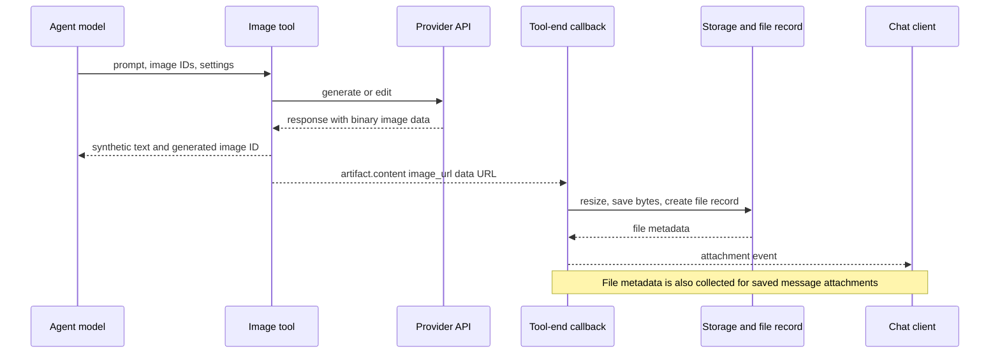

# Backend media audit

Research date: 2026-09-15. Scope: the checked-out `dev` baseline, the image tools, native model output, file persistence, credentials, configuration and accounting. These are static code findings, not results from live provider calls. Proposals below are explicitly labeled. See the parent research document for the product plan and durable job architecture.

## Findings that shape the design

1. **The Gemini workaround loses native response structure.** It asks Gemini for text and images, takes the first image, discards the returned text and other images, and gives the calling agent a synthetic tool result. A native conversation needs ordered text/media output and provider continuation metadata to survive streaming, storage and replay.
2. **Native support crosses the `@librechat/agents` boundary.** Shared content types already include images, video and input audio, but the locked agent runtime does not provide a complete mixed-media output path. Adding model settings or a renderer alone cannot fix that.
3. **Current generated-image persistence changes the original.** The default image save path resizes to a 768-pixel short side, with a long-side cap. A studio needs an original asset plus separate previews; directly reusing this path would undermine high-resolution generation.
4. **Existing infrastructure is useful but uneven.** File ownership, tenant storage paths, retention, download streams, encrypted user credentials, credit reservations and chat attachment delivery exist. Provider-specific generation parameters, billing, error handling and output ingestion remain spread across legacy tools.
5. **Chat and Studio should share assets and generation services.** Native Gemini messages, OpenAI image requests, provider video jobs and optional agent tools can use the same asset ingestion/accounting boundaries without giving them the same execution protocol.

## Current image paths

| Path                | Verified behavior                                                                                                                                                          | Consequence for a studio                                                                              |
| ------------------- | -------------------------------------------------------------------------------------------------------------------------------------------------------------------------- | ----------------------------------------------------------------------------------------------------- |
| Gemini custom tool  | `gemini_image_gen` is agent-only. Resolves API keys or a Vertex service account, calls `@google/genai` `generateContent`, and returns one base64 image as a tool artifact. | Reuse provider request knowledge and reference-image handling; replace the lossy result contract.     |
| OpenAI custom tools | `image_gen_oai` and `image_edit_oai` are agent-only. Generation uses the OpenAI Images SDK; edits use multipart Axios requests. Both return one image artifact.            | Extract one provider adapter used by direct generation, Studio and compatibility tools.               |
| Older image tools   | DALL-E, Stable Diffusion and Flux are registered alongside these tools. Flux already polls BFL request IDs inside the tool.                                                | This is broader than two providers, but tool-specific implementations are not a common media service. |
| Native chat output  | Google endpoint configuration recognizes `responseModalities`; shared message unions include `image_url`, `video_url` and `input_audio`.                                   | These are extension seams, not evidence of complete native image/video generation support.            |

Registration and construction: [tool loader](../../../api/app/clients/tools/util/handleTools.js#L224), [tool registry](../../../packages/api/src/tools/registry/definitions.ts#L404), [manifest](../../../api/app/clients/tools/manifest.json), [Flux polling](../../../api/app/clients/tools/structured/FluxAPI.js#L242), [shared content union](../../../packages/data-provider/src/types/content.ts), [Google parameters](../../../packages/api/src/endpoints/google/llm.ts#L93).

The current generated-image flow is:



The [standard tool-end callback](../../../api/server/controllers/agents/callbacks.js#L1068) processes only `image_url` parts in `artifact.content`, saves each with `FileContext.image_generation`, and adds `messageId`, `toolCallId` and `conversationId` to the attachment. The [Responses API callback](../../../api/server/controllers/agents/callbacks.js#L1427) has a parallel path that emits the `librechat:attachment` extension. [Resume handling](../../../api/server/controllers/agents/resume.js#L243) merges resolved artifact promises with attachments already saved during earlier pause segments. A shared ingestion service should serve both protocol projections rather than adding another implementation in these CJS callbacks.

### Gemini details

[GeminiImageGen.js](../../../api/app/clients/tools/structured/GeminiImageGen.js) establishes several important constraints:

- The model comes from `GEMINI_IMAGE_MODEL`, defaulting to `gemini-2.5-flash-image`; this is separate from the conversational agent's model. `responseModalities` is hard-coded to `['TEXT', 'IMAGE']` at the provider call.
- The tool receives a new prompt and selected image IDs. It does not send the model's original multi-turn native message history. The tool's prompt sanitizer removes quotes and line breaks.
- At lines 410–468 it uses `.find(p => p.inlineData)` from the first candidate, converts that one image, generates a UUID, and returns synthetic text. Native text, additional image parts, part order and native continuation metadata are not returned to LibreChat.
- The schema exposes `prompt`, `image_ids`, `aspectRatio` and `imageSize`; image-size support is inferred from the model name. See [Gemini toolkit](../../../packages/api/src/tools/toolkits/gemini.ts). A capability catalog should replace model-name substring checks.
- Reference images reuse already-loaded file objects and fetch missing IDs in one user-scoped query. Their order is preserved, and the storage strategy supplies download streams. Failed or missing reference images can be skipped rather than yielding a structured validation error.
- It passes an abort signal to the SDK, but catches provider errors and returns text such as “Image generation failed.” Safety blocks and no-image results also become text. A first-class run needs typed failure, blocked and cancelled states.
- The tool factory accepts `imageOutputType`, but its loader currently does not pass that setting, unlike the OpenAI factory. This is a concrete example of configuration drift to avoid during extraction.
- Proxy setup wraps `globalThis.fetch` for Google API URLs at module load. This should not be copied into a new provider service; inject the HTTP client/proxy dependency.

**Proposal:** Native Gemini chat should be a model response containing ordered text and media parts, with generated parts ingested as assets while retaining opaque provider continuation data on the server. Studio can use the same Gemini adapter for a single prompt or a saved revision history. Calling another model through a custom tool remains an optional orchestration feature, not a prerequisite for Gemini to generate its own media.

### OpenAI tool details

[OpenAIImageTools.js](../../../api/app/clients/tools/structured/OpenAIImageTools.js#L63) and [its schema](../../../packages/api/src/tools/toolkits/oai.ts) show:

- Separate `IMAGE_GEN_OAI_API_KEY`, model, base URL and Azure API version settings; the default model is `gpt-image-1`.
- Generation exposes prompt, background, quality and dimensions. The implementation accepts `n` and output compression, but those controls are absent from the published tool schema. It reads only `resp.data[0]`, so its implementation is not a multiple-output contract.
- Editing accepts ordered reference image IDs and streams them as `image[]`. There is a mask-support TODO. It takes the first returned result; multiple **input** images already work, while multiple **output** images are not surfaced.
- The generation branch requests a configured output format. The edit branch labels returned base64 with `imageOutputType` but does not send `output_format`. New ingestion must derive/validate MIME type from returned bytes rather than assuming the configured format.
- The generation branch explicitly has `TODO: handle cost in resp.usage`; the edit path also does not record usage here.
- Provider errors and aborts become strings rather than a stable run-status/error contract.

**Proposal:** Preserve both OpenAI Images operations and Responses-hosted image generation as distinct adapter operations. Their capabilities, previews and conversation semantics differ. Both should produce the same stored asset reference and usage record, and neither should require an agent to rewrite the user's prompt.

## Native multimodal output and the agent-runtime dependency

### Host repository facts

[ContentTypes](../../../packages/data-provider/src/types/runs.ts#L4) and [TMessageContentParts](../../../packages/data-provider/src/types/content.ts) already cover text, `image_file`, `image_url`, `video_url` and input audio. The [message schema](../../../packages/data-schemas/src/schema/message.ts) stores flexible content and metadata. This flexibility permits compatible evolution, but does not validate a new media lifecycle by itself.

The host has a [Google `responseModalities` parameter entry](../../../packages/api/src/endpoints/google/llm.ts#L109), [input-image encoders](../../../packages/api/src/files/encode/image.ts), [video encoders](../../../packages/api/src/files/encode/video.ts) and [audio encoders](../../../packages/api/src/files/encode/audio.ts). Video input can be sent as Google `media` or configured OpenAI-compatible `video_url` content. Input support must not be confused with generated-video output support.

Existing [model-end handling](../../../api/server/controllers/agents/callbacks.js#L94) captures token usage and thought signatures associated with tool calls. [Conversation replay](../../../api/app/clients/prompts/formatMessages.js#L354) restores the persisted `tool_call_id → signature` map to tool-bearing assistant messages. Native image parts need part-level continuation metadata, without exposing it as visible text or applying it to the wrong part after content compaction.

Replay also needs a careful mixed-content audit: [formatAgentMessages](../../../api/app/clients/prompts/formatMessages.js#L330) reduces remaining content to text when `hasReasoning` is set. A generated image must survive reasoning, tool steps, user steering, resumed runs and switching providers; preserving it in the initial stream is insufficient.

### Locked dependency facts

The lockfile pins [`@librechat/agents` 3.8.7](../../../package-lock.json#L10621). Its published source was inspected from the [exact npm tarball](https://registry.npmjs.org/@librechat/agents/-/agents-3.8.7.tgz), outside this repository. The downloaded archive's SHA-512 matched the lockfile:

```text
sha512-yIO/SnWakpKXLzaRCNJfaai0emp22cD7mO8ffzu8gDyIVTzK0jaoG1nrr0+PoVkIeK/piKb+QJEyobPecGX6fg==
```

The following links are version-pinned package source; line numbers describe that package, not the local host files. This was a static audit, with no dependency installation or runtime/provider probe.

| Component                                                                                                                                                                                                           | Verified in 3.8.7                                                                                                                                                                               | Work implied                                                                                                    |
| ------------------------------------------------------------------------------------------------------------------------------------------------------------------------------------------------------------------- | ----------------------------------------------------------------------------------------------------------------------------------------------------------------------------------------------- | --------------------------------------------------------------------------------------------------------------- |
| [Google response converters](https://unpkg.com/@librechat/agents@3.8.7/src/llm/google/utils/common.ts), `convertResponseContentToChatGenerationChunk` and `mapGenerateContentResultToChatResult`, lines 739 and 914 | Mixed response arrays preserve unrecognized Google parts via `return p`; inline image data is not normalized to LibreChat asset content. Function-call thought signatures have a dedicated map. | Normalize native media and preserve part identity, ordering and opaque continuation metadata.                   |
| [Content bridge](https://unpkg.com/@librechat/agents@3.8.7/src/messages/langchain.ts), `toLangChainContent`                                                                                                         | A cast-only bridge; runtime shapes remain unchanged.                                                                                                                                            | A type cast cannot supply the missing conversion.                                                               |
| [Stream handler](https://unpkg.com/@librechat/agents@3.8.7/src/stream.ts), normal content dispatch, lines 2107–2131                                                                                                 | After its string path, dispatches arrays consisting entirely of text or entirely of reasoning. The normal mixed text/image array path has no corresponding dispatch branch.                     | Introduce ordered mixed-content dispatch and a host ingestion seam. Test both separate chunks and mixed chunks. |
| [Content aggregator](https://unpkg.com/@librechat/agents@3.8.7/src/stream.ts), `updateContent`, lines 2395 and 2486                                                                                                 | Missing `type` returns early. The `image_url` branch copies the existing slot without assigning the incoming image URL.                                                                         | Implement stable media-part accumulation/replacement; raw inlineData is not enough.                             |
| [OpenAI Responses adapter](https://unpkg.com/@librechat/agents@3.8.7/src/llm/openai/utils/index.ts), lines 1028 and 1124                                                                                            | Completed `image_generation_call` is retained in `tool_outputs`; `response.image_generation_call.partial_image` explicitly returns null to avoid retaining every preview in history.            | Use transient preview events separate from durable final content.                                               |
| [Responses replay](https://unpkg.com/@librechat/agents@3.8.7/src/messages/core.ts), lines 1732–1778                                                                                                                 | Extracts completed image-generation results into positioned image blocks for replay.                                                                                                            | Reuse ordering/portability knowledge, with host-owned durable assets rather than repeated base64 payloads.      |

**Milestone dependency:** Before declaring native image chat complete, land compatible changes in `@librechat/agents`, release/pin them in LibreChat, and test the full adapter → stream → aggregation → asset persistence → reload → next-turn replay path. Google Developer API and Vertex use different client paths and both need coverage. The existing parameter entry alone does not prove that `responseModalities` reaches every SDK request correctly; verify the wire request in the spike.

## File ingestion, fidelity and references

[saveBase64Image](../../../api/server/services/Files/process.js#L1594) takes provider base64, runs `resizeImageBuffer`, saves through the selected strategy, and creates an owned, tenant-scoped file with retention metadata. [The default resize policy](../../../api/server/services/Files/images/resize.js#L19) limits the short side to 768 pixels and the long side to 2000 pixels, or 1568 for Anthropic. [`fileConfig.imageGeneration`](../../../packages/data-provider/src/file-config.ts#L602) can supply a percentage or pixel override; absent that, the save path chooses `high`. This behavior is configurable today, but it is unsuitable as the default archival path for a studio.

**Proposal:** Add media ingestion in `packages/api`, accepting an injected storage interface. Preserve original bytes, validated MIME type, dimensions and a checksum; create thumbnails/posters and chat-friendly derivatives as separate assets or renditions. Keep preview-generation failures separate from successful original ingestion. Do not send full base64 images/video through ordinary persisted message content, stream replay buffers or observability payloads.

Reusable pieces:

- [Storage strategy implementations](../../../api/server/services/Files/strategies.js): local, Firebase, Azure Blob, S3 and CloudFront download/upload/delete operations. Some source kinds intentionally lack upload or download support; callers must ask for required capabilities.
- [ImageService](../../../packages/api/src/storage/images.ts): a useful dependency-injection example, but its upload method deliberately resizes/converts, so it should not become the original-media ingest path unchanged.
- [File schema](../../../packages/data-schemas/src/schema/file.ts): user, tenant, storage region/key, MIME type, bytes, dimensions, timestamps, retention and file provenance patterns.
- [File strategy selection](../../../api/server/utils/getFileStrategy.js): image/document/default routing exists. There is no dedicated video strategy selection in this function; add a configurable media policy only if existing storage roles cannot express the requirement.
- [File-context tool detection](../../../packages/api/src/agents/tools.ts#L70), [active image resources](../../../api/server/services/ToolService.js#L141), and [image tool context](../../../packages/api/src/tools/toolkits/imageContext.ts): existing request-data reuse and image ID plumbing.

New durable media metadata should explicitly capture producer provider/model, requested/effective parameters, submitted prompt versus any provider-revised prompt, input asset IDs and roles (reference, mask, first frame, last frame), output ordinal, run/revision identity, original/rendition relationships, and provider operation identity where needed. Current synthetic strings such as `generated_image_id` are useful for compatibility, not a structured provenance model. The existing file `status` is a deferred-preview lifecycle; do not overload it with provider generation status.

Any asset-reference resolver must authorize owner/tenant or explicitly shared access, preserve reference ordering, reject unavailable required inputs before charging, and reuse already-loaded request data. Existing tools silently skipping inputs is not a suitable editing experience. Sharing, deletion and retention must account for assets reused across chat and Studio; deleting one presentation should not accidentally delete another's original.

## Credentials, configuration and accounting

### Credentials and provider catalog

[loadAuthValues](../../../api/server/services/Tools/credentials.js) resolves environment values and encrypted per-user plugin values, with alternate field names. [PluginService](../../../api/server/services/PluginService.js#L35) decrypts stored plugin auth. The tool manifest defines the image-specific auth fields. Gemini's tool factory supports API keys followed by Vertex service-account fallback; the conversational Google endpoint has a separate credential/configuration flow.

**Proposal:** A server-resolved provider connection should name the credential reference, API base/deployment, region, and adapter type; it should not persist plaintext secrets in a media run. Reuse existing credential storage and permission checks through injected resolvers. Decide explicit precedence when importing legacy image-tool settings; do not silently replace a user's tool credential with the chat provider's credential. Validate connection/model access before submission and expose actionable configuration failures in both surfaces.

[configSchema](../../../packages/data-provider/src/config.ts#L2850) already owns global image format, tool include/exclude controls and storage settings. It does not provide a first-class media provider/model capability catalog. Existing tool schemas expose parameters to the **agent**, not a user-operated generation form.

**Proposal:** Add a versioned media configuration section to `configSchema`: enabled connections/models, available operations, defaults, policy limits, concurrency/timeouts/retention and access rules. Model capability descriptors should distinguish input/output modalities, native conversation support, generate/edit/inpaint/extend/upscale operations, mask/reference roles, output count, accepted dimensions/durations/formats, and provider-specific options. Server validation remains authoritative; frontend forms consume a safe capability projection. Keep legacy tools and defaults working during migration.

### Accounting

The [Gemini tool](../../../api/app/clients/tools/structured/GeminiImageGen.js#L255) records prompt and candidate token counts through `spendTokens` after a successful image response. It does not await that charge before returning, and early safety/no-image returns skip that recording path. This is not a durable media settlement record. The [OpenAI tool](../../../api/app/clients/tools/structured/OpenAIImageTools.js#L199) explicitly leaves usage billing as a TODO. Flux contains its own [fixed-price table](../../../api/app/clients/tools/structured/FluxAPI.js#L104), illustrating the inconsistent units already present.

The project **already has credit reservations**: [checkBalance](../../../packages/api/src/middleware/checkBalance.ts#L205) calculates a token cost, reserves credit, and returns a held reservation; [transaction methods](../../../packages/data-schemas/src/methods/transaction.ts#L468) implement reserve, renew and release. The [transaction schema](../../../packages/data-schemas/src/schema/transaction.ts) supports prompt, completion and credits, with model/message/conversation correlation. [spendTokens](../../../packages/data-schemas/src/methods/spendTokens.ts) and [recordCollectedUsage](../../../packages/api/src/agents/usage.ts#L813) are relevant integration seams.

**Proposal:** Extend these seams with durable media settlement keyed to run/attempt/provider-operation identity. Keep raw provider usage and explicit units (text/image/audio tokens, generated images, video seconds, provider credits) separate from the LibreChat credit conversion. Reserve estimated spend, renew during long jobs, settle once, release unused reservation, and reconcile retries/late completion/cancellation. Do not infer that aborting an HTTP request prevents provider charges. A run without reported usage needs an explicit estimate/unknown state rather than a false zero. Ensure native chat's model usage and media usage do not charge the same provider work twice.

## Extraction and verification proposal

Respect the repository boundaries: `api` remains wiring; `packages/api` owns provider adapters, ingest and orchestration behavior; `packages/data-schemas` owns plain database contracts and methods; `packages/data-provider` owns public schemas, capability projections, endpoints and client types. Do not copy legacy app-singleton imports, `process.env` lookups or Mongoose signatures into the new service API.

Suggested extraction order, alongside the broader research plan:

1. Define ordered generated-content, asset-reference, request-capability and usage contracts. Prove a request from either chat or Studio maps to them without a fabricated tool call.
2. Land the agent-runtime dependency work above and a native Gemini fixture spike. Keep exact text/image ordering and continuation state through reload and a second editing turn.
3. Extract OpenAI Images and Gemini adapters with injected clients, credential resolution, config and storage. Keep compatibility tool wrappers, delegating behavior into TypeScript.
4. Add original-preserving ingestion and shared assets; project attachments back into existing chat and Responses transports.
5. Connect durable video/provider jobs and accounting to the same assets and capability model, with explicit per-provider differences.

Meaningful acceptance coverage includes: multiple image parts and interleaved text; image-only and text-only valid responses; provider safety refusal versus empty output; masks and ordered references; missing/unauthorized inputs; native signature replay after reload; retry without duplicate assets/charges; partial previews never saved as originals; cancellation with a late provider result; save failure after paid generation; MIME fidelity/transparency; retention/sharing of reused assets; and configured storage/provider variations.

No runtime changes, provider calls, test suites, typechecks or Lighthouse run were made for this documentation-only audit. Later changes to config, files or message loading require workspace typechecks, focused tests and the repository's Lighthouse gate. In particular, native chat must not gain serial startup database reads merely because Studio is enabled.
