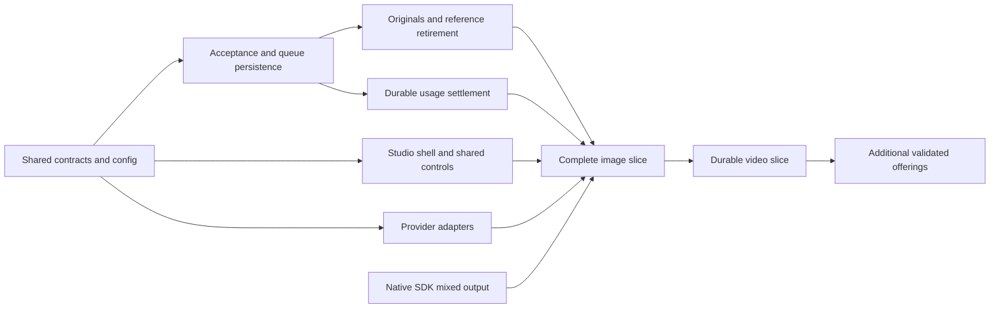

# Implementation outline and verification gates

Proposed on 2026-09-15. This is an implementation backlog for the [technical design](design.md),
not a record of completed features, migrations or tests. All future branches and PRs target `dev`.
Keep foundations disabled until the complete first user-facing slice is ready.

## Working order

UI, provider integration and upstream SDK work can proceed against reviewed shared contracts
while storage invariants are proven. Do not expose mock controls or advertise enabled generation
before real authorization, persistence, failures and recovery are connected.

| Work item                               | Concrete change                                                                                                                                                                                    | Review/exit evidence                                                                                                                                                                                        |
| --------------------------------------- | -------------------------------------------------------------------------------------------------------------------------------------------------------------------------------------------------- | ----------------------------------------------------------------------------------------------------------------------------------------------------------------------------------------------------------- |
| 1. Shared contracts and operator config | Add `media/` Zod schemas, plain DTOs, initial operation discriminants, named connection settings and disabled defaults; add exports, config loading/sanitization, role bits and migration coverage | Omitted config preserves behavior; nested defaults parse correctly; no credentials in startup/catalog; old role values preserved; no storage-engine types in public APIs                                    |
| 2. Acceptance and job repository        | Add thread/turn/job factories, tenant-aware indexes, idempotent staged acceptance, projection barrier, due-work claims, bounded admission and retry links                                          | Standalone Mongo tests kill/restart between every acceptance write; lost responses return the same IDs; conflicting payload rejected; no job dispatches before linked publication                           |
| 3. File ownership and fidelity          | Add media upload/import entry points over shared policy/storage; immutable originals, derivative references, bounded source retainers and reference-aware retirement                               | Upload-only thread works without provider call; original checksum survives download; sweeper/save/delete races cannot lose retained files or resurrect deleted ones; existing file behavior remains covered |
| 4. Worker, credentials and accounting   | Construct host-owned services/worker, resolve recoverable auth bindings, add durable credit holds and idempotent settlement/projection                                                             | Two workers obey global/user/provider limits; rotated/expired credentials handled; crash after debit cannot debit again; chat admission honors media liabilities during worker downtime                     |
| 5. Shared studio/chat image slice       | Add sidebar route, thread grid, import/editor composer, typed model controls, multiple queued jobs, thread detail/history and chat handoff; implement validated OpenRouter and native image paths  | End-to-end image generation and uploaded-image editing in both surfaces; parallel variants pin inputs; all lifecycle states accessible; queue/prompt state restores correctly                               |
| 6. Native mixed-output runtime          | Coordinate `@librechat/agents` events, aggregation and continuation with host recording/ingestion; pin compatible SDK                                                                              | Ordered text + multiple images survive streaming, save, reload and next edit; reasoning/tools/branches do not drop images; one invocation and one usage owner                                               |
| 7. Video slice                          | Add first validated async video adapter, provider polling and ingestion, posters/private playback/range support; second connection tests portability                                               | Navigation/process restart preserves jobs; duplicate notifications do not duplicate files/charges; expired delivery and cancellation races are truthful; same thread supports image and video turns         |
| 8. Provider breadth and refinement      | Expand validated OpenRouter offerings and native integrations; optional masks/upscale/extension only with matching UI + validation                                                                 | New offering adds adapter/descriptor/fixture coverage without provider branches throughout the service or UI; unsupported operations stay unavailable                                                       |

Items 5 and 6 converge before native image chat is declared complete. Numbering identifies work,
not a requirement to merge each in isolation. Split PRs by reviewable invariants; ship the first
enabled experience only when its dependencies are complete. Broad catalog discovery is not itself
support for every listed model.

## First implementation review: contracts and acceptance

Start with a reviewed shared schema and a real standalone-Mongo acceptance harness. This resolves
the identities that the frontend, adapters and persistence all depend on before their code drifts.

1. Define/import the shared `MediaSubmission`, `MediaThread`, `MediaTurn`, `MediaJob`, source-file
   references, versioned summaries and typed action/error shapes. Use `MediaJob` for one provider
   submission; retry jobs link to the same immutable turn.
2. Implement the disabled schema/default and safe startup projection. Register feature permissions
   without overwriting stored role choices or enabling legacy tools differently.
3. Add the job-as-receipt generation method, import-turn receipt, thread/turn projection repair
   and input-link barrier. A duplicate request must recover the same IDs and current
   preparing/accepted/rejected phase on a fresh process/connection.
4. Prove the critical crash cases in the table below before adding paid dispatch. Validate indexes
   on the supported database setup; log/fail readiness if correctness-critical indexes are absent.
5. Review the HTTP receipt/error contract with the client and provider adapters, then connect the
   first complete operation through the shared service.

The harness should use real data-schemas methods and `mongodb-memory-server` in standalone mode.
Inject failures at persistence/provider boundaries; do not mock repository methods and then infer
that multi-record recovery works. A replica-set test can add coverage but cannot replace the
default standalone case.

## Behavior that must be tested

| Invariant                   | Required scenario and assertion                                                                                                                                                                                                                             |
| --------------------------- | ----------------------------------------------------------------------------------------------------------------------------------------------------------------------------------------------------------------------------------------------------------- |
| Owner/tenant identity       | Another user/tenant cannot list, read, cancel, import or infer a thread/file/job; an async worker restores only the claimed job's explicit scope                                                                                                            |
| One accepted operation      | Duplicate POST, lost HTTP response, refresh and concurrent tabs with the same request identity return one thread/turn/job; changed body under the same key conflicts                                                                                        |
| Complete acceptance linkage | Failure after job staging, thread projection, turn projection, input reference acquisition and publication converges through repair; no paid call while staging                                                                                             |
| Preparation and imports     | Preparing receipts survive reload, stale grid pages and temporary detail absence without losing the draft; import recovery never creates a job; accepted only after source pins and linkage publish                                                         |
| Fixed parent selection      | Two edits queued from A complete in reverse order and both still use A; neither changes an unsent draft or pinned cover                                                                                                                                     |
| Safe retry                  | Known failed job can create one idempotent linked retry job; original stays terminal; unknown provider submission cannot automatically replay                                                                                                               |
| Distributed capacity        | Concurrent workers race for the final user/integration/global slot; only valid grants dispatch, and dead grants are reconciled without oversubmission                                                                                                       |
| Honest external effects     | Crash before remote call differs from crash after possible acceptance; missing provider operation evidence produces an uncertain state rather than a second charge                                                                                          |
| Correct input policy        | Disabled operation, changed spend limits, revoked credentials, expired/deleted input and retired thread are rechecked before dispatch; no silent route/input substitution                                                                                   |
| Durable usage               | Crash before/after reservation, debit, ledger publication and receipt cleanup; no duplicate debit/refund; existing chat cannot spend long-running media liability                                                                                           |
| Correct cost interpretation | Token-only zero fields do not make video free; raw provider units and rate snapshots retained; native chat usage not billed again as media                                                                                                                  |
| Reliable publication        | Duplicate provider outputs and storage retries converge to stable file IDs; partial outputs survive; saving failure retries ingestion, not generation                                                                                                       |
| Original integrity          | High-resolution image/transparency/MIME and original video bytes survive; thumbnail/poster failures do not discard downloadable originals                                                                                                                   |
| Retirement races            | Save-to-library versus expiry/deletion, deleting a thread while jobs run, account/tenant deletion and delayed callbacks; no leaked bytes or resurrection                                                                                                    |
| Native protocol             | Mixed text/image chunks, multiple images, final/partial identity, signatures, text-only/refusal, reasoning/tools, branches and follow-up edits survive full host/SDK replay                                                                                 |
| Credential recovery         | Restart with persisted encrypted binding, key expiry/rotation, changed endpoint destination and process-only identity; job cannot borrow another account's credential                                                                                       |
| Session ownership           | Logout/account change during requests/upload/polling cannot populate the next account's cache or restore the old prompt                                                                                                                                     |
| Accessible operation        | Keyboard/mouse/mobile flow for grid, selected tile, references, retry/cancel, player and editor; focus retained when jobs finish; localized states announced sensibly                                                                                       |
| Compatible rollout          | Feature absent/disabled; old messages/files; supported and unsupported job protocol versions; older clients render safe file fallbacks; all active deletion/balance writers upgraded before enablement                                                      |
| Disable after admission     | Restart or remove config after paid submission; durable activation still triggers reconciliation without new generation; an empty job queue cannot clear activation while retained media Files, unpublished writes or cleanup/settlement obligations remain |

Provider HTTP/model responses are appropriate fixture boundaries. Use deterministic SDK/provider
fixtures to exercise real serialization, adapters, database methods and UI; keep live generation
probes small, explicitly account-authorized and separate from deterministic CI.

## Checks by workspace

These are **planned implementation commands**, not commands run for this documentation change.
Use exact test paths as files are added, with tests run from their workspace directory.

| Changed workspace            | Verification                                                                                                                                                   |
| ---------------------------- | -------------------------------------------------------------------------------------------------------------------------------------------------------------- |
| `packages/data-provider`     | Focused media/config/default/migration tests; `npx tsc --noEmit`; root `npm run build:data-provider` when consumers need rebuilt exports                       |
| `packages/data-schemas`      | Real Mongo acceptance/claims/holds/settlement/retirement tests; tenant/index tests; `npx tsc --noEmit`                                                         |
| `packages/api`               | Command/worker/provider/ingestion/native-recording tests including injected crash windows; `npx tsc --noEmit`                                                  |
| `api`                        | Focused route/bootstrap/file-policy/auth compatibility tests when wiring changes                                                                               |
| `client`                     | Component/hook tests with real shared schemas; `npx tsc --noEmit`; browser scenarios through the real app with controlled provider responses                   |
| `packages/client`            | Only if shared primitives change: focused behavior/a11y tests and `npx tsc --noEmit`; specs are excluded from that workspace's typecheck and must actually run |
| Upstream `@librechat/agents` | Mixed-content dispatch/aggregation/replay tests in that repository, followed by LibreChat tests against the exact pinned package                               |

A tsdown build is not a typecheck. Run import sorting only with explicit changed paths. Use the
repo's staged/static-check tooling and target `dev`; avoid mass formatting or unrelated global
Recoil migrations.

## Performance and operations

Run `npm run lighthouse` for implementation touching startup, configuration, auth, files or message
loading. The existing [lane](../../../e2e/lighthouse/README.md) injects 250 ms per Mongo query and
checks the visible conversation. Preserve that gate and reuse loaded actor/config/conversation
data instead of adding media reads to the critical path.

Add a populated-studio browser scenario with many historical threads and a bounded active queue.
Assert request/query counts do not grow one-for-one with tile count, inactive terminal history
does not poll, originals are demand-loaded and video seeks do not download the full file first.
Measure these before proposing studio-specific budgets; do not hide regressions behind new limits.

Use existing observability plumbing for queue wait, submission uncertainty, provider duration,
poll/reconciliation attempts, publication failure, outstanding holds and cleanup lag. Correlate
thread/turn/job IDs without logging prompts, source bytes, provider secrets or native continuation.
Do not use per-job IDs as unbounded metrics labels.

Operational readiness includes worker shutdown/restart, unavailable optional Redis, missing or
failed correctness indexes, stale credentials, provider catalog outage, exhausted storage and
unsupported protocol versions. A failed media worker should expose media readiness/attention
without breaking unrelated text chat. Disable new admission independently from reconciliation
and cleanup so an operator can stop new spend while previously submitted jobs settle.

## Review and rollout

Use additive schema changes and default-off configuration. Do not backfill guessed prompts,
model IDs or provider context into old images. Legacy files may be imported as source assets with
their known provenance and original retention. Keep old custom tools usable during migration.

For implementation PRs, read inline review threads and audit them against current code. Run focused
tests and workspace typechecks after fixes, push, then request review for the exact remote head.
After repeated actionable rounds, review ownership, admission, replay, cancellation, expiry and
cleanup as a subsystem. Report actual local checks, remote head, CI state and review result; a clean
review of a previous head is not completion evidence for later changes.

Completion of the first enabled slice means a user can open the sidebar studio, import/generate an
image, queue independent work, refine a selected result inside its tile, recover after leaving,
and use the same asset in chat. Loading, empty, success, failure, cancellation, retry and restored
sessions need localized accessible behavior. Video and each later advertised operation meet the
same standard in their own slices.
