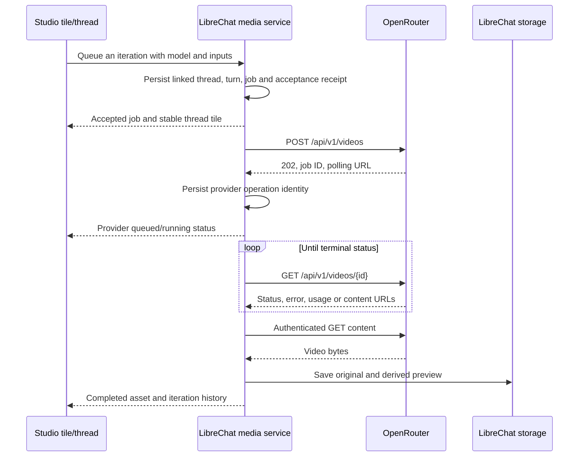

# OpenRouter as the first source of media-model breadth

Researched **2026-09-15 UTC**, using official documentation and unauthenticated, read-only public catalog requests. No media generation, credential test, or paid request was made. The proposed sidebar Media Studio can begin with OpenRouter discovery while keeping native-provider routes in the same model picker.

OpenRouter now documents dedicated **Image** and **Video Generation** APIs. Its default `/models` response is insufficient for media discovery: the documented default is **text output**, which hides image-only and video-output models unless a modality filter is supplied. [O1–O3]

## What the public catalogs actually returned

The media catalogs were retrieved at **23:12:48 UTC**. [openrouter-catalog.json](./openrouter-catalog.json) preserves selected raw capability fields, pricing metadata, source URLs, timestamps, and SHA-256 hashes of the retrieved responses. It contains no unrelated text-only catalog dump. Counts are catalog entries, including variants and specialized transformations, not counts of independent vendors or universally interchangeable generators.

| Request                                      | Observed result                                                                                                                                                                     |
| -------------------------------------------- | ----------------------------------------------------------------------------------------------------------------------------------------------------------------------------------- |
| `GET /api/v1/models`                         | 446 entries in the default text-output catalog; 11 also advertise image output, zero advertise video output, and 79 accept video input. Retrieved at 23:12:03 UTC.                  |
| `GET /api/v1/images/models`                  | **52 image-model entries**, covering 11 publisher namespaces; 43 advertise image-only output and nine advertise image plus text. Eight have model-level `supports_streaming: true`. |
| `GET /api/v1/models?output_modalities=image` | **54 entries**: the same 52 plus `openrouter/auto` and `openrouter/auto-beta`. These router entries are not additional fixed image models.                                          |
| `GET /api/v1/videos/models`                  | **29 video-model entries**, covering ten publisher namespaces. Includes video editing, upscaling, and avatar models as well as generation.                                          |
| `GET /api/v1/models?output_modalities=video` | The same **29 video-model IDs**, with general model metadata and input/output modalities.                                                                                           |

Video **input** support means a model can consume video; it does not establish generated-video **output**. Conversely, the absence of video output from the default text catalog does not establish that OpenRouter lacks video generation.

Representative breadth from the dedicated catalogs:

| Publisher grouping | Image entries | Video entries | Example model IDs observed                                                                            |
| ------------------ | ------------: | ------------: | ----------------------------------------------------------------------------------------------------- |
| OpenAI             |             8 |             1 | `openai/gpt-image-2.5-sunburst`, `openai/gpt-5.4-image-2`, `openai/sora-2-pro`                        |
| Google             |             6 |             3 | `google/gemini-3.1-flash-image`, `google/gemini-3-pro-image`, `google/veo-3.1`                        |
| Black Forest Labs  |             4 |             3 | `black-forest-labs/flux.2-pro`, `black-forest-labs/flux-3-video`, `black-forest-labs/flux-video-edit` |
| ByteDance          |             3 |             5 | `bytedance-seed/seedream-5-0-pro`, `bytedance/seedance-2.5`                                           |
| xAI                |             2 |             2 | `x-ai/grok-imagine-image-2.0`, `x-ai/grok-imagine-video-1.5`                                          |
| Microsoft          |             4 |             0 | `microsoft/mai-image-2.6`                                                                             |
| Meta               |             1 |             0 | `meta/muse-image`                                                                                     |
| Recraft            |            15 |             0 | `recraft/recraft-v4.1-pro`, `recraft/recraft-v4.1-vector`                                             |
| Qwen               |             2 |             0 | `qwen/qwen-image-3-pro`                                                                               |
| Krea               |             3 |             0 | `krea/krea-2-large`                                                                                   |
| Sourceful          |             4 |             0 | `sourceful/riverflow-v2.5-pro`                                                                        |
| MiniMax            |             0 |             3 | `minimax/hailuo-3-max`                                                                                |
| Alibaba            |             0 |             6 | `alibaba/wan-3.0`, `alibaba/happyhorse-1.1`                                                           |
| HeyGen             |             0 |             1 | `heygen/avatar-iv`                                                                                    |
| Runway             |             0 |             2 | `runway/gen-4.5`, `runway/aleph-2`                                                                    |
| Kuaishou / Kling   |             0 |             3 | `kwaivgi/kling-v3.0-pro`                                                                              |

The table groups the separate `bytedance-seed` and `bytedance` namespaces for readability. Publisher identity is different from the upstream serving provider. A zero means no entry in that dedicated catalog at retrieval, not that the company has no such product.

## Image generation and iteration

The Image API accepts `POST /api/v1/images` with a model, prompt, and optional `input_references`, returning base64 output data, detected media type, and usage/cost when available. It offers output count, size/resolution/aspect ratio, quality, format, background, compression and seed controls according to the selected endpoint's capabilities. Image references can be HTTPS URLs or base64 data URLs. [O2]

This fits a direct studio operation: select a result in a tile, request a change, and send that asset as a reference for the next iteration. However, reference-guided generation is not evidence of every editing operation. The inspected generic contract does not establish a universal mask/inpainting parameter, exact preservation of unchanged regions, or complete native Gemini conversation replay.

Model-level `supported_parameters` is a **union across endpoints**. `GET /images/models/{author}/{slug}/endpoints` supplies the definitive per-endpoint parameters, streaming flag, provider tag, passthrough allowlist and billable pricing lines. Select a compatible endpoint before validating a form; a union cannot prove that one endpoint supports the whole combination. A descriptor `{ "type": "boolean" }` means the parameter is supported, not that the requested value must be `true`. [O2, O4]

Two public endpoint responses were also captured:

- `google/gemini-3.1-flash-image` has separate Google AI Studio and Google Vertex/global endpoints, both with their own provider identity, capability record and allowed `cachedContent` passthrough.
- `bytedance-seed/seedream-4.5` resolves to a Seed endpoint with reference-count, image-count, resolution, aspect-ratio and seed descriptors.

Image streaming uses `image_generation.partial_image`, `image_generation.completed`, and error events. Partial renders are previews, not new iterations or final assets. The guide documents all-or-nothing Image API billing: failed or prematurely terminated image streams are not billed, although the upstream may continue rendering after disconnect. Preserve that as a route-specific contract; it is not a general guarantee for native providers, video, or chat-completion tokens. [O2]

Some catalog entries require input references, and some Recraft entries output **SVG only**. A studio that initially handles raster images must filter these capabilities or implement a deliberate SVG asset/rendering path. Do not infer PNG support from `output_modalities: ["image"]`.

## Video lifecycle

The documented video flow is:

Webhooks can supplement polling. The guide exposes pending/in-progress/completed/failed states; the API schema and webhook examples also include cancelled and expired. Completion URLs in `unsigned_urls` require the OpenRouter API key; they are not public signed playback links. Download server-side into LibreChat storage. [O3, O5]

Callbacks support an HTTPS URL per request or workspace default. The official recipe documents HMAC signature verification and `X-OpenRouter-Idempotency-Key` for duplicate delivery. Configure a signing secret, verify the raw payload, deduplicate events, and reconcile against the authoritative job. A callback delivery key is not proof of idempotent paid submission. [O6]

The inspected index/reference exposes submission, polling and download, but no user-callable cancellation endpoint. A `cancelled` status or cancellation webhook does not prove LibreChat can cancel a running job. Output retention duration, job-query lifetime, submission-idempotency guarantees, remote cancellation, and refund semantics remain validation questions. A closed tile or stopped poller must not imply rendering or charging stopped.

The catalog describes durations, resolutions, aspect ratios, explicit sizes, first/last-frame support, seed/audio flags and provider passthrough allowlists. The submit schema additionally accepts audio/video references where the provider supports them; it says other providers may ignore those references. The user guide's simpler reference section only describes images. Use the exact endpoint/schema plus a tested capability definition, not the broadest request type alone. [O3, O7]

`frame_images` takes precedence over `input_references` in the documented workflow. The studio should make those input roles clear and validate combinations instead of silently changing modes. Null duration/resolution fields in transformation models do not mean unlimited input or output dimensions.

## Routing, native-provider parity, and privacy

OpenRouter Image API routing explicitly supports `only`, `order`, `ignore`, `sort`, and `allow_fallbacks`. General routing docs default to provider fallback and distinguish a base provider slug from a specific endpoint/region. For a selected model's iterative thread, record the requested route and actual serving endpoint when available; choose compatible routing explicitly. A model fallback is a separate product choice and can change output behavior. The documented `models` fallback examples use chat completions, so their existence does not establish support on `/images` or `/videos`. [O2, O8]

An OpenRouter Gemini route and a native Gemini route are separate integration identities, even when the model names look equivalent. The direct Image API output envelope and inputs do not promise Google Interactions IDs, native interleaved output, or identical continuation semantics. OpenRouter documents reasoning-detail replay for conversational calls and a separate beta image-generation server tool; neither should be confused with its direct Image API. Preserve route-specific continuation behind the adapter and use a new branch/iteration when changing routes cannot preserve the same context. [O9, O10]

General OpenRouter metadata includes prompts/completions pricing, while dedicated image endpoints expose billable/unit/variant lines and video models expose pricing SKUs. Several video entries have zero generic prompt/completion prices because they are not token-billed text models. That does **not** mean free video generation. Use the dedicated pricing contract and returned cost, preserve units, and date estimates. The snapshot retains raw prices without converting them into user-facing estimates.

The public catalog is not the effective account catalog. Model access, API-key permissions, configured providers, quota, endpoint health and privacy rules can reduce the eligible set. OpenRouter documents a user-filtered models endpoint; this research did not call it with credentials. LibreChat must also apply its own role, tenant and deployment configuration. [O1]

OpenRouter's privacy overview says prompt/response logging and use are opt-in, while request metadata is retained. Upstream providers have separate policies. Most concretely, the video guide states that video generation is **not eligible for Zero Data Retention**, and enforced ZDR prevents video routing. Do not override that setting to make the button work; explain the unavailable capability and offer only administrator-approved compatible routes. [O3, O11]

## Fit with the proposed sidebar studio

### Existing LibreChat integration seams

LibreChat already recognizes OpenRouter in its
[provider identity registry](../../../packages/data-provider/src/providers.ts),
[OpenAI-compatible client configuration](../../../packages/api/src/endpoints/openai/config.ts),
and [custom-provider resolver](../../../packages/api/src/endpoints/config/providers.ts).
Preserve configured connection names, credentials, base URLs, headers and endpoint identity when
offering an existing connection to the studio. Two configured OpenRouter endpoints may represent
different accounts or policies.

The existing [model fetcher](../../../packages/api/src/endpoints/models.ts) requests `/models` and
returns a list of model IDs, with separate token-pricing handling. Its
[configuration loader](../../../packages/api/src/endpoints/config/models.ts) also resolves
user-provided keys and scoped requests. Reuse the authorization/configuration boundaries, but add
a media catalog service that retains dedicated operation/endpoint metadata. Sending image/video
catalogs through the existing string-list contract would lose the capability information required
by the studio. Keep public metadata caching separate from user-authorized connection availability,
and do not add media discovery to ordinary chat startup.

### Proposed integration

Recommendations, not implemented behavior:

1. Discover OpenRouter's dedicated image/video catalogs first, enrich with modality-filtered general metadata and selected endpoint records, and merge these with configured native routes. Cache dated descriptors server-side and expose the authorized subset to the model picker.
2. Make each tile a persistent **thread** with immutable **iterations**. A queued job belongs to an iteration; the tile is not replaced whenever a new generation starts. Store prompt/settings, referenced parent assets, route identity, provider job ID, output assets, usage and continuation separately.
3. Permit multiple tiles/jobs in the workspace. Use a configurable server queue and concurrency limits across users/providers; provider acceptance is separate from waiting in LibreChat's own queue. Reloading or closing the sidebar must not lose accepted work.
4. Editing an image appends or branches an iteration in its thread. Starting a variant can reuse settings and references while keeping the previous result available. Model changes should disclose when they begin a new provider context.
5. Prove a small number of routes before presenting every discovered model as supported: one OpenRouter image endpoint, one OpenRouter video endpoint, and native Gemini conversation/editing. Expand the validated catalog through fixtures and account-authorized generation tests; public discovery supplies breadth, not tested parity.

Remaining implementation probes are reference edits, true interleaved conversational output, masked editing, native/OpenRouter route changes, unsupported parameter combinations, image stream interruption, video recovery, duplicate callbacks, output expiry, ambiguous submission outcomes, and actual usage settlement. These were not executed here.

## Official sources

All sources retrieved **2026-09-15 UTC**:

- **O1:** [Models API and default output filter](https://openrouter.ai/docs/api/api-reference/models/list-all-models-and-their-properties); [user-filtered model catalog reference](https://openrouter.ai/docs/api/api-reference/models/list-models-filtered-by-user-provider-preferences-privacy-settings-and-guardrails), discovered through the [official documentation index](https://openrouter.ai/docs/llms.txt). The authenticated endpoint was not called.
- **O2:** [Image generation, discovery, routing, streaming and billing](https://openrouter.ai/docs/guides/overview/multimodal/image-generation).
- **O3:** [Video generation, lifecycle, reference roles and ZDR](https://openrouter.ai/docs/guides/overview/multimodal/video-generation).
- **O4:** [Image model endpoint capability reference](https://openrouter.ai/docs/api/api-reference/images/list-endpoints-for-an-image-model).
- **O5:** [Video polling reference](https://openrouter.ai/docs/api/api-reference/video-generation/poll-video-generation-status); [authenticated content download](https://openrouter.ai/docs/api/api-reference/video-generation/download-generated-video-content).
- **O6:** [Video webhook verification recipe](https://openrouter.ai/docs/cookbook/video-generation/video-generation-webhooks).
- **O7:** [Video submission schema](https://openrouter.ai/docs/api/api-reference/video-generation/submit-a-video-generation-request); [video catalog schema](https://openrouter.ai/docs/api/api-reference/video-generation/list-all-video-generation-models).
- **O8:** [Provider routing](https://openrouter.ai/docs/guides/routing/provider-selection); [model fallbacks](https://openrouter.ai/docs/guides/routing/model-fallbacks).
- **O9:** [Reasoning-detail preservation](https://openrouter.ai/docs/guides/best-practices/reasoning-tokens).
- **O10:** [Beta image-generation server tool](https://openrouter.ai/docs/guides/features/server-tools/image-generation).
- **O11:** [OpenRouter data collection](https://openrouter.ai/docs/guides/privacy/data-collection); [upstream provider logging](https://openrouter.ai/docs/guides/privacy/provider-logging).
- Public catalog GET URLs and per-response retrieval metadata are recorded in [openrouter-catalog.json](./openrouter-catalog.json).
