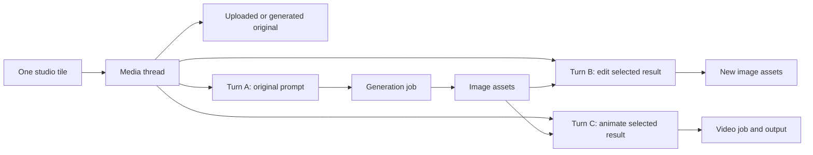

# Media Studio: thread tiles and queued creation

Product direction captured on 2026-09-15. This is a proposed experience and domain model, not an
implemented interface. It incorporates the requested sidebar entry, model selection, image/video
creation, editing existing images, multiple queued jobs and iteration inside each tile. Chat and
studio remain equal entry points into the shared subsystem.

## The experience

**Media Studio** is a persistent sidebar destination alongside the agent builder and other tools.
It opens `/studio` in the existing authenticated shell. The current chat model does not determine
which studio models are available. Feature enablement and media permissions control access.

The landing screen combines a creation composer with a grid of media threads:

```text
Sidebar             Media Studio
                    [Model] [Connection] [Image / Video / Edit]
Chat                [Prompt...................................]
Agent builder       [Add image / references] [Settings] [Queue]
Media Studio
                    [All] [Pending] [Completed] [Needs attention]

                    ┌───────────────────┐ ┌───────────────────┐
                    │ Product photograph│ │ Short launch clip │
                    │ Latest image      │ │ Poster / preview  │
                    │ 3 versions        │ │ Generating video  │
                    │ 2 ready, 1 queued │ │ 1 running         │
                    └───────────────────┘ └───────────────────┘
                    ┌───────────────────┐ ┌───────────────────┐
                    │ Uploaded portrait │ │ Landscape study   │
                    │ Edited image      │ │ Reference preview │
                    │ 2 versions        │ │ Needs attention   │
                    │ Completed         │ │ View error        │
                    └───────────────────┘ └───────────────────┘
```

This is a layout sketch. Use existing shared primitives, semantic theme roles and responsive
layout in implementation. The connection control can be secondary when a model has only one
usable route; selecting a model must still make its effective route clear before submission.

### A tile starts a thread

A new top-level creation submits the first job and creates one durable thread tile. Uploading an
existing image can establish the initial asset for an editing thread without requiring a paid
generation first. The original file stays available alongside later edits.

Opening the tile reveals its prompt/refinement composer, references, ordered turns, all job
attempts and output versions. The user can continue with “make the background darker,” select an
earlier result, try another model, or animate an image when supported. A turn can contain native
text and multiple media outputs. Each output can be inspected, downloaded, reused or sent to chat.

The tile summarizes the thread; it is not the only place outputs exist. Show a cover preview, title,
latest activity and separate ready/pending/failed counts. A thread can have completed media and
pending work simultaneously. Do not replace a useful completed preview with an empty spinner when
another iteration starts. A thumbnail failure should not hide the downloadable original.

Use `/studio/threads/:threadId` as the stable detail link. A drawer or split view on desktop can
provide quick access, while the same route works as a full screen on mobile and after reload.
Run and asset links can select a specific item inside that thread.

### Queue several independent ideas

The user can submit one idea and immediately begin another. Each accepted top-level job appears
as a tile without waiting for earlier work. The server controls actual concurrency according to
configured user, deployment and provider limits. Several accepted jobs may therefore be queued
while a smaller number run.

One submission identity covers the thread, turn and job. The server durably links them before
marking the receipt accepted or making a paid call. An earlier preparing receipt keeps a clearly
labeled provisional tile and recoverable draft until linkage completes. Retrying after a lost response returns those same
identities instead of duplicating tiles. Current permissions, credentials, input retention and
spend policy are checked again before dispatch; changed policy can require attention but cannot
silently change the queued model or reference image.

Within an existing thread, a user can queue several variants from a selected result. Those jobs
stay in that tile's history rather than creating unrelated tiles. An explicit duplicate/new-thread
action can separate an idea when wanted. A batch request with several outputs is still one request
attempt unless the adapter deliberately expands it into tracked child jobs.

Pending and completed filters describe the jobs/results **inside** each thread. The same thread
may match both filters. Expanding its status summary exposes every matching job, including jobs
without a usable output. A queue view can group all pending jobs by thread; it must not collapse
several running jobs into a misleading single status or claim an exact queue position across
different providers. Queue reordering, bulk actions and scheduled starts are optional later work.

## Threads, turns, jobs and assets

These are different identities with different lifetimes:

| Concept               | Purpose                                                                                                                                                                                     |
| --------------------- | ------------------------------------------------------------------------------------------------------------------------------------------------------------------------------------------- |
| Thread                | The persistent creative workspace represented by one tile; owner, title, ordered activity, selected/pinned cover and optional chat origin                                                   |
| Turn/revision         | An import with immutable source references, or one generation/editing instruction with its selected parent, chosen model/connection and immutable settings snapshot                         |
| Generation/job        | One provider submission attempt under a generation turn; tracks queueing, execution, ingestion, completion and reconciliation; an explicit safe retry creates a new job under the same turn |
| Asset                 | An uploaded input or immutable generated output, backed by the existing File system; originals and derivatives have explicit relationships                                                  |
| Provider continuation | Private adapter state tied to an exact branch, request history and provider/account/API/model context; not the thread's universal identity                                                  |



Use a required `MediaThread` and explicit turn/revision relationships for the studio. Direct image
APIs and video jobs need a thread just as native conversations do. Provider continuation can remain
optional within that thread.

The same thread may contain images and videos and may use multiple model connections. Do not lock
its identity to the first model or create a new thread automatically when the user changes models.
The interface should explain when a model change starts a fresh provider conversation while
retaining the selected files and LibreChat history.

## Keep iteration deterministic even when jobs finish out of order

Every queued turn captures a stable parent revision and authorized input asset IDs. Suppose image
A exists, and the user queues edits B and C from A. If C finishes first, B must still edit A, not C.
Submitting both does not authorize last-result-wins input substitution.

- Independent variants from the same completed input may run concurrently, even inside one thread.
- A turn requiring an unfinished output carries an explicit dependency and waits. If that parent
  fails or is cancelled, the dependent turn is blocked with an actionable choice rather than
  submitted using a missing or different image. Advanced dependent-job composition may be deferred;
  the initial UI can allow references only to completed assets.
- Native continuation follows the selected branch. If the provider requires sequential conversation
  state, serialize dependent turns or fork from the pinned history; do not serialize every unrelated
  studio thread or mutate one remote conversation concurrently without a documented contract.
- Job completion appends a result to the right turn. It does not steal an actively selected editor
  result, change an unsent prompt's reference, or replace a pinned tile cover.
- Keep accepted turn ordering stable, with explicit parent links for branches. A retry of an
  uncertain submission first reconciles that attempt; an intentional new variant is new work.
- Thread edits from another tab/device use revision checks and idempotent submission identities.
  Refresh restores accepted work; a stored draft never submits itself.

## Models: start discovery with OpenRouter, keep native connections

Use [OpenRouter research](openrouter.md) as the first catalog survey for provider/model breadth.
An OpenRouter adapter is one execution connection; native Google, OpenAI and other provider
connections remain peers. The studio should work with native connections even when OpenRouter is
not configured or is temporarily unavailable.

Represent a model's creator/family separately from how LibreChat reaches it. For example, a model
family may be accessible through OpenRouter and through its native vendor; these are alternative
connections, not interchangeable provider handles. Preserve both the requested model/route and
the actual resolved model/upstream endpoint when the API reports them.

The selector should support:

- Operation filtering for generate image, edit image and generate video, plus specific reference
  roles where supported. Image/video **input** support alone cannot qualify a generation model.
- Search and grouping by model creator/family, with configured connections shown as alternatives.
  Mapping equivalent model versions across native and gateway catalogs must be curated/verified,
  not inferred solely by name similarity.
- Valid settings and accepted inputs for the exact chosen API/model/operation. Gateway support
  need not expose every native capability; native adapters can expose their additional operations.
- Clear route changes. Revalidate inputs/settings and continuation when changing connections;
  preserve compatible draft values and identify unsupported fields before submission.
- Explicit gateway routing/fallback policy, constrained by operator policy. A multi-turn edit must
  not unexpectedly change models, privacy settings or account-bound continuation state on retry.

Catalog discovery and execution availability are separate. Cache validated descriptors, honor
operator allowlists and credential permissions, and retain historical model labels on old turns
after catalog entries disappear. A catalog outage should not prevent browsing existing threads.

## Chat stays connected

An explicit chat media action can create or reference the same media thread and job. A native
multimodal response can be linked through its stable message/branch identity without making a
duplicate provider request. “Open in studio” resolves that thread and selects the exact output.
Ordinary text-only chat should not fill the studio with empty tiles. Create/link media work for an
explicit media request or actual generated media, retaining an accepted media job even if it fails.

“Use in chat” attaches selected authorized assets to the chosen conversation draft and preserves
its existing text. It does not submit automatically. Thread history and a chat transcript are
distinct views: synchronize through stable links and shared assets, without duplicating every
studio event as an unsolicited chat message. Reuse must still respect temporary-chat retention,
destination input capabilities and sharing policy.

## First complete slice

The initial image slice should include the sidebar route, thread grid, creation/import controls,
multiple accepted jobs, thread detail with prompt iteration, all outputs, and chat handoff. Prove
the experience through an OpenRouter media path and a native provider path with verified access.
Add video through the same thread/job contract, including playable stored outputs and real job
status. Native Gemini mixed output remains an early architecture test.

Required acceptance examples:

1. Queue three unrelated creations; see three tiles immediately and reopen them after refresh.
2. Upload an existing image, edit it twice, and recover the original plus both versions in one tile.
3. Queue two variants from the same selected image; reverse completion order without changing
   either job's input or the user's selected result.
4. Keep completed media visible while another job in that thread is pending or fails.
5. Switch between a verified OpenRouter route and a native route, preserving local lineage while
   revalidating supported controls and explicitly handling continuation limits.
6. Open a chat result in its studio thread and attach a chosen studio output to chat without
   regeneration or loss of the destination draft.
7. Show truthful queued/running/importing/partial/failure/cancellation/uncertain states with every
   job inspectable. Detaching or hiding a tile does not imply remote cancellation.

The [main proposal](README.md) retains the durable execution, storage, authorization, accounting,
retention and verification requirements behind these interactions. The [frontend audit](frontend.md)
identifies the current sidebar, route and component seams.
