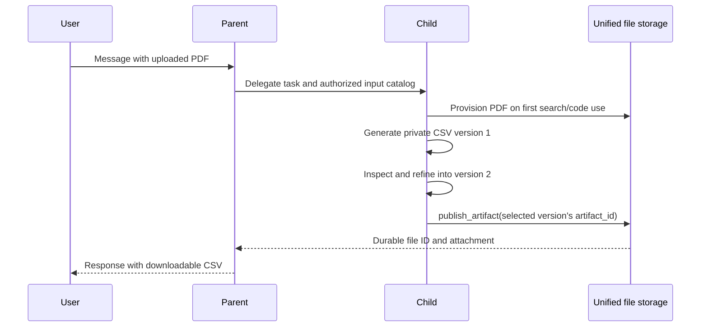

# Run-scoped files for subagents

An agent with file sharing enabled can delegate the files attached to the current message.
Children receive an authorized file catalog and use the existing native-provider, extracted-text,
code, or search paths. Code and search copies are provisioned when their tools need them.
Earlier conversation attachments and another agent's setup files are not added to this catalog.
Files explicitly routed only to tools still obey upload policy, but do not consume the receiving
model's attachment budget. Files resolved to provider or extracted-text delivery do consume it.

Enable the deployment capability in `librechat.yaml`, then enable **Share files with subagents**
in the parent agent's subagent settings:

```yaml
endpoints:
  agents:
    fileSharing:
      enabled: true
      allowSiblingSharing: false
      maxFiles: 100
      maxPrivateBytes: 268435456
      ttlMs: 3600000
```

The deployment capability and each agent's `subagents.shareFiles` setting default to disabled.
Existing saved agents do not need a migration. The limit bounds the run's file catalog and
private output references. `maxPrivateBytes` bounds the aggregate private snapshots stored on disk
for a run; it defaults to 256 MiB and can be configured up to 10 GiB. Reaching either limit rejects
a new capture while leaving existing versions usable. The lifetime begins at the generation's
creation time.

## Reading and publishing

`list_run_files` returns the current execution's permitted file IDs, delivery paths, provenance,
and unpublished artifact IDs. A child cannot enumerate another child's private outputs.
These tools are available to agents configured to delegate with file sharing enabled and to
child executions participating in that shared-file run. Enabling the deployment capability alone
does not add them to other agents.

Generated sandbox outputs stay private while a child reads, inspects, and refines them. The child can
create `analysis.csv`, inspect it in another tool call, and rewrite that filename without losing
the earlier version. Retained versions have separate artifact IDs, even when their filenames
match. Reading an unchanged file reuses its latest private version; changing a file and then
restoring earlier bytes creates another version. Catalogs list versions in creation order.
Select an artifact ID from `list_run_files` to choose the version to publish.

`publish_artifact` accepts an `artifact_id` from that list and returns a durable `file_id`.
It persists through the ordinary upload/storage/preview pipeline before notifying the parent.
The attachment appears in the conversation and Files panel, where it can be downloaded or
attached to another message. Publication records preserve user, tenant, conversation, run,
execution, producing agent, and input-file provenance. Retrying a successful publication returns
the same file ID; deleting that file does not let a cached retry restore it.
Publishing an earlier and a later version creates separate durable files. Later sandbox changes
do not change the bytes of either publication.

Search citations, memory updates, interactive tool resources, and image-generation results retain
their existing delivery behavior. They are not sandbox files in the publication catalog.



Publication grants access to the producing execution and its parent chain. To grant another
authorized agent access, the deployment must also enable `allowSiblingSharing`, and the child
must supply that agent's ID in `recipient_agent_ids`. This does not grant execution permission
to agents outside the parent's configured subagent roster.

## Execution and recovery

Each child execution has its own managed sandbox partition, including simultaneous copies of
the same saved agent. Its own setup files retain their existing authorization. Code execution
within one partition is serialized through artifact capture; independent children can run
concurrently.

Unrelated tool batches reuse the authorized catalog after its initial load. File-consuming tools,
explicit catalog reads, delegation, publication, and completion refresh persisted publications so
deleted files leave the catalog and queued tool resources. Concurrent preparations join a pending
refresh rather than restoring an older catalog over its result.

Private output versions are captured before another sandbox operation can change their bytes.
Reading or running more code does not retire those versions. Publication uses the selected
captured version, so inspection and refinement can continue without changing a file being published.
Only explicit publication adds an output to the parent's catalog and the user's conversation.
Successful publication deletes its selected private snapshot after the durable file is stored.
Completion, cancellation, expiry, and a pause for human approval delete all remaining private
snapshots. An interrupted, paused, or reconstructed child must regenerate unpublished outputs.
Persisted publications can be rediscovered while the original run grant is valid.

Expiry and cancellation end temporary access; they do not delete durable user files. Durable
files use the existing file retention and deletion behavior and can be explicitly attached to a
new message. Audit events record inheritance, publication, and expiry without file contents.

## SDK dependency and current support

The dependency manifests require `@librechat/agents` 3.8.6 or later, and the lockfile installs 3.8.6.
This release includes the host-owned execution context from
[agents #539](https://github.com/danny-avila/agents/pull/539), exposing
`SUBAGENT_CONTEXT_VERSION = 1` and the `RunConfig.subagentContext` prepare/complete adapter.
A normal locked install includes the required SDK; no local SDK build is needed. The runtime
capability check rejects enabled sharing if an incompatible SDK is loaded.

The first implementation supports foreground chat delegation with managed code environments and
subagent teams whose members use the same provider, endpoint, model, Responses API setting, and
image-detail setting. An unset image detail inherits the request value, so it differs from an
explicit `auto` setting. Shared prompts are checked against every member's permanent attachments
before the files are encoded once for the team. The root's endpoint file budget also includes
retained historical and setup resources, counting each file once and releasing removed publications.
Detached child threads and background code
execution are disabled for shared-file runs until their durable task records can carry the same
authorization scope. Attached workstation environments, native provider tool objects without host
execution definitions, and API entry points without the run-file adapter fail explicitly when
sharing is requested.

The browser scenarios are `e2e/specs/mock/run-files.spec.ts`, `run-files-delivery.spec.ts`, and
`run-files-lifecycle.spec.ts`. They cover native PDF and extracted-text delivery, lazy search/code
provisioning, versioned publication, nested delegation, recipient authorization, concurrent runs,
cancellation cleanup, checkpoint recovery, reload, download, and follow-up attachment reuse.
They exercise the real application and SDK with deterministic model, Code API, and RAG fixtures.
Manifest, session, host, encoder, SDK bridge, publication storage, and config tests also cover
authorization, retries, individual child restoration, and default compatibility.
