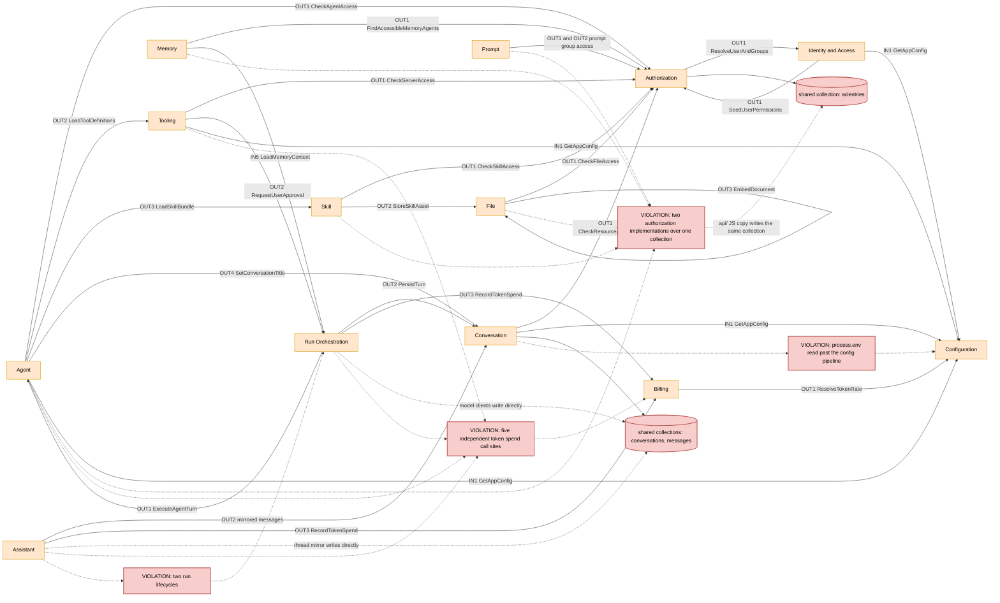

# Domain Map — Index

> System: LibreChat monorepo at `/home/maceo/Dev/silmari-chat`
> Generated by the **DomainMap** skill (DDD-transition analysis). Analysis only — no application code.
> Status: current-reality map with clearly-marked target notes. Provisional boundaries are labeled.

The repository is mid-transition. Its newest code lives in typed packages with real aggregates and ports (`packages/api/src/skills`, `packages/api/src/shared-links`, `packages/api/src/stream`); its oldest lives in a JavaScript Express server where domain rules sit in controllers, middleware, and model-client classes (`api/server`, `api/app/clients`). Most drift recorded below is that seam: the same rule implemented once on each side.

## 1. Domain roster

| Domain | Responsibility | Spec | Confidence |
|---|---|---|---|
| Authorization | Decide and record who may do what to which resource | [`authorization.domain.md`](./authorization.domain.md) | firm |
| Identity and Access | Establish and maintain who a request is | [`identity-access.domain.md`](./identity-access.domain.md) | firm |
| Conversation | Own the durable record of a chat and its organising structures | [`conversation.domain.md`](./conversation.domain.md) | firm on concepts, provisional on boundary |
| Agent | Define, version, share, and resolve agents | [`agent.domain.md`](./agent.domain.md) | firm on aggregate, provisional on boundary |
| Run Orchestration | Own the lifecycle of a single generation across replicas | [`run-orchestration.domain.md`](./run-orchestration.domain.md) | provisional |
| Tooling | Make external capability available to a run | [`tooling.domain.md`](./tooling.domain.md) | provisional |
| Skill | Own reusable skill packages and their synchronisation | [`skill.domain.md`](./skill.domain.md) | firm |
| File | Accept, store, transform, serve, and retire files | [`file.domain.md`](./file.domain.md) | firm |
| Memory | Store and budget durable facts about a user | [`memory.domain.md`](./memory.domain.md) | firm |
| Billing | Price model usage and keep token balances correct | [`billing.domain.md`](./billing.domain.md) | firm on aggregate, provisional on boundary |
| Prompt | Own the reusable prompt library and its sharing model | [`prompt.domain.md`](./prompt.domain.md) | firm |
| Configuration | Resolve the effective configuration for a request | [`configuration.domain.md`](./configuration.domain.md) | firm on pipeline, provisional on boundary |
| Assistant | Run conversations against provider-hosted assistant runtimes | [`assistant.domain.md`](./assistant.domain.md) | provisional, deprecation candidate |

## 2. Context map

One node per domain; one labeled edge per inter-domain interface or event. Edge labels reference the owning spec's port and event identifiers. Shared-data and duplicated-rule violations are drawn with the `gap` class.

## 3. Global gap & risk register

Consolidated from every domain's gaps section, highest severity first.

| Severity | Domain | Gap | Evidence (path) | Target remedy |
|---|---|---|---|---|
| high | [Authorization](./authorization.domain.md) | Two independent implementations of the same authorization rules over one collection | api/server/services/PermissionService.js and packages/api/src/acl/accessControlService.ts | Make the TypeScript service the only implementation; reduce the JS file to a shim |
| high | [Authorization](./authorization.domain.md) | Principal materialisation exists in only one of the two paths | api/server/services/PermissionService.js:319 | Port it into the TypeScript service before consolidating |
| high | [Authorization](./authorization.domain.md) | Identity-provider group sync embedded in the authorization service | api/server/services/PermissionService.js:508 | Move to Identity and Access, deliver memberships through a port |
| high | [Conversation](./conversation.domain.md) | The primary write path bypasses the domain entirely | api/app/clients/BaseClient.js:941 and api/server/controllers/agents/client.js | Introduce a turn-persistence port and route both clients through it |
| high | [Conversation](./conversation.domain.md) | Message and conversation writes are not atomic | api/app/clients/BaseClient.js:961 then :1031 | Make the persistence port a single operation over both collections |
| high | [Run Orchestration](./run-orchestration.domain.md) | The job aggregate is a 6899-line god object | packages/api/src/stream/GenerationJobManager.ts | Split claim leasing, event fan-out, and job state into collaborators |
| high | [Run Orchestration](./run-orchestration.domain.md) | Turn execution lives in the Agent controller, not this domain | api/server/controllers/agents/client.js | Move execution here; Agent only resolves configuration |
| high | [Agent](./agent.domain.md) | Agent execution and agent definition share a module tree | api/server/controllers/agents/client.js | Split execution into Run Orchestration |
| high | [Agent](./agent.domain.md) | Ephemeral agent has no type, so resume must hand-replay parameters | api/server/routes/agents/chat.js | Introduce an explicit ephemeral-agent value object |
| high | [Tooling](./tooling.domain.md) | Three tool subsystems with three loading paths and three failure modes | api/server/services/ToolService.js, api/app/clients/tools/manifest.json, packages/api/src/mcp/tools.ts | Introduce one registry resolving every tool key |
| high | [Tooling](./tooling.domain.md) | MCP aggregate split between a persisted document and process-local connection state | packages/data-schemas/src/schema/mcpServer.ts and packages/api/src/mcp/MCPManager.ts | Make connection readiness explicit and shared |
| high | [File](./file.domain.md) | File permission rules re-derived instead of delegated | api/server/services/Files/permissions.js | Replace with calls to the Authorization ports |
| high | [File](./file.domain.md) | Document creation and object storage are not atomic | api/server/services/Files/process.js | Write a pending document first, promote on storage success |
| high | [Billing](./billing.domain.md) | Five independent spend call sites across three domains | agents/usage.ts:653, abortMiddleware.js:163, Threads/manage.js:510, GeminiImageGen.js:287, agents/client.js | One spend port called from the run terminal transition |
| high | [Billing](./billing.domain.md) | Prompt and completion debits are two separate balance updates | packages/data-schemas/src/methods/spendTokens.ts | Make a spend one atomic balance mutation |
| high | [Skill](./skill.domain.md) | TypeScript package imports the legacy JS permission service | packages/api/src/skills/handlers.ts | Depend on the TypeScript access-control service |
| high | [Configuration](./configuration.domain.md) | Feature code reads process.env directly, bypassing all override layers | api/server/routes/config.js and packages/data-schemas/src/models/convo.ts | Route every flag read through the resolved config |
| high | [Configuration](./configuration.domain.md) | Search indexing availability fixed at model construction | packages/data-schemas/src/models/convo.ts | Decide indexing per operation from the resolved config |
| high | [Identity and Access](./identity-access.domain.md) | Group membership written by Authorization during a login transaction | api/server/services/PermissionService.js:508 | Move the sync here and publish memberships outward |
| high | [Memory](./memory.domain.md) | Policy composition lives in a route, unreachable from the run path | api/server/routes/memories.js | Extract a memory policy module both paths call |
| high | [Assistant](./assistant.domain.md) | A complete second run lifecycle parallel to Run Orchestration | api/server/services/Runs/StreamRunManager.js | Reuse the shared lifecycle, or accept as scoped deprecation debt |
| high | [Assistant](./assistant.domain.md) | Writes Conversation collections directly | api/server/services/Threads/manage.js:11 | Route mirrored messages through the Conversation port |
| med | [Authorization](./authorization.domain.md) | No event when permissions change, so caches cannot invalidate | no publisher exists for aclentries writes | Publish a permissions-changed event |
| med | [Conversation](./conversation.domain.md) | Search indexing is an invisible schema side effect | packages/data-schemas/src/models/plugins/mongoMeili.ts | Call the index port explicitly from the save path |
| med | [Conversation](./conversation.domain.md) | Shared links resolve live messages rather than a snapshot | packages/api/src/shared-links/service.ts | Freeze a message set at share time |
| med | [Run Orchestration](./run-orchestration.domain.md) | Token spend triggered from abort middleware | api/server/middleware/abortMiddleware.js:163 | Record spend from the job terminal transition |
| med | [Agent](./agent.domain.md) | Tool references validated at run time, not save time | api/server/services/Endpoints/agents/initialize.js | Validate on create and update against the Tooling port |
| med | [Tooling](./tooling.domain.md) | Tooling state stored on the Identity aggregate | user plugins field in packages/data-schemas/src/schema/user.ts | Move plugin enablement into a Tooling-owned collection |
| med | [Tooling](./tooling.domain.md) | MCP request context duplicated across the workspace boundary | packages/api/src/mcp/context.ts and api/server/services/MCPRequestContext.js | Keep the TypeScript implementation, make the JS file a shim |
| med | [Skill](./skill.domain.md) | Reserved-name lists duplicated across two files | packages/data-schemas/src/schema/skill.ts and methods/skill.ts | Export one constant and import it in both places |
| med | [Skill](./skill.domain.md) | Sync scheduling is process-local in a multi-pod deployment | packages/api/src/skills/sync/scheduler.ts | Gate on the existing cluster leader election |
| med | [File](./file.domain.md) | Vector documents can outlive or predecease their file | packages/api/src/files/rag.ts | Reconcile on sweep and on delete, driven by a file-swept event |
| med | [Prompt](./prompt.domain.md) | One access rule encoded by two middlewares | canAccessPromptGroupResource.js and canAccessPromptViaGroup.js | Resolve to the group once, then apply one check |
| med | [Configuration](./configuration.domain.md) | Override propagation is time-to-live based, so pods disagree briefly | packages/api/src/app/service.ts | Publish a config-changed event and invalidate on it |
| med | [Identity and Access](./identity-access.domain.md) | Session state duplicated on the user document | packages/data-schemas/src/schema/user.ts | Make the sessions collection authoritative |
| med | [Memory](./memory.domain.md) | Run-time injection re-derives enablement instead of calling the domain | agent initialisation paths | Route injection through the memory-context port |
| med | [Assistant](./assistant.domain.md) | Action handling duplicated with the Agent path | api/server/routes/assistants/actions.js | Consolidate on the Tooling domain |
| low | [Agent](./agent.domain.md) | Controller carries validation and permission-granting logic | api/server/controllers/agents/v1.js | Thin the controller to transport concerns |
| low | [Tooling](./tooling.domain.md) | Backend tool-key parsing lives in the shared frontend package | packages/data-provider/src/splitMCPToolKey.ts | Move resolution to Tooling, keep the type shared |
| low | [Configuration](./configuration.domain.md) | Reference-data seeding attached to model construction | api/models/index.js | Move seeding into an explicit start-up step |
| low | [Billing](./billing.domain.md) | Append-only property of transactions is a convention | bulkInsertTransactions and deleteTransactions exports | Restrict the mutation surface to the aggregate |

## 4. Transition summary

The three largest sources of coupling today are all duplication rather than dependency. Authorization is implemented twice over one collection — `api/server/services/PermissionService.js` and `packages/api/src/acl/accessControlService.ts` — with seven domains split between the two entry points, and one of the two paths silently skips principal materialisation. Conversation persistence has no boundary at all: `api/app/clients/BaseClient.js`, the agent client, and the assistant thread manager each write `conversations` and `messages` directly, non-atomically. Token spend is invoked from five independent sites across three domains and a piece of transport middleware.

The highest-leverage boundary to establish first is Authorization, because it is the cheapest to close and the most widely depended upon: the target implementation already exists and is already correct, so consolidation is a port-then-delegate exercise rather than a redesign, and it removes a class of divergence bugs across seven domains at once. Second is the turn-persistence port in Conversation, which is a small function that immediately gives the product's most important write path a single owner and makes it atomic. Third is the Run Orchestration split, which is the largest change and should follow the first two because it depends on that persistence port existing.

The recommended sequence across domains is therefore: consolidate Authorization behind the TypeScript service and relocate the Entra group sync to Identity and Access; introduce the Conversation turn-persistence port and move all three writers onto it; collapse the five Billing spend sites onto the run terminal transition; extract claim leasing and event fan-out from the generation-job god object; then move turn execution out of the Agent controller into Run Orchestration. Tooling's registry and Configuration's environment-read cleanup can proceed in parallel with any of these, since neither shares a call site with them. Nothing in this sequence requires a data migration, and each step is independently shippable and behavior-preserving.
