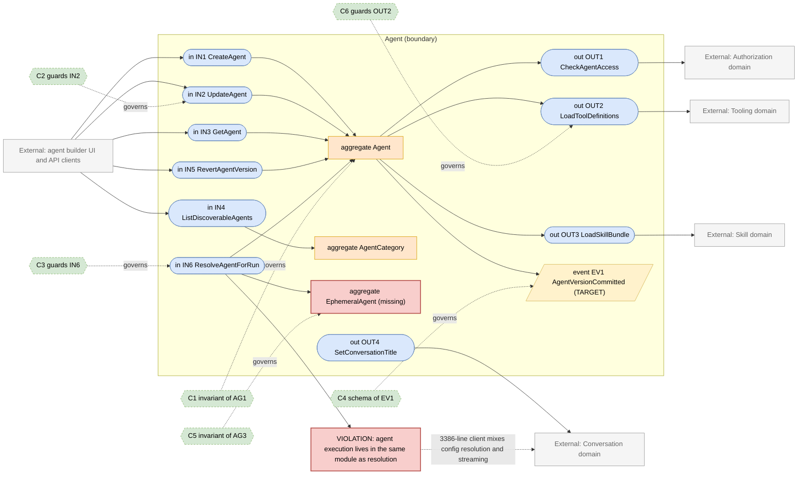
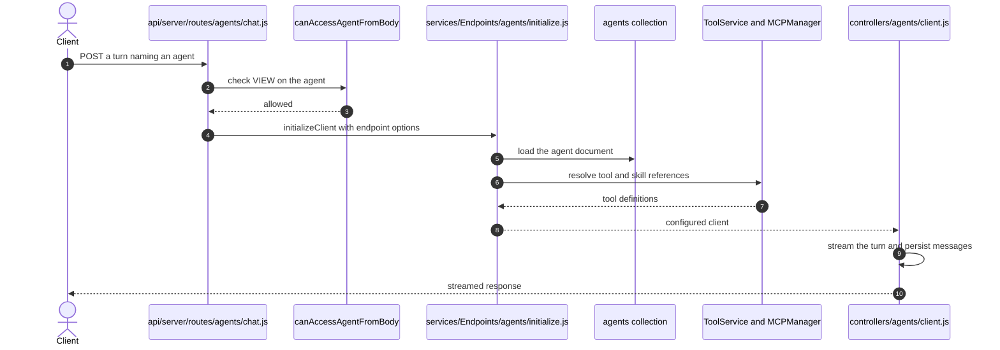

# Agent Domain

> **Responsibility:** Define, version, share, and resolve agents — the named configurations of provider, model, instructions, tools, skills, and files that a chat turn executes against.
> **Confidence:** firm on the aggregate, provisional on the boundary — agent definition and agent execution are entangled in the same files, so where the domain ends is currently a judgement call.
> **Owns the motivating feature/change:** no

Notation legend: see `references/diagram-and-grammar.md` in the DomainMap skill. Every ID drawn in section 2 is defined in section 3, one to one.

## 1. Ubiquitous language

| Term | Kind | Meaning | Source (path) |
|---|---|---|---|
| Agent | aggregate root | A named provider, model, instruction, tool, and skill configuration | packages/data-schemas/src/schema/agent.ts |
| AgentVersion | entity | A prior snapshot of an agent's configuration | packages/data-schemas/src/methods/agent.ts |
| AgentCategory | entity | Marketplace grouping for discoverable agents | packages/data-schemas/src/schema/agentCategory.ts |
| AgentApiKey | entity | Programmatic credential scoped to one agent | packages/data-schemas/src/schema/agentApiKey.ts |
| EphemeralAgent | value object | An agent assembled from request options rather than persisted | api/server/services/Endpoints/agents/initialize.js |
| ModelParameters | value object | Temperature, max tokens, and provider-specific settings | packages/data-schemas/src/schema/agent.ts |
| ToolRef | value object | An identifier naming a structured tool or an MCP server tool | api/server/services/ToolService.js |
| SkillRef | value object | An identifier naming a skill the agent may load | packages/api/src/skills/index.ts |

```ebnf
(* 3a — vocabulary *)
AgentId        = "agent_" , identifier ;
Provider       = "openai" | "anthropic" | "google" | "bedrock" | "azureOpenAI" | customEndpointName ;
ToolRef        = toolName | ( serverName , "_" , toolName ) ;
SkillRef       = skillName ;
AgentSource    = "persisted" | "ephemeral" ;
ModelParameters = { parameterName , parameterValue } ;
```

## 2. Interface & Contract Boundary Map



## 3. Grammar

```ebnf
(* 3b — interface signatures, from api/server/controllers/agents/v1.js,
   packages/api/src/agents/discovery.ts and api/server/services/Endpoints/agents/initialize.js *)
IN1_CreateAgent = "createAgent" , "(" , userId , "," , name , "," , Provider , "," , model , "," , [ instructions ] , "," , { ToolRef } , "," , { SkillRef } , ")"
                , "->" , ( Agent | ValidationRejected ) ;
IN2_UpdateAgent = "updateAgent" , "(" , AgentId , "," , userId , "," , mutableFields , ")"
                , "->" , ( Agent | Forbidden | ValidationRejected ) ;
IN3_GetAgent    = "getAgent" , "(" , AgentId , "," , userId , ")"
                , "->" , ( Agent | Forbidden | NotFound ) ;
IN4_ListDiscoverableAgents = "listDiscoverableAgents" , "(" , userId , "," , [ categoryId ] , "," , [ cursor ] , ")"
                , "->" , AgentPage ;
IN5_RevertAgentVersion = "revertAgentVersion" , "(" , AgentId , "," , userId , "," , versionIndex , ")"
                , "->" , ( Agent | Forbidden ) ;
IN6_ResolveAgentForRun = "resolveAgent" , "(" , requestOptions , "," , userId , ")"
                , "->" , ( ResolvedAgent | Forbidden ) ;

OUT1_CheckAgentAccess = "checkPermission" , "(" , userId , "," , "agent" , "," , AgentId , "," , requiredPermission , ")"
                , "->" , boolean ;
OUT2_LoadToolDefinitions = "loadTools" , "(" , { ToolRef } , "," , userId , ")"
                , "->" , ( { ToolDefinition } | ToolsUnavailable ) ;
OUT3_LoadSkillBundle = "loadSkills" , "(" , { SkillRef } , "," , userId , ")"
                , "->" , ( SkillBundle | SkillUnavailable ) ;
OUT4_SetConversationTitle = "setTitle" , "(" , conversationId , "," , title , ")"
                , "->" , ( Applied | NotFound ) ;

(* 3c — event schemas *)
EV1_AgentVersionCommitted = "AgentVersionCommitted" , "{" , agentId , "," , versionIndex , "," , changedBy , "," , changedFields , "," , occurredAt , "}" ;

(* 3d — contracts *)
C1 = governs AG1
     invariant provider exists
     invariant model exists
     invariant every ToolRef resolves to an available tool or the agent is unusable
     invariant versions is append only ;

C2 = governs IN2
     requires  caller holds EDIT on the agent
     ensures   the prior configuration is appended to versions
     ensures   EV1 published ;

C3 = governs IN6
     requires  caller holds VIEW on a persisted agent
     ensures   an ephemeral agent inherits only tools the caller may use
     ensures   a resumed run resolves the same agent the run paused on ;

C4 = governs EV1
     schema { agentId, versionIndex, changedBy, changedFields, occurredAt } ;

C5 = governs AG3
     invariant an ephemeral agent is never persisted
     invariant its tool set is derived from request options and the caller's grants only ;

C6 = governs OUT2
     requires  every requested ToolRef is known
     ensures   an unavailable expected tool fails the run rather than silently dropping ;

(* 3e — aggregate composition *)
AG1_Agent = AgentId , name , Provider , model , [ instructions ] , ModelParameters , { ToolRef } , { SkillRef } , { AgentVersion } ;
AG2_AgentCategory = categoryId , label , { AgentId } ;
AG3_EphemeralAgent = Provider , model , ModelParameters , { ToolRef } , { SkillRef } ;
```

Target-only rules: `EV1_AgentVersionCommitted` and `C4`. `AG3_EphemeralAgent` is drawn as a gap node because the concept exists in behaviour but has no type or module of its own — it is assembled inline in `api/server/services/Endpoints/agents/initialize.js`.

## 4. Aggregates

### AG1 · Agent
- **Purpose:** the reusable, shareable configuration a run executes against.
- **Root / boundary:** `agent` document keyed by `id`, including its embedded version history.
- **Invariants enforced** (contract): C1 — provider and model presence are schema-required; version append is enforced in `packages/data-schemas/src/methods/agent.ts`.
- **Invariants leaking / unguarded:** tool availability is validated at run time in `api/server/services/Endpoints/agents/initialize.js` rather than at save time, so an agent can be persisted referencing tools that no longer exist. Skill references are validated in a third place, `api/server/services/Endpoints/agents/skillDeps.js`.
- **Status:** aggregate — the strongest one in the codebase, with real invariants and versioning, but its referential invariants leak into the initialise path.

### AG2 · AgentCategory
- **Purpose:** organise discoverable agents for the marketplace listing.
- **Root / boundary:** `agentCategory` document; membership is derived from agent fields.
- **Invariants enforced** (contract): C1 covers agent-side validity; category membership itself has no invariant.
- **Invariants leaking / unguarded:** categories are seeded at boot by `ensureDefaultCategories` in `api/models/index.js`, so category identity depends on boot order rather than on the aggregate.
- **Status:** anemic — a lookup table with no behaviour.

### AG3 · EphemeralAgent (missing)
- **Purpose:** represent an agent assembled from request options for a one-off turn.
- **Root / boundary:** none — the concept is spread across request-body parsing, `buildEndpointOption`, and the resume-context replay in `api/server/routes/agents/chat.js`.
- **Invariants enforced** (contract): C5 — target only.
- **Invariants leaking / unguarded:** the resume path in `api/server/routes/agents/chat.js` has to reconstruct model parameters by hand precisely because there is no ephemeral-agent type to serialise; the comment there records that omitting this makes a continuation run with defaults.
- **Status:** missing — drawn as a gap node and defined in the grammar so the map stays complete.

## 5. Logic placement

| Logic | Current location (path) | Verdict | Target location |
|---|---|---|---|
| Agent create, update, version | packages/data-schemas/src/methods/agent.ts | correct | Agent |
| Agent HTTP surface | api/server/controllers/agents/v1.js (1577 lines) | misplaced: request handling, validation, and permission grants in one controller | Agent domain service behind a thin controller |
| Marketplace discovery and filtering | packages/api/src/agents/discovery.ts | correct | Agent |
| Ephemeral agent assembly | api/server/services/Endpoints/agents/initialize.js (1095 lines) | misplaced: resolution, tool loading, and provider wiring in one function | Agent resolution behind IN6 |
| Agent run execution and streaming | api/server/controllers/agents/client.js (3386 lines) | misplaced: execution belongs to Run Orchestration, not agent definition | Run Orchestration |
| Skill dependency resolution | api/server/services/Endpoints/agents/skillDeps.js | misplaced: Agent re-derives Skill domain rules | Skill, called through OUT3 |
| Conversation title generation | api/server/services/Endpoints/agents/title.js | misplaced: writes another domain's aggregate | Conversation, called through OUT4 |
| Agent avatar handling | packages/api/src/agents/avatars.ts | correct | Agent, delegating storage to File |
| Agent tool authorization filter | api/server/controllers/agents/filterAuthorizedTools.spec.js subject | correct | Agent |
| Token usage recording for a run | packages/api/src/agents/usage.ts | misplaced: Billing rules computed inside the Agent package | Billing, called from Run Orchestration |

## 6. Representative flow



- **Coupling points:** `initialize.js` reaches into Tooling and Skill directly rather than through a port, and the same function both resolves configuration and constructs the executing client. `client.js` then writes Conversation-owned collections. Three domains are crossed inside one call chain with no interface between them.
- **Hidden dependencies:** the resolved agent is mutated in place as it passes through initialisation, so later stages depend on earlier ones having run; ephemeral-agent parameters are reconstructed from the request body by a rest-spread in `buildOptions`, which is why the resume path has to replay them explicitly; tool availability depends on process-wide MCP connection state held in `packages/api/src/mcp/MCPManager.ts`.

## 7. Integration & ownership

| Talks to | Mechanism | Direction | Notes |
|---|---|---|---|
| Authorization | direct call from route middleware and controller | Agent to Authorization | every read and write is gated |
| Tooling | direct call during initialisation | Agent to Tooling | should be a port, currently reaches into MCP internals |
| Skill | direct call in skillDeps.js | Agent to Skill | Agent re-derives Skill rules |
| Conversation | direct write of the conversation title | Agent to Conversation | crosses into another aggregate |
| Run Orchestration | shared module — execution lives in the Agent controller tree | entangled | the largest structural gap here |
| File | direct call for avatars and attachments | Agent to File | id-based, acceptable |
| Billing | direct call to record usage | Agent to Billing | via packages/api/src/agents/usage.ts |
| Configuration | direct call for endpoint and model availability | Agent to Configuration | read-only |

- **Data this domain OWNS:** `agents`, `agentcategories`, `agentapikeys`, and the embedded version history.
- **Data it only READS (owned elsewhere):** `aclentries` (Authorization), `mcpservers` and `actions` (Tooling), `skills` (Skill), `files` (File), app configuration (Configuration).

## 8. Gaps & risks

| Gap | Evidence (path) | Severity | Target remedy |
|---|---|---|---|
| Agent execution and agent definition share a module tree | api/server/controllers/agents/client.js (3386 lines) | high | Split execution into Run Orchestration, leaving resolution here |
| Ephemeral agent has no type, so resume must hand-replay parameters | api/server/routes/agents/chat.js resume context handling | high | Introduce an explicit ephemeral-agent value object |
| Tool references are validated at run time, not save time | api/server/services/Endpoints/agents/initialize.js | med | Validate on IN1 and IN2 against the Tooling port |
| Skill dependency rules re-derived inside Agent | api/server/services/Endpoints/agents/skillDeps.js | med | Delegate to the Skill domain through OUT3 |
| Agent writes the conversation title directly | api/server/services/Endpoints/agents/title.js | med | Return the title, let Conversation apply it |
| Billing computation lives in the Agent package | packages/api/src/agents/usage.ts | med | Move the pricing computation into Billing |
| Controller carries validation and permission-granting logic | api/server/controllers/agents/v1.js | low | Thin the controller down to transport concerns |
| Category identity depends on boot seeding | api/models/index.js ensureDefaultCategories | low | Make categories a configuration-owned reference set |

## 9. Target design

N/A — the motivating change is owned by `authorization.domain.md`. The `EV1` rule above marks a target event this domain will need once agent-version changes must invalidate caches in Tooling and Skill.

## 10. Incremental refactor plan

1. Extract an `EphemeralAgent` type in `packages/api/src/agents` and have `buildEndpointOption` produce it, so the resume path serialises one object instead of replaying scattered fields. Behavior-preserving.
2. Introduce a tool-availability port in `packages/api/src/agents` wrapping the current Tooling reach-in, with no behaviour change.
3. Call that port from `IN1` and `IN2` at save time to reject agents referencing unknown tools, keeping run-time validation in place as a backstop.
4. Change `api/server/services/Endpoints/agents/title.js` to return a title rather than write it, and have the Conversation domain apply it.
5. Move the usage computation from `packages/api/src/agents/usage.ts` into the Billing domain, leaving a call at the same site.
6. Split streaming and persistence out of `api/server/controllers/agents/client.js` into Run Orchestration, one responsibility at a time, starting with the persistence calls.
7. Delegate `skillDeps.js` resolution to the Skill domain through `OUT3` and delete the local re-derivation.
8. Publish `AgentVersionCommitted` on update and revert, once a consumer exists.

## 11. Transition validation

| Principle | Result | Justification |
|---|---|---|
| Reduces coupling | pass | Tool and skill reach-ins become ports; the title write and usage computation move to their owners. |
| Clarifies ownership | pass | Agent keeps definition and resolution; execution, titles, and pricing move to the domains that own them. |
| Reinforces a boundary | pass | The ephemeral-agent type and the tool-availability port are both new boundaries where none existed. |
| Avoids spreading legacy | pass | Run-time validation is retained as a backstop rather than duplicated; no new cross-domain writes are added. |

## 12. Required changes

- **Modify:** `api/server/services/Endpoints/agents/initialize.js`, `api/server/services/Endpoints/agents/title.js`, `api/server/services/Endpoints/agents/skillDeps.js`, `api/server/controllers/agents/v1.js`, `api/server/controllers/agents/client.js`, `packages/api/src/agents/usage.ts`.
- **Introduce:** an `EphemeralAgent` value object; a tool-availability port; a skill-bundle port; an agent-version-committed event publisher.
- **Refactor:** move streaming and persistence out of the agent client into Run Orchestration; move usage pricing into Billing; convert title generation from a write into a return value.
- **Debt consciously accepted:** the embedded `versions` array stays on the agent document rather than becoming its own collection. It is bounded in practice and extracting it would require a migration with no current behavioural need. The marketplace category table also stays boot-seeded; moving it into configuration is cosmetic relative to the execution split.

Consistency checklist run: every diagram ID resolves to a grammar rule and back; every contract names a defined target; each gap-classed node appears in section 8; target-only rules are marked; no application code in this file.
