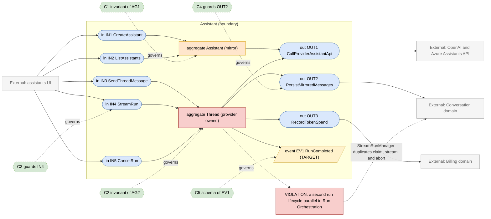
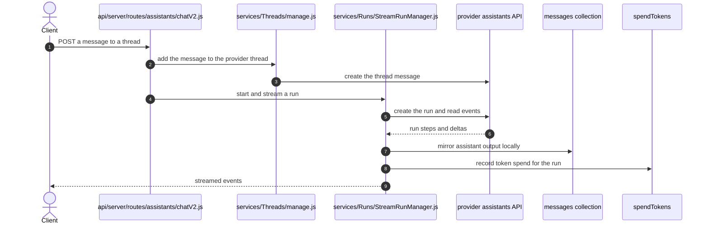

# Assistant Domain

> **Responsibility:** Run conversations against provider-hosted assistant runtimes — OpenAI and Azure Assistants, their threads, runs, and hosted file and tool resources — where the provider, not this system, owns the execution state.
> **Confidence:** provisional — this is a legacy runtime kept alongside the Agent domain. Its boundary is clear in the code but its future is not, so several judgements here are shaped by it being a deprecation candidate rather than a growth area.
> **Owns the motivating feature/change:** no

Notation legend: see `references/diagram-and-grammar.md` in the DomainMap skill. Every ID drawn in section 2 is defined in section 3, one to one.

## 1. Ubiquitous language

| Term | Kind | Meaning | Source (path) |
|---|---|---|---|
| Assistant | aggregate root | A provider-hosted assistant definition mirrored locally | packages/data-schemas/src/schema/assistant.ts |
| Thread | aggregate root | A provider-hosted conversation, mirrored into local messages | api/server/services/Threads/manage.js |
| Run | entity | One provider-side execution over a thread | api/server/services/Runs/RunManager.js |
| RunStep | entity | A provider-reported stage inside a run | api/server/services/Runs/handle.js |
| AssistantVersion | value object | Whether the v1 or v2 provider API shape is in use | api/server/routes/assistants/v1.js and v2.js |
| HostedFile | value object | A file whose bytes live with the provider rather than locally | api/server/services/Files/OpenAI |
| AssistantAction | value object | An OpenAPI action exposed to the provider as a function tool | api/server/routes/assistants/actions.js |

```ebnf
(* 3a — vocabulary *)
AssistantVersion = "v1" | "v2" ;
RunStatus     = "queued" | "in_progress" | "requires_action" | "completed" | "failed" | "cancelled" | "expired" ;
ThreadOrigin  = "provider" ;
HostedFileRef = providerFileId ;
```

## 2. Interface & Contract Boundary Map



## 3. Grammar

```ebnf
(* 3b — interface signatures, from api/server/routes/assistants and
   api/server/services/AssistantService.js, Threads/manage.js, Runs *)
IN1_CreateAssistant = "createAssistant" , "(" , userId , "," , AssistantVersion , "," , definition , ")"
                    , "->" , ( Assistant | ProviderError ) ;
IN2_ListAssistants  = "listAssistants" , "(" , userId , "," , AssistantVersion , ")"
                    , "->" , { Assistant } ;
IN3_SendThreadMessage = "addThreadMessage" , "(" , threadId , "," , userId , "," , content , "," , { HostedFileRef } , ")"
                    , "->" , ( ThreadMessage | ProviderError ) ;
IN4_StreamRun = "streamRun" , "(" , threadId , "," , assistantId , "," , userId , ")"
                    , "->" , RunEventStream ;
IN5_CancelRun = "cancelRun" , "(" , threadId , "," , runId , "," , userId , ")"
                    , "->" , ( Cancelled | RunNotCancellable ) ;

OUT1_CallProviderAssistantApi = "providerCall" , "(" , AssistantVersion , "," , operation , "," , payload , ")"
                    , "->" , ( ProviderResponse | ProviderError ) ;
OUT2_PersistMirroredMessages = "recordMessage" , "(" , conversationId , "," , mirroredMessage , ")"
                    , "->" , SavedMessage ;
OUT3_RecordTokenSpend = "spendTokens" , "(" , SpendContext , "," , TokenUsage , ")"
                    , "->" , SpendResult ;

(* 3c — event schemas *)
EV1_RunCompleted = "RunCompleted" , "{" , threadId , "," , runId , "," , status , "," , usage , "," , occurredAt , "}" ;

(* 3d — contracts *)
C1 = governs AG1
     invariant the local mirror never contradicts the provider definition it names
     invariant an assistant names exactly one provider version ;

C2 = governs AG2
     invariant thread state is authoritative at the provider, never locally
     invariant a locally mirrored message corresponds to exactly one provider message
     invariant a run in requires_action state blocks further messages until resolved ;

C3 = governs IN4
     requires  caller owns the thread
     requires  no other run on the thread is active
     ensures   provider run events are mirrored in order
     ensures   an interrupted stream leaves the provider run resumable or cancelled ;

C4 = governs OUT2
     requires  the target conversation belongs to the caller
     ensures   mirrored messages are written through the Conversation domain, not directly ;

C5 = governs EV1
     schema { threadId, runId, status, usage, occurredAt } ;

(* 3e — aggregate composition *)
AG1_Assistant = assistantId , AssistantVersion , ownerRef , definitionMirror , { AssistantAction } ;
AG2_Thread = threadId , providerRef , { Run } , { RunStep } , { HostedFileRef } ;
```

Target-only rules: `EV1_RunCompleted`, `C5`, and the write-through clause of `C4`. `AG2_Thread` is drawn as a gap node because its authoritative state lives at the provider while a partial copy is maintained locally.

## 4. Aggregates

### AG1 · Assistant
- **Purpose:** hold a local handle on a provider-hosted assistant so it can be listed, permissioned, and attached to actions.
- **Root / boundary:** `assistant` document; the provider holds the real definition.
- **Invariants enforced** (contract): C1 — version consistency is enforced by the separate v1 and v2 route trees.
- **Invariants leaking / unguarded:** the mirror is refreshed on read rather than reconciled, so a definition changed directly at the provider diverges silently until the next list.
- **Status:** anemic mirror — a cache of provider state with no independent invariants.

### AG2 · Thread (provider owned)
- **Purpose:** carry a conversation whose execution state belongs to the provider.
- **Root / boundary:** the provider thread; locally, `api/server/services/Threads/manage.js` maintains a message mirror.
- **Invariants enforced** (contract): C2 — enforced partially, by `RunManager` and `StreamRunManager` refusing overlapping runs.
- **Invariants leaking / unguarded:** the mirror writes messages and conversations directly (`recordMessage`, `getMessages`, `saveConvo` are imported at `api/server/services/Threads/manage.js:11`), so this domain writes Conversation-owned collections; spend is charged here too, at `api/server/services/Threads/manage.js:510`.
- **Status:** fragmented — authoritative state at the provider, mirrored state in Conversation's collections, run lifecycle in a manager parallel to Run Orchestration.

## 5. Logic placement

| Logic | Current location (path) | Verdict | Target location |
|---|---|---|---|
| Assistant definition CRUD | api/server/services/AssistantService.js | correct | Assistant |
| Version routing between v1 and v2 | api/server/routes/assistants/v1.js and v2.js | correct | Assistant |
| Thread message mirroring | api/server/services/Threads/manage.js | misplaced: writes Conversation collections directly | Conversation, through OUT2 |
| Run lifecycle and polling | api/server/services/Runs/RunManager.js | duplicated: a second run lifecycle beside Run Orchestration | Assistant, but reusing the shared lifecycle |
| Run streaming | api/server/services/Runs/StreamRunManager.js | duplicated: a second streaming implementation | Run Orchestration |
| Token spend for assistant runs | api/server/services/Threads/manage.js:510 | misplaced: a fourth independent Billing call site | Billing, through one spend port |
| Assistant actions | api/server/routes/assistants/actions.js | duplicated: parallel to the Agent domain's action handling | Tooling |
| Hosted file handling | api/server/services/Files/OpenAI | correct | File, as a storage strategy |
| Abort handling | api/server/middleware/abortRun.js | duplicated: a second abort path beside abortMiddleware | Run Orchestration |

## 6. Representative flow



- **Coupling points:** the flow writes Conversation-owned collections directly and calls Billing directly, and it does both through a run lifecycle that duplicates Run Orchestration's claim, stream, and abort concerns without sharing its code.
- **Hidden dependencies:** authoritative run state lives at the provider, so a lost stream requires polling to recover; the local mirror can diverge from the provider thread with nothing reconciling them; hosted files have provider-side lifetimes independent of the local `files` collection; the v1 and v2 route trees carry near-duplicate logic differing only in provider payload shape.

## 7. Integration & ownership

| Talks to | Mechanism | Direction | Notes |
|---|---|---|---|
| Provider assistants API | network call | Assistant outward | holds the authoritative state |
| Conversation | direct write of messages and conversations | Assistant to Conversation data | a boundary violation, same class as the agent client |
| Billing | direct call to spendTokens | Assistant to Billing | one of five spend sites |
| Run Orchestration | none — a parallel implementation | duplicated | the largest structural gap here |
| File | direct call for hosted file upload | Assistant to File | via the OpenAI strategy |
| Tooling | parallel action handling | duplicated | actions exist in two places |
| Configuration | direct read for endpoint availability | Assistant to Configuration | read-only |

- **Data this domain OWNS:** `assistants`, and the provider-side threads, runs, and hosted files it creates.
- **Data it only READS (owned elsewhere):** `messages` and `conversations` — which it also writes, incorrectly (Conversation), `files` (File), `balances` (Billing), app configuration (Configuration).

## 8. Gaps & risks

| Gap | Evidence (path) | Severity | Target remedy |
|---|---|---|---|
| A complete second run lifecycle parallel to Run Orchestration | api/server/services/Runs/StreamRunManager.js and RunManager.js | high | Reuse the shared generation-job lifecycle, keeping only provider-specific transport |
| Writes Conversation collections directly | api/server/services/Threads/manage.js:11 | high | Route mirrored messages through the Conversation port |
| A fourth independent Billing call site | api/server/services/Threads/manage.js:510 | med | Charge through the single spend port |
| Action handling duplicated with the Agent path | api/server/routes/assistants/actions.js | med | Consolidate on the Tooling domain |
| A second abort path | api/server/middleware/abortRun.js | med | Fold into the shared abort handling |
| Near-duplicate v1 and v2 route trees | api/server/routes/assistants/v1.js and v2.js | low | Share the handler, vary only the payload adapter |
| Local mirror can diverge from provider state with no reconciliation | api/server/services/Threads/manage.js | low | Reconcile on read, or accept and document the staleness |

## 9. Target design

N/A — the motivating change is owned by `authorization.domain.md`. Because this runtime is a deprecation candidate, the plan below is deliberately limited to removing duplication that costs the rest of the system, not to modernising the runtime.

## 10. Incremental refactor plan

1. Route mirrored message writes through the Conversation persistence port introduced in step 1 of `conversation.domain.md`, replacing the direct `recordMessage` and `saveConvo` imports. Behavior-preserving.
2. Charge token spend through the single Billing port rather than calling `spendTokens` directly.
3. Share the payload-independent parts of the v1 and v2 route trees, leaving only an adapter per version.
4. Fold `api/server/middleware/abortRun.js` into the shared abort path.
5. Consolidate assistant actions onto the Tooling domain's action handling.
6. Publish `RunCompleted` so downstream consumers stop polling the mirror.
7. Only if the runtime is retained beyond the current deprecation window, replace `StreamRunManager` with the shared generation-job lifecycle plus a provider-specific transport.

## 11. Transition validation

| Principle | Result | Justification |
|---|---|---|
| Reduces coupling | pass | Direct Conversation writes and a direct Billing call are both replaced by ports; two duplicate paths are removed. |
| Clarifies ownership | pass | Message persistence returns to Conversation, spend to Billing, actions to Tooling. |
| Reinforces a boundary | pass | Each step routes an existing cross-domain write through a named port instead of a direct import. |
| Avoids spreading legacy | pass | Nothing new is built on this runtime; the plan only removes duplication, and the largest change is explicitly conditional on the runtime being retained. |

## 12. Required changes

- **Modify:** `api/server/services/Threads/manage.js`, `api/server/services/Runs/StreamRunManager.js`, `api/server/routes/assistants/v1.js`, `api/server/routes/assistants/v2.js`, `api/server/routes/assistants/actions.js`, `api/server/middleware/abortRun.js`.
- **Introduce:** a run-completed event publisher; a per-version payload adapter shared by the two route trees.
- **Refactor:** replace direct Conversation writes and Billing calls with ports; fold the second abort path into the shared one; consolidate action handling onto Tooling.
- **Debt consciously accepted:** the parallel run lifecycle stays in place unless the runtime outlives its deprecation window. Rewriting it onto the shared generation-job lifecycle is a large change to a path that is scheduled to be removed, and the duplication is contained within this domain. The local mirror's potential divergence from provider state is likewise accepted and documented rather than reconciled, because the provider remains authoritative and the mirror exists only for local listing and search.

Consistency checklist run: every diagram ID resolves to a grammar rule and back; every contract names a defined target; each gap-classed node appears in section 8; target-only rules are marked; no application code in this file.
