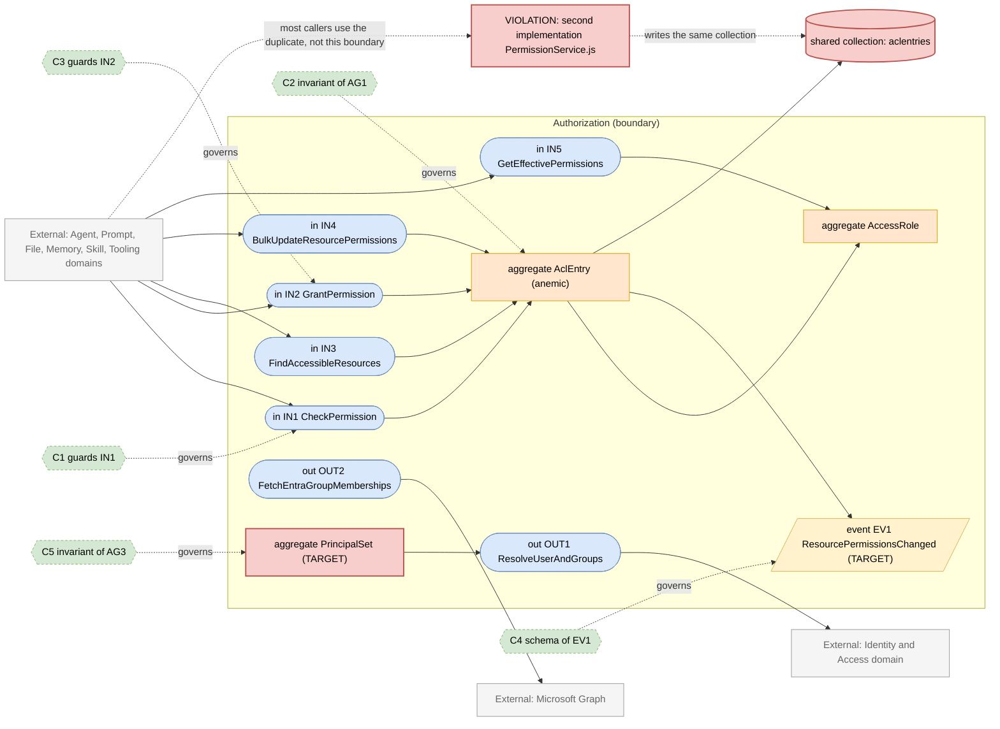
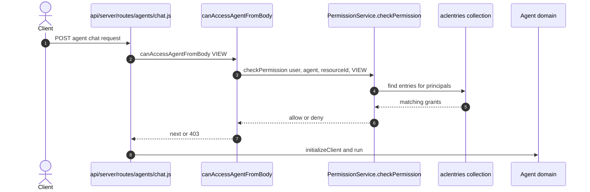
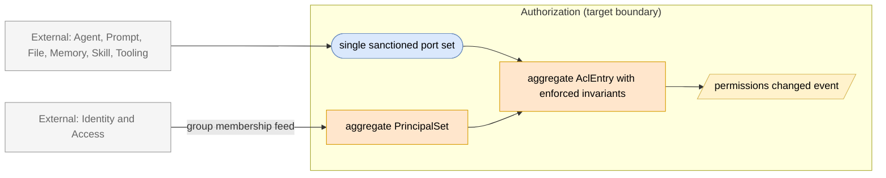

# Authorization Domain

> **Responsibility:** Decide and record who may do what to which resource — ACL grants, access roles, principal resolution (user / group / public / role), and effective-permission answers for every other domain.
> **Confidence:** firm — the vocabulary (`aclEntry`, `accessRole`, `PrincipalType`, `PermissionBits`) is explicit and consistent; the ambiguity is *implementation location*, not concept.
> **Owns the motivating feature/change:** yes — consolidating the two parallel authorization implementations behind one owning boundary.

Notation legend: see `references/diagram-and-grammar.md` in the DomainMap skill. Every `IN/OUT/EV/C/AG` ID drawn in section 2 is defined in section 3, one to one.

## 1. Ubiquitous language

| Term | Kind | Meaning | Source (path) |
|---|---|---|---|
| AclEntry | aggregate root (anemic) | One grant: principal + resource + permission bits, optionally role-derived | packages/data-schemas/src/schema/aclEntry.ts |
| AccessRole | aggregate root | Named bundle of permission bits per resource type (viewer / editor / owner) | packages/data-schemas/src/schema/accessRole.ts |
| Principal | value object | Who a grant is for — user, group, public, or platform role | packages/api/src/types/principal.ts |
| PrincipalType | value object | Enum: USER, GROUP, PUBLIC, ROLE | packages/data-provider/src/accessPermissions.ts |
| PermissionBits | value object | Bitmask: VIEW, EDIT, DELETE, SHARE | packages/data-provider/src/accessPermissions.ts |
| ResourceType | value object | Agent, promptGroup, file, memory, mcpServer, skill | packages/data-provider/src/accessPermissions.ts |
| Group | entity | Collection of user principals, optionally mirrored from Entra ID | packages/data-schemas/src/schema/group.ts |
| SystemGrant | entity | Platform-level grant seeded at boot rather than user-granted | packages/data-schemas/src/schema/systemGrant.ts |
| Role | entity | Platform role carrying feature permissions (distinct from AccessRole) | packages/data-schemas/src/schema/role.ts |

```ebnf
(* 3a — vocabulary *)
PrincipalType = "USER" | "GROUP" | "PUBLIC" | "ROLE" ;
PermissionBit = "VIEW" | "EDIT" | "DELETE" | "SHARE" ;
PermissionBits = PermissionBit , { PermissionBit } ;
ResourceType  = "agent" | "promptGroup" | "file" | "memory" | "mcpServer" | "skill" ;
Principal     = PrincipalType , [ principalId ] ;
AccessRoleId  = "agent_viewer" | "agent_editor" | "agent_owner" | otherRoleId ;
```

## 2. Interface & Contract Boundary Map



## 3. Grammar

```ebnf
(* 3b — interface signatures. Present-day shapes taken from
   packages/api/src/acl/accessControlService.ts and api/server/services/PermissionService.js *)
IN1_CheckPermission = "checkPermission" , "(" , userId , "," , role , "," , ResourceType , "," , resourceId , "," , requiredPermission , ")"
                    , "->" , boolean ;
IN2_GrantPermission = "grantPermission" , "(" , Principal , "," , ResourceType , "," , resourceId , "," , AccessRoleId , "," , grantedBy , [ "," , expiredAt ] , ")"
                    , "->" , ( AclEntry | null ) ;
IN3_FindAccessibleResources = "findAccessibleResources" , "(" , userId , "," , role , "," , ResourceType , "," , PermissionBits , ")"
                    , "->" , { resourceId } ;
IN4_BulkUpdateResourcePermissions = "bulkUpdateResourcePermissions" , "(" , ResourceType , "," , resourceId , "," , { PrincipalGrant } , ")"
                    , "->" , ( GrantSummary | ValidationError ) ;
IN5_GetEffectivePermissions = "getEffectivePermissions" , "(" , userId , "," , role , "," , ResourceType , "," , resourceId , ")"
                    , "->" , PermissionBits ;

OUT1_ResolveUserAndGroups = "getUserPrincipals" , "(" , userId , "," , role , ")"
                    , "->" , { Principal } ;
OUT2_FetchEntraGroupMemberships = "syncUserEntraGroupMemberships" , "(" , user , "," , accessToken , ")"
                    , "->" , ( GroupMembershipSet | GraphError ) ;

(* 3c — event schemas *)
EV1_ResourcePermissionsChanged = "ResourcePermissionsChanged" , "{" , resourceType , "," , resourceId , "," , changedBy , "," , addedPrincipals , "," , removedPrincipals , "," , occurredAt , "}" ;

(* 3d — contracts *)
C1 = governs IN1
     requires  userId exists
     requires  resourceType in ResourceType
     ensures   result is boolean
     invariant no caller reads aclentries directly ;

C2 = governs AG1
     invariant principalType in PrincipalType
     invariant principalId exists when principalType != "PUBLIC"
     invariant permBits is subset of PermissionBits
     invariant tenantId scopes every read and write ;

C3 = governs IN2
     requires  accessRoleId exists for resourceType
     requires  principal exists
     ensures   AclEntry upserted for principal and resource
     ensures   EV1 published ;

C4 = governs EV1
     schema { resourceType, resourceId, changedBy, addedPrincipals, removedPrincipals, occurredAt } ;

C5 = governs AG3
     invariant principal cache is derived only from Identity
     invariant expired group memberships never widen access ;

(* 3e — aggregate composition *)
AG1_AclEntry = principalType , [ principalId ] , resourceType , resourceId , permBits , [ roleId ] , grantedBy , [ expiredAt ] ;
AG2_AccessRole = accessRoleId , resourceType , permBits , name ;
AG3_PrincipalSet = userPrincipal , { groupPrincipal } , [ rolePrincipal ] , publicPrincipal ;
```

Target-only rules: `EV1_ResourcePermissionsChanged`, `C4`, `AG3_PrincipalSet`, and `C5` describe the target. Today no permission-change event exists and principal resolution is an ad-hoc cache read inside `packages/api/src/acl/accessControlService.ts` plus a re-implementation in `api/server/services/PermissionService.js`.

## 4. Aggregates

### AG1 · AclEntry
- **Purpose:** the single record of a grant, and the only place effective access is derivable from.
- **Root / boundary:** `aclEntry` document; consistency boundary is one principal-resource pair.
- **Invariants enforced** (contract): C2 — principal type validity, tenant scoping, bit subset.
- **Invariants leaking / unguarded:** grant creation is validated in two places with different code — `api/server/services/PermissionService.js:66` (`grantPermission`) and `packages/api/src/acl/accessControlService.ts:38` (`grantPermission`). `ensurePrincipalExists` at `api/server/services/PermissionService.js:319` exists only in the JS copy, so grants made through the TS path do not get the same principal materialisation.
- **Status:** anemic — the schema is a data bag, all invariants live in service functions outside it, and those functions are duplicated.

### AG2 · AccessRole
- **Purpose:** name a bit bundle so callers grant `agent_editor` rather than raw bits.
- **Root / boundary:** `accessRole` document keyed by `accessRoleId`.
- **Invariants enforced** (contract): C2 constrains the bits an entry may carry to a defined role bundle.
- **Invariants leaking / unguarded:** roles are seeded at boot from `api/models/index.js` (`seedDefaultRoles`), so a mis-seeded environment silently changes everyone's effective access with no invariant check.
- **Status:** aggregate — small, coherent, correctly owned.

### AG3 · PrincipalSet (target)
- **Purpose:** the resolved set of principals a request acts as; every permission answer is a function of it.
- **Root / boundary:** does not exist as a persisted or modelled concept today.
- **Invariants enforced** (contract): C5 — target only.
- **Invariants leaking / unguarded:** principal resolution is currently split between `getUserPrincipals` in `packages/api/src/acl/accessControlService.ts` (cache-backed) and the Entra sync path at `api/server/services/PermissionService.js:508`, which writes group membership as a side effect of an authentication flow.
- **Status:** missing — drawn as a gap node; introduced by the target design in section 9.

## 5. Logic placement

| Logic | Current location (path) | Verdict | Target location |
|---|---|---|---|
| Grant a role-based permission | api/server/services/PermissionService.js:66 and packages/api/src/acl/accessControlService.ts:38 | duplicated: two implementations of the same rule over the same collection | Authorization, single TS implementation |
| Check a permission | api/server/services/PermissionService.js:143 and packages/api/src/acl/accessControlService.ts | duplicated | Authorization |
| Find accessible resources | api/server/services/PermissionService.js:245 and packages/api/src/acl/accessControlService.ts | duplicated | Authorization |
| Principal materialisation | api/server/services/PermissionService.js:319 | misplaced: only in the JS copy, so the TS path skips it | Authorization |
| Entra group membership sync | api/server/services/PermissionService.js:508 | misplaced: identity-provider integration inside the authorization service | Identity and Access, publishing to Authorization |
| Resource-access route guard | api/server/middleware/accessResources/canAccessResource.js | correct | Authorization (as published middleware) |
| Agent-specific access guard | api/server/middleware/accessResources/canAccessAgentFromBody.js | correct | Authorization |
| File-permission helpers | api/server/services/Files/permissions.js | misplaced: File domain re-derives ACL semantics | File calls Authorization IN1 or IN3 |
| Shared-link access check | packages/api/src/shared-links/access.ts | correct | Conversation calling Authorization |
| Skill grant handling | packages/api/src/skills/handlers.ts | misplaced: imports PermissionService rather than the TS boundary | Authorization |

## 6. Representative flow



- **Coupling points:** the guard at `api/server/middleware/accessResources/canAccessAgentFromBody.js` imports the JS `PermissionService` directly, while `packages/api/src/shared-links/access.ts` and `packages/api/src/mcp/registry/db/ServerConfigsDB.ts` import the TS `AccessControlService`. Two callers of the same rule reach two different code paths.
- **Hidden dependencies:** the `aclentries` collection is the implicit shared contract between the two implementations; `applyTenantIsolation` in `packages/data-schemas/src/models/aclEntry.ts` silently scopes every query by tenant, so an unset tenant context changes results without any caller seeing it; principal resolution reads a process-local cache (`userPrincipalsCache`) that is not invalidated by the Entra sync path.

## 7. Integration & ownership

| Talks to | Mechanism | Direction | Notes |
|---|---|---|---|
| Agent | direct call from route middleware | Agent to Authorization | every agent read and write is gated here |
| Prompt | direct call in api/server/routes/prompts.js | Prompt to Authorization | prompt groups are ACL resources |
| File | direct call in api/server/services/Files/permissions.js | File to Authorization | plus File-local re-derivation of the same semantics |
| Memory | direct call in api/server/routes/memories.js | Memory to Authorization | uses `findAccessibleResources` |
| Skill | direct call in packages/api/src/skills/handlers.ts | Skill to Authorization | crosses the workspace boundary into api/ JS |
| Tooling (MCP) | direct call in packages/api/src/mcp/registry/db/ServerConfigsDB.ts | Tooling to Authorization | uses the TS implementation |
| Identity and Access | direct call, plus shared write of group documents | both directions | Entra sync lives on the wrong side |
| Conversation | direct call in packages/api/src/shared-links/access.ts | Conversation to Authorization | shared-link visibility |

- **Data this domain OWNS:** `aclentries`, `accessroles`, `systemgrants`, and the group-membership projection used for principals.
- **Data it only READS (owned elsewhere):** `users` and `roles` (Identity and Access), the resource documents themselves (Agent, Prompt, File, Memory, Skill, Tooling).

## 8. Gaps & risks

| Gap | Evidence (path) | Severity | Target remedy |
|---|---|---|---|
| Two independent implementations of the same authorization rules over one collection | api/server/services/PermissionService.js (986 lines) and packages/api/src/acl/accessControlService.ts (431 lines) | high | Make the TS service the only implementation; reduce the JS file to a re-export shim |
| Principal materialisation exists in only one of the two paths | api/server/services/PermissionService.js:319 | high | Move `ensurePrincipalExists` into the TS service before consolidating |
| Identity-provider group sync embedded in the authorization service | api/server/services/PermissionService.js:508 | high | Move to Identity and Access; deliver memberships to Authorization through an explicit port |
| No event when permissions change; caches and consumers cannot invalidate | no publisher exists for `aclentries` writes | med | Publish EV1 on grant, revoke, and bulk update |
| File domain re-derives ACL semantics locally | api/server/services/Files/permissions.js | med | Replace with calls to IN1 and IN3 |
| Tenant scoping is an implicit schema plugin, not a stated contract | packages/data-schemas/src/models/plugins/tenantIsolation.ts | med | State tenant scope in C2 and assert it at the boundary |
| Two role concepts share the word "role" (platform Role vs AccessRole) | packages/data-schemas/src/schema/role.ts and accessRole.ts | low | Rename in the ubiquitous language; keep both, disambiguate at the interface |

## 9. Target design

- **Placement decision:** extend this domain rather than introduce a new boundary. The concepts, collections, and vocabulary already exist and are coherent; what is missing is a single owner. Introducing a new module would create a third implementation of the same rules.
- **Target interfaces:** `IN1`, `IN2`, `IN3`, `IN4`, and `IN5` become the only sanctioned entry points, exported from `packages/api/src/acl`. `OUT1` becomes an explicit port onto Identity and Access instead of an in-service cache read. `OUT2` moves out of this domain entirely and becomes an inbound feed from Identity and Access.
- **Aggregates / services involved:** `AG1_AclEntry` gains its invariants back by routing every write through the domain service; `AG2_AccessRole` is unchanged; `AG3_PrincipalSet` is introduced as a first-class in-memory aggregate so principal resolution has one definition and one cache-invalidation rule. The domain service is the existing `AccessControlService` class, extended with `ensurePrincipalExists` and `bulkUpdateResourcePermissions` lifted from the JS copy.
- **Events to emit / consume:** emit `EV1_ResourcePermissionsChanged` on every grant, revoke, and bulk update so principal and resource caches invalidate without cross-domain reach-in. Consume a group-membership-changed feed from Identity and Access in place of calling Microsoft Graph directly.



## 10. Incremental refactor plan

1. Port `ensurePrincipalExists`, `ensureGroupPrincipalExists`, and `bulkUpdateResourcePermissions` from `api/server/services/PermissionService.js` into `packages/api/src/acl/accessControlService.ts`, with parity tests against the existing specs. Behavior-preserving, ships alone.
2. Replace the body of `api/server/services/PermissionService.js` with delegation to the TS service, keeping its exact export surface so no caller changes. Ships alone; the JS file becomes a shim.
3. Move `syncUserEntraGroupMemberships` and `performEntraGroupMembershipSync` to the Identity and Access domain, leaving Authorization to consume the resulting membership set through `OUT1`. Ships alone.
4. Introduce `PrincipalSet` as an explicit type with one resolution function and one cache key, replacing the ad-hoc `userPrincipalsCache` reads. Ships alone.
5. Publish `ResourcePermissionsChanged` from the TS service on grant, revoke, and bulk update. No consumer yet; the event is additive and ships alone.
6. Subscribe the principal and resource caches to that event, deleting time-based invalidation. Ships alone.
7. Replace `api/server/services/Files/permissions.js` ACL derivation with calls to `IN1` and `IN3`. Ships alone, File domain only.
8. Delete the JS shim once no importer remains, converting the remaining `require` sites to the package import.

## 11. Transition validation

| Principle | Result | Justification |
|---|---|---|
| Reduces coupling | pass | Ten call sites that reach two different implementations converge on one port set; the File domain stops re-deriving ACL rules. |
| Clarifies ownership | pass | `aclentries` gets exactly one writer; identity-provider sync moves to the domain that owns identity. |
| Reinforces a boundary | pass | The sanctioned port set becomes the only sanctioned entry, and `PrincipalSet` gives principal resolution a named home instead of a cache read. |
| Avoids spreading legacy | pass | No new shared-collection access and no new cross-domain reach-in are introduced; each step either deletes a duplicate or moves logic toward its owner. |

## 12. Required changes

- **Modify:** `packages/api/src/acl/accessControlService.ts`, `api/server/services/PermissionService.js`, `api/server/middleware/accessResources/canAccessResource.js`, `api/server/services/Files/permissions.js`, `packages/api/src/skills/handlers.ts`, `packages/data-schemas/src/methods/aclEntry.ts`.
- **Introduce:** a `PrincipalSet` type and resolver in `packages/api/src/acl`; a permissions-changed event published by the domain service; an inbound group-membership port replacing the direct Microsoft Graph call.
- **Refactor:** lift principal materialisation and bulk permission update out of the JS service; relocate Entra group sync to Identity and Access; replace File-local ACL derivation with domain calls.
- **Debt consciously accepted:** the `aclentries` schema stays anemic — invariants remain in the service rather than moving into the document. Making the schema self-enforcing would touch every write path at once and is not independently shippable. The two-meanings-of-role naming collision is also left in place; renaming `Role` or `AccessRole` would ripple through the frontend permission types for no behavioral gain.

Consistency checklist run: every diagram ID resolves to a grammar rule and back; every contract names a defined target; each gap-classed node appears in section 8; target-only rules are marked; no application code in this file.
