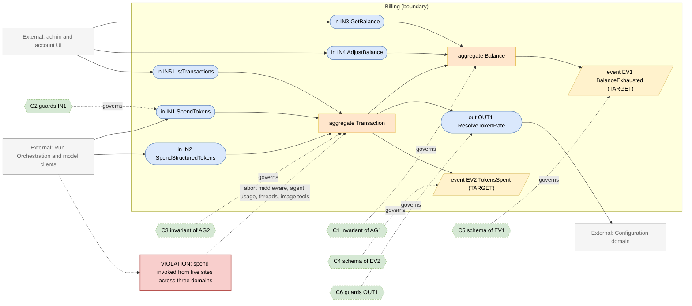
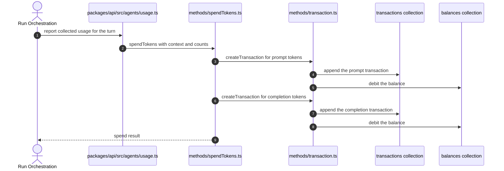

# Billing Domain

> **Responsibility:** Price model usage and keep every user's token balance correct — token-to-credit conversion, transaction recording, balance debit and auto-refill, and the spend limits the rest of the system honours.
> **Confidence:** firm on the aggregate and its rules, provisional on the boundary — pricing and spend are invoked from five call sites across three domains, so the boundary is defined by a function name rather than by a module.
> **Owns the motivating feature/change:** no

Notation legend: see `references/diagram-and-grammar.md` in the DomainMap skill. Every ID drawn in section 2 is defined in section 3, one to one.

## 1. Ubiquitous language

| Term | Kind | Meaning | Source (path) |
|---|---|---|---|
| Balance | aggregate root | A user's remaining credits, with auto-refill settings | packages/data-schemas/src/schema/balance.ts |
| Transaction | entity | One recorded debit or credit with its token counts and rate | packages/data-schemas/src/schema/transaction.ts |
| TokenUsage | value object | Prompt and completion token counts reported by a provider | packages/data-schemas/src/methods/spendTokens.ts |
| StructuredTokenUsage | value object | Prompt tokens split into input, cache write, and cache read | packages/data-schemas/src/methods/spendTokens.ts |
| TokenRate | value object | Credits per token for a model and token kind | packages/api/src/endpoints/pricing.ts |
| EndpointTokenConfig | value object | Per-endpoint rate overrides supplied by configuration | packages/api/src/endpoints/tokenConfig.ts |
| AutoRefill | value object | The rule that tops a balance up on a schedule | packages/data-schemas/src/methods/transaction.ts |
| SpendContext | value object | Which conversation, model, and purpose a spend belongs to | packages/data-schemas/src/methods/spendTokens.ts |

```ebnf
(* 3a — vocabulary *)
TokenKind      = "prompt" | "completion" | "cacheWrite" | "cacheRead" ;
TransactionKind = "debit" | "credit" | "autoRefill" ;
SpendPurpose   = "chat" | "title" | "summary" | "tool" | "image" ;
BalanceState   = "enabled" | "disabled" ;
```

## 2. Interface & Contract Boundary Map



## 3. Grammar

```ebnf
(* 3b — interface signatures, from packages/data-schemas/src/methods/spendTokens.ts
   and transaction.ts, plus api/server/routes/balance.js *)
IN1_SpendTokens = "spendTokens" , "(" , SpendContext , "," , TokenUsage , ")"
                , "->" , SpendResult ;
IN2_SpendStructuredTokens = "spendStructuredTokens" , "(" , SpendContext , "," , StructuredTokenUsage , ")"
                , "->" , ( promptResult , completionResult ) ;
IN3_GetBalance  = "findBalanceByUser" , "(" , userId , ")"
                , "->" , ( Balance | NotFound ) ;
IN4_AdjustBalance = "upsertBalanceFields" , "(" , userId , "," , fields , ")"
                , "->" , Balance ;
IN5_ListTransactions = "getTransactions" , "(" , filter , ")"
                , "->" , { Transaction } ;

OUT1_ResolveTokenRate = "getMultiplier" , "(" , model , "," , TokenKind , "," , [ EndpointTokenConfig ] , ")"
                , "->" , TokenRate ;

(* 3c — event schemas *)
EV1_BalanceExhausted = "BalanceExhausted" , "{" , userId , "," , remaining , "," , occurredAt , "}" ;
EV2_TokensSpent      = "TokensSpent" , "{" , userId , "," , conversationId , "," , model , "," , tokenCounts , "," , credits , "," , occurredAt , "}" ;

(* 3d — contracts *)
C1 = governs AG1
     invariant tokenCredits is never negative when balance is enabled
     invariant an auto-refill applies at most once per configured interval
     invariant balance belongs to exactly one user and tenant ;

C2 = governs IN1
     requires  SpendContext names a user
     requires  a rate is resolvable for the model and token kind
     ensures   at most two transactions are written per call
     ensures   the balance debit and the transaction record are consistent
     ensures   EV2 published ;

C3 = governs AG2
     invariant every transaction names a model, a token kind, and a rate
     invariant a structured transaction records input, cache write, and cache read separately
     invariant transactions are append only ;

C4 = governs EV2
     schema { userId, conversationId, model, tokenCounts, credits, occurredAt } ;

C5 = governs EV1
     schema { userId, remaining, occurredAt } ;

C6 = governs OUT1
     requires  the model is known to the pricing table or an endpoint override exists
     ensures   an unknown model yields an explicit zero rate rather than a silent one ;

(* 3e — aggregate composition *)
AG1_Balance = userRef , tokenCredits , [ autoRefillEnabled ] , [ refillIntervalValue ] , [ refillAmount ] , [ lastRefill ] ;
AG2_Transaction = userRef , conversationId , model , TokenKind , rawAmount , TokenRate , tokenValue , [ SpendPurpose ] ;
```

Target-only rules: `EV1_BalanceExhausted`, `EV2_TokensSpent`, `C4`, and `C5`. Today an exhausted balance surfaces as an error thrown at the next spend attempt, with no signal.

## 4. Aggregates

### AG1 · Balance
- **Purpose:** hold the authoritative remaining credit for a user and apply refills.
- **Root / boundary:** `balance` document keyed by user; `updateBalance` in `packages/data-schemas/src/methods/transaction.ts` is its only correct mutation path.
- **Invariants enforced** (contract): C1 — non-negativity and refill spacing are enforced inside `updateBalance` and `createAutoRefillTransaction`.
- **Invariants leaking / unguarded:** `upsertBalanceFields` is exported and used directly by `api/server/routes/balance.js`, so balance fields can be written without passing through the transaction path that maintains C1.
- **Status:** aggregate with one bypass route.

### AG2 · Transaction
- **Purpose:** be the append-only record that explains every balance change.
- **Root / boundary:** `transaction` document; created by `createTransaction` and `createStructuredTransaction`.
- **Invariants enforced** (contract): C3 — rate and token kind are computed in `calculateTokenValue` and `calculateStructuredTokenValue`.
- **Invariants leaking / unguarded:** `bulkInsertTransactions` and `deleteTransactions` are exported, so the append-only property is a convention rather than an enforced invariant.
- **Status:** aggregate — coherent, with escape hatches.

## 5. Logic placement

| Logic | Current location (path) | Verdict | Target location |
|---|---|---|---|
| Token-to-credit conversion | packages/data-schemas/src/methods/transaction.ts calculateTokenValue | correct | Billing |
| Structured token conversion | packages/data-schemas/src/methods/transaction.ts calculateStructuredTokenValue | correct | Billing |
| Balance debit and refill | packages/data-schemas/src/methods/transaction.ts updateBalance | correct | Billing |
| Spend entry point | packages/data-schemas/src/methods/spendTokens.ts | correct | Billing |
| Model pricing table | packages/api/src/endpoints/pricing.ts | misplaced: pricing lives in the endpoint configuration package | Billing, reading configuration through OUT1 |
| Endpoint token config resolution | packages/api/src/endpoints/tokenConfig.ts | misplaced: same reason | Billing |
| Usage aggregation for an agent run | packages/api/src/agents/usage.ts:653 | misplaced: Billing invoked from inside the Agent package | Run Orchestration calling Billing |
| Spend on abort | api/server/middleware/abortMiddleware.js:163 | misplaced: Billing invoked from transport middleware | Run Orchestration terminal transition |
| Spend for assistant runs | api/server/services/Threads/manage.js:510 | misplaced: a fourth independent spend call site | Assistant domain calling Billing once |
| Spend for image generation | api/app/clients/tools/structured/GeminiImageGen.js:287 | misplaced: a tool calls Billing directly | Tooling reporting usage, Run Orchestration spending |
| Balance config resolution | api/server/routes/balance.js createSetBalanceConfig | correct | Billing |

## 6. Representative flow



- **Coupling points:** five independent call sites invoke spend — the agent client, the agent usage module, the abort middleware, the assistant thread manager, and an image tool — so the Billing boundary is crossed from three domains and from transport middleware. Pricing tables live in the endpoint package rather than here, so a rate change touches Configuration code.
- **Hidden dependencies:** whether spend happens at all depends on the `balance.enabled` and `transactions.enabled` flags carried inside the spend context, so a caller that forgets to populate them silently records nothing; the prompt and completion debits are two separate balance updates, so a failure between them leaves a partially-charged turn; the abort path charges from middleware whose ordering relative to the run's own accounting is not enforced.

## 7. Integration & ownership

| Talks to | Mechanism | Direction | Notes |
|---|---|---|---|
| Run Orchestration | direct call at turn completion and on abort | Run to Billing | two paths, only one of them inside the run lifecycle |
| Agent | direct call from the usage module | Agent to Billing | should be mediated by Run Orchestration |
| Assistant | direct call from the thread manager | Assistant to Billing | a separate spend path for the legacy runtime |
| Tooling | direct call from an image tool | Tooling to Billing | a tool charging a balance directly |
| Configuration | direct read for pricing and balance settings | Billing to Configuration | read-only |
| Identity and Access | direct call to seed a balance for a new user | Identity to Billing | acceptable, id-based |

- **Data this domain OWNS:** `balances` and `transactions`.
- **Data it only READS (owned elsewhere):** `users` (Identity and Access), model and endpoint configuration (Configuration), conversation identifiers (Conversation).

## 8. Gaps & risks

| Gap | Evidence (path) | Severity | Target remedy |
|---|---|---|---|
| Five independent spend call sites across three domains | agents/client.js, agents/usage.ts:653, abortMiddleware.js:163, Threads/manage.js:510, GeminiImageGen.js:287 | high | One spend port called only from the run terminal transition |
| Prompt and completion debits are two separate balance updates | packages/data-schemas/src/methods/spendTokens.ts | high | Make a spend one atomic balance mutation |
| Balance fields writable outside the transaction path | upsertBalanceFields used by api/server/routes/balance.js | med | Route all balance writes through the aggregate |
| Pricing tables live in the endpoint configuration package | packages/api/src/endpoints/pricing.ts | med | Move pricing into Billing, reading rates from Configuration |
| Spend silently no-ops when context flags are unset | balance and transactions flags in SpendTxData | med | Make the flags explicit parameters resolved at the boundary |
| Append-only property of transactions is a convention | bulkInsertTransactions and deleteTransactions exports | low | Restrict the mutation surface to the aggregate |
| No signal when a balance is exhausted | no publisher exists | low | Publish EV1 so the UI and limits react |

## 9. Target design

N/A — the motivating change is owned by `authorization.domain.md`. The consolidation of spend call sites below depends on the Run Orchestration split described in `run-orchestration.domain.md` and is sequenced after it.

## 10. Incremental refactor plan

1. Make the balance and transaction enablement flags explicit parameters resolved once at the boundary, rather than optional fields on the spend context. Behavior-preserving.
2. Combine the prompt and completion debits into one balance mutation inside `spendTokens`, keeping the two transaction records.
3. Route `api/server/routes/balance.js` writes through the aggregate rather than `upsertBalanceFields` directly.
4. Move the pricing table and endpoint token config into the Billing module, leaving re-exports so callers are unaffected.
5. Convert the image-tool spend at `GeminiImageGen.js` into a usage report that the run charges, removing the tool's direct Billing dependency.
6. Convert the abort-path spend into a terminal-transition spend, coordinated with step 4 of `run-orchestration.domain.md`.
7. Collapse the agent usage module's spend call into the same terminal transition, leaving one spend site per turn.
8. Publish `TokensSpent` and `BalanceExhausted` once the single spend site exists.

## 11. Transition validation

| Principle | Result | Justification |
|---|---|---|
| Reduces coupling | pass | Five cross-domain spend calls collapse toward one; a tool and a middleware stop depending on Billing. |
| Clarifies ownership | pass | Pricing moves to the domain that owns rates, and balance writes get a single path. |
| Reinforces a boundary | pass | The single spend port at the run terminal transition is a boundary that does not exist today. |
| Avoids spreading legacy | pass | Re-exports preserve caller signatures while the implementation moves; no new direct collection access is added. |

## 12. Required changes

- **Modify:** `packages/data-schemas/src/methods/spendTokens.ts`, `packages/data-schemas/src/methods/transaction.ts`, `api/server/routes/balance.js`, `api/server/middleware/abortMiddleware.js`, `packages/api/src/agents/usage.ts`, `api/app/clients/tools/structured/GeminiImageGen.js`, `api/server/services/Threads/manage.js`.
- **Introduce:** a single spend port invoked from the run terminal transition; explicit enablement parameters; a Billing-owned pricing module; tokens-spent and balance-exhausted event publishers.
- **Refactor:** atomicise the balance debit; relocate pricing out of the endpoint package; convert tool and middleware spend calls into usage reports.
- **Debt consciously accepted:** transactions stay append-only by convention rather than by database constraint — the bulk-insert and delete helpers are needed by administrative tooling and tests, and locking them down would require a separate administrative surface for no boundary gain. The Assistant runtime also keeps its own spend call until that domain is retired; rewiring a deprecated path is not worth the change surface.

Consistency checklist run: every diagram ID resolves to a grammar rule and back; every contract names a defined target; each gap-classed node appears in section 8; target-only rules are marked; no application code in this file.
