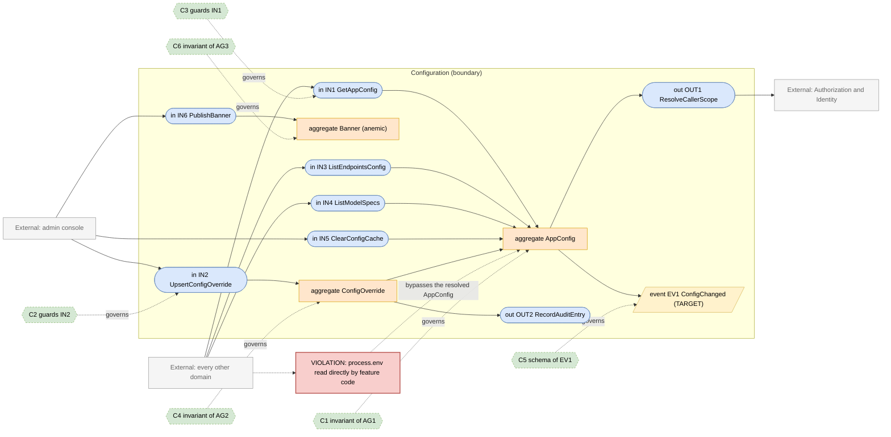
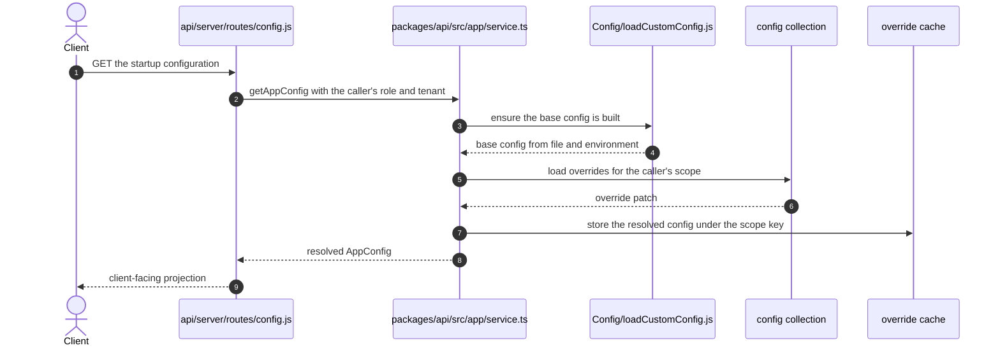

# Configuration Domain

> **Responsibility:** Resolve the effective configuration for a request — the YAML and environment base, database-stored admin overrides, per-role and per-tenant layering, endpoint and model availability, model specs, and the capability flags the rest of the system reads.
> **Confidence:** firm on the resolution pipeline, provisional on the boundary — configuration is read by nearly every other domain, so the domain's edge is defined by who calls `getAppConfig` rather than by a module fence.
> **Owns the motivating feature/change:** no

Notation legend: see `references/diagram-and-grammar.md` in the DomainMap skill. Every ID drawn in section 2 is defined in section 3, one to one.

## 1. Ubiquitous language

| Term | Kind | Meaning | Source (path) |
|---|---|---|---|
| AppConfig | aggregate root | The resolved configuration for a request, layered from base plus overrides | packages/api/src/app/service.ts |
| ConfigOverride | entity | A database-stored change layered over the file and environment base | packages/data-schemas/src/schema/config.ts |
| EndpointConfig | value object | Which providers are available and how each is reached | packages/api/src/endpoints/config/endpoints.ts |
| ModelSpec | value object | A named, preset model configuration surfaced in the UI | packages/api/src/modelSpecs |
| Capability | value object | A named feature flag gating a route or a UI affordance | packages/data-schemas SystemCapabilities |
| Banner | entity | An administrator message shown to users | packages/data-schemas/src/schema/banner.ts |
| AuditLog | entity | The record of an administrative configuration change | packages/data-schemas/src/schema/auditLog.ts |
| OverrideScope | value object | Whether an override applies globally, per role, or per tenant | packages/api/src/app/service.ts |

```ebnf
(* 3a — vocabulary *)
ConfigLayer   = "defaults" | "yaml" | "environment" | "databaseOverride" ;
OverrideScope = "global" | "role" | "tenant" | "user" ;
Capability    = identifier ;
EndpointKind  = "openAI" | "anthropic" | "google" | "bedrock" | "azureOpenAI" | "custom" | "agents" | "assistants" ;
```

## 2. Interface & Contract Boundary Map



## 3. Grammar

```ebnf
(* 3b — interface signatures, from packages/api/src/app/service.ts,
   api/server/services/Config and packages/api/src/admin/config.ts *)
IN1_GetAppConfig = "getAppConfig" , "(" , [ role ] , "," , [ userId ] , "," , [ tenantId ] , "," , [ refresh ] , ")"
                 , "->" , AppConfig ;
IN2_UpsertConfigOverride = "upsertOverride" , "(" , OverrideScope , "," , scopeKey , "," , configPatch , "," , actorId , ")"
                 , "->" , ( ConfigOverride | ValidationRejected ) ;
IN3_ListEndpointsConfig = "getEndpointsConfig" , "(" , AppConfig , ")"
                 , "->" , { EndpointConfig } ;
IN4_ListModelSpecs = "getModelSpecs" , "(" , AppConfig , "," , [ role ] , ")"
                 , "->" , { ModelSpec } ;
IN5_ClearConfigCache = "clearAppConfigCache" , "(" , [ tenantId ] , ")"
                 , "->" , Cleared ;
IN6_PublishBanner = "upsertBanner" , "(" , message , "," , displayFrom , "," , displayTo , "," , actorId , ")"
                 , "->" , Banner ;

OUT1_ResolveCallerScope = "getAppConfigOptionsFromUser" , "(" , requestUser , ")"
                 , "->" , ( role , userId , tenantId ) ;
OUT2_RecordAuditEntry = "recordAuditLog" , "(" , actorId , "," , action , "," , before , "," , after , ")"
                 , "->" , AuditLog ;

(* 3c — event schemas *)
EV1_ConfigChanged = "ConfigChanged" , "{" , scope , "," , scopeKey , "," , changedPaths , "," , changedBy , "," , occurredAt , "}" ;

(* 3d — contracts *)
C1 = governs AG1
     invariant layers apply in order defaults then yaml then environment then database override
     invariant a resolved config is never partially applied
     invariant strict override mode rejects an unknown override key rather than ignoring it ;

C2 = governs IN2
     requires  caller holds the administrative configuration capability
     requires  the patch validates against the configuration schema
     ensures   an audit entry records the change
     ensures   affected caches are invalidated
     ensures   EV1 published ;

C3 = governs IN1
     requires  caller scope is resolved from the authenticated request, not supplied by the client
     ensures   the returned config reflects the caller's role and tenant
     ensures   secrets are never included in a client-facing projection ;

C4 = governs AG2
     invariant an override names exactly one scope and scope key
     invariant secret values are stored encrypted ;

C5 = governs EV1
     schema { scope, scopeKey, changedPaths, changedBy, occurredAt } ;

C6 = governs AG3
     invariant a banner has a display window with displayFrom not after displayTo ;

(* 3e — aggregate composition *)
AG1_AppConfig = { ConfigLayer } , { EndpointConfig } , { ModelSpec } , { Capability } , cacheKey ;
AG2_ConfigOverride = OverrideScope , scopeKey , configPatch , updatedBy , updatedAt ;
AG3_Banner = message , displayFrom , displayTo , [ type ] ;
```

Target-only rules: `EV1_ConfigChanged` and `C5`. Today cache invalidation is performed by direct calls to `clearAppConfigCache` and `clearOverrideCache`.

## 4. Aggregates

### AG1 · AppConfig
- **Purpose:** give every caller one resolved answer to "what is configured for this request".
- **Root / boundary:** the resolution pipeline in `packages/api/src/app/service.ts`, with the base built once and overrides layered per role, user, and tenant.
- **Invariants enforced** (contract): C1 — layering order and strict-override rejection are implemented in `createAppConfigService`.
- **Invariants leaking / unguarded:** feature code across the repository reads `process.env` directly rather than the resolved config — `api/server/routes/config.js` computes `emailLoginEnabled`, `passwordResetEnabled`, and shared-link flags from the environment at module load, and `packages/data-schemas/src/models/convo.ts` decides whether search indexing exists by reading `MEILI_HOST` at model construction. Those reads bypass every override layer.
- **Status:** aggregate — a genuine resolution pipeline whose authority is undermined by direct environment reads.

### AG2 · ConfigOverride
- **Purpose:** let administrators change behaviour without a redeploy, scoped to a role or tenant.
- **Root / boundary:** `config` document plus the encryption applied in `packages/api/src/admin/secrets.ts`.
- **Invariants enforced** (contract): C4 — scope exclusivity and secret encryption.
- **Invariants leaking / unguarded:** the override cache is keyed by role, user, and tenant with a time-to-live, so a change is visible after a delay rather than immediately; nothing signals the change.
- **Status:** aggregate — well-formed, with eventual rather than immediate propagation.

### AG3 · Banner
- **Purpose:** carry an administrator message to users within a display window.
- **Root / boundary:** `banner` document.
- **Invariants enforced** (contract): C6 — the display window ordering.
- **Invariants leaking / unguarded:** the window check is applied at read time in the route rather than by the aggregate, so an invalid window can be stored.
- **Status:** anemic — a data bag whose one rule is applied by a reader.

## 5. Logic placement

| Logic | Current location (path) | Verdict | Target location |
|---|---|---|---|
| Layered config resolution and caching | packages/api/src/app/service.ts | correct | Configuration |
| Custom YAML config loading | api/server/services/Config/loadCustomConfig.js | correct | Configuration |
| Endpoint availability resolution | packages/api/src/endpoints/config/endpoints.ts | correct | Configuration |
| Model list loading per provider | api/server/services/Config/loadConfigModels.js and loadDefaultModels.js | correct | Configuration |
| Model spec filtering by role | packages/api/src/modelSpecs | correct | Configuration |
| Administrative override handling | packages/api/src/admin/config.ts | correct | Configuration |
| Secret encryption for overrides | packages/api/src/admin/secrets.ts | correct | Configuration |
| Audit logging of admin changes | packages/api/src/admin/auditLog.ts | correct | Configuration |
| Direct environment reads in feature code | api/server/routes/config.js and packages/data-schemas/src/models/convo.ts | misplaced: bypasses the resolution pipeline | Configuration, read through IN1 |
| Model pricing tables | packages/api/src/endpoints/pricing.ts | misplaced: Billing rules inside the endpoint config package | Billing |
| Cached tool list | api/server/services/Config/getCachedTools.js | misplaced: Tooling state cached by Configuration | Tooling |
| Category and role seeding at boot | api/models/index.js | misplaced: reference-data seeding attached to model construction | Configuration start-up |

## 6. Representative flow



- **Coupling points:** every domain calls `getAppConfig`, so Configuration is the most depended-upon boundary in the system; the same route also reads `process.env` at module load for several flags, which means part of the response never passes through the pipeline it is describing.
- **Hidden dependencies:** the base config is built once and memoised, so an environment change requires a restart while a database override does not; the override cache has a time-to-live, so two pods can serve different configurations briefly; `packages/data-schemas/src/models/convo.ts` decides at model-construction time whether search indexing exists, so that behaviour is fixed for the process lifetime regardless of later configuration.

## 7. Integration & ownership

| Talks to | Mechanism | Direction | Notes |
|---|---|---|---|
| Every other domain | direct call to getAppConfig | each domain to Configuration | read-only, the widest fan-in in the system |
| Authorization and Identity | direct call to resolve the caller's scope | Configuration to Authorization | needed to layer role and tenant overrides |
| Tooling | shared cache of the tool list | both directions | Configuration caches Tooling state |
| Billing | shared module — pricing lives in the endpoint package | both directions | pricing belongs to Billing |
| Admin console | direct call for overrides, banners, roles, groups, and audit | admin to Configuration | the administrative surface |

- **Data this domain OWNS:** the `config` collection, `banners`, `auditlogs`, the resolved-config caches, and the YAML and environment base.
- **Data it only READS (owned elsewhere):** `users` and `roles` (Identity and Access), `aclentries` (Authorization).

## 8. Gaps & risks

| Gap | Evidence (path) | Severity | Target remedy |
|---|---|---|---|
| Feature code reads process.env directly, bypassing all override layers | api/server/routes/config.js and packages/data-schemas/src/models/convo.ts | high | Route every flag read through the resolved config |
| Search indexing availability is fixed at model construction | packages/data-schemas/src/models/convo.ts | high | Decide indexing per operation from the resolved config |
| Override propagation is time-to-live based, so pods disagree briefly | packages/api/src/app/service.ts override cache | med | Publish EV1 and invalidate on the signal |
| Billing pricing tables live in the endpoint config package | packages/api/src/endpoints/pricing.ts | med | Move pricing into Billing |
| Configuration caches the Tooling tool list | api/server/services/Config/getCachedTools.js | med | Move the cache into Tooling |
| Reference-data seeding attached to model construction | api/models/index.js seedDatabase | low | Move seeding into an explicit start-up step |
| Banner display-window rule applied by the reader | api/server/routes/banner.js | low | Enforce the window at the aggregate |

## 9. Target design

N/A — the motivating change is owned by `authorization.domain.md`. The configuration-change event below is a prerequisite for removing time-to-live-based override propagation and is sequenced in section 10.

## 10. Incremental refactor plan

1. Replace the module-load `process.env` reads in `api/server/routes/config.js` with reads from the resolved config inside the handler. Behavior-preserving where no override exists.
2. Move the search-indexing decision in `packages/data-schemas/src/models/convo.ts` from model construction to a per-operation check, coordinated with step 5 of `conversation.domain.md`.
3. Move the cached tool list out of `api/server/services/Config/getCachedTools.js` into the Tooling domain.
4. Move the pricing tables from `packages/api/src/endpoints/pricing.ts` into Billing, leaving re-exports.
5. Publish `ConfigChanged` from the override handler; keep the existing time-to-live as a backstop.
6. Subscribe the override and app-config caches to that event and shorten the backstop.
7. Move role, category, and system-grant seeding out of `api/models/index.js` into an explicit start-up step owned by this domain.
8. Enforce the banner display window at the aggregate rather than in the reader.

## 11. Transition validation

| Principle | Result | Justification |
|---|---|---|
| Reduces coupling | pass | Feature code stops depending on the process environment directly, and Configuration stops holding Tooling and Billing state. |
| Clarifies ownership | pass | Pricing returns to Billing, the tool cache to Tooling, and seeding becomes an explicit Configuration responsibility. |
| Reinforces a boundary | pass | Routing every flag through the resolved config makes `getAppConfig` the real boundary it is already assumed to be. |
| Avoids spreading legacy | pass | Re-exports keep signatures while implementations move; the time-to-live stays as a backstop rather than being replaced blindly. |

## 12. Required changes

- **Modify:** `api/server/routes/config.js`, `packages/data-schemas/src/models/convo.ts`, `packages/api/src/app/service.ts`, `api/server/services/Config/getCachedTools.js`, `packages/api/src/endpoints/pricing.ts`, `api/models/index.js`, `api/server/routes/banner.js`.
- **Introduce:** a config-changed event publisher; an explicit start-up seeding step; per-operation search-index resolution.
- **Refactor:** replace direct environment reads with resolved-config reads; relocate the tool cache to Tooling and pricing to Billing; enforce the banner window at the aggregate.
- **Debt consciously accepted:** the YAML and environment base stays memoised for the process lifetime, so environment changes still require a restart. Making the base hot-reloadable would introduce a class of partial-application bugs that the strict layering currently prevents, and administrators already have database overrides for anything that must change live.

Consistency checklist run: every diagram ID resolves to a grammar rule and back; every contract names a defined target; each gap-classed node appears in section 8; target-only rules are marked; no application code in this file.
