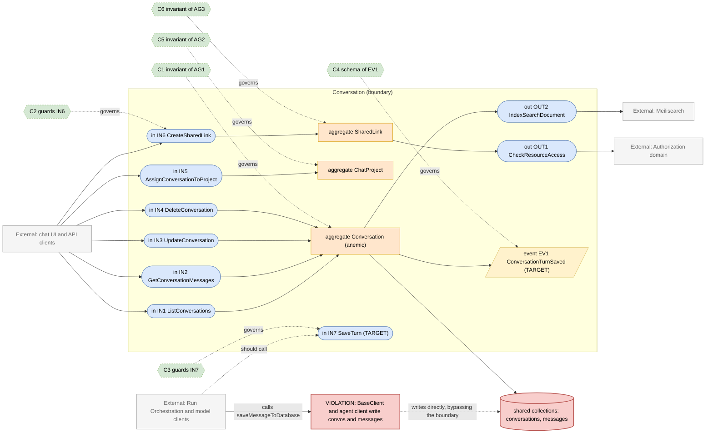
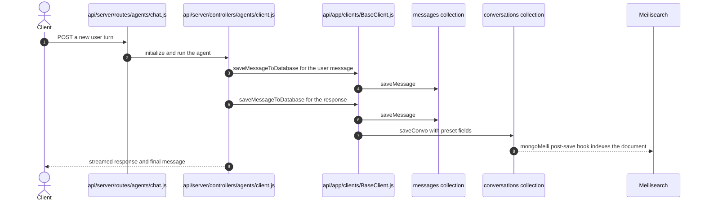

# Conversation Domain

> **Responsibility:** Own the durable record of a chat — conversations, their message trees, the organising structures around them (tags, favorites, chat projects, shared links), and the search projection of both.
> **Confidence:** firm on the concepts, provisional on the boundary — conversations and messages are written by the model-client layer rather than by this domain, so its real boundary today is narrower than its conceptual one.
> **Owns the motivating feature/change:** no

Notation legend: see `references/diagram-and-grammar.md` in the DomainMap skill. Every ID drawn in section 2 is defined in section 3, one to one.

## 1. Ubiquitous language

| Term | Kind | Meaning | Source (path) |
|---|---|---|---|
| Conversation | aggregate root | A chat thread with its endpoint preset, agent, files, tags, and message references | packages/data-schemas/src/schema/convo.ts |
| Message | entity | One node in the conversation tree, linked by parentMessageId | packages/data-schemas/src/schema/message.ts |
| ConversationTag | entity | User-defined label applied to conversations | packages/data-schemas/src/schema/conversationTag.ts |
| ChatProject | aggregate root | A folder grouping conversations, with derived counts | packages/data-schemas/src/schema/chatProject.ts |
| SharedLink | aggregate root | A public or scoped snapshot handle onto a conversation | packages/data-schemas/src/schema/share.ts |
| Favorite | entity | A user marking a conversation or other resource as favorite | packages/data-schemas/src/schema/favorite.ts |
| SearchProjection | value object | The Meilisearch document derived from a conversation or message | packages/data-schemas/src/models/plugins/mongoMeili.ts |
| ConversationPreset | value object | Endpoint and model settings frozen onto the conversation | packages/data-schemas/src/schema/defaults.ts |

```ebnf
(* 3a — vocabulary *)
MessageRole   = "user" | "assistant" | "system" | "tool" ;
MessageTree   = Message , { Message } ;
ConversationId = uuid ;
ShareScope    = "public" | "authenticated" | "revoked" ;
ProjectAssignment = ConversationId , chatProjectId ;
```

## 2. Interface & Contract Boundary Map



## 3. Grammar

```ebnf
(* 3b — interface signatures, from api/server/routes/convos.js, messages.js,
   projects.js, share.js and packages/api/src/shared-links/service.ts *)
IN1_ListConversations = "listConversations" , "(" , userId , "," , [ cursor ] , "," , [ chatProjectId ] , "," , [ tags ] , ")"
                      , "->" , ( ConversationPage ) ;
IN2_GetConversationMessages = "getMessages" , "(" , ConversationId , "," , userId , ")"
                      , "->" , ( MessageTree | NotFound ) ;
IN3_UpdateConversation = "updateConversation" , "(" , ConversationId , "," , userId , "," , mutableFields , ")"
                      , "->" , ( Conversation | NotFound ) ;
IN4_DeleteConversation = "deleteConversation" , "(" , ConversationId , "," , userId , ")"
                      , "->" , DeleteReport ;
IN5_AssignConversationToProject = "assignConversationToProject" , "(" , ConversationId , "," , chatProjectId , "," , userId , ")"
                      , "->" , ( ChatProject | NotFound ) ;
IN6_CreateSharedLink = "createSharedLink" , "(" , ConversationId , "," , userId , "," , ShareScope , ")"
                      , "->" , ( ShareId | ShareRefused ) ;
IN7_SaveTurn = "saveTurn" , "(" , ConversationId , "," , userMessage , "," , responseMessage , "," , presetFields , ")"
                      , "->" , ( SavedTurn | SaveRejected ) ;

OUT1_CheckResourceAccess = "checkPermission" , "(" , userId , "," , resourceType , "," , resourceId , "," , requiredPermission , ")"
                      , "->" , boolean ;
OUT2_IndexSearchDocument = "indexDocument" , "(" , indexName , "," , SearchProjection , ")"
                      , "->" , ( Indexed | IndexError ) ;

(* 3c — event schemas *)
EV1_ConversationTurnSaved = "ConversationTurnSaved" , "{" , conversationId , "," , userId , "," , messageIds , "," , endpoint , "," , model , "," , occurredAt , "}" ;

(* 3d — contracts *)
C1 = governs AG1
     invariant conversationId is unique per user and tenant
     invariant every message references a conversation that exists
     invariant parentMessageId forms a tree with no cycle
     invariant a temporary conversation carries expiredAt ;

C2 = governs IN6
     requires  caller owns the conversation
     requires  shared links are enabled by configuration
     ensures   the snapshot excludes messages created after the share
     ensures   revoking a share makes the link unreadable ;

C3 = governs IN7
     requires  conversationId exists or is created in the same operation
     ensures   user message and response message are saved atomically
     ensures   the conversation preset reflects the endpoint that produced the turn
     ensures   EV1 published ;

C4 = governs EV1
     schema { conversationId, userId, messageIds, endpoint, model, occurredAt } ;

C5 = governs AG2
     invariant conversationCount equals the number of assigned conversations
     invariant a conversation belongs to at most one chat project ;

C6 = governs AG3
     invariant shareId is unguessable
     invariant a revoked share resolves to nothing ;

(* 3e — aggregate composition *)
AG1_Conversation = ConversationId , title , userRef , { messageRef } , ConversationPreset , { tag } , [ chatProjectId ] , [ expiredAt ] ;
AG2_ChatProject  = name , userRef , conversationCount , lastConversationAt ;
AG3_SharedLink   = shareId , ConversationId , userRef , ShareScope , [ snapshotAt ] ;
```

Target-only rules: `IN7_SaveTurn`, `C3`, `EV1_ConversationTurnSaved`, and `C4`. Today the equivalent write happens inside `api/app/clients/BaseClient.js` at `saveMessageToDatabase`, which calls `saveMessage` and `saveConvo` directly.

## 4. Aggregates

### AG1 · Conversation
- **Purpose:** the durable thread that everything else in the product hangs off.
- **Root / boundary:** `conversation` document plus the messages that reference its `conversationId`.
- **Invariants enforced** (contract): C1 — identity uniqueness, tree shape, temporary-conversation expiry.
- **Invariants leaking / unguarded:** none of C1 is enforced by the aggregate. Messages are written independently by `api/app/clients/BaseClient.js:961` and the conversation is upserted separately at `api/app/clients/BaseClient.js:1031`, so a failed second write leaves a message without a matching conversation preset. The tree shape is maintained only by whichever client sets `parentMessageId`.
- **Status:** anemic — the schema is a data bag; the write rules live in the model-client layer of another domain.

### AG2 · ChatProject
- **Purpose:** group conversations into a workspace with derived counts.
- **Root / boundary:** `chatProject` document; `conversationCount` and `lastConversationAt` are derived state it must keep true.
- **Invariants enforced** (contract): C5.
- **Invariants leaking / unguarded:** the counter is maintained by `assignConversationToProject` in `packages/data-schemas/src/methods/chatProject.ts`, but conversation deletion goes through `api/server/routes/convos.js`, which is a separate path — the count can drift.
- **Status:** aggregate with a derived-state gap.

### AG3 · SharedLink
- **Purpose:** expose a conversation outside the owner's session without granting access to the conversation itself.
- **Root / boundary:** `share` document keyed by an opaque share id.
- **Invariants enforced** (contract): C6, with access mediated by `packages/api/src/shared-links/access.ts`.
- **Invariants leaking / unguarded:** the snapshot boundary is implicit — the link resolves live messages rather than a frozen set, so C2's snapshot clause is aspirational.
- **Status:** aggregate — the newest and cleanest of the three, already behind a TS service.

## 5. Logic placement

| Logic | Current location (path) | Verdict | Target location |
|---|---|---|---|
| Persist a chat turn (message plus conversation) | api/app/clients/BaseClient.js:941 and :1031 | misplaced: the write rules for this domain live in the model-client layer | Conversation, behind IN7 |
| Persist agent-run messages | api/server/controllers/agents/client.js | misplaced: a second writer of the same collections | Conversation, behind IN7 |
| Conversation listing and pagination | packages/data-schemas/src/methods/conversation.ts | correct | Conversation |
| Message tree assembly | packages/data-schemas/src/methods/message.ts | correct | Conversation |
| Search projection and indexing | packages/data-schemas/src/models/plugins/mongoMeili.ts | misplaced: search indexing is a schema-level side effect of persistence | Conversation, behind an explicit OUT2 call |
| Shared-link creation and access | packages/api/src/shared-links/service.ts and access.ts | correct | Conversation |
| Chat project assignment and counters | packages/api/src/projects/handlers.ts | correct | Conversation |
| Favorites | packages/api/src/favorites/handlers.ts | correct | Conversation |
| Conversation title generation | api/server/services/Endpoints/agents/title.js | misplaced: writes the conversation title from the Agent domain | Agent emits, Conversation applies |
| Search availability probe | api/server/routes/search.js | correct | Conversation |

## 6. Representative flow



- **Coupling points:** the flow never enters this domain's own interfaces. `api/app/clients/BaseClient.js` and `api/server/controllers/agents/client.js` both write `messages` and `conversations` directly, so the Conversation boundary is bypassed on the single most important write path in the product.
- **Hidden dependencies:** the Meilisearch projection is a mongoose plugin registered in `packages/data-schemas/src/models/convo.ts`, so indexing is an invisible side effect of any save and is silently disabled when the Meili environment variables are unset; message and conversation writes are two separate operations with no transaction; `applyTenantIsolation` scopes reads by an ambient tenant; the user message is saved from a floating promise (`api/app/clients/BaseClient.js:670`) whose rejection is only logged.

## 7. Integration & ownership

| Talks to | Mechanism | Direction | Notes |
|---|---|---|---|
| Run Orchestration and model clients | direct write of this domain's collections | Runner to Conversation data | the boundary violation drawn in section 2 |
| Authorization | direct call for shared-link and resource access | Conversation to Authorization | via packages/api/src/shared-links/access.ts |
| Agent | direct call to set the conversation title | Agent to Conversation | api/server/services/Endpoints/agents/title.js |
| File | shared reference — the conversation carries a files array | Conversation reads File ids | no ownership transfer, ids only |
| Billing | shared key — transactions carry conversationId | Billing reads Conversation ids | loose, id-only coupling |
| Meilisearch | schema plugin side effect | Conversation to search | should be an explicit outbound call |
| Configuration | direct call for shared-link and temporary-chat flags | Conversation to Configuration | read-only |

- **Data this domain OWNS:** `conversations`, `messages`, `conversationtags`, `chatprojects`, `shares`, `favorites`, and the Meilisearch `convos` and `messages` indexes.
- **Data it only READS (owned elsewhere):** `users` (Identity and Access), `agents` (Agent), `files` (File), app configuration (Configuration).

## 8. Gaps & risks

| Gap | Evidence (path) | Severity | Target remedy |
|---|---|---|---|
| The primary write path bypasses the domain entirely | api/app/clients/BaseClient.js:941 and api/server/controllers/agents/client.js | high | Introduce IN7 SaveTurn and route both clients through it |
| Message and conversation writes are not atomic | api/app/clients/BaseClient.js:961 then :1031 | high | Make IN7 a single operation over both collections |
| Search indexing is an invisible schema side effect | packages/data-schemas/src/models/plugins/mongoMeili.ts | med | Call OUT2 explicitly from the save path |
| Chat project counters can drift on conversation delete | packages/data-schemas/src/methods/chatProject.ts versus api/server/routes/convos.js | med | Route deletion through the aggregate that owns the counter |
| Shared links resolve live messages rather than a snapshot | packages/api/src/shared-links/service.ts | med | Freeze a message set at share time, per C2 |
| Conversation title written from the Agent domain | api/server/services/Endpoints/agents/title.js | low | Agent returns a title, Conversation applies it |
| User-message save is a floating promise whose failure is only logged | api/app/clients/BaseClient.js:670 | low | Fold into the atomic IN7 operation |

## 9. Target design

N/A — the motivating change is owned by `authorization.domain.md`. The `IN7` and `EV1` rules above are target markers for the persistence boundary this domain will need, sequenced in section 10 but not part of the current change.

## 10. Incremental refactor plan

1. Add a `saveTurn` function in `packages/api/src` that wraps the existing `saveMessage` and `saveConvo` calls with the same arguments and semantics. No caller changes yet; behavior-preserving.
2. Move `api/app/clients/BaseClient.js` `saveMessageToDatabase` to call `saveTurn` instead of the two model methods. Ships alone.
3. Move the agent client at `api/server/controllers/agents/client.js` to the same function. Ships alone.
4. Make `saveTurn` atomic over both collections now that it is the only writer, keeping the external signature identical.
5. Replace the `mongoMeili` post-save hook with an explicit index call inside `saveTurn`, leaving the plugin registered for other write paths until they are converted.
6. Route conversation deletion through the chat-project aggregate so `conversationCount` is maintained in one place.
7. Publish `ConversationTurnSaved` from `saveTurn`; add subscribers later, starting with the search projection.
8. Freeze the shared-link message set at creation time in `packages/api/src/shared-links/service.ts`.

## 11. Transition validation

| Principle | Result | Justification |
|---|---|---|
| Reduces coupling | pass | Two model-client writers collapse to one call into this domain; search indexing stops being a hidden schema dependency. |
| Clarifies ownership | pass | The conversations and messages collections gain a single writer, and the chat-project counter gains a single maintainer. |
| Reinforces a boundary | pass | `saveTurn` is the boundary — it exists precisely so that the runner cannot reach past it into the collections. |
| Avoids spreading legacy | pass | Every step removes a direct collection write rather than adding one; the plugin stays only until its last caller is converted. |

## 12. Required changes

- **Modify:** `api/app/clients/BaseClient.js`, `api/server/controllers/agents/client.js`, `packages/data-schemas/src/models/convo.ts`, `packages/data-schemas/src/methods/chatProject.ts`, `api/server/routes/convos.js`, `packages/api/src/shared-links/service.ts`.
- **Introduce:** a `saveTurn` domain service in `packages/api/src` as the single turn-persistence port; an explicit search-index outbound call; a turn-saved event publisher.
- **Refactor:** collapse the two-step message and conversation write into one atomic operation; move title application from Agent into this domain; move deletion through the counter-owning aggregate.
- **Debt consciously accepted:** the `conversationPreset` fields stay denormalised onto the conversation document. Normalising them would touch every endpoint's option-building code at once and is not independently shippable. The Meilisearch plugin also stays registered after step 5 so that non-chat write paths keep indexing; removing it is deferred until every writer uses `saveTurn`.

Consistency checklist run: every diagram ID resolves to a grammar rule and back; every contract names a defined target; each gap-classed node appears in section 8; target-only rules are marked; no application code in this file.
