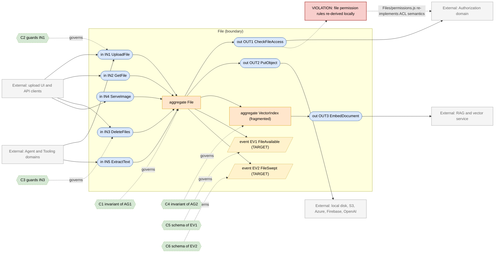
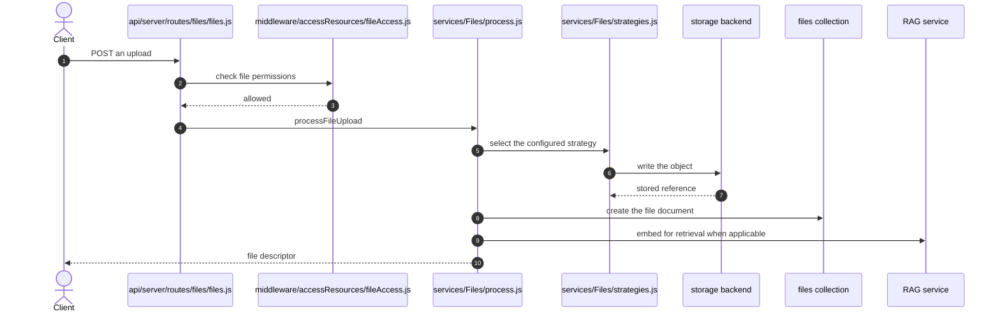

# File Domain

> **Responsibility:** Accept, store, transform, serve, and retire user and agent files across pluggable storage backends, including text extraction, OCR, vector indexing, and image handling.
> **Confidence:** firm — the concept and its storage strategies are explicit; the ambiguity is that file access control is re-derived here instead of being asked of Authorization.
> **Owns the motivating feature/change:** no

Notation legend: see `references/diagram-and-grammar.md` in the DomainMap skill. Every ID drawn in section 2 is defined in section 3, one to one.

## 1. Ubiquitous language

| Term | Kind | Meaning | Source (path) |
|---|---|---|---|
| File | aggregate root | A stored artifact with its source, type, size, and owning user | packages/data-schemas/src/schema/file.ts |
| StorageStrategy | value object | Where bytes live: local, S3, Azure, Firebase, OpenAI, code interpreter | api/server/services/Files/strategies.js |
| FileSource | value object | The strategy identifier persisted on the file document | packages/data-schemas/src/schema/file.ts |
| Attachment | value object | A file reference carried on a message or conversation | packages/api/src/files/agents |
| VectorDocument | entity | The embedded representation used for retrieval | api/server/services/Files/VectorDB |
| OcrResult | value object | Extracted text from a scanned document | packages/api/src/files/ocr.ts |
| RetentionPolicy | value object | The rule deciding when a file is swept | packages/api/src/files/retention.ts |
| Citation | value object | A pointer from generated text back into a source file | api/server/services/Files/Citations |

```ebnf
(* 3a — vocabulary *)
FileSource     = "local" | "s3" | "azure" | "firebase" | "openai" | "execute_code" | "vectordb" ;
FileContext    = "message_attachment" | "avatar" | "agent_file" | "tool_output" | "skill_asset" ;
FileState      = "uploading" | "available" | "processing" | "failed" | "swept" ;
RetentionRule  = ttl | "never" ;
```

## 2. Interface & Contract Boundary Map



## 3. Grammar

```ebnf
(* 3b — interface signatures, from api/server/routes/files, services/Files/process.js
   and packages/api/src/files *)
IN1_UploadFile = "processFileUpload" , "(" , userId , "," , upload , "," , FileContext , "," , [ agentId ] , ")"
               , "->" , ( File | UploadRejected ) ;
IN2_GetFile    = "getFiles" , "(" , userId , "," , { fileId } , ")"
               , "->" , { File } ;
IN3_DeleteFiles = "deleteFiles" , "(" , userId , "," , { fileId } , ")"
               , "->" , DeleteReport ;
IN4_ServeImage = "serveImage" , "(" , fileId , "," , requestContext , ")"
               , "->" , ( ImageBytes | Forbidden | NotFound ) ;
IN5_ExtractText = "extractText" , "(" , fileId , "," , [ ocrOptions ] , ")"
               , "->" , ( TextContent | ExtractionFailed ) ;

OUT1_CheckFileAccess = "checkPermission" , "(" , userId , "," , "file" , "," , fileId , "," , requiredPermission , ")"
               , "->" , boolean ;
OUT2_PutObject = "saveBuffer" , "(" , FileSource , "," , key , "," , bytes , ")"
               , "->" , ( StoredRef | StorageError ) ;
OUT3_EmbedDocument = "embedFile" , "(" , fileId , "," , TextContent , ")"
               , "->" , ( VectorDocument | EmbeddingError ) ;

(* 3c — event schemas *)
EV1_FileAvailable = "FileAvailable" , "{" , fileId , "," , userId , "," , fileSource , "," , bytes , "," , occurredAt , "}" ;
EV2_FileSwept     = "FileSwept" , "{" , fileId , "," , reason , "," , occurredAt , "}" ;

(* 3d — contracts *)
C1 = governs AG1
     invariant every file names a FileSource that has a registered strategy
     invariant a file document exists only when its bytes are stored or explicitly marked failed
     invariant deleting a file removes bytes from its strategy and its vector documents ;

C2 = governs IN1
     requires  size is within the configured limit for the context
     requires  mime type is permitted for the context
     ensures   the stored object and the file document are created together
     ensures   EV1 published ;

C3 = governs IN3
     requires  caller holds DELETE on every file named
     ensures   strategy bytes, vector documents, and the file document are all removed
     ensures   EV2 published ;

C4 = governs AG2
     invariant a vector document exists only while its file exists
     invariant re-indexing replaces rather than duplicates prior vectors ;

C5 = governs EV1
     schema { fileId, userId, fileSource, bytes, occurredAt } ;

C6 = governs EV2
     schema { fileId, reason, occurredAt } ;

(* 3e — aggregate composition *)
AG1_File = fileId , userRef , FileSource , FileContext , filename , bytes , type , [ expiresAt ] ;
AG2_VectorIndex = fileId , { VectorDocument } , embeddingModel ;
```

Target-only rules: `EV1_FileAvailable`, `EV2_FileSwept`, `C5`, and `C6`. Today file lifecycle is communicated by direct calls and by the sweep job in `packages/api/src/files/sweep.ts`.

## 4. Aggregates

### AG1 · File
- **Purpose:** be the single record of an artifact regardless of which backend holds its bytes.
- **Root / boundary:** `file` document; the consistency boundary is the document plus its stored object.
- **Invariants enforced** (contract): C1 — strategy registration is enforced in `api/server/services/Files/strategies.js`; size and type limits in `packages/api/src/files/validation.ts`.
- **Invariants leaking / unguarded:** document creation and object storage are separate steps in `api/server/services/Files/process.js`, so a failure between them leaves an orphan on either side; the sweep in `packages/api/src/files/sweep.ts` exists partly to compensate for that.
- **Status:** aggregate with a two-phase-write gap.

### AG2 · VectorIndex
- **Purpose:** keep the retrievable representation of a file in step with the file itself.
- **Root / boundary:** vector documents in the RAG service, keyed by file id; there is no local document for them.
- **Invariants enforced** (contract): C4 — enforced by convention in `packages/api/src/files/rag.ts`.
- **Invariants leaking / unguarded:** the vector store is a separate service with its own lifetime, so deleting a file and deleting its vectors are two calls that can diverge; nothing reconciles them.
- **Status:** fragmented — one concept split between the file document, the RAG service, and the code-interpreter session files in `packages/api/src/files/codeFilesSession.ts`.

## 5. Logic placement

| Logic | Current location (path) | Verdict | Target location |
|---|---|---|---|
| Upload orchestration across strategies | api/server/services/Files/process.js (1393 lines) | misplaced: validation, storage, extraction, and persistence in one function | File, split by responsibility |
| Storage strategy selection | api/server/services/Files/strategies.js | correct | File |
| Size and type validation | packages/api/src/files/validation.ts | correct | File |
| File access control | api/server/services/Files/permissions.js | misplaced: re-derives ACL semantics instead of asking Authorization | Authorization, called through OUT1 |
| Image serving and request validation | api/server/routes/files/images.js and middleware/validateImageRequest.js | correct | File |
| OCR extraction | packages/api/src/files/ocr.ts and mistral | correct | File |
| Vector indexing | packages/api/src/files/rag.ts | correct | File |
| Retention and sweep | packages/api/src/files/retention.ts and sweep.ts | correct | File |
| Agent attachment resolution | packages/api/src/files/agents | duplicated: attachment shaping also happens in the agent client | File |
| Citation resolution | api/server/services/Files/Citations | correct | File |

## 6. Representative flow



- **Coupling points:** the access guard at `api/server/middleware/accessResources/fileAccess.js` and the helper at `api/server/services/Files/permissions.js` both encode file permission rules, so authorization semantics live partly inside this domain; the upload path calls the RAG service inline, so an embedding failure affects upload latency and outcome.
- **Hidden dependencies:** which strategy runs depends on ambient configuration rather than a parameter, so the same upload behaves differently per environment; document creation and object storage are not transactional; the code-interpreter session file lifetime in `packages/api/src/files/codeFilesSession.ts` is governed by a remote service's expiry rather than by the file document.

## 7. Integration & ownership

| Talks to | Mechanism | Direction | Notes |
|---|---|---|---|
| Authorization | direct call, plus locally re-derived rules | File to Authorization | the re-derivation is the violation drawn in section 2 |
| Agent | direct call for avatars and agent files | Agent to File | id-based |
| Tooling | direct call for tool-produced artifacts | Tooling to File | image and document outputs |
| Conversation | shared reference — conversations carry a files array | Conversation reads File ids | id-only, acceptable |
| Skill | direct call for skill assets | Skill to File | via the skillFile schema |
| RAG service | network call | File outward | separate service, separate lifetime |
| Configuration | direct read of strategy and limit settings | File to Configuration | read-only |

- **Data this domain OWNS:** `files`, the objects in every storage backend, and the vector documents derived from them.
- **Data it only READS (owned elsewhere):** `users` (Identity and Access), `agents` (Agent), `aclentries` (Authorization).

## 8. Gaps & risks

| Gap | Evidence (path) | Severity | Target remedy |
|---|---|---|---|
| File permission rules re-derived instead of delegated | api/server/services/Files/permissions.js | high | Replace with calls to the Authorization ports |
| Document creation and object storage are not atomic | api/server/services/Files/process.js | high | Write the document first in a pending state, promote on storage success |
| Vector documents can outlive or predecease their file | packages/api/src/files/rag.ts | med | Reconcile on the sweep and on delete, driven by EV2 |
| Upload orchestration is one 1393-line function tree | api/server/services/Files/process.js | med | Split validation, storage, extraction, and persistence |
| Strategy selection depends on ambient configuration | api/server/services/Files/strategies.js | med | Pass the resolved strategy explicitly from the boundary |
| Attachment shaping duplicated between File and the agent client | packages/api/src/files/agents and api/server/controllers/agents/client.js | low | Keep one shaping function in File |
| No file lifecycle events, so consumers poll or assume | no publisher exists | low | Publish EV1 and EV2 |

## 9. Target design

N/A — the motivating change is owned by `authorization.domain.md`. Replacing this domain's local permission derivation is step 7 of that spec's refactor plan, and the events above are sequenced in section 10 here.

## 10. Incremental refactor plan

1. Replace the body of `api/server/services/Files/permissions.js` with calls to the Authorization ports, keeping its export surface. Behavior-preserving.
2. Make the file document the first write, created in a pending state, and promote it to available only after storage succeeds. Removes the orphaned-object failure mode.
3. Pass the resolved storage strategy into `processFileUpload` instead of resolving it from ambient configuration inside.
4. Split `process.js` into validation, storage, extraction, and persistence steps behind the existing entry point.
5. Move embedding out of the synchronous upload path, triggered by a file-available signal instead.
6. Publish `FileAvailable` and `FileSwept`; drive vector reconciliation from `FileSwept`.
7. Delete the duplicated attachment shaping in the agent client in favour of the File implementation.

## 11. Transition validation

| Principle | Result | Justification |
|---|---|---|
| Reduces coupling | pass | File stops encoding Authorization rules and stops calling the RAG service inline on the request path. |
| Clarifies ownership | pass | Permission answers come from one domain; vector lifetime becomes File's responsibility, driven by its own events. |
| Reinforces a boundary | pass | The pending-then-promote write and the explicit strategy parameter both make the boundary of a file operation observable. |
| Avoids spreading legacy | pass | No new shared-collection access; each step deletes a re-derivation or an implicit dependency. |

## 12. Required changes

- **Modify:** `api/server/services/Files/permissions.js`, `api/server/services/Files/process.js`, `api/server/services/Files/strategies.js`, `packages/api/src/files/rag.ts`, `packages/api/src/files/sweep.ts`, `api/server/controllers/agents/client.js`.
- **Introduce:** a pending-then-available file state transition; an explicit strategy parameter at the boundary; file-available and file-swept event publishers.
- **Refactor:** delegate permission checks to Authorization; split the upload orchestration into named steps; move embedding off the synchronous upload path; consolidate attachment shaping.
- **Debt consciously accepted:** the six storage strategies stay as separate modules behind the selector rather than being unified. They differ genuinely in capability, and unifying them would obscure real differences. The vector store also stays a separate service with its own lifetime; making it transactional with MongoDB is not achievable and reconciliation is the correct trade.

Consistency checklist run: every diagram ID resolves to a grammar rule and back; every contract names a defined target; each gap-classed node appears in section 8; target-only rules are marked; no application code in this file.
