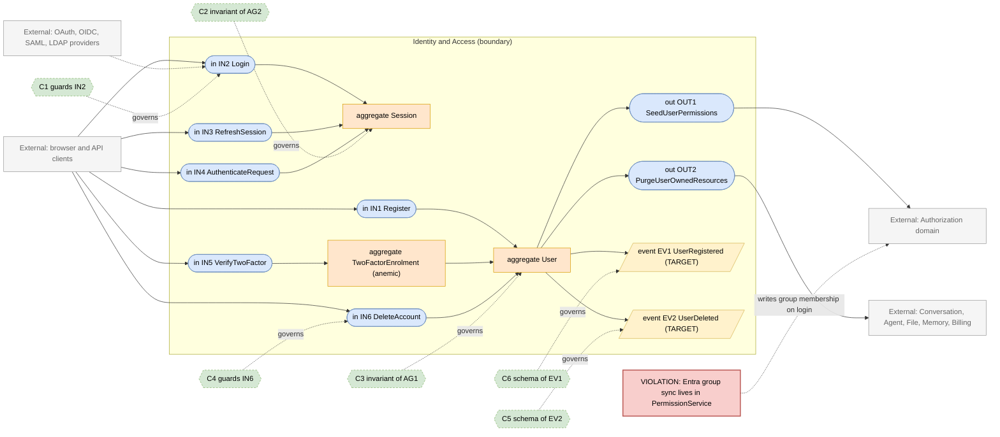
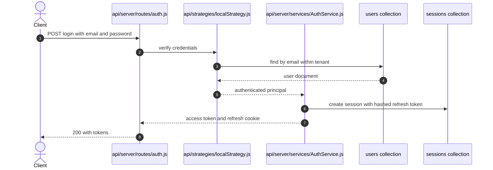

# Identity and Access Domain

> **Responsibility:** Establish and maintain who a request is — registration, credential and federated login, session and refresh-token lifecycle, two-factor enrolment, API keys, and the platform role attached to a user.
> **Confidence:** firm — the concepts and storage are unambiguous; the ambiguity is that group membership and platform-role assignment are written from two domains.
> **Owns the motivating feature/change:** no

Notation legend: see `references/diagram-and-grammar.md` in the DomainMap skill. Every ID drawn in section 2 is defined in section 3, one to one.

## 1. Ubiquitous language

| Term | Kind | Meaning | Source (path) |
|---|---|---|---|
| User | aggregate root | A person or service account, with credentials, provider links, and a platform role | packages/data-schemas/src/schema/user.ts |
| Session | aggregate root | A live refresh-token grant bound to one user and tenant | packages/data-schemas/src/schema/session.ts |
| Token | entity | Single-use hashed token for verification, password reset, or invite | packages/data-schemas/src/schema/token.ts |
| Provider | value object | Credential source: local, google, github, discord, apple, facebook, openid, saml, ldap | api/strategies/index.js |
| TwoFactorSecret | value object | TOTP secret plus backup codes, with a pending variant during enrolment | packages/data-schemas/src/schema/user.ts |
| PlatformRole | value object | Named role carrying feature permissions, distinct from an access role | packages/data-schemas/src/schema/role.ts |
| ApiKey | entity | Long-lived programmatic credential scoped to an agent | packages/data-schemas/src/schema/agentApiKey.ts |
| Tenant | value object | Isolation scope applied to nearly every collection | packages/data-schemas/src/models/plugins/tenantIsolation.ts |

```ebnf
(* 3a — vocabulary *)
Provider     = "local" | "google" | "github" | "discord" | "apple" | "facebook" | "openid" | "saml" | "ldap" ;
Credential   = passwordHash | providerSubjectId ;
PlatformRole = "USER" | "ADMIN" | customRoleName ;
TokenPurpose = "verify" | "resetPassword" | "invite" ;
SessionState = "active" | "expired" | "revoked" ;
```

## 2. Interface & Contract Boundary Map



## 3. Grammar

```ebnf
(* 3b — interface signatures, from api/server/controllers/auth and api/strategies *)
IN1_Register = "registerUser" , "(" , email , "," , password , "," , [ inviteToken ] , ")"
             , "->" , ( User | RegistrationRejected ) ;
IN2_Login    = "login" , "(" , Provider , "," , Credential , ")"
             , "->" , ( AccessToken , RefreshToken | TwoFactorRequired | AuthRejected ) ;
IN3_RefreshSession = "refresh" , "(" , RefreshToken , ")"
             , "->" , ( AccessToken , RefreshToken | SessionExpired ) ;
IN4_AuthenticateRequest = "requireJwtAuth" , "(" , AccessToken , ")"
             , "->" , ( RequestUser | Unauthorized ) ;
IN5_VerifyTwoFactor = "verifyTwoFactor" , "(" , userId , "," , ( totpCode | backupCode ) , ")"
             , "->" , ( AccessToken , RefreshToken | TwoFactorRejected ) ;
IN6_DeleteAccount = "deleteAccount" , "(" , userId , ")"
             , "->" , ( Deleted | DeletionRefused ) ;

OUT1_SeedUserPermissions = "seedPrincipalAndGrants" , "(" , userId , "," , PlatformRole , ")"
             , "->" , ( GrantSummary | GrantError ) ;
OUT2_PurgeUserOwnedResources = "deleteUserResources" , "(" , userId , ")"
             , "->" , PurgeReport ;

(* 3c — event schemas *)
EV1_UserRegistered = "UserRegistered" , "{" , userId , "," , email , "," , provider , "," , tenantId , "," , occurredAt , "}" ;
EV2_UserDeleted    = "UserDeleted" , "{" , userId , "," , tenantId , "," , occurredAt , "}" ;

(* 3d — contracts *)
C1 = governs IN2
     requires  provider in Provider
     requires  account is not banned
     requires  email domain is allowed
     ensures   Session created when two factor is not pending
     ensures   refreshTokenHash never stored in plaintext ;

C2 = governs AG2
     invariant refreshTokenHash exists
     invariant expiration is in the future for an active session
     invariant session belongs to exactly one user and tenant ;

C3 = governs AG1
     invariant email is unique within tenant
     invariant password absent when provider is federated
     invariant totpSecret absent until enrolment is confirmed ;

C4 = governs IN6
     requires  caller is the account owner or an administrator
     ensures   every resource owned by the user is purged or reassigned
     ensures   EV2 published ;

C5 = governs EV2
     schema { userId, tenantId, occurredAt } ;

C6 = governs EV1
     schema { userId, email, provider, tenantId, occurredAt } ;

(* 3e — aggregate composition *)
AG1_User = email , [ passwordHash ] , provider , { providerSubjectId } , PlatformRole , [ twoFactorEnabled ] , [ tenantId ] ;
AG2_Session = refreshTokenHash , expiration , userRef , [ tenantId ] ;
AG3_TwoFactorEnrolment = pendingTotpSecret , { pendingBackupCode } , confirmedAt ;
```

Target-only rules: `EV1_UserRegistered`, `EV2_UserDeleted`, `C5`, and `C6`. Today account deletion is an orchestrated fan-out of direct calls from `api/server/controllers/UserController.js`, not an event.

## 4. Aggregates

### AG1 · User
- **Purpose:** the identity record every other domain keys off.
- **Root / boundary:** `user` document; the consistency boundary is one person plus their provider links and two-factor state.
- **Invariants enforced** (contract): C3 — uniqueness, credential-versus-provider exclusivity, enrolment ordering.
- **Invariants leaking / unguarded:** the platform `role` field is written both here and by the OpenID role-sync path in `packages/api/src/auth/openidRoleSync.ts`; group membership derived from the same login is written by `api/server/services/PermissionService.js:508`, which belongs to Authorization.
- **Status:** aggregate, but with a leaking boundary — two domains write role and membership.

### AG2 · Session
- **Purpose:** bound refresh-token lifetime, revocable independently of the access token.
- **Root / boundary:** `session` document keyed by hashed refresh token.
- **Invariants enforced** (contract): C2.
- **Invariants leaking / unguarded:** the user document also carries `refreshToken` and `expiresAt` fields (`packages/data-schemas/src/schema/user.ts`), duplicating session state on the user aggregate.
- **Status:** fragmented — session state exists on two documents.

### AG3 · TwoFactorEnrolment
- **Purpose:** hold the half-finished enrolment so a failed confirmation cannot lock an account out.
- **Root / boundary:** embedded in the user document as `pendingTotpSecret` and `pendingBackupCodes`.
- **Invariants enforced** (contract): C3 covers the ordering rule.
- **Invariants leaking / unguarded:** the promotion from pending to confirmed is performed in `api/server/services/twoFactorService.js` and `api/server/controllers/TwoFactorController.js` rather than by the aggregate.
- **Status:** anemic — an embedded data bag with its transition rules in a service.

## 5. Logic placement

| Logic | Current location (path) | Verdict | Target location |
|---|---|---|---|
| Credential verification per provider | api/strategies/localStrategy.js and siblings | correct | Identity and Access |
| Session issue and refresh | packages/api/src/auth/refresh.ts | correct | Identity and Access |
| JWT request authentication | api/strategies/jwtStrategy.js and api/server/middleware/requireJwtAuth.js | correct | Identity and Access |
| Platform-role sync from OpenID claims | packages/api/src/auth/openidRoleSync.ts | correct | Identity and Access |
| Entra group membership sync | api/server/services/PermissionService.js:508 | misplaced: identity-provider integration inside Authorization | Identity and Access, publishing memberships outward |
| Ban and domain-allow checks | api/server/middleware/checkBan.js and checkDomainAllowed.js | correct | Identity and Access |
| Account deletion fan-out across domains | api/server/controllers/UserController.js | misplaced: orchestrates deletes inside other domains directly | Identity and Access emits EV2; each domain purges its own data |
| Two-factor enrolment transitions | api/server/services/twoFactorService.js | misplaced: aggregate transition in a service | Identity and Access aggregate |
| User document cache | packages/api/src/auth/userDocCache.ts | correct | Identity and Access |

## 6. Representative flow



- **Coupling points:** the federated login path in `api/server/controllers/auth/oauth.js` calls into `api/server/services/PermissionService.js` to synchronise group membership, so a login transaction writes Authorization-owned data. `packages/api/src/auth/openidRoleSync.ts` writes the platform role during the same request.
- **Hidden dependencies:** `applyTenantIsolation` on the user model silently scopes lookups by the ambient tenant; the user-document cache in `packages/api/src/auth/userDocCache.ts` is invalidated by convention rather than by a published change signal; session state is duplicated onto the user document, so a stale `refreshToken` field can disagree with the `sessions` collection.

## 7. Integration & ownership

| Talks to | Mechanism | Direction | Notes |
|---|---|---|---|
| Authorization | direct call plus a shared write of group documents | both directions | the shared write is the violation drawn in section 2 |
| Configuration | direct call to getAppConfig in api/server/routes/config.js | Identity to Configuration | login methods and registration flags are config-driven |
| Billing | direct call when seeding a starting balance | Identity to Billing | balance is created for new users |
| Conversation, Agent, File, Memory | direct call during account deletion | Identity to each | should be an event fan-out |
| Tooling | direct call to uninstall user OAuth MCP servers on delete | Identity to Tooling | see api/server/controllers/__tests__/deleteUserMcpServers.spec.js |

- **Data this domain OWNS:** `users`, `sessions`, `tokens`, `roles`, and the credential and two-factor fields on the user document.
- **Data it only READS (owned elsewhere):** `groups` and `aclentries` (Authorization), app configuration (Configuration).

## 8. Gaps & risks

| Gap | Evidence (path) | Severity | Target remedy |
|---|---|---|---|
| Group membership written by Authorization during a login transaction | api/server/services/PermissionService.js:508 | high | Move the sync here and publish memberships to Authorization |
| Session state duplicated on the user document | packages/data-schemas/src/schema/user.ts refreshToken and expiresAt | med | Make the sessions collection authoritative and drop the user fields |
| Account deletion is a hand-written fan-out into other domains | api/server/controllers/UserController.js | med | Publish EV2 and let each domain purge its own data |
| Two-factor transitions live in a service, not the aggregate | api/server/services/twoFactorService.js | med | Move the pending-to-confirmed transition behind the aggregate |
| Platform role written by two paths | packages/api/src/auth/openidRoleSync.ts and admin user routes | low | One role-assignment port, both callers routed through it |
| No registration event, so downstream seeding is implicit ordering | no publisher exists | low | Publish EV1 and let Billing and Authorization subscribe |

## 9. Target design

N/A — this domain does not own the motivating change. Its target-marked interfaces exist only to receive the Entra group sync relocated from Authorization, which is planned in `authorization.domain.md`.

## 10. Incremental refactor plan

1. Introduce a single role-assignment function in `packages/api/src/auth` and route both the OpenID sync and the admin user route through it. Behavior-preserving.
2. Accept the relocated Entra group sync from Authorization behind an explicit outbound port, so login stops writing Authorization collections inline.
3. Move the two-factor pending-to-confirmed transition out of `api/server/services/twoFactorService.js` and behind the user aggregate, keeping the controller signature unchanged.
4. Make the `sessions` collection authoritative: stop writing `refreshToken` and `expiresAt` on the user document, reading only from sessions.
5. Publish `UserRegistered` and `UserDeleted`; leave the existing direct deletion fan-out in place while subscribers are added.
6. Convert one deletion consumer at a time from the direct call to the event, deleting each direct call as its subscriber lands.

## 11. Transition validation

| Principle | Result | Justification |
|---|---|---|
| Reduces coupling | pass | Account deletion stops reaching into five domains; login stops writing Authorization data. |
| Clarifies ownership | pass | Sessions get one authoritative store; role assignment gets one writer. |
| Reinforces a boundary | pass | The user aggregate regains its two-factor transition, and the deletion event replaces cross-domain calls. |
| Avoids spreading legacy | pass | No new shared-collection writes; each move deletes a cross-domain reach-in rather than adding one. |

## 12. Required changes

- **Modify:** `api/server/controllers/UserController.js`, `api/server/services/twoFactorService.js`, `packages/api/src/auth/openidRoleSync.ts`, `packages/api/src/auth/refresh.ts`, `packages/data-schemas/src/schema/user.ts`.
- **Introduce:** a single role-assignment port; a group-membership outbound port toward Authorization; `UserRegistered` and `UserDeleted` publishers.
- **Refactor:** relocate the Entra sync from Authorization into this domain; collapse duplicated session fields onto the sessions collection; move two-factor transitions behind the aggregate.
- **Debt consciously accepted:** the nine provider strategies stay as separate Passport strategies rather than being unified behind one credential port — they are stable, individually tested, and unifying them yields no boundary improvement. The user document also keeps its embedded `plugins` array, which properly belongs to Tooling; extracting it would require a data migration that no current change needs.

Consistency checklist run: every diagram ID resolves to a grammar rule and back; every contract names a defined target; each gap-classed node appears in section 8; target-only rules are marked; no application code in this file.
