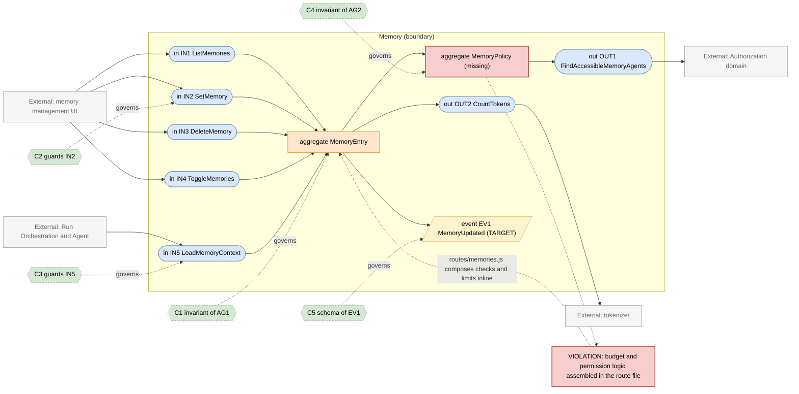
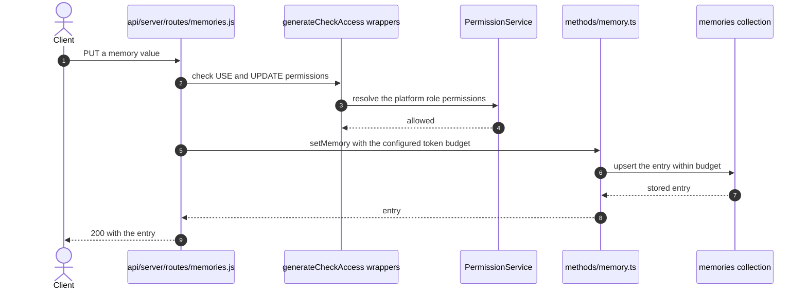

# Memory Domain

> **Responsibility:** Store, curate, and budget the durable facts an assistant remembers about a user between conversations, and expose them for injection into a run.
> **Confidence:** firm — small, well-bounded, with its own schema, routes, permission type, and configuration block.
> **Owns the motivating feature/change:** no

Notation legend: see `references/diagram-and-grammar.md` in the DomainMap skill. Every ID drawn in section 2 is defined in section 3, one to one.

## 1. Ubiquitous language

| Term | Kind | Meaning | Source (path) |
|---|---|---|---|
| MemoryEntry | aggregate root | One remembered fact, keyed and owned by a user | packages/data-schemas/src/schema/memory.ts |
| MemoryKey | value object | The stable slot a fact occupies, so updates replace rather than accumulate | packages/data-schemas/src/methods/memory.ts |
| MemoryBudget | value object | The token ceiling across all of a user's memories | packages/api/src/memory/config.ts |
| MemoryToggle | value object | Per-user opt-in that gates reading and writing | packages/data-schemas/src/methods/memory.ts |
| MemoryAgent | value object | The agent configured to curate memories during a run | packages/api/src/memory/config.ts |
| MemoryPermission | value object | The platform permission gating use, read, create, update, and delete | api/server/routes/memories.js |

```ebnf
(* 3a — vocabulary *)
MemoryKey      = identifier ;
MemoryScope    = "user" ;
MemoryAction   = "USE" | "READ" | "CREATE" | "UPDATE" | "DELETE" ;
MemoryBudget   = tokenCount ;
```

## 2. Interface & Contract Boundary Map



## 3. Grammar

```ebnf
(* 3b — interface signatures, from api/server/routes/memories.js and
   packages/data-schemas/src/methods/memory.ts *)
IN1_ListMemories = "getUserMemories" , "(" , userId , ")"
                 , "->" , { MemoryEntry } ;
IN2_SetMemory    = "setMemory" , "(" , userId , "," , MemoryKey , "," , value , ")"
                 , "->" , ( MemoryEntry | BudgetExceeded | Forbidden ) ;
IN3_DeleteMemory = "deleteMemory" , "(" , userId , "," , MemoryKey , ")"
                 , "->" , ( Deleted | NotFound ) ;
IN4_ToggleMemories = "toggleUserMemories" , "(" , userId , "," , enabled , ")"
                 , "->" , MemoryToggle ;
IN5_LoadMemoryContext = "loadMemoryContext" , "(" , userId , "," , MemoryBudget , ")"
                 , "->" , ( MemoryContext | Disabled ) ;

OUT1_FindAccessibleMemoryAgents = "findAccessibleResources" , "(" , userId , "," , "agent" , "," , requiredPermissions , ")"
                 , "->" , { agentId } ;
OUT2_CountTokens = "countTokens" , "(" , text , ")"
                 , "->" , tokenCount ;

(* 3c — event schemas *)
EV1_MemoryUpdated = "MemoryUpdated" , "{" , userId , "," , memoryKey , "," , action , "," , occurredAt , "}" ;

(* 3d — contracts *)
C1 = governs AG1
     invariant a memory key is unique per user and tenant
     invariant total memory tokens stay within the configured budget
     invariant a memory belongs to exactly one user ;

C2 = governs IN2
     requires  the caller holds the memory create or update permission
     requires  memories are enabled for the user
     ensures   writing an existing key replaces rather than appends
     ensures   a write that would exceed the budget is rejected whole
     ensures   EV1 published ;

C3 = governs IN5
     requires  memories are enabled for the user
     ensures   the returned context never exceeds the budget
     ensures   a disabled user contributes no memory context to the run ;

C4 = governs AG2
     invariant the memory agent is one the user may use
     invariant budget and permission rules have one definition ;

C5 = governs EV1
     schema { userId, memoryKey, action, occurredAt } ;

(* 3e — aggregate composition *)
AG1_MemoryEntry = userRef , MemoryKey , value , tokenCount , updatedAt ;
AG2_MemoryPolicy = MemoryBudget , MemoryAgent , { MemoryAction } ;
```

Target-only rules: `EV1_MemoryUpdated` and `C5`. `AG2_MemoryPolicy` is drawn as a gap node because the policy exists in behaviour but has no module: budget, agent selection, and permission composition are assembled in `api/server/routes/memories.js`.

## 4. Aggregates

### AG1 · MemoryEntry
- **Purpose:** hold one durable fact so it survives across conversations.
- **Root / boundary:** `memory` document keyed by user and key.
- **Invariants enforced** (contract): C1 — key uniqueness is enforced by the schema; the token budget is enforced in `packages/data-schemas/src/methods/memory.ts`.
- **Invariants leaking / unguarded:** the budget value itself is read from configuration in the route layer and passed in, so the aggregate enforces a limit it does not own; the `Tokenizer` used to measure entries is imported directly by `api/server/routes/memories.js`.
- **Status:** aggregate — small and well-formed, with its policy inputs supplied from outside.

### AG2 · MemoryPolicy (missing)
- **Purpose:** answer, in one place, whether this user may read or write memories, which agent curates them, and how large the budget is.
- **Root / boundary:** does not exist — the answer is assembled from five `generateCheckAccess` wrappers, a `findAccessibleResources` call, and a configuration read, all inside the route file.
- **Invariants enforced** (contract): C4 — target only.
- **Invariants leaking / unguarded:** because the composition lives in a route, the run-time path that injects memories into a turn cannot reuse it and re-derives the same decisions.
- **Status:** missing — drawn as a gap node and defined in the grammar so the map stays complete.

## 5. Logic placement

| Logic | Current location (path) | Verdict | Target location |
|---|---|---|---|
| Memory CRUD and key semantics | packages/data-schemas/src/methods/memory.ts | correct | Memory |
| Token budget enforcement | packages/data-schemas/src/methods/memory.ts with the limit passed in | correct | Memory, owning its own budget read |
| Memory configuration parsing | packages/api/src/memory/config.ts | correct | Memory |
| Permission composition | api/server/routes/memories.js | misplaced: five permission wrappers composed in a route | Memory policy module |
| Memory agent selection | api/server/routes/memories.js calling findAccessibleResources | misplaced: agent selection assembled in the route | Memory policy module |
| Token counting for entries | Tokenizer imported into api/server/routes/memories.js | misplaced: measurement wired at the transport layer | Memory, behind OUT2 |
| Memory injection into a run | agent initialisation and client paths | misplaced: re-derives enablement rather than calling IN5 | Memory, behind IN5 |

## 6. Representative flow



- **Coupling points:** the route composes Authorization checks, Configuration reads, and Tokenizer usage before the domain is entered, so the domain's own policy is only reachable through HTTP; the run-time injection path does not go through this route and therefore re-derives enablement independently.
- **Hidden dependencies:** the token budget arrives as a parameter, so a caller that omits it silently disables the limit; memory availability depends on both a platform permission and a per-user toggle, and the two are checked in different places; the memory-curating agent is selected by an accessible-resources query whose result depends on ACL state that can change mid-conversation.

## 7. Integration & ownership

| Talks to | Mechanism | Direction | Notes |
|---|---|---|---|
| Authorization | direct call for permission and agent accessibility | Memory to Authorization | composed in the route today |
| Agent | direct call to select the curating agent | Memory to Agent | id-based |
| Run Orchestration | direct call during turn assembly | Run to Memory | should use IN5 |
| Configuration | direct read of the memory block | Memory to Configuration | supplies the budget |
| Identity and Access | shared key — memories are keyed by user | Memory reads user ids | id-only |

- **Data this domain OWNS:** `memories` and the per-user memory toggle.
- **Data it only READS (owned elsewhere):** `agents` (Agent), `aclentries` and platform roles (Authorization), the memory configuration block (Configuration).

## 8. Gaps & risks

| Gap | Evidence (path) | Severity | Target remedy |
|---|---|---|---|
| Policy composition lives in a route, unreachable from the run path | api/server/routes/memories.js | high | Extract a memory policy module both paths call |
| Run-time injection re-derives enablement instead of calling the domain | agent initialisation paths | med | Route injection through IN5 |
| The token budget is a caller-supplied parameter | packages/data-schemas/src/methods/memory.ts | med | Have the domain read its own configuration |
| Token measurement wired at the transport layer | Tokenizer import in api/server/routes/memories.js | low | Move behind OUT2 inside the domain |
| Two independent gates (platform permission and user toggle) | routes/memories.js and methods/memory.ts | low | Combine in the policy module |
| No memory-change signal for caches or the UI | no publisher exists | low | Publish EV1 |

## 9. Target design

N/A — the motivating change is owned by `authorization.domain.md`. The policy module below depends on the consolidated permission port from that spec and is sequenced after it.

## 10. Incremental refactor plan

1. Extract a memory policy module in `packages/api/src/memory` that answers enablement, budget, and curating-agent selection, implemented by moving the existing route composition verbatim. Behavior-preserving.
2. Change `api/server/routes/memories.js` to call the policy module instead of composing checks inline.
3. Have the policy module read the memory configuration itself, so the budget stops being a caller-supplied parameter.
4. Expose `loadMemoryContext` as the single injection port and convert the agent initialisation path to call it.
5. Move token measurement inside the domain, behind the outbound tokenizer port.
6. Publish `MemoryUpdated` on set, delete, and toggle.

## 11. Transition validation

| Principle | Result | Justification |
|---|---|---|
| Reduces coupling | pass | The route stops composing three domains' concerns, and the run path stops re-deriving enablement. |
| Clarifies ownership | pass | Budget, enablement, and agent selection get one owner inside the domain. |
| Reinforces a boundary | pass | The policy module and the injection port are boundaries that do not exist today. |
| Avoids spreading legacy | pass | Step 1 moves existing code rather than reimplementing it; no new shared data access is added. |

## 12. Required changes

- **Modify:** `api/server/routes/memories.js`, `packages/data-schemas/src/methods/memory.ts`, `packages/api/src/memory/config.ts`, the agent initialisation path that injects memory context.
- **Introduce:** a memory policy module; a single memory-context injection port; a tokenizer port; a memory-updated event publisher.
- **Refactor:** move permission and agent-selection composition out of the route; make the budget domain-owned rather than caller-supplied.
- **Debt consciously accepted:** memories stay keyed only by user rather than gaining a per-agent or per-project scope. Adding scopes would change the aggregate's identity and there is no current requirement for it. The platform-permission gate also stays separate from the per-user toggle at the storage level; unifying them would require a data migration for a purely cosmetic simplification.

Consistency checklist run: every diagram ID resolves to a grammar rule and back; every contract names a defined target; each gap-classed node appears in section 8; target-only rules are marked; no application code in this file.
