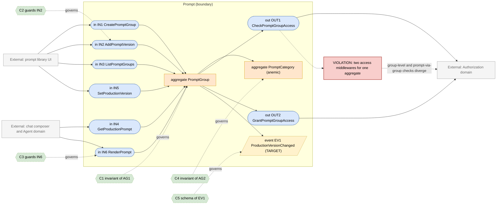
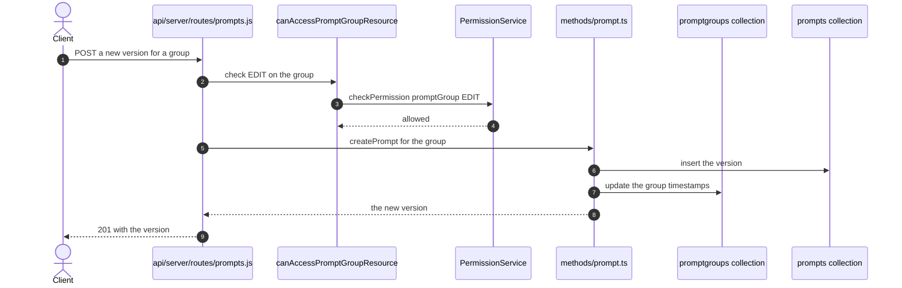

# Prompt Domain

> **Responsibility:** Own the reusable prompt library — prompt groups and their versioned prompts, categories, variable substitution, and the sharing model that decides who can see and run a saved prompt.
> **Confidence:** firm — the group-and-version model is explicit and the access path is already ACL-based; the ambiguity is that the group is the permission subject while the prompt is the aggregate the code most often handles.
> **Owns the motivating feature/change:** no

Notation legend: see `references/diagram-and-grammar.md` in the DomainMap skill. Every ID drawn in section 2 is defined in section 3, one to one.

## 1. Ubiquitous language

| Term | Kind | Meaning | Source (path) |
|---|---|---|---|
| PromptGroup | aggregate root | The named, shareable unit holding a prompt's versions and its production pointer | packages/data-schemas/src/schema/promptGroup.ts |
| Prompt | entity | One version of the text inside a group | packages/data-schemas/src/schema/prompt.ts |
| PromptCategory | entity | A grouping label used for browsing the library | packages/data-schemas/src/schema/categories.ts |
| PromptVariable | value object | A named placeholder substituted at use time | packages/api/src/prompts/format.ts |
| ProductionPrompt | value object | The version pointer a group resolves to when run | packages/data-schemas/src/methods/prompt.ts |
| PromptType | value object | Whether the prompt is a chat template or a plain text block | packages/data-schemas/src/schema/prompt.ts |
| PromptArtifact | value object | Structured output instructions bundled with a prompt | packages/api/src/prompts/artifacts |

```ebnf
(* 3a — vocabulary *)
PromptType     = "text" | "chat" ;
PromptVariable = "{{" , identifier , "}}" ;
GroupVisibility = "private" | "shared" | "public" ;
VersionPointer = promptId ;
```

## 2. Interface & Contract Boundary Map



## 3. Grammar

```ebnf
(* 3b — interface signatures, from api/server/routes/prompts.js,
   packages/data-schemas/src/methods/prompt.ts and packages/api/src/prompts *)
IN1_CreatePromptGroup = "createPromptGroup" , "(" , userId , "," , name , "," , PromptType , "," , initialPrompt , "," , [ categoryId ] , ")"
                      , "->" , ( PromptGroup | ValidationRejected ) ;
IN2_AddPromptVersion  = "createPrompt" , "(" , groupId , "," , userId , "," , promptText , ")"
                      , "->" , ( Prompt | Forbidden ) ;
IN3_ListPromptGroups  = "getPromptGroups" , "(" , userId , "," , [ categoryId ] , "," , [ cursor ] , ")"
                      , "->" , PromptGroupPage ;
IN4_GetProductionPrompt = "getPromptGroup" , "(" , groupId , "," , userId , ")"
                      , "->" , ( Prompt | Forbidden | NotFound ) ;
IN5_SetProductionVersion = "updateProductionPrompt" , "(" , groupId , "," , userId , "," , VersionPointer , ")"
                      , "->" , ( PromptGroup | Forbidden ) ;
IN6_RenderPrompt = "renderPrompt" , "(" , promptText , "," , { PromptVariable } , "," , variableValues , ")"
                      , "->" , ( RenderedPrompt | UnresolvedVariable ) ;

OUT1_CheckPromptGroupAccess = "checkPermission" , "(" , userId , "," , "promptGroup" , "," , groupId , "," , requiredPermission , ")"
                      , "->" , boolean ;
OUT2_GrantPromptGroupAccess = "grantPermission" , "(" , principal , "," , "promptGroup" , "," , groupId , "," , accessRoleId , ")"
                      , "->" , ( AclEntry | GrantError ) ;

(* 3c — event schemas *)
EV1_ProductionVersionChanged = "ProductionVersionChanged" , "{" , groupId , "," , previousVersion , "," , newVersion , "," , changedBy , "," , occurredAt , "}" ;

(* 3d — contracts *)
C1 = governs AG1
     invariant a group always points at exactly one production version
     invariant every prompt in the group shares the group's type
     invariant deleting the production version promotes another or deletes the group
     invariant the group name is unique per owner and tenant ;

C2 = governs IN2
     requires  caller holds EDIT on the group
     requires  the new version matches the group's PromptType
     ensures   the prior production pointer is unchanged unless explicitly moved ;

C3 = governs IN6
     requires  every variable in the text has a supplied value or a declared default
     ensures   an unresolved variable is reported rather than rendered literally
     ensures   rendering never mutates the stored prompt ;

C4 = governs AG2
     invariant a category is referenced by zero or more groups and owns none of them ;

C5 = governs EV1
     schema { groupId, previousVersion, newVersion, changedBy, occurredAt } ;

(* 3e — aggregate composition *)
AG1_PromptGroup = groupId , name , PromptType , ownerRef , { Prompt } , VersionPointer , [ categoryId ] ;
AG2_PromptCategory = categoryId , label , [ tenantId ] ;
```

Target-only rules: `EV1_ProductionVersionChanged` and `C5`. Today a version change is visible only by re-reading the group.

## 4. Aggregates

### AG1 · PromptGroup
- **Purpose:** be the shareable, versioned unit — the thing a permission is granted on and the thing a chat composer resolves.
- **Root / boundary:** `promptGroup` document plus the `prompt` documents that reference it; the production pointer is the invariant that binds them.
- **Invariants enforced** (contract): C1 — the production pointer and group-prompt relationship are maintained in `packages/data-schemas/src/methods/prompt.ts`.
- **Invariants leaking / unguarded:** the group is the permission subject but the prompt is what most code handles, so access is checked two ways — `canAccessPromptGroupResource.js` for the group and `canAccessPromptViaGroup.js` for a prompt reached through its group. Two middlewares encoding one rule is where the two can drift.
- **Status:** aggregate — real invariants, with a split access path.

### AG2 · PromptCategory
- **Purpose:** provide browsing structure over the library.
- **Root / boundary:** `categories` document; membership is a field on the group.
- **Invariants enforced** (contract): C4 — categories reference groups without owning them.
- **Invariants leaking / unguarded:** categories are seeded at boot by `ensureDefaultCategories` in `api/models/index.js`, so their identity depends on start-up order; they are also shared with the Agent domain's marketplace categories in intent though not in schema.
- **Status:** anemic — a lookup table with no behaviour.

## 5. Logic placement

| Logic | Current location (path) | Verdict | Target location |
|---|---|---|---|
| Group and version CRUD | packages/data-schemas/src/methods/prompt.ts | correct | Prompt |
| Production pointer maintenance | packages/data-schemas/src/methods/prompt.ts | correct | Prompt |
| Group-level access check | api/server/middleware/accessResources/canAccessPromptGroupResource.js | correct | Prompt calling Authorization |
| Prompt-via-group access check | api/server/middleware/accessResources/canAccessPromptViaGroup.js | duplicated: a second encoding of the same rule | Prompt, one check |
| Variable formatting and substitution | packages/api/src/prompts/format.ts | correct | Prompt |
| Prompt schema validation | packages/api/src/prompts/schemas.ts | correct | Prompt |
| Legacy prompt migration | packages/api/src/prompts/migration.ts | correct | Prompt |
| Artifact instruction bundling | packages/api/src/prompts/artifacts | misplaced: output-format instructions shared with the Agent domain | a shared instruction module both domains consume |
| Category seeding | api/models/index.js ensureDefaultCategories | misplaced: reference data seeded at boot | Configuration |
| Permission grants on share | api/server/routes/prompts.js | correct | Prompt calling Authorization |

## 6. Representative flow



- **Coupling points:** two access middlewares encode the same group-ownership rule for different entry shapes; the version insert and the group update are two writes with no transaction, so the group can lag its versions.
- **Hidden dependencies:** the production pointer is what the chat composer resolves, so a group whose pointer is stale silently serves the wrong text; category identity depends on boot seeding; `applyTenantIsolation` on both the prompt and group models scopes reads by an ambient tenant, so a cross-tenant group reference resolves to nothing rather than to an error.

## 7. Integration & ownership

| Talks to | Mechanism | Direction | Notes |
|---|---|---|---|
| Authorization | direct call for checks and grants | Prompt to Authorization | group is the ACL resource |
| Agent | shared instruction module for artifacts | both directions | packages/api/src/prompts/artifacts is consumed by agent runs |
| Conversation | direct read when a saved prompt seeds a turn | Conversation to Prompt | read-only |
| Configuration | direct read for prompt permissions and limits | Prompt to Configuration | read-only |
| Identity and Access | shared key — groups are owned by users | Prompt reads user ids | id-only |

- **Data this domain OWNS:** `promptgroups`, `prompts`, and `categories`.
- **Data it only READS (owned elsewhere):** `users` (Identity and Access), `aclentries` (Authorization), app configuration (Configuration).

## 8. Gaps & risks

| Gap | Evidence (path) | Severity | Target remedy |
|---|---|---|---|
| One access rule encoded by two middlewares | canAccessPromptGroupResource.js and canAccessPromptViaGroup.js | med | Resolve the prompt to its group once, then apply one check |
| Version insert and group update are not atomic | packages/data-schemas/src/methods/prompt.ts | med | Make version creation a single operation over both collections |
| Artifact instructions shared by copy between Prompt and Agent | packages/api/src/prompts/artifacts | med | Extract one instruction module both domains import |
| Category reference data seeded at boot | api/models/index.js ensureDefaultCategories | low | Move category seeding into Configuration |
| Stale production pointer silently serves the wrong text | packages/data-schemas/src/methods/prompt.ts | low | Publish EV1 and validate the pointer on read |
| Category concept overlaps the Agent marketplace category without sharing a schema | categories.ts and agentCategory.ts | low | Name them distinctly in the ubiquitous language |

## 9. Target design

N/A — the motivating change is owned by `authorization.domain.md`. Collapsing the two access middlewares depends on the consolidated permission port from that spec and is sequenced after it.

## 10. Incremental refactor plan

1. Resolve a prompt to its group once in a shared helper, then apply the single group-level check, so `canAccessPromptViaGroup.js` becomes a thin caller of `canAccessPromptGroupResource.js`. Behavior-preserving.
2. Make version creation a single operation covering the version insert and the group update.
3. Extract the artifact instruction text into one module imported by both Prompt and Agent, deleting the second copy.
4. Move category seeding out of `api/models/index.js` into the Configuration domain's start-up sequence.
5. Publish `ProductionVersionChanged` on pointer moves; use it to invalidate composer caches.
6. Validate the production pointer on read and repair or report a dangling pointer rather than serving nothing.

## 11. Transition validation

| Principle | Result | Justification |
|---|---|---|
| Reduces coupling | pass | Two access encodings become one, and the artifact instruction copy shared with Agent is deduplicated. |
| Clarifies ownership | pass | Category reference data moves to Configuration; the group becomes the single access subject. |
| Reinforces a boundary | pass | Atomic version creation makes the group aggregate's boundary real rather than conventional. |
| Avoids spreading legacy | pass | Each step deletes a duplicate or a boot-time side effect; nothing new reaches across a boundary. |

## 12. Required changes

- **Modify:** `api/server/middleware/accessResources/canAccessPromptViaGroup.js`, `api/server/middleware/accessResources/canAccessPromptGroupResource.js`, `packages/data-schemas/src/methods/prompt.ts`, `packages/api/src/prompts/artifacts`, `api/models/index.js`, `api/server/routes/prompts.js`.
- **Introduce:** a shared prompt-to-group resolution helper; one shared artifact instruction module; a production-version-changed event publisher.
- **Refactor:** collapse the duplicate access check; atomicise version creation; relocate category seeding to Configuration.
- **Debt consciously accepted:** prompt versions stay as separate documents rather than an embedded array on the group. Embedding would simplify atomicity but would break the existing pagination over versions, and the current model is not causing correctness problems. The naming overlap between prompt categories and agent marketplace categories is also left in place; renaming would ripple through the frontend for a purely descriptive gain.

Consistency checklist run: every diagram ID resolves to a grammar rule and back; every contract names a defined target; each gap-classed node appears in section 8; target-only rules are marked; no application code in this file.
