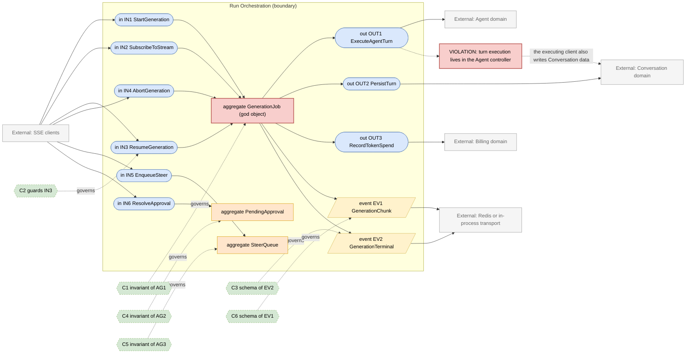
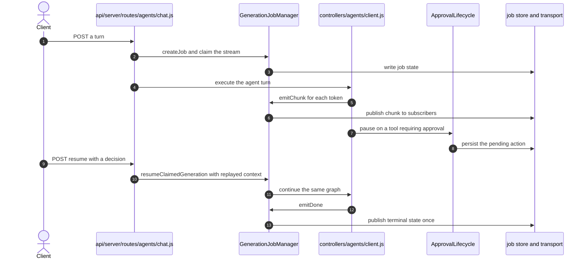

# Run Orchestration Domain

> **Responsibility:** Own the lifecycle of a single generation — claim it on one replica, stream its events to any replica, pause it for human approval or steering, resume or abort it, and drive it to a terminal state exactly once.
> **Confidence:** provisional — the concepts are real and named in code, but the domain has no module boundary of its own: it is spread between one very large manager class and the agent controller tree.
> **Owns the motivating feature/change:** no

Notation legend: see `references/diagram-and-grammar.md` in the DomainMap skill. Every ID drawn in section 2 is defined in section 3, one to one.

## 1. Ubiquitous language

| Term | Kind | Meaning | Source (path) |
|---|---|---|---|
| GenerationJob | aggregate root | One in-flight generation, identified by a stream id and claimed by one replica | packages/api/src/stream/GenerationJobManager.ts |
| StreamId | value object | The conversation-scoped identifier a client subscribes to | packages/api/src/types/stream.ts |
| Claim | value object | The lease a replica holds while it drives a job | packages/api/src/stream/GenerationJobManager.ts |
| PendingAction | entity | A paused tool call awaiting human approval | packages/api/src/stream/ApprovalLifecycle.ts |
| PendingSteer | entity | A queued user interjection applied mid-run | packages/api/src/stream/SteeringLifecycle.ts |
| EventTransport | value object | The cross-replica fan-out channel, in-memory or Redis | packages/api/src/stream/implementations/RedisEventTransport.ts |
| JobStore | value object | Where job state lives, in-memory or Redis | packages/api/src/stream/interfaces/IJobStore.ts |
| ResumeContext | value object | The graph-determining config replayed onto a resumed turn | api/server/routes/agents/chat.js |

```ebnf
(* 3a — vocabulary *)
JobStatus     = "queued" | "running" | "paused" | "completed" | "failed" | "aborted" ;
ClaimState    = "unclaimed" | "claimed" | "released" ;
PauseReason   = "approval" | "steer" | "oauth" ;
StreamId      = conversationId ;
TransportKind = "memory" | "redis" ;
```

## 2. Interface & Contract Boundary Map



## 3. Grammar

```ebnf
(* 3b — interface signatures, from packages/api/src/stream/GenerationJobManager.ts,
   SteeringLifecycle.ts, ApprovalLifecycle.ts and api/server/controllers/agents *)
IN1_StartGeneration = "createJob" , "(" , StreamId , "," , userId , "," , runMetadata , ")"
                    , "->" , ( Claim | AlreadyRunning ) ;
IN2_SubscribeToStream = "subscribeWithResume" , "(" , StreamId , "," , [ lastEventId ] , ")"
                    , "->" , EventStream ;
IN3_ResumeGeneration = "resumeClaimedGeneration" , "(" , StreamId , "," , ResumeContext , ")"
                    , "->" , ( Claim | ResumeRefused ) ;
IN4_AbortGeneration = "abortJob" , "(" , StreamId , "," , userId , ")"
                    , "->" , ( Aborted | NotFound ) ;
IN5_EnqueueSteer    = "enqueue" , "(" , StreamId , "," , userId , "," , steerContent , ")"
                    , "->" , ( PendingSteer | SteerRefused ) ;
IN6_ResolveApproval = "resolve" , "(" , StreamId , "," , actionId , "," , decision , ")"
                    , "->" , ( Resumed | ApprovalExpired ) ;

OUT1_ExecuteAgentTurn = "runAgentTurn" , "(" , ResolvedAgent , "," , messages , "," , callbacks , ")"
                    , "->" , ( TurnResult | TurnError ) ;
OUT2_PersistTurn = "saveTurn" , "(" , conversationId , "," , userMessage , "," , responseMessage , ")"
                    , "->" , SavedTurn ;
OUT3_RecordTokenSpend = "spendTokens" , "(" , txMetadata , "," , tokenUsage , ")"
                    , "->" , SpendResult ;

(* 3c — event schemas *)
EV1_GenerationChunk = "GenerationChunk" , "{" , streamId , "," , sequence , "," , payload , "," , createdAt , "}" ;
EV2_GenerationTerminal = "GenerationTerminal" , "{" , streamId , "," , status , "," , [ error ] , "," , finishedAt , "}" ;

(* 3d — contracts *)
C1 = governs AG1
     invariant at most one replica holds the claim for a stream id
     invariant a terminal status is published exactly once
     invariant a paused job retains the config needed to rebuild the same graph
     invariant job state and event transport agree on the job creation timestamp ;

C2 = governs IN3
     requires  a pending action exists for the stream
     requires  the resumed graph is rebuilt from the stored resume context
     ensures   the client cannot substitute a different tool set on resume
     ensures   the claim is re-acquired before any chunk is emitted ;

C3 = governs EV2
     schema { streamId, status, error, finishedAt } ;

C4 = governs AG2
     invariant a pending action expires rather than blocking forever
     invariant only the owning user may resolve an approval ;

C5 = governs AG3
     invariant steers apply in enqueue order
     invariant a parked steer is recoverable after a replica restart ;

C6 = governs EV1
     schema { streamId, sequence, payload, createdAt } ;

(* 3e — aggregate composition *)
AG1_GenerationJob = StreamId , userId , JobStatus , ClaimState , runMetadata , [ PendingAction ] , { PendingSteer } ;
AG2_PendingApproval = actionId , StreamId , toolCall , expiresAt , [ decision ] ;
AG3_SteerQueue = StreamId , { PendingSteer } , [ parkedRecovery ] ;
```

`AG1_GenerationJob` is drawn with the `gap` class because it is real and load-bearing but oversized: the manager implementing it is 6899 lines in `packages/api/src/stream/GenerationJobManager.ts`.

## 4. Aggregates

### AG1 · GenerationJob
- **Purpose:** guarantee that one generation is driven by exactly one replica and observed identically by every client.
- **Root / boundary:** the job record in the job store, keyed by stream id, plus its claim and terminal state.
- **Invariants enforced** (contract): C1 — single claim, exactly-once terminal, resume fidelity. These are genuinely enforced, through `claimGeneration`, `claimTerminalJob`, and `publishTerminalClaim`.
- **Invariants leaking / unguarded:** the aggregate is a single class carrying claim leasing, event fan-out, resume state, approval expiry, steering preemption, activity labels, and metrics. Approval and steering have been partially extracted into `ApprovalLifecycle` and `SteeringLifecycle`, but both take the manager back as a collaborator, so the boundary is not closed.
- **Status:** aggregate, but a god object — one class, 6899 lines, holding at least five distinct responsibilities.

### AG2 · PendingApproval
- **Purpose:** hold a paused tool call so a human can approve or reject it without losing the run.
- **Root / boundary:** `packages/api/src/stream/ApprovalLifecycle.ts`; the pause-persistence handshake is its consistency boundary.
- **Invariants enforced** (contract): C4 — expiry and owner-only resolution.
- **Invariants leaking / unguarded:** `failStalePausePersistence` and `waitForPausePersistence` expose the handshake to callers, so the pause protocol is partly the caller's responsibility.
- **Status:** aggregate — correctly extracted, boundary not yet sealed.

### AG3 · SteerQueue
- **Purpose:** apply user interjections to a running generation in order, surviving replica restarts.
- **Root / boundary:** `packages/api/src/stream/SteeringLifecycle.ts`.
- **Invariants enforced** (contract): C5 — ordering and parked-steer recovery.
- **Invariants leaking / unguarded:** synthesising applied-steer events is a free function (`synthesizeAppliedSteerEvents`) rather than aggregate behaviour, and preempt rearming lives back on the manager.
- **Status:** aggregate — extracted, with behaviour still split against the manager.

## 5. Logic placement

| Logic | Current location (path) | Verdict | Target location |
|---|---|---|---|
| Claim leasing and takeover | packages/api/src/stream/GenerationJobManager.ts | correct | Run Orchestration |
| Cross-replica event fan-out | packages/api/src/stream/implementations/RedisEventTransport.ts | correct | Run Orchestration |
| Terminal-state exactly-once publication | packages/api/src/stream/GenerationJobManager.ts | correct | Run Orchestration |
| Approval pause and resume | packages/api/src/stream/ApprovalLifecycle.ts | correct | Run Orchestration |
| Steering queue and preemption | packages/api/src/stream/SteeringLifecycle.ts | correct | Run Orchestration |
| Turn execution and provider streaming | api/server/controllers/agents/client.js | misplaced: the run is executed inside the Agent controller tree | Run Orchestration |
| Message and conversation persistence during a run | api/app/clients/BaseClient.js and api/server/controllers/agents/client.js | misplaced: writes another domain's collections | Conversation, through OUT2 |
| Token spend on abort | api/server/middleware/abortMiddleware.js:163 | misplaced: billing rules invoked from transport middleware | Billing, through OUT3 |
| Resume-context replay | api/server/routes/agents/chat.js | misplaced: route middleware reconstructs domain state | Run Orchestration |
| Metrics and job counts | packages/api/src/stream/GenerationJobManager.ts | correct | Run Orchestration |

## 6. Representative flow



- **Coupling points:** execution enters from the Agent controller and writes Conversation collections mid-flight, so a single run touches three domains without an interface between them; the resume path reconstructs graph-determining config in route middleware because the job metadata is the only place it survives.
- **Hidden dependencies:** job state and event transport must agree on a creation timestamp, and several methods take `expectedCreatedAt` to enforce that by convention; the in-memory transport silently changes semantics in single-process deployments versus Redis; leader election in `packages/api/src/cluster/LeaderElection.ts` implicitly governs which replica performs sweep work; the abort middleware records spend outside the job lifecycle, so an aborted run's accounting depends on middleware ordering.

## 7. Integration & ownership

| Talks to | Mechanism | Direction | Notes |
|---|---|---|---|
| Agent | shared module — execution lives in the Agent controller tree | entangled | the principal gap for this domain |
| Conversation | direct write during a run | Run to Conversation data | should go through a persistence port |
| Billing | direct call to spendTokens from the run and from abort middleware | Run to Billing | two call sites, one of them in transport middleware |
| Tooling | direct call for tool execution and MCP OAuth pauses | Run to Tooling | approval pauses originate here |
| Redis | event transport and job store | both directions | pluggable, correctly abstracted |
| Configuration | direct read for stream and cluster settings | Run to Configuration | read-only |

- **Data this domain OWNS:** job state, claims, pending actions, steer queues, and the generation event stream.
- **Data it only READS (owned elsewhere):** agent configuration (Agent), conversation and message documents (Conversation), balance state (Billing).

## 8. Gaps & risks

| Gap | Evidence (path) | Severity | Target remedy |
|---|---|---|---|
| The job aggregate is a 6899-line god object | packages/api/src/stream/GenerationJobManager.ts | high | Split claim leasing, event fan-out, and job state into three collaborators |
| Turn execution lives in the Agent controller, not this domain | api/server/controllers/agents/client.js | high | Move execution here and call Agent only to resolve configuration |
| Runs write Conversation collections directly | api/app/clients/BaseClient.js:941 | high | Route persistence through a Conversation port |
| Approval and steering still call back into the manager | ApprovalLifecycle.ts and SteeringLifecycle.ts constructors | med | Invert the dependency so the manager drives them, not the reverse |
| Token spend is triggered from abort middleware | api/server/middleware/abortMiddleware.js:163 | med | Record spend from the job terminal transition instead |
| Resume context is rebuilt in route middleware | api/server/routes/agents/chat.js | med | Make resume context part of the job aggregate's published state |
| Timestamp agreement between store and transport is by convention | expectedCreatedAt parameters throughout GenerationJobManager.ts | low | Make the creation stamp part of the claim value object |

## 9. Target design

N/A — the motivating change is owned by `authorization.domain.md`. This domain's target work is the execution split described in section 10, which is sequenced after the authorization consolidation because it touches far more call sites.

## 10. Incremental refactor plan

1. Extract claim leasing from `GenerationJobManager` into a `ClaimLease` collaborator with the same method signatures, keeping the manager as a facade. Behavior-preserving.
2. Extract event fan-out (chunk, done, error emission and subscription) into a `StreamChannel` collaborator behind the same facade.
3. Invert the approval and steering dependencies so the manager passes them what they need instead of handing them itself.
4. Move token spend from `api/server/middleware/abortMiddleware.js` to the job terminal transition, so every ending path accounts identically.
5. Promote resume context to a named field of the job aggregate and delete the route-middleware reconstruction.
6. Move persistence calls out of the executing client into a Conversation port, coordinated with step 2 of `conversation.domain.md`.
7. Move the execution loop itself out of `api/server/controllers/agents/client.js` into this domain, leaving the Agent domain responsible only for producing a resolved agent.

## 11. Transition validation

| Principle | Result | Justification |
|---|---|---|
| Reduces coupling | pass | Execution stops straddling Agent, Conversation, and Billing; each becomes a named port. |
| Clarifies ownership | pass | Job state, claims, and the event stream get one owner; conversation writes and spend recording move to their owners. |
| Reinforces a boundary | pass | Splitting the god object into named collaborators creates internal boundaries where a single class exists today. |
| Avoids spreading legacy | pass | Each extraction keeps the facade signature, so no new caller learns the internals; no new direct collection access is introduced. |

## 12. Required changes

- **Modify:** `packages/api/src/stream/GenerationJobManager.ts`, `packages/api/src/stream/ApprovalLifecycle.ts`, `packages/api/src/stream/SteeringLifecycle.ts`, `api/server/controllers/agents/client.js`, `api/server/middleware/abortMiddleware.js`, `api/server/routes/agents/chat.js`.
- **Introduce:** a `ClaimLease` collaborator, a `StreamChannel` collaborator, a resume-context field on the job aggregate, and explicit persistence and spend ports.
- **Refactor:** invert the approval and steering dependencies; relocate the execution loop from the Agent controller; consolidate spend recording onto the terminal transition.
- **Debt consciously accepted:** the dual in-memory and Redis implementations stay as they are. They are already behind interfaces and the semantic differences between them are a deployment concern, not a boundary problem. The `expectedCreatedAt` convention also stays until the claim value object exists, because changing it earlier would touch dozens of call sites for no boundary gain.

Consistency checklist run: every diagram ID resolves to a grammar rule and back; every contract names a defined target; each gap-classed node appears in section 8; target-only rules are marked; no application code in this file.
