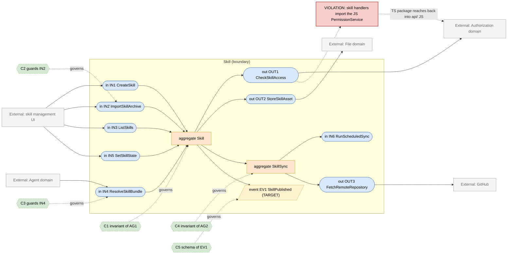
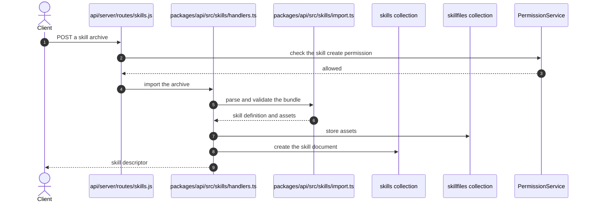

# Skill Domain

> **Responsibility:** Own reusable skill packages — their identity and naming rules, bundled files, import and GitHub synchronisation, deployment state, and the per-user or per-agent enablement that decides whether a skill is loaded into a run.
> **Confidence:** firm — this is the newest subsystem in the repository and its boundary is the cleanest, with schema-level naming rules and a dedicated package.
> **Owns the motivating feature/change:** no

Notation legend: see `references/diagram-and-grammar.md` in the DomainMap skill. Every ID drawn in section 2 is defined in section 3, one to one.

## 1. Ubiquitous language

| Term | Kind | Meaning | Source (path) |
|---|---|---|---|
| Skill | aggregate root | A named package of instructions plus optional bundled files | packages/data-schemas/src/schema/skill.ts |
| SkillFile | entity | One binary or text asset belonging to a skill | packages/data-schemas/src/schema/skillFile.ts |
| SkillSyncStatus | entity | The outcome of the most recent synchronisation attempt | packages/data-schemas/src/schema/skillSyncStatus.ts |
| SkillSyncCredential | entity | The credential used to reach a remote skill source | packages/data-schemas/src/schema/skillSyncCredential.ts |
| SkillState | value object | Whether a skill is enabled for a given user or agent | packages/api/src/skills/skillStates.ts |
| ReservedName | value object | A name prefix or word a skill may not use | packages/data-schemas/src/schema/skill.ts |
| DeploymentSkill | value object | A first-party skill supplied by the deployment rather than a user | packages/api/src/skills/deployment.ts |
| SkillBundle | value object | The resolved instructions and files handed to a run | packages/api/src/skills/index.ts |

```ebnf
(* 3a — vocabulary *)
SkillName      = lowercaseWord , { "-" , lowercaseWord } ;
ReservedPrefix = "anthropic-" | "claude-" ;
ReservedWord   = "help" | "clear" | "compact" | "model" | "exit" | "quit" | "settings" | "anthropic" | "claude" ;
SkillOrigin    = "user" | "imported" | "synced" | "deployment" ;
SyncOutcome    = "pending" | "succeeded" | "failed" ;
```

## 2. Interface & Contract Boundary Map



## 3. Grammar

```ebnf
(* 3b — interface signatures, from packages/api/src/skills and api/server/routes/skills.js *)
IN1_CreateSkill = "createSkill" , "(" , userId , "," , SkillName , "," , description , "," , body , "," , { asset } , ")"
                , "->" , ( Skill | NameRejected | LimitExceeded ) ;
IN2_ImportSkillArchive = "importSkill" , "(" , userId , "," , archive , ")"
                , "->" , ( Skill | ImportRejected ) ;
IN3_ListSkills  = "listSkills" , "(" , userId , "," , [ SkillOrigin ] , ")"
                , "->" , { SkillDescriptor } ;
IN4_ResolveSkillBundle = "resolveSkills" , "(" , { SkillName } , "," , userId , "," , [ agentId ] , ")"
                , "->" , ( SkillBundle | SkillUnavailable ) ;
IN5_SetSkillState = "setSkillState" , "(" , userId , "," , SkillName , "," , enabled , "," , [ agentId ] , ")"
                , "->" , SkillState ;
IN6_RunScheduledSync = "runSync" , "(" , sourceId , ")"
                , "->" , SkillSyncStatus ;

OUT1_CheckSkillAccess = "checkPermission" , "(" , userId , "," , "skill" , "," , skillId , "," , requiredPermission , ")"
                , "->" , boolean ;
OUT2_StoreSkillAsset = "storeAsset" , "(" , skillId , "," , filename , "," , bytes , ")"
                , "->" , ( StoredRef | StorageError ) ;
OUT3_FetchRemoteRepository = "fetchRepository" , "(" , repositoryRef , "," , SkillSyncCredential , ")"
                , "->" , ( RepositorySnapshot | FetchError ) ;

(* 3c — event schemas *)
EV1_SkillPublished = "SkillPublished" , "{" , skillId , "," , skillName , "," , origin , "," , publishedBy , "," , occurredAt , "}" ;

(* 3d — contracts *)
C1 = governs AG1
     invariant name matches the kebab-case pattern and is at most 64 characters
     invariant name does not start with a reserved prefix
     invariant name is not a reserved command word
     invariant body is at most 100000 characters
     invariant name is unique per owner and tenant ;

C2 = governs IN2
     requires  the archive contains a skill definition file
     requires  total asset size is within the configured limit
     ensures   assets are stored before the skill becomes listable
     ensures   an import that violates C1 is rejected whole ;

C3 = governs IN4
     requires  caller holds VIEW on every named skill
     ensures   a named skill that cannot be resolved fails the run rather than being dropped
     ensures   deployment skills are resolvable without a per-user grant ;

C4 = governs AG2
     invariant a sync never partially replaces a skill
     invariant credentials are stored encrypted
     invariant a failed sync leaves the previous skill version intact ;

C5 = governs EV1
     schema { skillId, skillName, origin, publishedBy, occurredAt } ;

(* 3e — aggregate composition *)
AG1_Skill = skillId , SkillName , displayTitle , description , body , SkillOrigin , { SkillFile } , ownerRef ;
AG2_SkillSync = sourceId , repositoryRef , SkillSyncCredential , SkillSyncStatus , lastRunAt ;
```

Target-only rules: `EV1_SkillPublished` and `C5`. Today skill availability changes are visible only by re-querying.

## 4. Aggregates

### AG1 · Skill
- **Purpose:** be the unit of reusable instruction a run can load, with a stable name that is safe to use as a slash command.
- **Root / boundary:** `skill` document plus its `skillFile` assets.
- **Invariants enforced** (contract): C1 — genuinely enforced at the schema level in `packages/data-schemas/src/schema/skill.ts`, including the reserved-prefix and reserved-word lists and the length limits.
- **Invariants leaking / unguarded:** the reserved lists are duplicated between the schema and `packages/data-schemas/src/methods/skill.ts`, with a comment in each telling the reader to keep them in sync. Asset storage is a separate write from the skill document, so an import can leave assets without a skill.
- **Status:** aggregate — the best-defended aggregate in the repository, with one duplication risk.

### AG2 · SkillSync
- **Purpose:** keep skills sourced from a remote repository up to date without losing the working copy on failure.
- **Root / boundary:** the sync source with its credential and status documents; orchestration in `packages/api/src/skills/sync/orchestrator.ts`.
- **Invariants enforced** (contract): C4 — atomic replacement and encrypted credentials.
- **Invariants leaking / unguarded:** the scheduler in `packages/api/src/skills/sync/scheduler.ts` decides when a sync runs based on process-local timing, so in a fleet the same sync can be attempted more than once unless leader election intervenes.
- **Status:** aggregate — coherent, with a distribution caveat.

## 5. Logic placement

| Logic | Current location (path) | Verdict | Target location |
|---|---|---|---|
| Name and size validation | packages/data-schemas/src/schema/skill.ts | correct | Skill |
| Reserved-name lists | packages/data-schemas/src/schema/skill.ts and methods/skill.ts | duplicated: two copies kept in sync by comment | Skill, one exported constant |
| Skill CRUD and listing | packages/api/src/skills/handlers.ts | correct | Skill |
| Archive import and parsing | packages/api/src/skills/import.ts and parse.ts | correct | Skill |
| GitHub synchronisation | packages/api/src/skills/sync/github.ts and orchestrator.ts | correct | Skill |
| Sync scheduling | packages/api/src/skills/sync/scheduler.ts | misplaced: fleet-wide scheduling decided per process | Skill, gated by cluster leader election |
| Enablement state | packages/api/src/skills/skillStates.ts | correct | Skill |
| Deployment skill identification | packages/api/src/skills/deployment.ts | correct | Skill |
| Permission checks | packages/api/src/skills/handlers.ts importing PermissionService | misplaced: a TS package reaching back into api/ JS | Authorization TS service |
| Skill dependency resolution for a run | api/server/services/Endpoints/agents/skillDeps.js | misplaced: Skill rules re-derived inside the Agent domain | Skill, behind IN4 |

## 6. Representative flow



- **Coupling points:** `packages/api/src/skills/handlers.ts` imports the JS `PermissionService` from `api/`, which inverts the intended dependency direction — the TypeScript package should not depend on the legacy Express server. The Agent domain separately re-derives skill dependency rules in `api/server/services/Endpoints/agents/skillDeps.js`.
- **Hidden dependencies:** the reserved-name lists must be edited in two files together; asset writes and the skill document write are not transactional; sync timing depends on process-local scheduler state, so behaviour differs between one pod and several; deployment skills are identified by a naming predicate (`isDeploymentSkillId`) wired in at `api/models/index.js`, so identification depends on boot wiring.

## 7. Integration & ownership

| Talks to | Mechanism | Direction | Notes |
|---|---|---|---|
| Authorization | direct call into the JS service | Skill to Authorization | wrong-direction import, drawn as a violation |
| Agent | direct call for skill dependency resolution | Agent to Skill | today Agent re-derives rules instead |
| File | direct call for skill assets | Skill to File | via the skillFile schema |
| GitHub | network call under a stored credential | Skill outward | the sync source |
| Configuration | direct read for limits and deployment skill wiring | Skill to Configuration | read-only |
| Run Orchestration | indirect — the bundle is resolved during agent initialisation | Run to Skill | mediated by Agent |

- **Data this domain OWNS:** `skills`, `skillfiles`, `skillsyncstatuses`, `skillsynccredentials`, and skill enablement state.
- **Data it only READS (owned elsewhere):** `agents` (Agent), `users` (Identity and Access), `aclentries` (Authorization).

## 8. Gaps & risks

| Gap | Evidence (path) | Severity | Target remedy |
|---|---|---|---|
| TypeScript package imports the legacy JS permission service | packages/api/src/skills/handlers.ts | high | Depend on the TS access-control service instead |
| Skill dependency rules re-derived in the Agent domain | api/server/services/Endpoints/agents/skillDeps.js | med | Delegate to IN4 and delete the local derivation |
| Reserved-name lists duplicated across two files | packages/data-schemas/src/schema/skill.ts and methods/skill.ts | med | Export one constant and import it in both places |
| Asset writes and skill creation are not atomic | packages/api/src/skills/import.ts | med | Store assets first, create the skill last, sweep orphans |
| Sync scheduling is process-local in a multi-pod deployment | packages/api/src/skills/sync/scheduler.ts | med | Gate on the existing cluster leader election |
| Deployment skill identification depends on boot wiring | api/models/index.js isExternalSkillId | low | Make the predicate part of the Skill package |
| No skill lifecycle event, so agent validation cannot react | no publisher exists | low | Publish EV1 |

## 9. Target design

N/A — the motivating change is owned by `authorization.domain.md`. Step 2 of that spec's plan removes this domain's wrong-direction import as a side effect, after which the moves below apply.

## 10. Incremental refactor plan

1. Export the reserved prefix and word lists once from the schema module and import them in the methods module, deleting the second copy. Behavior-preserving.
2. Switch `packages/api/src/skills/handlers.ts` from the JS permission service to the TypeScript access-control service, correcting the dependency direction.
3. Reorder import so assets are stored before the skill document is created, making an interrupted import leave only sweepable orphans.
4. Gate the sync scheduler on the existing leader election in `packages/api/src/cluster/LeaderElection.ts`.
5. Move deployment-skill identification into the Skill package and have `api/models/index.js` consume it rather than supply it.
6. Expose `resolveSkills` as the single skill-resolution port and convert `api/server/services/Endpoints/agents/skillDeps.js` to call it.
7. Publish `SkillPublished` on create, import, and successful sync.

## 11. Transition validation

| Principle | Result | Justification |
|---|---|---|
| Reduces coupling | pass | The TypeScript package stops depending on the Express server, and Agent stops re-deriving skill rules. |
| Clarifies ownership | pass | Reserved names get one definition; deployment-skill identification moves into the domain that owns skills. |
| Reinforces a boundary | pass | `resolveSkills` becomes the single way a run obtains skills, replacing a second derivation path. |
| Avoids spreading legacy | pass | Step 2 removes a legacy import rather than adding one; no new shared data access is introduced. |

## 12. Required changes

- **Modify:** `packages/api/src/skills/handlers.ts`, `packages/api/src/skills/import.ts`, `packages/api/src/skills/sync/scheduler.ts`, `packages/data-schemas/src/methods/skill.ts`, `api/server/services/Endpoints/agents/skillDeps.js`, `api/models/index.js`.
- **Introduce:** one exported reserved-name constant; a single skill-resolution port; a skill-published event publisher; leader-election gating for scheduled syncs.
- **Refactor:** correct the permission-service import direction; reorder import writes; relocate deployment-skill identification into the package.
- **Debt consciously accepted:** skill bodies stay inline on the document rather than moving to file storage. The 100000-character cap keeps documents bounded, and moving them would complicate sync atomicity for no boundary gain. Enablement state also stays keyed by user and agent rather than becoming an ACL resource; it is a preference, not a permission, and modelling it as one would blur the Authorization boundary.

Consistency checklist run: every diagram ID resolves to a grammar rule and back; every contract names a defined target; each gap-classed node appears in section 8; target-only rules are marked; no application code in this file.
