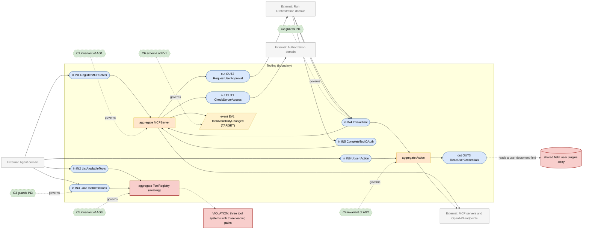
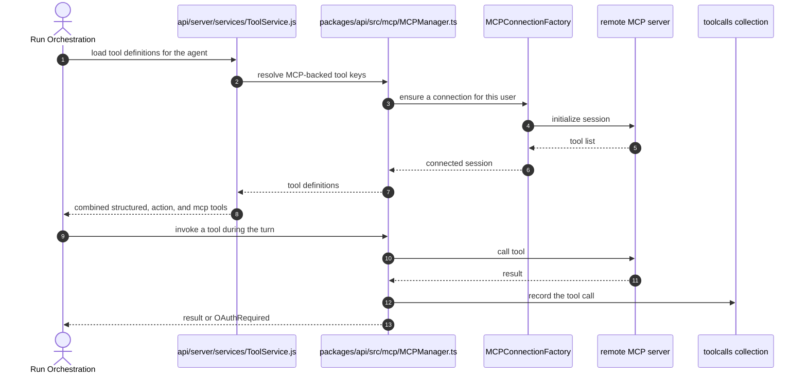

# Tooling Domain

> **Responsibility:** Make external capability available to a run — registered MCP servers and their connections, OpenAPI actions, built-in structured tools, and the per-user credentials and OAuth grants each of them needs.
> **Confidence:** provisional — MCP, actions, and built-in tools are three separately-grown subsystems that share one purpose and one consumer, so treating them as one domain is a judgement call rather than an observation.
> **Owns the motivating feature/change:** no

Notation legend: see `references/diagram-and-grammar.md` in the DomainMap skill. Every ID drawn in section 2 is defined in section 3, one to one.

## 1. Ubiquitous language

| Term | Kind | Meaning | Source (path) |
|---|---|---|---|
| MCPServer | aggregate root | A registered Model Context Protocol server with its transport config and author | packages/data-schemas/src/schema/mcpServer.ts |
| MCPConnection | entity | A live client session to one server, per user or per process | packages/api/src/mcp/connection.ts |
| Action | aggregate root | An OpenAPI-described capability attached to an agent, with its auth block | packages/data-schemas/src/schema/action.ts |
| StructuredTool | value object | A built-in tool defined in the manifest | api/app/clients/tools/manifest.json |
| PluginAuth | entity | Per-user secret for a tool or action | packages/data-schemas/src/schema/pluginAuth.ts |
| ToolCall | entity | A recorded invocation of a tool during a run | packages/data-schemas/src/schema/toolCall.ts |
| MCPOAuthGrant | entity | A user's OAuth token for an MCP server, with reconnection state | packages/api/src/mcp/oauth/tokens.ts |
| ToolKey | value object | The composite identifier joining a server name and a tool name | packages/data-provider/src/splitMCPToolKey.ts |

```ebnf
(* 3a — vocabulary *)
ToolKind      = "structured" | "action" | "mcp" ;
ToolKey       = toolName | ( serverName , delimiter , toolName ) ;
AuthType      = "service_http" | "oauth" | "none" ;
ConnectionScope = "app" | "user" ;
ConnectionState = "disconnected" | "connecting" | "connected" | "oauth_required" ;
```

## 2. Interface & Contract Boundary Map



## 3. Grammar

```ebnf
(* 3b — interface signatures, from api/server/services/ToolService.js,
   ActionService.js, packages/api/src/mcp/MCPManager.ts and mcp/tools.ts *)
IN1_RegisterMCPServer = "upsertServer" , "(" , serverName , "," , serverConfig , "," , authorId , ")"
                      , "->" , ( MCPServer | ValidationRejected ) ;
IN2_ListAvailableTools = "listTools" , "(" , userId , "," , [ ToolKind ] , ")"
                      , "->" , { ToolDescriptor } ;
IN3_LoadToolDefinitions = "loadTools" , "(" , { ToolKey } , "," , userId , ")"
                      , "->" , ( { ToolDefinition } | ExpectedToolUnavailable ) ;
IN4_InvokeTool        = "callTool" , "(" , ToolKey , "," , arguments , "," , userId , "," , runContext , ")"
                      , "->" , ( ToolResult | ToolError | OAuthRequired ) ;
IN5_CompleteToolOAuth = "completeOAuth" , "(" , serverName , "," , userId , "," , authorizationCode , ")"
                      , "->" , ( MCPOAuthGrant | OAuthFailed ) ;
IN6_UpsertAction      = "upsertAction" , "(" , actionId , "," , agentId , "," , openApiSpec , "," , AuthType , ")"
                      , "->" , ( Action | ValidationRejected ) ;

OUT1_CheckServerAccess = "checkPermission" , "(" , userId , "," , "mcpServer" , "," , serverId , "," , requiredPermission , ")"
                      , "->" , boolean ;
OUT2_RequestUserApproval = "pauseForApproval" , "(" , streamId , "," , toolCall , ")"
                      , "->" , ( Approved | Rejected | Expired ) ;
OUT3_ReadUserCredentials = "getUserPluginAuth" , "(" , userId , "," , toolKey , ")"
                      , "->" , ( Credentials | NotConfigured ) ;

(* 3c — event schemas *)
EV1_ToolAvailabilityChanged = "ToolAvailabilityChanged" , "{" , toolKind , "," , toolKeys , "," , availability , "," , occurredAt , "}" ;

(* 3d — contracts *)
C1 = governs AG1
     invariant serverName is unique per tenant
     invariant a server config with oauth carries a resolvable authorization endpoint
     invariant connection state is never reported connected without a live session ;

C2 = governs IN4
     requires  caller holds access to the tool's owning resource
     requires  required credentials exist or OAuthRequired is returned
     ensures   the invocation is recorded as a ToolCall
     ensures   a tool requiring approval pauses the run rather than executing ;

C3 = governs IN3
     requires  every requested ToolKey is resolvable
     ensures   an expected tool that cannot be loaded fails the caller rather than being dropped
     ensures   returned definitions are filtered to what the caller may use ;

C4 = governs AG2
     invariant an action belongs to exactly one agent
     invariant auth secrets are stored encrypted, never on the action document in plaintext ;

C5 = governs AG3
     invariant one lookup resolves any ToolKey to exactly one provider
     invariant structured, action, and mcp tools share one identifier space ;

C6 = governs EV1
     schema { toolKind, toolKeys, availability, occurredAt } ;

(* 3e — aggregate composition *)
AG1_MCPServer = serverName , serverConfig , authorRef , [ tenantId ] , { MCPConnection } ;
AG2_Action    = actionId , agentRef , openApiSpec , AuthType , [ encryptedAuth ] ;
AG3_ToolRegistry = { ToolKey } , ToolKind , resolver ;
```

Target-only rules: `EV1_ToolAvailabilityChanged`, `C6`, `AG3_ToolRegistry`, and `C5`. `AG3` is drawn as a gap node because no single registry exists today — resolution is split between `api/server/services/ToolService.js`, `api/app/clients/tools/manifest.json`, and `packages/api/src/mcp/tools.ts`.

## 4. Aggregates

### AG1 · MCPServer
- **Purpose:** hold a server's transport and auth configuration and mediate the live connection to it.
- **Root / boundary:** `mcpServer` document plus the connection state held in `packages/api/src/mcp/MCPManager.ts` and `UserConnectionManager.ts`.
- **Invariants enforced** (contract): C1 — the connection factory and registry enforce state transitions in `packages/api/src/mcp/MCPConnectionFactory.ts`.
- **Invariants leaking / unguarded:** the persisted document and the in-process connection state are two halves of one aggregate living in two places, and OAuth readiness had to be reconciled across pods explicitly (see the recent commit reconciling MCP OAuth readiness). Connection state is process-local while the document is shared.
- **Status:** fragmented — configuration is persisted, live state is per-process, and they are only conventionally in sync.

### AG2 · Action
- **Purpose:** describe an OpenAPI capability attached to a specific agent, with its authentication.
- **Root / boundary:** `action` document, owned by a user and referencing an agent.
- **Invariants enforced** (contract): C4 — encryption is applied in `api/server/services/ActionService.js`.
- **Invariants leaking / unguarded:** the same encrypt and decrypt logic is applied at call sites rather than by the aggregate, so a new caller can persist an unencrypted auth block.
- **Status:** anemic — a data bag with its rules in a 518-line service.

### AG3 · ToolRegistry (missing)
- **Purpose:** give every tool identifier one resolver, regardless of whether it is structured, an action, or MCP-backed.
- **Root / boundary:** does not exist. `splitMCPToolKey` in the data-provider package is the closest thing to a shared identifier rule, and it needs the caller to already know the server names.
- **Invariants enforced** (contract): C5 — target only.
- **Invariants leaking / unguarded:** each of the three subsystems has its own loading path and its own failure mode, which is why fail-closed behaviour for unavailable MCP tools had to be added separately rather than falling out of a shared registry.
- **Status:** missing — drawn as a gap node and defined in the grammar so the map stays complete.

## 5. Logic placement

| Logic | Current location (path) | Verdict | Target location |
|---|---|---|---|
| MCP connection lifecycle | packages/api/src/mcp/MCPConnectionFactory.ts and connection.ts | correct | Tooling |
| MCP server registry and inspection | packages/api/src/mcp/registry | correct | Tooling |
| MCP OAuth flow and reconnection | packages/api/src/mcp/oauth | correct | Tooling |
| Built-in structured tool loading | api/server/services/ToolService.js (2047 lines) | misplaced: tool loading, formatting, and agent wiring in one JS service | Tooling, split by responsibility |
| OpenAPI action execution and auth | api/server/services/ActionService.js | correct | Tooling |
| Tool identifier parsing | packages/data-provider/src/splitMCPToolKey.ts | misplaced: a backend resolution rule living in the shared frontend package | Tooling, with the shared type re-exported |
| Per-user tool credentials | api/server/services/PluginService.js | correct | Tooling |
| User plugin list | user document plugins field in packages/data-schemas/src/schema/user.ts | misplaced: Tooling state stored on the Identity aggregate | Tooling |
| Tool authorization filtering for a run | api/server/controllers/agents/filterAuthorizedTools.spec.js subject | correct | Tooling |
| MCP request context propagation | packages/api/src/mcp/context.ts and api/server/services/MCPRequestContext.js | duplicated: context handling exists on both sides of the workspace boundary | Tooling, TS only |

## 6. Representative flow



- **Coupling points:** the Agent domain calls `ToolService` directly during initialisation rather than through a port, and `ToolService` in turn reaches into the MCP package internals; an OAuth-required result pauses the run, which means Tooling drives Run Orchestration's lifecycle from inside a tool call.
- **Hidden dependencies:** MCP connection state is process-local, so behaviour differs between a single pod and a fleet; the user's `plugins` array on the Identity aggregate silently determines which structured tools appear; `splitMCPToolKey` requires the caller to supply known server names, so identifier parsing depends on ambient registry state; the manifest at `api/app/clients/tools/manifest.json` is a build-time input that changes the available tool set with no runtime signal.

## 7. Integration & ownership

| Talks to | Mechanism | Direction | Notes |
|---|---|---|---|
| Agent | direct call during initialisation | Agent to Tooling | reaches into internals, not a port |
| Run Orchestration | direct call for invocation, plus a pause callback for approval and OAuth | both directions | the bidirectional coupling is inherent to human-in-the-loop tools |
| Authorization | direct call via the TS access-control service | Tooling to Authorization | one of the few TS-path consumers |
| Identity and Access | shared write of the user plugins field | both directions | Tooling state on the Identity aggregate |
| File | direct call for tool-produced artifacts | Tooling to File | image and document outputs |
| Configuration | direct read of MCP and tool configuration | Tooling to Configuration | read-only |
| Remote servers | network calls over MCP transports and HTTP | Tooling outward | the domain's reason to exist |

- **Data this domain OWNS:** `mcpservers`, `actions`, `pluginauths`, `toolcalls`, and the in-process connection registry.
- **Data it only READS (owned elsewhere):** `users` including the plugins field (Identity and Access), `agents` (Agent), `aclentries` (Authorization).

## 8. Gaps & risks

| Gap | Evidence (path) | Severity | Target remedy |
|---|---|---|---|
| Three tool subsystems with three loading paths and three failure modes | api/server/services/ToolService.js, api/app/clients/tools/manifest.json, packages/api/src/mcp/tools.ts | high | Introduce one tool registry resolving every ToolKey |
| MCP aggregate is split between a persisted document and process-local connection state | packages/data-schemas/src/schema/mcpServer.ts and packages/api/src/mcp/MCPManager.ts | high | Make connection readiness an explicit, shared part of the aggregate |
| Tooling state stored on the Identity aggregate | user plugins field in packages/data-schemas/src/schema/user.ts | med | Move plugin enablement into a Tooling-owned collection |
| Action auth encryption applied by the service, not the aggregate | api/server/services/ActionService.js | med | Enforce encryption at the aggregate boundary |
| MCP request context duplicated across the workspace boundary | packages/api/src/mcp/context.ts and api/server/services/MCPRequestContext.js | med | Keep the TS implementation, make the JS file a shim |
| Backend tool-key parsing lives in the shared frontend package | packages/data-provider/src/splitMCPToolKey.ts | low | Move resolution to Tooling, keep the type shared |
| No signal when tool availability changes | no publisher exists | low | Publish EV1 so agents can be revalidated |

## 9. Target design

N/A — the motivating change is owned by `authorization.domain.md`. The `AG3` and `EV1` rules above mark the registry and availability signal this domain needs; both are sequenced in section 10 rather than being part of the current change.

## 10. Incremental refactor plan

1. Reduce `api/server/services/MCPRequestContext.js` to a re-export of `packages/api/src/mcp/context.ts`, deleting the duplicate implementation. Behavior-preserving.
2. Introduce a `ToolRegistry` in `packages/api/src/tools` that resolves a tool key to one of the three providers, implemented by delegating to the existing three paths. No caller changes.
3. Move `api/server/services/ToolService.js` loading calls onto the registry, one tool kind at a time.
4. Give the Agent domain a single `loadTools` port backed by the registry, replacing its direct reach into MCP internals.
5. Move plugin enablement off the user document into a Tooling-owned collection, dual-writing until readers are converted.
6. Enforce action auth encryption at the aggregate boundary so no call site can persist plaintext.
7. Publish `ToolAvailabilityChanged` when a server connects, disconnects, or its tool list changes; subscribe agent validation to it.

## 11. Transition validation

| Principle | Result | Justification |
|---|---|---|
| Reduces coupling | pass | Agent stops reaching into MCP internals; three loading paths converge behind one registry. |
| Clarifies ownership | pass | Plugin enablement moves off the Identity aggregate; the duplicated request context gets one owner. |
| Reinforces a boundary | pass | The registry and the `loadTools` port are both new boundaries where callers currently reach through. |
| Avoids spreading legacy | pass | The registry delegates to existing paths rather than reimplementing them, and each step deletes a duplicate or a reach-in. |

## 12. Required changes

- **Modify:** `api/server/services/ToolService.js`, `api/server/services/MCPRequestContext.js`, `api/server/services/ActionService.js`, `packages/api/src/mcp/MCPManager.ts`, `packages/data-schemas/src/schema/user.ts`, `packages/data-provider/src/splitMCPToolKey.ts`.
- **Introduce:** a `ToolRegistry` resolving every tool key; a `loadTools` port for the Agent domain; a Tooling-owned plugin-enablement collection; a tool-availability event publisher.
- **Refactor:** collapse the duplicated MCP request context; move tool-key resolution out of the shared frontend package; enforce action auth encryption at the aggregate.
- **Debt consciously accepted:** the built-in structured tool manifest stays a build-time JSON input rather than becoming database-backed. Making it dynamic would change deployment semantics for no boundary gain, and the registry can resolve against it as-is. Process-local MCP connection pooling also stays; sharing live sessions across pods is a distributed-systems change well beyond the boundary work described here.

Consistency checklist run: every diagram ID resolves to a grammar rule and back; every contract names a defined target; each gap-classed node appears in section 8; target-only rules are marked; no application code in this file.
