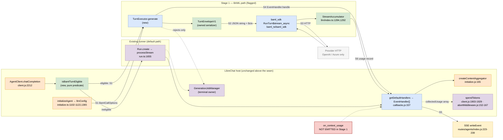
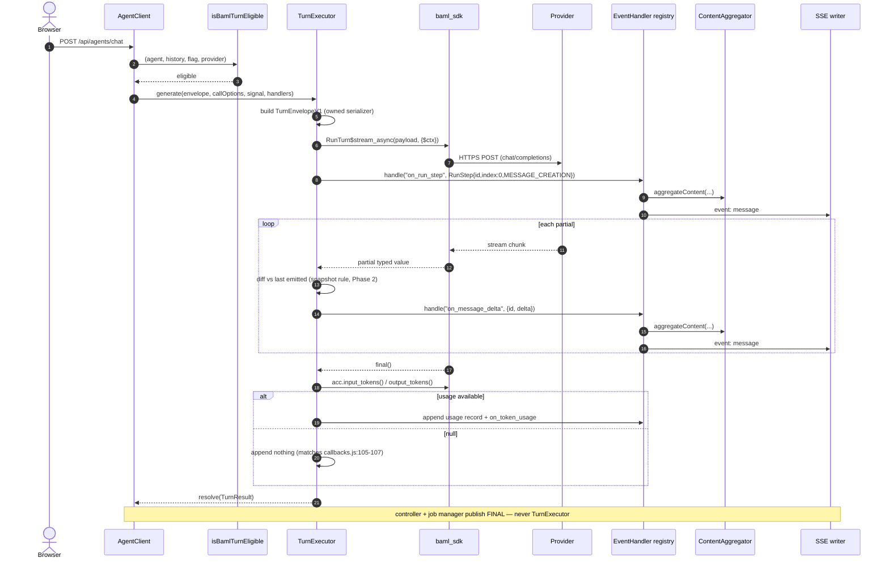
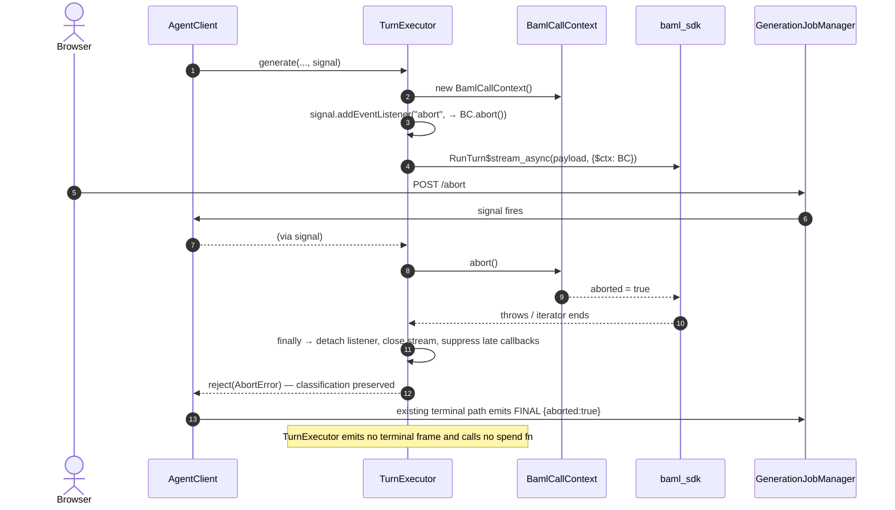
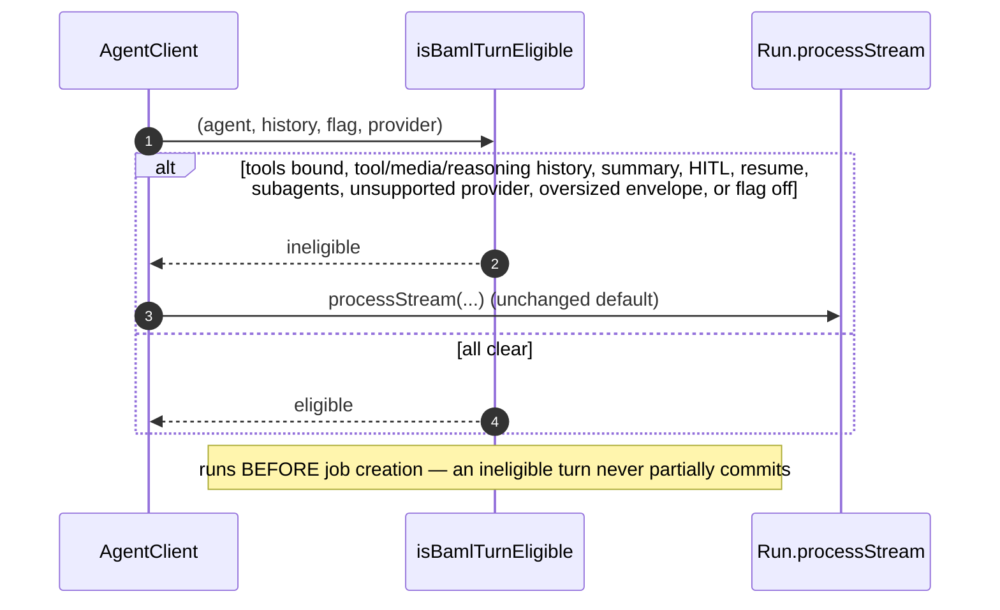
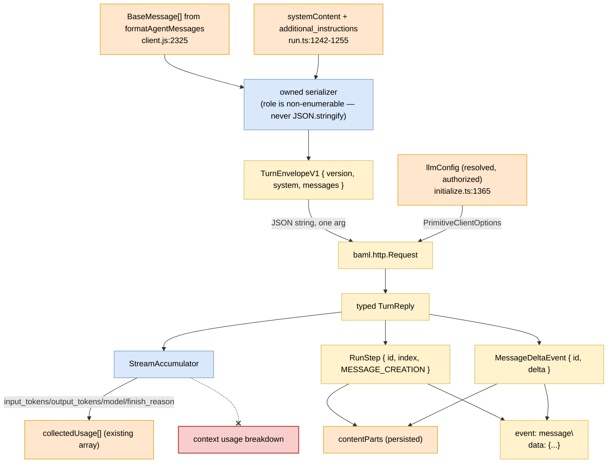

# Stage 1 — single-shot text generation through BAML

**Revision 2.** Rewritten against the review. Every C1–C10 finding is addressed
below; the mapping is in [Review disposition](#review-disposition). Two review
claims were re-verified independently and one open question it raised is now
closed with evidence (`$ctx` is reachable, collectors are not — see C3').

## Deliverable

One eligible chat turn — **text in, text out, no tools** — is generated by BAML
instead of by the agent graph, behind a flag, with byte-equivalent observable
behavior. Nothing else.

**Explicitly not in this plan:** the tool loop, HITL, steering, subagents,
summarization, multimodal or reasoning history, context-usage events. Tool-loop
ownership becomes its own TDD plan **after** Stage 1 production equivalence is
demonstrated, per review C9.

The earlier title ("BAML owns the chat turn loop") described an ambition, not a
deliverable, and is retired.

## Architecture — decided, per review C7

**The existing `Run` remains the lifecycle object.** The controller keeps using it
for activity labels, calibration ratio, title generation, `resume`, and
`getInterrupt` (`api/server/controllers/agents/client.js:612-715,2075-2087,2700-2703,2963-2974,3250-3270`).
A `processStream` lookalike cannot stand in for that surface and this plan does
not attempt it.

Stage 1 delegates exactly one operation — *generate a single assistant turn* — to
a `TurnExecutor`. Everything else on `Run` is untouched.

```
AgentClient.chatCompletion
  └─ isBamlTurnEligible(...)   ← ONE named predicate, ONE call site
       ├─ false → run.processStream(...)          (unchanged, default)
       └─ true  → turnExecutor.generate(...)      (new, flagged)
```

**Selection lives at the AgentClient streaming call site**, not at `createRun`.
`createRun` has consumers beyond this path — the OpenAI-compatible and Responses
controllers among them — and selecting there would alter routes and resume paths
Stage 1 does not support (review C7).

### `isBamlTurnEligible` — closed enumeration

Returns `false`, routing to the existing runner, for **any** of:

| Condition | Why |
|---|---|
| flag off for this tenant/agent | default |
| any tool bound to the agent | Stage 1 has no tool loop |
| history contains a Tool message or AI message with `tool_calls` | would be silently flattened |
| history contains non-string content parts (media, files) | ditto |
| history contains reasoning blocks or thought signatures | ditto |
| a summary / compaction message is present | precedence undefined in Stage 1 |
| HITL enabled, or the run is a resume | no interrupt surface |
| subagents configured | out of scope |
| provider not in the Stage 1 supported set | see below |
| caller is not `AgentClient.chatCompletion` | OpenAI/Responses routes excluded |

The predicate runs **before the generation job is created**, so an ineligible turn
never partially commits. It is pure and side-effect free, and it is the only place
these conditions are expressed.

**Supported provider set for Stage 1: OpenAI and Azure OpenAI only.** Anthropic,
Google, Vertex, Bedrock, and custom endpoints route to the existing runner. This
closes the review's open provider question; widening it is a follow-up with its own
matrix.

### Fallback policy — closed

**Fail closed after first emission.** If `TurnExecutor.generate` rejects *before*
any event has been dispatched, the caller may fall back to the existing runner
once. After the first dispatched event, failure propagates as a normal turn
failure. Falling back mid-stream would duplicate a turn, and is forbidden.

---

## What is verified

Probed against the installed toolchain (`baml wrapper 0.2.0` / `toolchain 0.15.0`)
on 2026-08-09. Reproduce with `scripts/baml-spike/probe.sh` and
`scripts/baml-toolloop/*.mjs`.

| Fact | Evidence |
|---|---|
| Generated SDK is `require()`-able from CommonJS | `require('./baml_ts/dist/index.js')` OK on node 20.19.2 and 24.16.0, ~91ms init |
| The bridge is **not** `require()`-able | `require('@boundaryml/baml-bridge')` → `ERR_PACKAGE_PATH_NOT_EXPORTED`; `exports` has `import` only |
| The bridge **is** reachable by dynamic import from CJS | `await import('@boundaryml/baml-bridge')` OK; `BamlCallContext` and `Collector` both constructible |
| Typed returns cross to JS intact | `claims()` → 18 real instances, `instanceof` passes; nested class with `Msg[]` field readable |
| A single class instance as an argument works | `chat_body(new Tenant({...}), 'hi')` → OK |
| **An array of class instances as an argument is broken** | `expected instance, got map`, panics in `Array.filter`. Fresh JS-built instances fail identically |
| JSON string is the working array boundary | `baml.json.from_string<Msg[]>()` → OK, nested classes included |
| Runtime `$types` binding works on `$parse` | union binds, yields correct constructor, rejects non-members with `no union member matched` |
| Runtime `$types` binding **panics on the live call** | type-var renderer; see `scripts/baml-toolloop/README.md` |
| Unrecognized type tokens fail **silently** | `lowerTypeToWireTy` degrades unknown tokens to the top type; a plain JS class "bound" and returned unvalidated data |
| Per-request model / key / base_url are expressible | `baml.llm.PrimitiveClientOptions`; two tenants in one process, `bridge-smoke.mjs` 6/6 |
| `@librechat/agents` source is readable here | 512 `.ts` files under `node_modules/@librechat/agents/src/`; its own repo is absent from this machine |

### C3' — collector and abort reachability, resolved

The review flagged this as an assumption. It is now measured, and the two halves
land differently:

| Capability | Reachable through the **generated public API**? | Evidence |
|---|---|---|
| Per-call **abort context** | **Yes** | `buildArgs` accepts a `$ctx` option key (`node_modules/@boundaryml/baml-bridge/dist/define_function.js:138-140`); the wrapper attaches and detaches it around the call (`:184,202,248,266`). `new BamlCallContext()` → `.abort()` flips `.aborted`, verified from CJS |
| Per-call **collector** | **No** | The wrapper hardcodes both trailing arguments: `await rt.callFunction(bamlFqn, argsProto, null, null)` (`define_function.js:202` region). There is no `$collector` option key. `Collector` exists on the bridge but the generated path never passes one |

**Consequences, both binding on this plan:**

1. **Cancellation is implementable today** via `$ctx` plus one dynamic import of
   the bridge. `BamlCallContext` is not re-exported by the generated SDK, so the
   adapter must `await import('@boundaryml/baml-bridge')` once at module init and
   cache it. This is a deliberate, documented exception to CLAUDE.md's
   no-dynamic-imports rule — the bridge's `exports` map offers no `require`
   condition, so there is no static alternative. It is confined to one module.
2. **Collector-based billing is not available.** Revision 1 of this plan named
   `Collector` as the billing surface; that was wrong at the call path even though
   the class exists. Stage 1 takes usage from the **streaming** path's
   `StreamAccumulator` instead (`input_tokens()`, `output_tokens()`, `model()`,
   `finish_reason()` — generated at `baml_ts/baml_sdk/baml/llm/index.ts:1284,1292,1268,1276`).
   Non-streaming BAML calls therefore cannot report usage and are **out of scope
   for Stage 1**; the executor always streams.

If a future stage needs collector-backed usage on non-streaming calls, the fix is
a generator/export change upstream, not reach-through into generated privates.

### Toolchain doc warning

The installed line is v1. `docs.boundaryml.com` documents **v0** and says so in its
own banner ("This site documents BAML v0, the legacy DSL. BAML v1 is a separate,
fully featured programming language in public beta"). v0's `@@dynamic` +
`TypeBuilder` + `ClientRegistry` + `Collector`-with-usage are real *in v0* and
absent or inert here. `@@dynamic` parses in v1 and has no observable effect:
`$parse` drops extra fields identically to a rigid class, and
`render_output_format` returns a byte-identical schema. `baml describe <symbol>`
is the reference for what is installed.

---

## How tools are typed — settled, and out of scope for Stage 1

`baml_src/ns_toolloop/` and `scripts/baml-toolloop/README.md` establish this
offline. **Do not re-derive it.** Stage 1 has no tools, so this section exists
only to constrain the follow-up plan:

| Stage | Mechanism |
|---|---|
| Selection | union declared statically in `.baml`, **inlined** in the signature |
| Narrowing | `$types: { T: { list: { union: subset } } }` on `$parse` **only** |
| Dispatch | read the literal `tool` field **host-side** |
| Feedback | `build_transcript(names[], args[], results[])` — parallel primitive arrays |

Rules that fall out, each verified: every tool needs a literal discriminator (the
rendered schema is structural `{...} or {...}` with no type names); a bare union
cannot be `$parse`d; a type alias cannot be an LLM return type
(`Unknown type alias: BoundTool$stream`); a union-typed BAML parameter cannot
discriminate a host map.

---

## Contracts

This section is the part the review found missing. Each contract names its owner,
its schema, and its test.

### 1. Input — versioned, strictly text-only, with a preflight gate (review C4)

Of the two options the review offered, this plan takes the **strictly text-only
envelope plus preflight eligibility predicate**. Stage 1 does not need structured
history, and a lossy canonical envelope is the more dangerous of the two.

```ts
const TURN_ENVELOPE_VERSION = 1 as const;

type TurnRole = 'system' | 'user' | 'assistant';   // closed union, not string

interface TurnMessageV1 {
  role: TurnRole;
  content: string;                                  // never an array in v1
}

interface TurnEnvelopeV1 {
  version: typeof TURN_ENVELOPE_VERSION;
  system: string | null;                            // merged, see precedence
  messages: TurnMessageV1[];
}
```

**Owned serializer, mandatory.** `formatAgentMessages` installs `role` as a
**non-enumerable** property (`node_modules/@librechat/agents/src/messages/format.ts:119-139`),
so `JSON.stringify` of a LangChain instance silently omits it. The adapter must
never serialize dependency instances. It reads `_getType()`/constructor identity
explicitly and builds the envelope itself.

**Precedence for system content**, resolved once and documented: `systemContent`
assembled at `packages/api/src/agents/run.ts:1242-1255` (tool-context map plus
`agent.instructions`) comes first, then `additional_instructions`. A summary
message makes the turn **ineligible** in Stage 1 rather than being merged.

**Named limits**, as constants, no magic numbers:

| Constant | Meaning |
|---|---|
| `MAX_ENVELOPE_BYTES` | UTF-8 byte ceiling on the serialized envelope |
| `MAX_MESSAGE_COUNT` | ceiling on `messages.length` |
| `MAX_MESSAGE_BYTES` | ceiling on a single message's `content` |

Exceeding any limit is an **eligibility failure before job creation**, not a
runtime error.

**Behaviour table, each row a test:**

| Input | Behaviour |
|---|---|
| unknown `version` on parse | reject; never best-effort |
| absent required field | reject with a stable category |
| `content: ''` | preserved as empty string, not dropped |
| non-string content part | ineligible (preflight) |
| Tool message / `tool_calls` present | ineligible (preflight) |
| reasoning block / thought signature | ineligible (preflight) |
| Unicode, emoji, combining marks | round-trips byte-identically |
| content containing backticks and `${` | round-trips; BAML prompt interpolation does not evaluate it |
| exactly at a byte limit | eligible; one byte over | ineligible |

Tests run against **real `formatAgentMessages` output**, not hand-built objects —
the existing fixtures at `packages/api/src/agents/run.spec.ts:57-60,161-165`
already cover AI tool calls, ToolMessages, and non-string tool content, and are
the negative corpus for the predicate.

### 2. Events — typed transcript, per supported path (review C1)

Revision 1 listed event names and asserted order. That was insufficient and one
entry was wrong.

**Correction: ordinary text completion does not emit `on_run_step_completed`.**
The text path dispatches message creation and message deltas
(`node_modules/@librechat/agents/src/stream.ts:1814-1881`); step completion is the
tool path (`:895-915`). Stage 1 emits **message creation followed by ordered
message deltas, and nothing else**. Inventing a completion event would be
observably different from the existing runner.

The Stage 1 transcript, in full:

| # | Event | `data` | `metadata` | Identity | Graph needed |
|---|---|---|---|---|---|
| 1 | `on_run_step` | `RunStep` with `id`, numeric `index`, typed `stepDetails` of type message creation | run/thread/agent ids | `id` allocated by the executor, monotonic `index` from 0 | no |
| 2..n | `on_message_delta` | delta carrying the **same `id`** as step 1 | same | reuses step 1's `id` | no |

`RunStep` shape: `node_modules/@librechat/agents/src/types/stream.ts:52-92`.
The aggregator stores the step in its step map (`src/stream.ts:2450-2483`) and
**drops any delta whose id does not match an existing step** (`:2515-2527,2546-2563`).
Id correlation is therefore a correctness requirement, not hygiene.

**No `CHAT_MODEL_END`.** Its installed handler returns early when graph or
metadata is absent and calls `graph.getAgentContext(metadata)`
(`api/server/controllers/agents/callbacks.js:81-115`). Stage 1 has no graph, so
emitting it would be a silent no-op that collects no usage. Usage is delivered
through an explicit port instead — see contract 3.

**Tested against the real registry.** Fixtures are consumed by the actual
`getDefaultHandlers` output (`api/server/controllers/agents/callbacks.js:337`)
and the real aggregator from `createContentAggregator`, asserting the resulting
`contentParts` and the SSE frames written. A fake registry that records event
names only is not an acceptable test for this contract.

### 3. Usage, token events, and spending — three separate paths (review C5)

The review is right that revision 1 conflated these. They are now separate.

**3a. Normalized usage record.** The executor reads `input_tokens()` /
`output_tokens()` / `model()` / `finish_reason()` from the stream's
`StreamAccumulator` after `final()`, and produces one record with the same fields
the existing `ModelEndHandler` enriches with — model, provider, agent id, cache
fields, type (`callbacks.js:73-167`).

**Provider-reported zero and unavailable usage are different states** and must not
collapse. Revision 1's "record zero explicitly" was wrong; the installed handler
*skips* collection when usage is unavailable (`callbacks.js:105-107`). Stage 1
matches that behaviour exactly:

| Accumulator returns | Record |
|---|---|
| `0` | a record with `0` — provider said zero |
| `null` | **no record appended** — matches the existing skip |

**3b. Collected usage and SSE.** The executor appends to the **existing**
`collectedUsage` array and `usageEmitSink`, both already constructed and passed
into `getDefaultHandlers` at `api/server/services/Endpoints/agents/initialize.js:358-375`.
It emits `on_token_usage` itself. It does **not** spend.

**3c. Spending stays where it is.** Success-path spend is the AgentClient
finalizer (`api/server/controllers/agents/client.js:1903-1929,2727-2735`); the
abort path is `api/server/middleware/abortMiddleware.js:63-95,152-167`. Exactly-once
drain ordering is preserved because the executor only appends to the same array
those owners already drain.

**3d. Context usage is explicitly omitted in Stage 1**, and this is a known gap.
`TContextUsageEvent` needs a pre-call context breakdown and budget
(`packages/data-provider/src/types/runs.ts:181-201`), which a post-hoc token count
cannot reconstruct. The consequence is that the UI context meter does not update
for BAML turns. That is accepted for Stage 1, must be listed in the rollout notes,
and is a required item for the Stage 2 plan.

Tests: cache fields present, provider-reported zero, unavailable usage, partial
error with partial usage, abort before any usage, and a late accumulator read
racing abort cleanup.

### 4. Terminal state — the adapter never owns it (review C6)

Revision 1 assigned final/abort emission to the adapter. Wrong owner.

Today `processStream` rejects and the controller decides `aborted` vs `complete`
at `api/server/controllers/agents/request.js:1147-1158`; `:1524-1674` is the
persist-and-publish consequence of that decision and `:1739-1803` is the
failure/reconciliation dispatch. Controller cleanup also settles memory and
subagent work, bills, and clears references (`client.js:2697-2763`).

Terminal state is not a single call but a **three-primitive claim protocol** on
the job manager, and the guards are enforced at runtime:

```ebnf
(* G7 — packages/api/src/stream/GenerationJobManager.ts *)
T1_Claim   = "claimTerminalJob" , "(" , streamId , "," , status , "," , [ error ] ,
             "," , [ expectedCreatedAt ] , "," , [ options ] , ")"
           , "->" , ( TerminalJobClaim | null ) ;              (* :3043-3071 *)
T2_Publish = "publishTerminalClaim" , "(" , TerminalJobClaim , "," , ( ServerSentEvent | null ) , ")"
           , "->" , ( finalEvent , persistenceFailed ) ;        (* :3195-3205 *)
T3_Finish  = "finishTerminalJob" , "(" , TerminalJobClaim , ")" , "->" , void ;  (* :3308-3313 *)

(* GUARDS — these throw, so an executor that tried to terminalize would fail loudly:
   T2 throws 'Terminal persistence claim was not issued by this manager' unless
      terminalClaimRuntimes.has(claim) && claim.persistencePending (:3206-3208)
   T3 rejects 'Terminal claim was not issued by this manager' (:3318-3320),
      de-duped via terminalFinishPromises (:3314-3317)
   A controller MUST NOT emit a terminal client event before T1 succeeds:
      abort, pause and completion all race on the same generation epoch. *)
```

Stage 1 participates in none of it. `TurnExecutor` never calls T1–T3.

The Stage 1 executor therefore:

- **propagates** provider failures by rejecting; it does not classify them;
- **preserves abort classification** when its request signal fires;
- **stops dispatching** immediately after disposal;
- **never** publishes the terminal/final frame or mutates terminal job status;
- **never** calls a spend function or persists a message directly.

Integration tests must assert **exactly one terminal result** for: success,
provider error, abort before the call, abort during handshake, abort after partial
content, abort after the last delta, reconnect, and generation replacement.

### 5. Async, streaming, and cleanup (review C8)

**`_async` only.** `scripts/baml-toolloop/async-probe.mjs:5-12` records that the
generated synchronous companions block Node's event loop and can deadlock an
in-process server. Every call and stream operation in the adapter uses the async
companion. A synchronous BAML companion in `packages/api` is a review-blocking
defect.

**Partial semantics must be established before they are consumed.** The generated
stream is pull-based and yields partial typed values; whether a partial is a
prefix, a snapshot, or a field update is **not** established by the current probes
(`async-probe.mjs:124-155`). Phase 2 determines this against a real
separate-process HTTP fixture. Until then no delta forwarding is implemented.
Rules, once known, are explicit: if partials are snapshots, the adapter diffs
against the last emitted text and forwards only the suffix; a snapshot forwarded
whole would duplicate persisted text, because deltas are aggregated and streamed in
the same pass.

**Serial dispatch.** Handlers are awaited one at a time in source order. Durable
emission is deliberately awaited to preserve ordering
(`emitEvent`, `api/server/controllers/agents/callbacks.js:228-234`) and the job manager fences
and sequences appends (`GenerationJobManager.ts:5089-5204`). No `Promise.all`, no
concurrent fan-out.

**Named limits**, all constants: `CALL_TIMEOUT_MS`, `FIRST_BYTE_TIMEOUT_MS`,
`IDLE_TIMEOUT_MS`, `MAX_PARTIAL_BUFFER_BYTES`, `MAX_ENVELOPE_BYTES`.

**Cleanup, in `finally`, on every path:** detach the abort listener, abort the
call context, and suppress any late callback.

**It cannot close the stream.** `BamlStream`'s complete surface is
`next`/`nextAsync`/`final`/`finalAsync` (`dist/stream.d.ts:9-22`) — no
`Symbol.asyncIterator`, no `return`/`throw`, no `close`. So the executor drives an
explicit `nextAsync()` loop rather than `for await`, and **`BamlCallContext.abort()`
via `$ctx` is the only cancellation lever there is**. Reaching into the generated
`Stream`'s `_sse` field to close it is private reach-through and is forbidden.

That makes one Phase 0 question load-bearing: does `abort()` actually terminate an
in-flight `nextAsync()`, and how fast? Measure it; if it does not, Stage 1 has no
working cancellation and the plan stops there.

Tested for: EOF without a typed final, invalid final, provider hang, slow callback,
and abort during each distinct wait.

### 6. Call options — resolved values only, never reconstructed (review C10)

The executor does not build provider configuration. It receives an internal DTO
carrying values **already resolved and authorized** by
`initializeAgent` (`packages/api/src/agents/initialize.ts:1102-1122,1365-1368`)
and `createRun`'s dynamic-header resolution (`run.ts:1211-1268`):

```ts
interface BamlCallOptions {
  provider: 'openAI' | 'azureOpenAI';   // Stage 1 supported set
  model: string;
  baseUrl: string | null;
  apiKey: string;                        // never logged, never serialized
  headers: Readonly<Record<string, string>>;
  tenantId: string | null;
}
```

Reconstructing these from raw request or environment data would break custom,
Azure, and Anthropic endpoints and tenant isolation. Secrets are redacted from
every error and log line; the DTO has an explicit redacting `toString`. Tested for:
built-in key, custom/reverse-proxy base URL, user-supplied key, Azure deployment,
missing key, and tenant isolation.

---

## System, sequence, and data-flow diagrams

All type quotations below are verbatim from the installed tree at `a577fd2c5`.

### Seam map

Six seams cross the Stage 1 boundary. Each has a grammar in
[Interface and contract grammar](#interface-and-contract-grammar).



`TurnExecutor` never touches `JOB` or `SPEND` except by rejecting — terminal state
and spending stay with their existing owners (contract 4).

### Sequence — eligible turn, success



Step 5 allocates `id` once; every delta reuses it. The aggregator drops any delta
whose `id` has no matching step (`stream.ts:2515-2527,2546-2563`), so id
correlation is a correctness requirement.

### Sequence — abort



### Sequence — preflight rejection



### Data flow



The dashed cut is the Stage 1 gap: a post-hoc token count cannot reconstruct the
pre-call breakdown `TContextUsageEvent` requires
(`packages/data-provider/src/types/runs.ts:181-201`).

---

## Interface and contract grammar

Notation follows `specs/*.domain.md`. Every production is derived from a
declaration in the installed tree; the source is cited above each block.

### Vocabulary

```ebnf
(* G0 — vocabulary *)
TurnRole        = "system" | "user" | "assistant" ;
Provider        = "openAI" | "azureOpenAI" ;            (* Stage 1 supported set *)
EnvelopeVersion = "1" ;
StepId          = identifier ;                          (* allocated by TurnExecutor *)
MessageId       = identifier ;
StepIndex       = nonNegativeInteger ;                  (* monotonic from 0 *)
TokenCount      = nonNegativeInteger ;
UsageState      = Reported , TokenCount | Unavailable ;
Ineligibility   = "tools_bound" | "tool_history" | "media_content" | "reasoning_history"
                | "summary_present" | "hitl_or_resume" | "subagents"
                | "unsupported_provider" | "envelope_too_large" | "flag_off"
                | "unsupported_caller" ;
```

### S1 — AgentClient → TurnExecutor

```ebnf
(* G1 — from the new adapter port; predicate at api/server/controllers/agents/client.js:2212 *)
IN1_IsEligible  = "isBamlTurnEligible" , "(" , agent , "," , BaseMessageList , "," , flagState , "," , Provider , ")"
                , "->" , ( "eligible" | Ineligibility ) ;

IN2_Generate    = "generate" , "(" , TurnEnvelopeV1 , "," , BamlCallOptions , "," , AbortSignal , "," , EventHandlerRegistry , ")"
                , "->" , ( TurnResult | ProviderError | AbortError | MalformedFinal ) ;

TurnResult      = { finalText , UsageState } ;

(* Contract: generate NEVER publishes a terminal frame, mutates job status,
   persists a message, or calls a spend function. It rejects; the controller
   classifies. See api/server/controllers/agents/request.js:1524-1674. *)
```

**Crossing invariants.** `IN1` is pure and runs before job creation. Fallback to
the existing runner is permitted only if `IN2` rejects with **zero** dispatched
events; after the first event, failure propagates.

### S1' — initializeAgent → TurnExecutor (credentials)

```ebnf
(* G1' — values resolved at packages/api/src/agents/initialize.ts:1102-1122,1365
   and packages/api/src/agents/run.ts:1211-1268 *)
BamlCallOptions = provider : Provider
                , model    : string
                , baseUrl  : ( string | null )
                , apiKey   : Secret
                , headers  : { headerName , headerValue }
                , tenantId : ( string | null ) ;

Secret          = opaque ;   (* redacting toString; never logged or serialized *)

(* Contract: the executor RECEIVES these already-authorized. It MUST NOT
   reconstruct them from req/env — doing so breaks custom, Azure and tenant
   isolation paths. *)
```

### S2 — TurnExecutor → generated BAML SDK

```ebnf
(* G2 — from node_modules/@boundaryml/baml-bridge/dist/define_function.js:114-160,196-215
   and the generated companions in baml_ts/baml_sdk/ *)
CallOptions     = [ "$ctx"   , BamlCallContext ]
                , [ "$types" , TypeBindingMap ] ;
(* EXACTLY these two keys are recognized. Any other $-key hits the
   'unknown optional argument' throw at define_function.js:153.
   $types is REQUIRED when the callee declares typeParams and FORBIDDEN when it
   does not — both throw with explicit messages (:32-38, :40-43). *)

(* TYPE-SURFACE GAP: `$ctx` is never emitted into any generated TypeScript
   signature — generated code declares only `$opts?:` and `$types?:`, and `$ctx`
   appears zero times. It is runtime-only. The adapter therefore needs a typed
   wrapper declaring the option, NOT an `as any` cast (CLAUDE.md forbids `any`).
   Encode the wrapper once, in the same module as the cached bridge import. *)

IN3_RunTurn     = "RunTurn$stream_async" , "(" , payload : JsonString , "," , CallOptions , ")"
                , "->" , BamlStream ;

(* BamlStream, node_modules/@boundaryml/baml-bridge/dist/stream.d.ts:9-22 —
   the COMPLETE public surface: *)
BamlStream      = "next" , "(" , ")"      , "->" , TStream
                | "nextAsync" , "(" , ")" , "->" , Promise
                | "final" , "(" , ")"     , "->" , TFinal
                | "finalAsync" , "(" , ")", "->" , Promise ;

(* NO Symbol.asyncIterator, NO return()/throw(), NO close(), NO cancellation hook.
   Consequences, both binding:
   - the executor drives the stream with an explicit nextAsync() loop; it cannot
     use for-await, and a `finally` block CANNOT close the stream
   - abort therefore rests ENTIRELY on BamlCallContext.abort() via $ctx.
     There is no second lever. Reaching into the generated Stream's `_sse` field
     to call close() is private reach-through and is forbidden. *)

IN4_BuildReq    = "RunTurn$build_request" , "(" , payload : JsonString , ")"
                , "->" , HttpRequest ;                 (* offline; wire-shape tests *)

IN5_Parse       = "RunTurn$parse" , "(" , json : string , ")"
                , "->" , ( TurnReply | ParseError ) ;  (* offline; network-free *)

BamlCallContext = "new BamlCallContext" , "(" , ")" ;
                  (* .abort() -> void ; .aborted -> bool
                     native.d.ts:33-39; NOT re-exported by baml_sdk —
                     reached by one cached dynamic import of the bridge *)

(* NEGATIVE CONTRACTS, all measured:
   - no "$collector" key exists; the wrapper calls
     rt.callFunction(fqn, argsProto, null, null) — collectors are unreachable
   - an array of class instances as a parameter panics: "expected instance, got map"
   - $types on the LIVE call panics in the type-var renderer; $parse only
   - an unrecognized $types token degrades SILENTLY to the top type
   - synchronous companions block the event loop — async only *)
```

### S3 — BAML → provider

```ebnf
(* G3 — baml.http.Request, <builtin>/baml/ns_http/http.baml:8-13 *)
HttpRequest     = method  : string
                , url     : string
                , headers : { headerName , headerValue }
                , body    : string ;

(* Contract: asserted OFFLINE via IN4_BuildReq. Method, URL, Authorization,
   model, and presence of the output-format block are all test targets.
   No test issues a live request except the key-gated live tier. *)
```

### S4 — TurnExecutor → EventHandler registry

```ebnf
(* G4 — EventHandler, node_modules/@librechat/agents/src/types/graph.ts:122-143 *)
IN6_Handle      = "handle" , "(" , event : string , "," , EventData , "," , [ metadata ] , "," , [ graph ] , ")"
                , "->" , ( void | Promise ) ;

(* Stage 1 emits EXACTLY this transcript, in this order: *)
Stage1Transcript = MessageCreationStep , { MessageDelta } ;

(* RunStep, src/types/stream.ts:52-92 ; MessageCreationDetails :118-123 *)
MessageCreationStep = "on_run_step" , RunStep ;
RunStep         = type        : "message_creation"
                , id          : StepId
                , index       : StepIndex
                , stepDetails : MessageCreationDetails
                , [ runId ] , [ agentId ] , [ groupId ] , [ stepIndex ] ;
MessageCreationDetails = type : "message_creation"
                , message_creation : ( message_id : MessageId ) ;

(* MessageDeltaEvent, src/types/stream.ts:227-250 *)
MessageDelta    = "on_message_delta" , MessageDeltaEvent ;
MessageDeltaEvent = id : StepId , delta : ( [ content ] , [ tool_call_ids ] ) ;

(* HARD INVARIANTS
   I1  every MessageDelta.id EQUALS the MessageCreationStep.id
       (mismatched deltas are DROPPED: src/stream.ts:2515-2527,2546-2563)
   I2  index starts at 0 and is monotonic, but is ADVISORY: the aggregator
       REWRITES RunStep.index before storing it (src/stream.ts:2477-2481), so
       emitted index != stored index in general and deltas resolve against the
       STORED value. Assert on the stored index, never on the emitted one.
   I3  Stage 1 emits NO "on_run_step_completed" — that is the tool path
       (src/stream.ts:895-915); the text path does not (:1814-1881)
   I4  Stage 1 emits NO "CHAT_MODEL_END" — its handler returns early without a
       graph (callbacks.js:82-85), so it would collect nothing AND would skip
       `finalize`, swallowing a pending refusal error
   I5  handlers are awaited SERIALLY in source order
       (emitEvent, callbacks.js:228-234; JSDoc :219-227) *)
```

**Silent-drop hazards.** Four paths discard data without throwing. Every one is a
way a wrong transcript passes a naive test, so each is an explicit negative test:

| Dropped | Site | Signal |
|---|---|---|
| delta whose `id` has no `stepMap` entry | `stream.ts:2518,2549,2562` | none |
| missing `runStep` in the stream handler | `stream.ts:1841-1858` | `console.warn` |
| mixed text/reasoning array matching neither `.every(...)` branch | `stream.ts:1942-1966` | **none at all** |
| `ModelEndHandler` without `graph`/`metadata` | `callbacks.js:82-85` | `console.warn` |

**`MessageContentComplex` is not discriminable.** Its final two union arms are
`Record<string, any>` with `type?: string` and `type?: never`, so any object
type-checks. The grammar above cannot be enforced by the declared union — Stage 1
validates content shape itself before emitting.

**Negative contract — the registry is not reachable through `processStream`.**

```ebnf
(* G4' — src/types/run.ts:405-408 *)
EventStreamOptions = [ callbacks : ClientCallbacks ] , [ keepContent : bool ] ;
ClientCallbacks    = [ "TOOL_ERROR" ] , [ "TOOL_START" ] , [ "TOOL_END" ] ;

(* These are CLIENT TOOL callbacks, not the event-handler registry.
   The registry is HandlerRegistry (src/events.ts:13-23); its canonical TYPE is
   the inline Record<string, EventHandler> used by composeEventHandlers
   (events.ts:25-27) and RunConfig.customHandlers (types/run.ts:227) — there is
   no named alias for it. It is built by getDefaultHandlers (callbacks.js:337),
   carried as runConfig.customHandlers, and installed by Run.create
   (run.ts:1548-1560,1655). processStream itself is a method on class Run
   (src/run.ts:717), not a type in types/run.ts.
   The executor receives the registry through an explicit typed port — never
   through { callbacks }, and never via a duck-typed fake graph. *)
```

### S5 — handlers → aggregator and SSE wire

```ebnf
(* G5 — packages/api/src/types/events.ts:4-64 ; routes/agents/index.js:223-239 *)
ServerSentEvent = StreamEvent | CreatedEvent | FinalEvent ;
StreamEvent     = event : string , data : ( string | object ) ;

WireFrame       = "event: " , eventName , LF , "data: " , jsonPayload , LF , LF ;
eventName       = "message" | "error" | "title" ;

(* THREE producers, NON-IDENTICAL formats — do not treat the wire as one shape:
   writeEvent  (routes/agents/index.js:223-239) parameterized event name;
               injects generationProtocolVersion on final frames
   sendEvent   (utils/events.ts:4-13)  hardcodes "event: message";
               DROPS an empty-string StreamEvent.data; no version injection
   handleError (utils/events.ts:15-23) hardcodes "event: error";
               serializes a BARE JSON STRING, not an object
   Stage 1 produces S4 events only and never writes the wire directly, so it
   inherits whichever producer the existing handler already uses. Equivalence
   tests must compare frames from the SAME producer on both runners. *)

(* Contract: unchanged by Stage 1. The existing handlers perform BOTH
   aggregation and SSE writing in one pass
   (callbacks.js:408,438,474,499,515,589,598), so a correct S4 transcript is
   correct for persistence and for the live stream simultaneously. *)
```

### S6 — usage record → collectedUsage

```ebnf
(* G6 — accumulator: baml_ts/baml_sdk/baml/llm/index.ts:1268,1276,1284,1292
   sink: api/server/services/Endpoints/agents/initialize.js:358-375 *)
AccumulatorRead = input_tokens  : ( TokenCount | null )
                , output_tokens : ( TokenCount | null )
                , model         : ( string | null )
                , finish_reason : ( string | null ) ;

OUT1_AppendUsage = "collectedUsage.push" , "(" , UsageRecord , ")" , "->" , void ;
OUT2_EmitTokens  = "on_token_usage" , TTokenUsageEvent , "->" , void ;

(* I6  Reported 0 and Unavailable are DISTINCT:
       input_tokens() = 0    -> append a record carrying 0
       input_tokens() = null -> append NOTHING (matches callbacks.js:105-107)
   I7  the executor NEVER calls spendTokens; success-path spend stays at
       client.js:1903-1929,2727-2735 and abort-path at
       abortMiddleware.js:152-167, both draining the same array
   I8  on_context_usage is NOT emitted in Stage 1 — TContextUsageEvent needs a
       pre-call breakdown (runs.ts:181-201, whose `breakdown` is the
       TTokenBudgetBreakdown at :163-179) that no post-hoc count can supply *)
```

---

## Packaging and deployment (review C10)

**The production image does not currently contain the generated SDK.**
`Dockerfile.multi` copies `packages/*/dist` trees and the final stage copies only
`packages/api/dist` (`Dockerfile.multi:109-116`); `baml_ts` is never copied. A local
`require()` probe proves nothing about production. This is a Phase 0 gate.

Required before Phase 3:

1. A real export boundary. `baml_ts` is outside the CommonJS `@librechat/api`
   package and its build entries (`packages/api/tsdown.config.mjs:4-13`,
   `packages/api/package.json:4-20`), with no workspace export or build dependency.
   Either bundle the generated SDK into `@librechat/api`'s build output or publish
   it as a workspace package that `packages/api` depends on. Decide and document.
2. `.baml` sources and generated output registered as CI/build cache inputs, and
   as Turborepo task inputs, so a `.baml` edit invalidates the API build.
3. `Dockerfile.multi` copies whatever the boundary decision produces.
4. A **native-load smoke test inside the built Linux image** that imports the
   exported runner and executes one offline BAML function. The bridge is a napi
   native addon with eight platform targets; none has been exercised on a deploy
   base image.

---

## Test strategy

CLAUDE.md requires real logic over mocks. The model call is either offline-shaped
or genuinely live; it is never faked.

**Which `test` form touches the network** — exact:

- `test "name" { assert.… }` — pure assertions, **offline**.
- `test Name { functions: [Fn], args: {…} }` — **issues a real request**. The
  toolloop spike excludes exactly one by selector
  (`baml test -x "SelectDynTool::TypeBuilderBlock"`). Any new one gets the same
  treatment and runs only with a key present. **If CI ever runs `baml test`
  without that exclusion, it bills.**

**Offline tier — every change, no key, no network.**

- `baml test` for pure BAML: envelope parsing, precedence, limit boundaries.
- `baml.llm.build_request` for wire shape.
- Jest in `packages/api` for the adapter, driven by scripted BAML results,
  asserting the event transcript against the **real** handler registry and
  aggregator, and the resulting `contentParts` and SSE frames.
- A separate-process HTTP fixture for progressive streaming (Phase 2), because
  in-process fixtures cannot demonstrate real partial delivery.
- MongoDB via `mongodb-memory-server` where persistence is asserted.

**Live tier — key-gated, skipped loudly when absent.** One real turn per supported
provider through each runner, comparing the full equivalence set below.

Mocking is confined to the provider HTTP endpoint. The handler registry, the
aggregator, the SSE writer, the job manager, and the database are all real.

---

## Phase 0 — toolchain, module, and deployment gate

**Given** the compiler, the module boundary, and the deploy image are all unproven
**When** any later phase is built on them
**Then** its results are not trustworthy

1. **Pin exactly.** Replace revision 1's unverified "pin in `baml.toml`" with the
   actual supported selection mechanism — determine it via `baml help toolchain`
   and `baml toolchain --help`, and record what was used. Pin
   `@boundaryml/baml-bridge` to an **exact** version, not `^0.15.0`. Assert
   wrapper, toolchain, generated-SDK, and bridge versions agree at startup.
2. **Fix the build command.** Revision 1 wrote it as a fragment. It is:
   `npm run build:data-provider && npm run build:data-schemas && npm run build:api`.
   Confirmed missing today: `packages/api/dist` and `packages/data-provider/dist`
   do not exist, and `scripts/activity-labels/run.mts --dry` fails because of it.
3. **Codegen reproducibility.** One script runs `baml generate` then
   `tsc -p baml_ts/tsconfig.json`; CI asserts regeneration produces no diff.
4. **Module-format gate.** Prove the chosen export boundary loads from the
   CommonJS API package, in the built Linux image, with the native addon resolving.
5. **Entrypoint proof (review C3).** One production-loadable public entrypoint that
   (a) invokes the exact turn function **asynchronously** with a runtime-selected
   client, (b) creates and aborts a per-call `BamlCallContext` from `config.signal`
   via the `$ctx` option, (c) detaches the listener and releases call and stream
   resources in `finally`, and (d) returns a normalized final result plus a usage
   record. **Collector attachment is explicitly excluded** — it is not reachable
   through the generated API (C3'); usage comes from the stream accumulator.
   If any of (a)–(d) cannot be done without reaching into generated privates,
   change the generator or export boundary before Phase 3. Reach-through is not an
   option.

**Done when** a clean checkout reproduces byte-identical generated output, and the
built image loads and runs the exported runner.

6. **Measure `abort()` latency against an in-flight `nextAsync()`.** This is the
   only cancellation lever that exists (contract 5). If `abort()` does not
   terminate a pending read, Stage 1 has no working cancellation and stops here.

**Diff-noise note.** `_inlinedbaml.ts` is 3.1 MB on disk and regenerates on every
`.baml` edit; the host consumes exactly one binding from it, the exported
`BYTECODE` (`baml_ts/baml_sdk/index.ts:18`). Accepted; revisit only if review
suffers.

---

## Phase 1 — the envelope, offline

**Given** conversation history that reached the seam
**When** the envelope is built
**Then** it either round-trips exactly or the turn is rejected before job creation

Implements contract 1 in full: closed `TurnRole` union, `version`, owned
serializer, precedence, named limits, and the behaviour table. Every row of that
table is a test. The negative corpus is real `formatAgentMessages` output.

**Red first:** write the round-trip and rejection tests before the serializer
exists; `baml check` fails, then `baml test` and jest fail, then they pass.

---

## Phase 2 — the BAML turn function and the exact call path

**Given** an envelope and resolved `BamlCallOptions`
**When** the request is built and the stream is driven
**Then** the wire shape is correct and partial semantics are known

- Wire shape asserted offline via `build_request`: method, URL, `Authorization`,
  model, and that the rendered prompt carries the output-format block. Runtime
  model / base URL / key changes are reflected.
- **Execute the exact turn function with `PrimitiveClientOptions`.** The existing
  runtime-client spike constructs and inspects a request but never executes the
  real function; that gap is closed here.
- **Determine partial semantics** — prefix, snapshot, or field update — against a
  separate-process HTTP fixture. Define the typed output envelope, message
  identity, finish state, and final reconciliation from the answer.
- `_async` everywhere; call, first-byte, and idle timeouts in place.

**Refactor gate:** prompt text moves into a `template_string` only after wire-shape
tests pass, so a prompt edit cannot silently change the request.

---

## Phase 3 — the adapter

**Blocked until contracts 1–6 above are implemented and Phase 0 gates pass.**

One typed port. Named units for input normalization, BAML invocation, event
projection, usage normalization, and cleanup. It receives the **real** handler
registry and the minimum valid dispatch context — it does not pass a lookalike
through `{ callbacks }` (that argument is `EventStreamOptions`, whose `callbacks`
are client tool callbacks, not the event-handler registry:
`node_modules/@librechat/agents/src/types/run.ts:405-408`,
`src/types/graph.ts:56-65`), and it does not duck-type a fake graph.

Behaviours, each its own test:

| Given | When | Then |
|---|---|---|
| an eligible text turn | it completes | exactly `on_run_step` then ordered `on_message_delta`, correlated ids, no step-completed |
| streamed partials | deltas arrive | forwarded and aggregated in one pass, no duplicated text |
| accumulator reports usage | turn ends | one normalized record appended to the existing `collectedUsage` |
| accumulator reports `null` | turn ends | **no** record appended |
| provider errors | mid-stream | the executor rejects; the controller classifies; one terminal result |
| the client aborts | at each distinct wait | abort classification preserved; dispatch stops; one terminal result |
| disposal | after it | no late callback reaches a handler |

Integration tests run through the real controller and job manager, in-memory and
Redis paths, including reconnect and generation replacement.

---

## Phase 4 — flag on, equivalence

**Blocked until Phase 3 passes.**

Default stays the existing runner. Equivalence compares, for the same input:

- the canonical **event transcript**;
- **persisted assistant content**;
- **terminal state**;
- **usage records** and **spend outcomes**;
- context-usage behaviour, acknowledging the documented Stage 1 gap.

Not just final text. Both in-memory and Redis/reconnect paths.

**Rollout signals** with thresholds set before enabling: latency, provider error
rate, abort completion rate, malformed finals, missing usage, billing divergence
against the control runner, and event-transcript mismatch count. Any breach rolls
back by flipping the flag; the existing runner is untouched, so rollback is
immediate.

**Done when** a real browser conversation streams and bills correctly through the
BAML runner behind the flag.

---

## Code-quality constraints (review, cleanup section)

Binding on Phase 3 and enforced at review:

- One typed `TurnExecutor` port with one reason to change. Input normalization,
  invocation, event projection, and usage normalization are named units.
- Guard clauses for eligibility, unsupported data, abort, and malformed finals.
  No nesting of provider selection, stream iteration, translation, and cleanup in
  one function.
- **Control expressions stay pure.** No `await handler.handle(...)`, iterator
  advancement, collector mutation, usage append, or abort call inside an `if`,
  ternary, logical short-circuit, `filter`, or `Promise.all`.
- Serial awaited dispatch. No concurrent fan-out where order, persistence, or
  mutable aggregation is observable.
- Existing enums (`GraphEvents`, `StepEvents`, `UsageEvents`) and named constants
  for every byte, depth, count, timeout, and limit. No scattered event strings,
  status strings, numeric thresholds, or model/provider literals.
- Closed discriminated unions with exhaustive switches for role, content, and
  event variants. Unknown data takes an explicit telemetry-and-reject path.
- Terminal job state and spending stay at their existing owners. A shim that
  persists messages, emits final SSE, or calls a spend function directly is a
  defect, not a shortcut.
- The repository cleanup review runs before rollout: dead imports, wrong-abstraction
  calls, generated/private API reach-through, nesting, side effects in control
  expressions, mutable control variables, magic literals.

---

## Review disposition

| # | Finding | Where addressed |
|---|---|---|
| C1 | Event contract name-only, `on_run_step_completed` wrong | Contract 2 — typed transcript, id correlation, completion event removed |
| C2 | Handler injection / graph context | Contract 2 + Phase 3 — real registry via one typed port, no `{callbacks}` lookalike, no fake graph |
| C3 | Collector / cancellation assumed | C3' — measured: abort reachable via `$ctx`, collector **not**; billing moved to stream accumulator; Phase 0 gate 5 |
| C4 | Lossy input DTO | Contract 1 — versioned text-only envelope, closed role union, owned serializer, preflight predicate |
| C5 | Usage / billing / context conflated | Contract 3 — three paths; zero vs unavailable distinguished; spend left at existing owners; context usage an explicit documented gap |
| C6 | Terminal ownership misassigned | Contract 4 — executor rejects and never terminalizes |
| C7 | `processStream` lookalike insufficient | Architecture — `Run` stays the lifecycle object; one `TurnExecutor` operation; predicate at the AgentClient call site |
| C8 | Async/streaming contract missing | Contract 5 — `_async` only, partial semantics determined in Phase 2, serial dispatch, named limits, cleanup matrix |
| C9 | Phase 5 not implementation-ready | Deliverable retitled to Stage 1; tool loop removed to its own plan |
| C10 | Package and credential boundaries absent | Packaging section + Contract 6 |

Also applied: the Stage 1 provider set, flag scope, fallback boundary, and
selection predicate are closed rather than left open; the toolloop README's stale
"17 BAML tests" count should be corrected to 20 or, better, stop quoting a
volatile total.

**Not done here:** no tracking bead was created. `bd` reports no `.beads` directory
in this worktree, and initializing one is a persistent project change outside the
scope of this edit.

## Success criteria

- [ ] Toolchain and bridge pinned exactly; regeneration reproducible in CI
- [ ] Exported runner loads and runs inside the built Linux image
- [ ] Async entrypoint proven with `$ctx` abort and `finally` cleanup
- [ ] Real formatted messages either round-trip the versioned envelope or fail the
      preflight predicate with no silent loss
- [ ] Event transcript matches the existing runner's for a text turn, verified
      against the real aggregator and default handlers
- [ ] Usage records match, including provider-zero and unavailable cases
- [ ] Exactly one terminal result across every success/error/abort/replacement race
- [ ] Spending and terminal state remain at their existing owners
- [ ] Selection scoped to one named predicate and one call site
- [ ] A real browser conversation streams and bills correctly behind the flag
- [ ] Existing runner remains default and untouched
